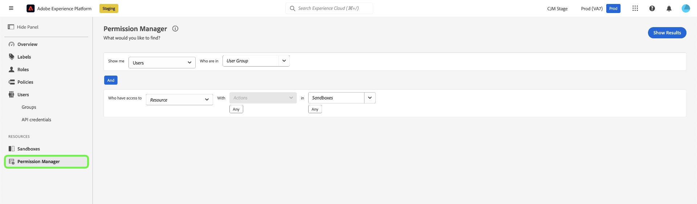

# Adobe Experience Platform 发行说明

**发行日期： 2024年8月20日**

>[!TIP]
>
>查看[示例用例文档概述](https://experienceleague.adobe.com/en/docs/experience-platform/rtcdp/use-cases/overview)，了解各种用例，例如潜在客户、客户获取以及您的组织通过Real-Time CDP可以实现的更多内容。

对Experience Platform中现有功能和文档的更新：

- [基于属性的访问控制](#abac)
- [目标](#destinations)
- [Experience Data Model (XDM)](#xdm)
- [身份服务](#identity-service)
- [Segmentation Service](#segmentation)
- [源](#sources)

## 基于属性的访问控制 {#abac}

基于属性的访问控制是Adobe Experience Platform的一项功能，它使注重隐私的品牌在管理用户访问方面拥有更大的灵活性。 可以将架构字段和区段等单个对象分配给用户角色。此功能允许您授予或撤销组织中特定 Platform 用户对各个对象的访问权限。

通过基于属性的访问控制，贵组织的管理员可以控制用户对所有平台工作流和资源中敏感个人数据(SPD)、个人身份信息(PII)和其他自定义类型数据的访问。 管理员可以定义只能访问特定字段以及与这些字段对应的数据的用户角色。

**新增功能**

| 功能更新 | 描述 |
| --- | --- |
| 新增权限管理器功能 | 您现在可以利用[权限管理器](../../access-control/abac/permission-manager/overview.md)通过简单的查询来生成报告，这将有助于您了解访问管理，并节省在几个工作流和粒度级别验证访问权限的时间。 有关创建用户和角色报告的详细信息，请参阅[权限管理器用户指南](../../access-control/abac/permission-manager/permissions.md)。 {width="250" align="center" zoomable="yes"} |

{style="table-layout:auto"}

有关基于属性的访问控制的详细信息，请参阅[基于属性的访问控制概述](../../access-control/abac/overview.md)。有关基于属性的访问控制工作流程的综合指南，请阅读[基于属性的访问控制端到端指南](../../access-control/abac/end-to-end-guide.md)。

## 目标 {#destinations}

[!DNL Destinations] 是预先构建的与目标平台的集成，可实现从 Adobe Experience Platform 无缝激活数据。您可以使用目标激活已知和未知的数据，用于跨渠道营销活动、电子邮件宣传、定向广告和许多其他用例。

**新增或更新的功能**{#destinations-new-updated-functionality}

| 功能 | 描述 |
| ----------- | ----------- |
| 现在通常可以将按需文件导出到批处理目标。 | 所有客户现在都可以使用按需将文件导出到批处理目标的选项。 有关详细信息，请参阅[专用文档](../../destinations/ui/export-file-now.md)。 |
| 在[计划步骤](../../destinations/ui/activate-batch-profile-destinations.md#scheduling)中编辑多个导出受众的导出计划。 | 现在，所有客户都可以使用选项，直接通过受众激活工作流的计划步骤编辑多个导出受众的导出计划。 {width="250" align="center" zoomable="yes"} |
| 在[计划步骤](../../destinations/ui/activate-batch-profile-destinations.md#scheduling)中编辑多个导出受众的文件名。 | 现在，所有客户都可以使用直接从Audience Activation工作流的计划步骤编辑多个导出文件的名称的选项。 {width="250" align="center" zoomable="yes"} |
| 从[目标详细信息](../../destinations/ui/destination-details-page.md#bulk-remove)页面上的数据流中删除多个受众。 | 现在，所有客户都可以使用从&#x200B;**[!UICONTROL 目标详细信息]**&#x200B;页面中移除现有数据流多个受众的选项。 {width="250" align="center" zoomable="yes"} |
| 从[目标详细信息](../../destinations/ui/destination-details-page.md#bulk-export)页面按需将多个文件导出到批处理目标。 | 所有客户现在都可以使用按需将多个文件从&#x200B;**[!UICONTROL 目标详细信息]**&#x200B;页面导出到批处理目标的选项。 {width="250" align="center" zoomable="yes"} |
| 从[目标详细信息](../../destinations/ui/destination-details-page.md#bulk-edit-file-names)页面编辑多个导出受众的文件名。 | 您现在可以直接从&#x200B;**[!UICONTROL 目标详细信息]**&#x200B;页面编辑多个导出文件的名称。 {width="250" align="center" zoomable="yes"} |
| 从[目标详细信息](../../destinations/ui/export-datasets.md#remove-dataset)页面中移除数据流中的多个数据集。 | 现在，所有客户都可以使用从数据流中删除多个数据集的选项。 {width="250" align="center" zoomable="yes"} |

{style="table-layout:auto"}

有关详细信息，请阅读[目标概述](../../destinations/home.md)。

## Experience Data Model (XDM) {#xdm}

XDM 是一种开源规范，可为导入 Adobe Experience Platform 的数据提供通用结构和定义（架构）。通过遵守 XDM 标准，所有客户体验数据都可以合并到一个通用的呈现中，以更快、更加集成的方式提供见解。您可以从客户行为中获得有价值的见解，通过区段定义客户受众，并使用客户属性实现个性化目的。

**新增功能**

| 功能 | 描述 |
| --- | --- |
| ML辅助模式创建流程 | 使用高级机器学习算法分析示例CSV数据文件，并使用标准和自定义字段自动创建优化架构。 主要功能： <ul><li>更快的架构创建：使用ML推荐和生成的XDM字段，直接从示例数据文件生成架构。</li><li>灵活的架构演变：在生成的架构中轻松添加或更新字段。</li><li>无缝集成：与Schema Ul中的核心架构创建流程完全集成，确保流畅而一致的用户体验。</li><li>高效的审查和编辑：使用平面视图编辑器快速查看和更新架构，从而使创建过程更高效且更便于用户使用。</li></ul> |

{style="table-layout:auto"}

若要了解更多信息，请阅读[ML辅助模式创建概述](../../xdm/ui/ml-assisted-schema-creation.md)

有关 Platform 中 XDM 的详细信息，请查看 [XDM 系统概述](../../xdm/home.md)。

## 身份服务 {#identity-service}

使用Adobe Experience Platform Identity Service跨设备和系统桥接身份，允许您实时提供有影响力的个人数字体验，从而全面了解客户及其行为。

**已更新文档**

| 功能 | 描述 |
| --- | --- |
| Graph配置指南 | 有关在使用身份图形链接规则和身份数据时可能遇到的常见图形场景的信息，请阅读[图形配置指南](../../identity-service/identity-graph-linking-rules/example-configurations.md)。 图形配置指南提供了从简单的单人员图形场景到复杂的分层多人员图形场景的示例。 您还可以使用该指南来获取可在[图形模拟UI](../../identity-service/identity-graph-linking-rules/graph-simulation.md)中输入的事件和算法配置示例，以及在某些图形场景下如何选择主要标识的细分。 |

{style="table-layout:auto"}

有关Identity服务的详细信息，请阅读[Identity服务概述](../../identity-service/home.md)。

## Segmentation Service {#segmentation}

[!DNL Segmentation Service] 允许您对存储在 [!DNL Experience Platform] 中的与个人（例如客户、潜在客户、用户或组织）相关的数据划分到受众区段中。您可以通过区段定义或其他源从 [!DNL Real-Time Customer Profile] 数据创建受众。这些受众在 [!DNL Platform] 上集中配置和维护，并且可以通过任何 Adobe 解决方案轻松访问。

**更新的功能**

| 功能 | 描述 |
| ------- | ----------- |
| 摄取详细信息 | 对于具有自定义上传来源的受众，您可以在受众详细信息页面中更全面地查看受众摄取的详细信息。 此外，您还可以通过选择架构并选择用于标记的所需属性，将标签应用于有效负载属性。 有关摄取详细信息部分的更多信息，请参阅[受众门户指南](../../segmentation/ui/audience-portal.md#ingestion-details)。 |

{style="table-layout:auto"}

有关 [!DNL Segmentation Service] 的详细信息，请查看[分段概述](../../segmentation/home.md)。

## 源

Experience Platform 提供 RESTful API 和交互式 UI，可让您轻松为各种数据提供者设置源连接。这些源连接允许您验证并连接到外部存储系统和 CRM 服务、设置运行摄取操作的时间以及管理数据摄取吞吐量。

在Experience Platform中使用源从Adobe应用程序或第三方数据源中摄取数据。

**已更新文档**

| 更新文档 | 描述 |
| --- | --- |
| 扩展了有关更新数据流的文档 | 更新了UI中[更新现有源数据流](../../sources/tutorials/ui/update-dataflows.md)的指南，以提供有关您可以对现有数据流进行各种配置的更多信息。 此外，还更新了指南，以阐明重新启用禁用数据流时的预期行为。 |

{style="table-layout:auto"}

有关详细信息，请阅读[源概述](../../sources/home.md)。
