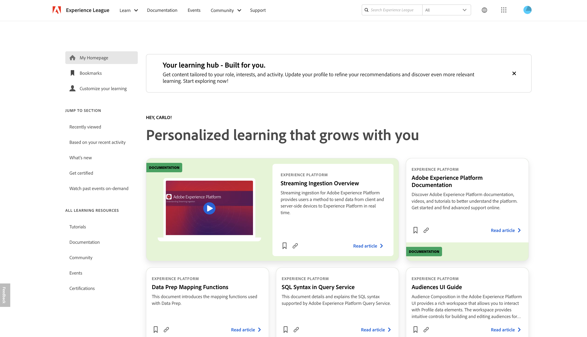

# Adobe Experience Platform 发行说明

>[!TIP]
>
>有关其他Adobe Experience Platform应用程序的发行说明，请参阅以下文档：
>
>- [Adobe Journey Optimizer](https://experienceleague.adobe.com/zh-hans/docs/journey-optimizer/using/whats-new/release-notes)
>- [Adobe Journey Optimizer B2B](https://experienceleague.adobe.com/en/docs/journey-optimizer-b2b/user/release-notes)
>- [Customer Journey Analytics](https://experienceleague.adobe.com/zh-hans/docs/analytics-platform/using/releases/latest)
>- [Real-Time CDP Collaboration](https://experienceleague.adobe.com/en/docs/real-time-cdp-collaboration/using/latest)

**发行日期： 2025年4月29日**

Adobe Experience Platform 中现有功能和文档的更新：

- [Experience League](#experience-league)
- [目标](#destinations)
- [Experience Data Model](#xdm)
- [身份标识服务](#identity)
- [查询服务](#query-service)
- [实时客户轮廓](#profile)
- [源](#sources)

## Experience League {#experience-league}

Experience League是一个全面的学习平台，旨在帮助您通过Adobe产品增强技能。 它提供各种资源，包括：课程、文档、社区页面、活动和对认证的访问。

| 功能 | 描述 |
| --- | --- |
| 个性化主页 | 在[Experience League](https://experienceleague.adobe.com/en/home#)上访问和自定义您的个性化主页。 使用您的Adobe凭据登录，然后在顶部菜单中选择&#x200B;**[!UICONTROL Experience League]**&#x200B;以开始优化您的学习体验： <ul><li>**书签**：使用[!UICONTROL 书签]功能在一个位置保存和收集您喜爱的资源。 您可以保存各种内容，包括播放列表、文章和教程。</li><li>**自定义您的学习**：使用最符合您需求的角色、行业、产品和体验级别来更新Experience League配置文件，从而增强您的学习体验。</li><li>**推荐**：查看根据您最近的活动推荐的学习内容。</li><li>**最近查看过的内容**：使用[!UICONTROL 最近查看过的内容]部分可快速导航回最近查看过的内容，如文档和视频。</li><li>**学习资源**：使用[!UICONTROL 所有学习资源]面板导航到教程、文档、社区、活动和认证。</li><li>**新增功能**：查看Experience League上最新内容流的[!UICONTROL 新增功能]部分。</li><li>**点播观看过去的活动**：通过[!UICONTROL 点播观看过去的活动]部分，观看产品聚光灯、用例和教程中以前录制的直播。</li></ul>  Experience League上的{width="250" align="center" zoomable="yes"} |

{style="table-layout:auto"}

## 目标 {#destinations}

[!DNL Destinations] 是预先构建的与目标平台的集成，可实现从 Adobe Experience Platform 无缝激活数据。您可以使用目标激活已知和未知的数据，用于跨渠道营销活动、电子邮件宣传、定向广告和许多其他用例。

**新的或更新后的目标** {#new-updated-destinations}

| 目标 | 描述 |
| --- | --- |
| [Marketo Engage人员同步](/help/destinations/catalog/adobe/marketo-engage-person-sync.md) | Adobe更新了[!DNL Marketo Engage Person Sync]目标以修复身份映射中存在多个电子邮件时影响客户的问题。 |

**新功能或更新功能** {#destinations-new-updated-functionality}

| 功能 | 描述 |
| --- | --- |
| 用于完整文件导出的&#x200B;**每周**&#x200B;和&#x200B;**每月**&#x200B;计划选项 | 现在，在激活到基于文件的云存储目标时，您可以计划每周或每月为人员和潜在客户受众导出完整文件。 [阅读有关计划选项的更多信息](/help/destinations/ui/activate-batch-profile-destinations.md#export-full-files)。 |

{style="table-layout:auto"}

**修复、增强功能和其他公告** {#destinations-fixes-and-enhancements}

- **强制数据集导出结束日期延迟到2025年9月1日**\
  在[2024年9月版](/help/release-notes/2024/september-2024.md#destinations-new-updated-functionality)中，Adobe将任何在该版&#x200B;*之前创建的数据集导出数据流的默认结束日期设置为2025年5月1日。* Adobe现在将强制实施截止日期延长至&#x200B;**2025年9月1日**，以便让客户有更多时间更新其计划。 有关如何编辑数据集导出数据流的结束日期的信息，请参阅[导出数据集教程](../../destinations/ui/export-datasets.md#schedule-dataset-export)的计划部分。

- **改进了LiveRamp载入的失败SFTP传输处理**\
  Adobe已修复一个影响通过SFTP将文件导出到[LiveRamp载入](/help/destinations/catalog/advertising/liveramp-onboarding.md)目标的问题。 有时，文件传输会因临时服务器端问题而失败，失败尝试产生的临时文件会保留在服务器上。 这些不可删除的文件会阻止后续重试，因为Adobe没有覆盖这些文件的权限。\
  通过此修复，如果重试尝试无法删除临时文件，Adobe将生成一个附加后缀“`attempt2`”的新文件，以确保重试成功完成。

## Experience Data Model (XDM) {#xdm}

XDM 是一种开源规范，可为导入 Adobe Experience Platform 的数据提供通用结构和定义（架构）。通过遵守 XDM 标准，所有客户体验数据都可以合并到一个通用的呈现中，以更快、更加集成的方式提供见解。您可以从客户行为中获得有价值的见解，通过区段定义客户受众，并使用客户属性实现个性化目的。

**更新的 XDM 组件**

| 功能 | 描述 |
| --- | --- |
| 字符串字段收到最小值1 | 默认情况下，新字符串字段的最小长度为1。 仍可接受非必填字段的Null值。 有关最佳实践的更多信息，请阅读有关数据建模的[最佳实践的指南](../../xdm/schema/best-practices.md#data-integrity-tips) |

{style="table-layout:auto"}

有关 Experience Platform 中 XDM 的详细信息，请查看 [XDM 系统概述](../../xdm/home.md)。

## 身份标识服务 {#identity}

使用 Adobe Experience Platform 身份标识服务通过跨设备和系统桥接身份标识，全面了解您的客户及其行为，助您实时提供有影响力的个人数字体验。

**更新的功能**

| 功能 | 描述 |
| --- | --- |
| [!BADGE 有限可用性]{type=Informative} [!DNL Identity Graph Linking Rules] | 身份图形链接规则现在处于“有限可用”状态，所有客户都可以在开发沙盒中访问它。 <ul><li>**激活要求**：在您配置和保存[!DNL Identity Settings]之前，该功能将保持非活动状态。 如果没有此配置，系统将继续正常运行，并且不会更改行为。</li><li>**重要说明**：在此“有限可用性”阶段，Edge分段可能会产生意外的区段成员资格结果。 但是，流分段和批量分段将按预期运行。</li><li>**后续步骤**：有关如何在生产沙盒中启用此功能的信息，请联系您的Adobe客户团队。</li></ul> |

{style="table-layout:auto"}

有关详细信息，请阅读[[!DNL Identity Graph Linking Rules] 文档](../../identity-service/identity-graph-linking-rules/overview.md)。

## 查询服务 {#query-service}

使用查询服务，通过标准 SQL 在 Adobe Experience Platform 数据湖中查询数据。无缝组合数据集，并从查询结果中生成新数据集，以增强报告功能、启用数据科学工作流程，或促进向实时客户轮廓引入数据。例如，您可以将客户交易数据与行为数据合并，为有针对性的营销活动识别高价值受众。

**更新的功能**

| 功能 | 描述 |
| --- | --- |
| SQL受众覆盖 | 使用新SQL查询的结果覆盖现有配置文件以刷新受众成员资格。 通过删除过时的记录并在单次操作中插入更新的记录，您可以更加高效地管理动态受众。 有关详细信息，请参阅[SQL受众扩展指南](../../query-service/data-distiller-audiences/overview.md#replace-audience)。 |
| 下载并复制查询结果 | [直接从查询编辑器下载查询结果](../../query-service/ui/overview.md#download-query-results)为CSV、XLSX或JSON文件，或者[将结果复制到剪贴板](../../query-service/ui/overview.md#copy-results)为逗号分隔值(CSV)，以便快速用于Excel等电子表格应用程序。 这些增强功能可简化离线分析、报表和数据验证工作流。 |
| 全屏查看查询结果 | [在全屏对话框中预览查询结果](../../query-service/ui/overview.md#view-results)以提高可读性，轻松扫描大型数据集，并选择要复制的行。 全屏视图提供了可调整大小的网格布局，可帮助您更有效地查看宽表格和详细的输出。 |
| 模型预测中的增强列选择 | 使用扩展`model_predict`语法选择特定列并应用别名。 检索中间预测结果，如特征向量和概率分数。 增强选择需要功能标志激活。 有关语法示例和功能标志的详细信息，请参阅[模型生命周期文档](../../query-service/advanced-statistics/models.md#select-specific-output-fields)。 |
| 使用CREATE TABLE和INSERT TO保存模型预测输出 | [使用CREATE TABLE AS SELECT将所选预测输出保存到新表中，或使用INSERT INTO SELECT插入现有表中](../../query-service/advanced-statistics/models.md#predict)。 如果启用了增强的列选择，则中间结果（例如特征向量和概率）也可以与最终预测一起保留。 有关用法示例，请参阅[SQL语法文档](../../query-service/sql/syntax.md#create-table-as-select)。 |

有关 [!DNL Query Service] 的详细信息，请查看 [[!DNL Query Service] 概述](../../query-service/home.md)。

## 实时客户轮廓 {#profile}

Adobe Experience Platform 使您能够为客户提供协调、一致且相关的体验，无论他们何时何地与您的品牌互动均是如此。利用实时客户轮廓，您可以看到每个客户的整体视图，其中结合来自多个渠道的数据，包括在线、离线、CRM 和第三方数据。轮廓允许您将客户数据整合到一个统一视图中，并为每一次客户交互提供可操作的、有时间戳的描述。

| 功能 | 描述 |
| ------- | ----------- |
| 假名个人资料数据有效期限 | 在配置文件仪表板中管理您的假名配置文件数据过期。 要详细了解此功能和假名轮廓，请阅读[假名轮廓数据有效期限指南](../../profile/pseudonymous-profiles.md)。 |

{style="table-layout:auto"}

要了解有关实时客户轮廓的更多信息，请阅读[轮廓概述](../../profile/home.md)

## 源 {#sources}

Experience Platform 提供 RESTful API 和交互式 UI，可让您轻松为各种数据提供者设置源连接。这些源连接允许您验证并连接到外部存储系统和 CRM 服务、设置运行摄取操作的时间以及管理数据摄取吞吐量。

使用 Experience Platform 中的源从 Adobe 应用程序或第三方数据源引入数据。

**新来源**

| 功能 | 描述 |
| --- | --- |
| [!BADGE Beta]{type=Informative} [!DNL Algolia User Profiles] | [[!DNL Algolia User Profiles]](../../sources/connectors/data-partners/algolia-user-profiles.md)源现已可用。 使用此源将您的[!DNL Algolia]用户配置文件相关性数据引入Experience Platform。 然后，您可以使用此数据通过为网站、电子商务平台和应用程序提供高性能搜索解决方案来提高用户参与度、转化率和总体客户体验。 有关详细信息，请阅读有关如何[将数据摄取 [!DNL Algolia User Profiles] 到Experience Platform](../../sources/tutorials/ui/create/data-partners/algolia-user-profiles.md)的指南。 |
| 针对[!DNL Azure Databricks]的[!BADGE Beta]{type=Informative} API支持 | [!DNL Azure Databricks]源现在可在API中使用。 使用[!DNL Flow Service] API连接您的[!DNL Databricks]帐户并将您的[!DNL Databricks]数据导入Experience Platform。 有关详细信息，请参阅[[!DNL Azure Databricks]](../../sources/connectors/databases/databricks.md)上的文档。 |

{style="table-layout:auto"}

**更新的功能**

| 功能 | 描述 |
| --- | --- |
| 更新了用于将流媒体数据摄取到Experience Platform的XDM字段。 | 新的XDM字段组`mediaReporting`现在可用于通过Adobe Analytics源将流媒体数据摄取到Experience Platform。 此字段替换`media.mediaTimed`字段。   在三个月的过渡期间，`media.mediaTimed`字段上的数据摄取将继续。 但是，在2025年7月底，`media.mediaTimed`字段将完全弃用，并且在Experience Platform架构UI中将不再可见，数据将仅使用`mediaReporting`字段发送。  如果您在2025年4月22日之前实施了Analytics源以将流媒体数据收集到Platform，则必须迁移现有配置以使用新字段组发送数据。 此迁移必须在2025年7月底之前完成。 请联系您的Adobe客户团队以获取迁移支持。 |
| [!DNL MariaDB]和[!DNL PostgreSQL]的新身份验证类型 | 您现在可以使用基本身份验证在Experience Platform上验证您的[!DNL MariaDB]和[!DNL PostgreSQL]源。 有关详细信息，请阅读以下文档： <ul><li>[[!DNL MariaDB]](../../sources/connectors/databases/mariadb.md)</li><li>[[!DNL PostgreSQL]](../../sources/connectors/databases/postgres.md) |
| 对[!DNL Amazon Redshift]的行级筛选支持 | 您可以在Experience Platform上对[!DNL Amazon Redshift]数据使用行级过滤功能。 有关详细信息，请参阅[在API](../../sources/tutorials/api/filter.md)中过滤源的行级数据的指南。 |

{style="table-layout:auto"}

有关更多信息，请阅读[源概述](../../sources/home.md)。
