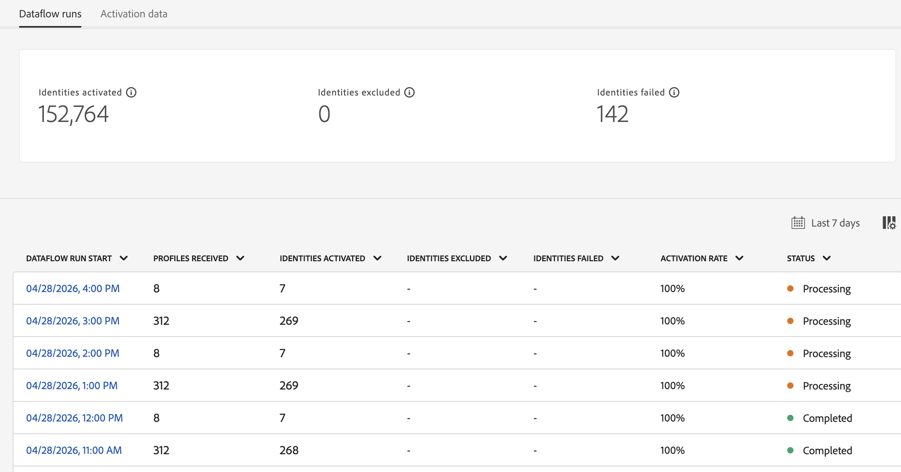

# Adobe Experience Platform 发行说明

>[!TIP]
>
>有关其他 Adobe Experience Platform 应用程序的发行说明，请参阅以下文档：
>
>- [Adobe Journey Optimizer](https://experienceleague.adobe.com/zh-hans/docs/journey-optimizer/using/whats-new/release-notes)
>- [Adobe Journey Optimizer B2B](https://experienceleague.adobe.com/zh-hans/docs/journey-optimizer-b2b/user/release-notes)
>- [Customer Journey Analytics](https://experienceleague.adobe.com/zh-hans/docs/analytics-platform/using/releases/latest)
>- [联合受众构成](https://experienceleague.adobe.com/zh-hans/docs/federated-audience-composition/using/release-notes)
>- [Real-Time CDP Collaboration](https://experienceleague.adobe.com/zh-hans/docs/real-time-cdp-collaboration/using/latest)

**发行日期： 2026年4月28日**

Adobe Experience Platform 中新功能和现有功能的更新：

- [数据收集](#data-collection)
- [目标](#destinations)
- [Experience Data Model (XDM)](#xdm)
- [查询服务](#query-service)
- [Real-Time CDP](#rtcdp)
- [沙盒](#sandboxes)
- [源](#sources)

## 数据收集 {#data-collection}

Adobe Experience Platform 提供一套技术，通过这些技术，可收集客户端客户体验数据，并将它发送到 Adobe Experience Platform Edge Network，从中可充实、转换数据和将数据分发到 Adobe 或非 Adobe 目标。

**新增功能或更新后的功能**

| 功能 | 描述 |
| --- | --- |
| 查看内部版本详细信息 | 您现在可以从库或环境访问内部版本和内部版本详细信息以查看当前实时内部版本并检查内容（扩展、数据元素和规则）。 有关详细信息，请参阅[内部版本概述](../../tags/ui/publishing/builds.md#build-details)。 |

{style="table-layout:auto"}

有关详细信息，请阅读[数据收集概述](../../tags/home.md)。

## 目标 {#destinations}

[!DNL Destinations]是与目标平台的预建集成。 使用目标针对跨渠道营销活动、电子邮件营销活动、定向广告和许多其他用例激活您的已知和未知数据。

**新增或更新目标**

| 目标 | 描述 |
| --- | --- |
| [!BADGE Beta]{type=Informative} [Microsoft广告客户匹配](../../destinations/catalog/advertising/microsoft-ads-customer-match.md) | 按电子邮件地址匹配客户并在[!DNL Microsoft Advertising Network]中重新与客户互动，包括搜索和受众广告。 将您的[!DNL Microsoft Advertising]帐户关联到Real-Time CDP，以直接从Experience Platform自动创建和管理客户匹配列表。 要获取访问权限，请联系您的Adobe客户经理。 |
| [!BADGE Beta]{type=Informative} [Reddit自定义受众](../../destinations/catalog/advertising/reddit-custom-audience.md) | 将受众从Experience Platform发送到[!DNL Reddit Ads]。 连接您的[!DNL Reddit]帐户、映射身份并激活受众以联系在[!DNL Reddit]上积极探索其兴趣的人员。 |
| [Amazon Ads v2](../../destinations/catalog/advertising/amazon-ads-v2.md) | 对所有新[!DNL Amazon Ads]连接使用[!DNL Amazon Ads v2]卡。 [!DNL Amazon Ads v2]连接到[!DNL Ads Data Manager]，后者支持扩展身份类型、与地址相关的字段以及跨[!DNL Amazon Ads]产品的数据共享，从而提高定位率和受众匹配率。 目录中的现有[!DNL Amazon Ads]连接器已重命名为[（旧版） [!DNL Amazon Ads]](../../destinations/catalog/advertising/amazon-ads.md)。 如果您现有旧版连接，则该连接将继续运行，而不需要进行任何更改。 |
| [[!DNL Rokt]](../../destinations/catalog/advertising/rokt.md) | 使用[!DNL Rokt]将Experience Platform受众关联到AI驱动的实时决策，通过更精确的定位、抑制和个性化来提高营销活动性能。 |
| [Acxiom受众连接](../../destinations/catalog/advertising/acxiom-audience-connection.md) | [!DNL Acxiom Audience Connection]目标现已正式可用。 使用它通过[!DNL Acxiom's Real ID]技术增强受众并将它们激活到[!DNL Altice]、[!DNL Ampersand]、[!DNL Comcast]、[!DNL Cox]、[!DNL Facebook]、[!DNL Amazon]、[!DNL Pinterest]、[!DNL Vizio]、[!DNL LG Ads]、[!DNL Spectrum]和[!DNL Viant]。 |
| [Acxiom Real ID受众连接](../../destinations/catalog/advertising/acxiom-real-id-audience-connection.md) | [!DNL Acxiom Real ID Audience Connection]目标现已正式可用。 使用它以在[!DNL Altice]、[!DNL Ampersand]、[!DNL Comcast]、[!DNL Cox]、[!DNL Facebook]、[!DNL Amazon]、[!DNL Pinterest]、[!DNL Vizio]、[!DNL LG Ads]、[!DNL Spectrum]和[!DNL Viant]之间将[!DNL Acxiom's Real ID]用作匹配键来激活受众。 |

{style="table-layout:auto"}

**修复和改进**

| 修复 | 描述 |
| --- | --- |
| [Snowflake流](../../destinations/catalog/warehouses/snowflake.md)目标的新`TS`列 | [Snowflake流](../../destinations/catalog/warehouses/snowflake.md)目标现在在共享表中包含一个`TS`时间戳列，该列显示每行的上次更新时间。 此更新将在4月底推出。 |
| 监控对[自定义Personalization](../../destinations/catalog/personalization/custom-personalization.md)目标的支持 | [数据流运行页面](../../dataflows/ui/monitor-destinations.md#dataflow-runs-for-streaming-destinations)现在显示[自定义Personalization](../../destinations/catalog/personalization/custom-personalization.md)目标的量度。 以前，这些量度不适用于此目标类型。 使用它们验证受众是否按预期激活，并诊断问题。  {zoomable="yes"} |
| 激活工作流审核步骤中的配置文件计数 | 激活工作流的审核步骤现在显示已激活受众的个人资料计数。 还显示[流式目标](../../destinations/ui/activate-segment-streaming-destinations.md)的配置文件计数，而不仅仅是[批处理目标](../../destinations/ui/activate-batch-profile-destinations.md)。  {zoomable="yes"} |
| [!DNL Pinterest]令牌到期可见性 | [[!DNL Pinterest]](../../destinations/catalog/advertising/pinterest.md)目标现在显示令牌过期日期，以便您查看何时需要重新身份验证。 [!DNL Pinterest]令牌每30天过期一次。 令牌过期后，数据导出将停止工作。 为避免中断，请在令牌过期之前[刷新您的身份验证凭据](../../destinations/catalog/advertising/pinterest.md#refresh-authentication-credentials)。 |
| 已过期计划的导出文件现在处于禁用状态 | 当您的受众计划过期时，**[!UICONTROL Export file now]**&#x200B;现在在您尝试使用它之前被禁用，工具提示解释了原因。 以前，选择操作会导致错误。  {zoomable="yes"} |
| 修复了激活工作流中的列可见性 | 修复了一个问题，该问题导致更改一个表中的可见列错误地影响激活工作流中的其他表。 |

{style="table-layout:auto"}

有关更多信息，请阅读[目标概述](../../destinations/home.md)。

## 体验数据模型 (XDM) {#xdm}

XDM 是一种开源规范，可为导入 Experience Platform 的数据提供常用的结构和定义（架构）。 通过遵守 XDM 标准，所有客户体验数据都可以合并到一个通用的呈现中，以更快、更加集成的方式提供洞察。 您可以从客户行为中获得有价值的洞察，通过区段定义客户受众，并使用客户属性实现个性化目的。

| 功能 | 描述 |
| --- | --- |
| 字段组使用情况和发现增强功能 | 查看哪些架构使用字段组并直接在UI中访问元数据，例如兼容类、必需属性和治理标签。 您还可以按类兼容性和行业标记过滤字段组，以在进行更改之前更有效地发现相关资源并评估影响。 有关详细信息，请参阅[浏览字段组指南](../../xdm/ui/explore.md#explore-field-groups.md)。 |

有关详细信息，请参阅 [XDM 概述](../../xdm/home.md)。

## 查询服务 {#query-service}

使用查询服务在Adobe Experience Platform [!DNL Data Lake]中使用标准SQL查询数据。 加入[!DNL Data Lake]中的任何数据集，并将查询结果捕获为新数据集，以用于报表、数据科学Workspace或将其摄取到实时客户个人资料中。

**新增功能或更新后的功能**

| 功能 | 描述 |
| --- | --- |
| 查询服务会话管理 | 从[!UICONTROL Admin]选项卡查看和结束活动查询服务会话，以监视使用情况和空闲会话容量。 这有助于管理员通过从非活动会话中回收容量来维护可靠的Data Distiller工作流。 有关详细信息，请参阅[管理查询服务会话指南](../../query-service/ui/session-management.md)。 |

{style="table-layout:auto"}

有关详细信息，请阅读[查询服务概述](../../query-service/home.md)。

## Real-Time CDP {#rtcdp}

Real-Time CDP通过跨多个渠道实时摄取、处理和激活数据，提供统一的可操作客户配置文件。 借助Real-Time CDP，组织可以从Experience Platform中连接现有数据源、构建和激活丰富受众，并确保跨目标激活符合隐私要求。 这使营销人员、分析人员和IT团队能够通过无缝、跨渠道的营销活动，为其客户提供高度个性化、及时的体验。

**新增功能或更新后的功能**

| 功能 | 描述 |
| --- | --- |
| Real-Time CDP MCP (Beta) | 使用[Real-Time CDP MCP](../../rtcdp/rtcdp-mcp.md)将Real-Time CDP引入AI代理和与MCP兼容的客户端，使您能够通过本机LLM体验直接与Real-Time CDP工具交互。 通过将与MCP兼容的客户端（例如Claude、ChatGPT、Claude Code、Codex、Cursor或VS Code）连接到Adobe代表提供的端点，您可以使用自然语言检查受众、目标配置和激活运行历史记录，而无需编写Experience Platform REST API调用或导航多个UI工作流。 完成基于浏览器的Adobe登录后，您将拥有对工具的只读访问权限，包括： <ul><li>搜索现有受众</li><li>预览受众成员资格</li><li>列出目标类型</li><li>列出已配置的帐户</li><li>列出已配置的目标</li><li>列出Source连接</li><li>列出目标连接</li><li>检查激活运行</li></ul>. 每个请求都需要`imsOrgId`和`sandboxName`参数，以确保操作范围限定在您的组织和沙盒中。 **注意**：此Beta版本中不支持写入操作。 |

{style="table-layout:auto"}

有关详细信息，请阅读[Real-Time CDP概述](../../rtcdp/home.md)。

## 沙盒 {#sandboxes}

Adobe Experience Platform 旨在丰富全球范围内的数字体验应用。 公司通常并行运行多个数字体验应用程序，并且需要满足这些应用程序的开发、测试和部署需要，同时确保操作法规遵从性。

**新增功能或更新后的功能**

| 功能 | 描述 |
| --- | --- |
| 快速复制 | 通过[沙盒工具UI](/help/sandboxes/ui/sandbox-tooling.md#express-copy)的单个操作，使用Express Copy将对象复制到目标沙盒。 系统会自动检测依赖对象，并在目标沙盒中创建这些对象，如果它们已存在，则重复使用这些对象。 |

{style="table-layout:auto"}

有关详细信息，请阅读[沙盒概述](../../sandboxes/home.md)。

## 源 {#sources}

Experience Platform 提供 RESTful API 和交互式 UI，可让您轻松为各种数据提供者设置源连接。 这些源连接允许您验证并连接到外部存储系统和 CRM 服务、设置运行摄取操作的时间以及管理数据摄取吞吐量。

**新源或已更新的源**

| 来源 | 描述 |
| --- | --- |
| [!BADGE Beta]{type=Informative} [!DNL Talon.One] | 适用于Experience Platform的[[!DNL Talon.One] 源](../../sources/connectors/loyalty/talon-one.md)现在在批处理模式和流式模式下均可用。 使用[[!DNL Talon.One Batch Source Connector]](../../sources/tutorials/ui/create/loyalty/talon-one-batch.md)定期摄取已关闭的会话和历史忠诚度交易记录，使用[[!DNL Talon.One Streaming Events]](../../sources/tutorials/ui/create/loyalty/talon-one-streaming.md)源近乎实时地将[!DNL Talon.One]事件引入Experience Platform。 这些功能结合起来，可更轻松地在Real-Time CDP、Adobe Journey Optimizer和Offer Decisioning中加载和激活[!DNL Talon.One]忠诚度数据。 |
| 使用SOQL对[!DNL Salesforce]的行级筛选支持 | 您现在可以直接在[!DNL Salesforce]源连接中应用[!DNL Salesforce]对象查询语言(SOQL)筛选器，从而允许您在将数据引入Experience Platform之前限制行级数据。 使用功能可以： <ul><li>在Salesforce对象上定义SOQL where-clause样式条件（例如，仅电子邮件为null!=潜在客户或特定阶段的商机）</li><li>将摄取限制为仅包含符合条件的行，从而减少不必要的数据移动、存储和下游处理</li><li>通过从源头控制将哪些记录引入Experience Platform，使Experience Platform引入与您的CRM数据访问和合规性规则更紧密地保持一致</li></ul>. 有关详细信息，请阅读有关源](../../sources/tutorials/api/filter.md)的[行级筛选的指南。 |

{style="table-layout:auto"}

有关更多信息，请阅读[源概述](../../sources/home.md)。

<!--

| Data Distiller Accelerators | Run and schedule Adobe-managed, parameterized SQL templates in the Query Service UI to perform common analyses without writing SQL. This helps you standardize analytics workflows and reuse trusted query logic across your organization. See the [Data Distiller accelerators guide](../../query-service/ui/accelerators.md) for more details. |

| [!DNL Delta Sharing] | You can use the [!DNL Delta Sharing] source to bring Delta tables into Experience Platform through a secure, open data‑sharing protocol. After you configure a [!DNL Delta Sharing] connection and select the shares and tables you want to ingest, Platform automatically brings that data into your datasets so you can use it for analysis, segmentation, and activation. |
| [!DNL Meta Ads] (Beta) | You can use the [!DNL Meta Ads] source connector (Beta) in the Sources workspace to authenticate to [!DNL Meta], select your ad accounts, and schedule ingestion of [!DNL Meta Ads] campaign and performance data into Experience Platform datasets. |

| Automatic dataflow disabling | Sources ingestion dataflows that fail continuously for 30 days are automatically disabled, helping to surface unhealthy dataflows and reduce repeated failed runs. |

-->
