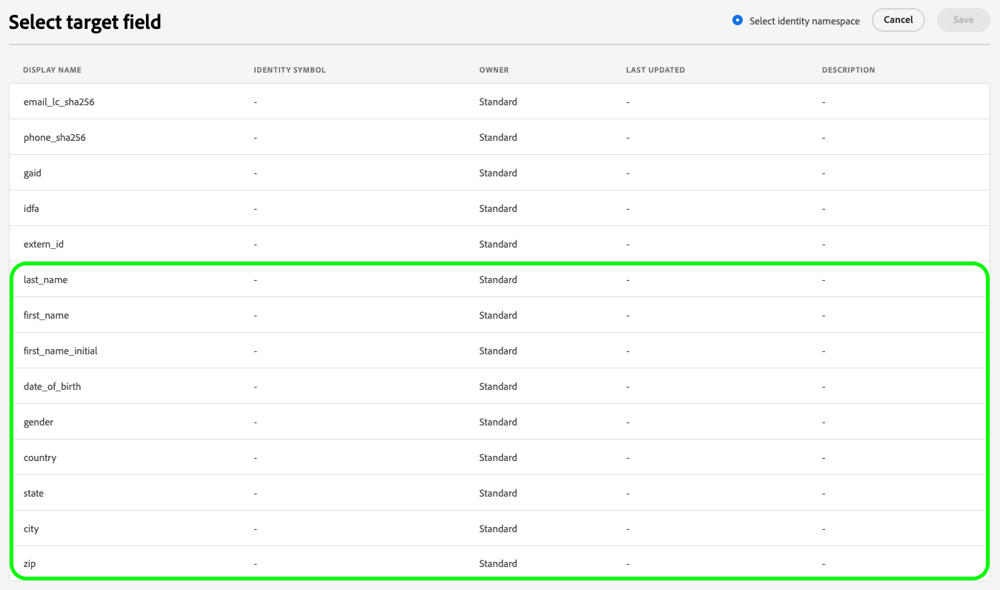

# Adobe Experience Platform 发行说明

>[!TIP]
>
>有关其他 Adobe Experience Platform 应用程序的发行说明，请参阅以下文档：
>
>- [Adobe Journey Optimizer](https://experienceleague.adobe.com/zh-hans/docs/journey-optimizer/using/whats-new/release-notes)
>- [Adobe Journey Optimizer B2B](https://experienceleague.adobe.com/zh-hans/docs/journey-optimizer-b2b/user/release-notes)
>- [Customer Journey Analytics](https://experienceleague.adobe.com/zh-hans/docs/analytics-platform/using/releases/pre-release-notes)
>- [联合受众构成](https://experienceleague.adobe.com/zh-hans/docs/federated-audience-composition/using/e-release-notes)
>- [Real-Time CDP Collaboration](https://experienceleague.adobe.com/zh-hans/docs/real-time-cdp-collaboration/using/latest)

**发布日期：2025 年 6 月 18 日**

Adobe Experience Platform 中新功能和现有功能的更新：

- [访问控制](#access-control)
- [高级数据生命周期管理](#advanced-data-lifecycle-management)
- [目录服务](#catalog-service)
- [仪表板](#dashboards)
- [数据治理](#data-governance)
- [目标](#destinations)
- [联合受众构成](#fac)
- [Privacy Service](#privacy-service)
- [沙盒](#sandboxes)
- [区段](#segmentation-service)
- [源](#sources)

## 访问控制 {#access-control}

Experience Platform 利用 [Adobe Admin Console](https://adminconsole.adobe.com) 产品轮廓将用户与权限和沙盒关联起来。权限控制对各种 Experience Platform 功能的访问，包括数据建模、轮廓管理和沙盒管理。

**主要功能**

| 功能 | 描述 |
| ------- | ----------- |
| 导出仪表板数据权限 | 仪表板中的&#x200B;**[!UICONTROL 下载 CSV]** 和&#x200B;**[!UICONTROL 以电子邮件形式发送]**&#x200B;选项现在需要&#x200B;**[!UICONTROL 导出仪表板数据]**&#x200B;权限。此权限确保只有授权用户才能导出表格洞察数据，从而支持更严格的治理和数据访问控制策略。请阅读[访问控制指南的权限部分](../../access-control/home.md#permissions)以了解更多信息。 |

有关更多信息，请参阅[访问控制概述](../../access-control/home.md)。

## 高级数据生命周期管理 {#advanced-data-lifecycle-management}

Experience Platform 提供了一整套数据安全功能，允许您通过程序化删除客户记录和数据集来管理存储的数据。使用 UI 中的数据生命周期工作区或通过调用 Data Hygiene API，您可以有效地管理数据存储。使用这些功能可确保信息按预期使用、在需要修复不正确的数据时进行更新以及在组织政策认为必要时进行删除。

**新文档**

| 新文档 | 描述 |
| --- | --- |
| 记录删除正式发布 | 您现在可以使用 UI 或 API 根据身份标识字段删除个人记录。此功能允许从单个数据集或所有数据集中删除数据，有助于减少存储、加强治理并改善数据卫生。适用调用量限制和权限要求。请阅读[删除记录指南](../../hygiene/ui/record-delete.md)以了解详情。 |

有关更多信息，请阅读[高级数据生命周期管理概述](../../hygiene/home.md)。

## 目录服务 {#catalog-service}

目录服务是 Adobe Experience Platform 中记录数据位置和沿袭的系统。虽然所有摄取到 Experience Platform 中的数据均作为文件和目录存储在数据湖中，但目录保存这些文件和目录的元数据和描述以供查找和监控目的。

**新增功能或更新后的功能**

| 功能 | 描述 |
| --- | --- |
| 改进的数据集预览：更快的导航和更清晰的洞察 | 快速预览数据集数据，查看底层 SQL 查询，并通过改进的筛选功能和更清晰的结构可见性，浏览多达 100 行数据，所有操作均在熟悉的数据集预览体验中完成。请阅读[数据集用户指南](../../catalog/datasets/user-guide.md#preview)以了解详情。 |

{style="table-layout:auto"}

## 仪表板 {#dashboards}

Experience Platform 提供了多个仪表板，您可以通过这些仪表板查看在每日快照中摄取的有关您组织数据的重要洞察。

**新增功能或更新后的功能**

| 功能 | 描述 |
| ------- | ----------- |
| 以电子邮件导出选项发送 | 您现在可以从 Query Pro Mode 仪表板中导出多达 10,000 条记录，只需从&#x200B;**[!UICONTROL 查看更多]**&#x200B;菜单中选择&#x200B;**[!UICONTROL 以电子邮件形式发送]**&#x200B;即可。此选项可安全地将下载链接发送到与 Adobe 相关的电子邮件，以便进行更大规模的导出。请阅读[查看更多指南](../../dashboards/sql-insights-query-pro-mode/view-more.md#export)以了解详情。 |

有关仪表板的详细信息，包括如何授予访问权限和创建自定义小组件，请首先阅读[仪表板概述](../../dashboards/home.md)。

## 数据治理 {#data-governance}

Adobe Experience Platform 数据治理是一系列策略和技术，用于管理客户数据并确保遵守适用于数据使用的法规、限制和政策。它在 Experience Platform 的 [!DNL Experience Platform] 各个层面中发挥着关键作用，包括编目、数据谱系、数据使用标记、数据访问策略和营销操作数据访问控制。

**新增功能**

| 功能 | 描述 |
| --- | --- |
| Azure CMK 警报和 IP 允许列表配置 | 您现在可以在 Azure Key Vault 中将 Adobe 的静态 IP 地址列入允许列表，以确保在启用网络限制时继续访问。这有助于防止由于密钥访问受限而导致 Platform 服务中断。 |
| CMK 配置警报和解决方案 | Experience Platform 现会在 Adobe 服务无法访问您的 Azure Key Vault 时触发警报（例如，由于移除了 IP 允许列表条目或禁用了密钥）。新指南可帮助您了解每个警报并采取纠正措施。 |

有关更多信息，请阅读[数据治理概述](../../data-governance/home.md)。

## 目标 {#destinations}

[!DNL Destinations] 是预先构建的与目标平台的集成，可实现从 Adobe Experience Platform 无缝激活数据。您可以使用目标激活已知和未知的数据，用于跨渠道营销活动、电子邮件宣传、定向广告和许多其他用例。

**新目标**

| 目标 | 描述 |
| --- | --- |
| [[!DNL Algolia]](../../destinations/catalog/personalization/algolia.md)连接 | 使用[!DNL Algolia]目标在从主页到搜索的各个网站之间提供一致的个性化服务。从多个数据源建立丰富的受众群体，并通过各种渠道分享，以改进目标市场选择策略和营销活动个性化。 |

**新增或更新的功能**

| 功能 | 描述 |
| --- | --- |
| [Google Customer Match + DV360](../../destinations/catalog/advertising/google-customer-match-dv360.md)正式发布 | Google客户匹配+ DV360目标现在可供所有Experience Platform用户使用。 文档现在包含有关[!DNL Adobe]和[!DNL Google]广告帐户之间[帐户链接](../../destinations/catalog/advertising/google-customer-match-dv360.md#linking)的详细指导。 |
| 流目标的[受众级别监控](../../dataflows/ui/monitor-destinations.md#audience-level-dataflow-runs-for-streaming-destinations) | 受众级别监控现在可用于以下目标： <ul><li>[[!DNL (API) Oracle Eloqua] 连接](../../destinations/catalog/email-marketing/oracle-eloqua-api.md)</li><li>[[!DNL (V2) Marketo Engage]](../../destinations/catalog/adobe/marketo-engage.md)</li><li>[[!DNL Airship Attributes]](../../destinations/catalog/mobile-engagement/airship-attributes.md)</li><li>[[!DNL Amazon Kinesis]](../../destinations/catalog/cloud-storage/amazon-kinesis.md)</li><li>[[!DNL Azure Event Hubs]](../../destinations/catalog/cloud-storage/azure-event-hubs.md)</li><li>[[!DNL Google Customer Match + Display & Video 360]](../../destinations/catalog/advertising/google-customer-match-dv360.md)</li><li>[[!DNL HTTP API]](../../destinations/catalog/streaming/http-destination.md)</li><li>[[!DNL HubSpot]](../../destinations/catalog/crm/hubspot.md)</li><li>[[!DNL Magnite: Real-time]](../../destinations/catalog/advertising/magnite-streaming.md)</li><li>[[!DNL Marketo Engage Person Sync]](../../destinations/catalog/adobe/marketo-engage-person-sync.md)</li><li>[[!DNL Microsoft Dynamics 365]](../../destinations/catalog/crm/microsoft-dynamics-365.md)</li><li>[[!DNL Moengage]](../../destinations/catalog/mobile-engagement/moengage.md)</li><li>[[!DNL Outreach]](../../destinations/catalog/crm/outreach.md)</li><li>[[!DNL PubMatic Connect]](../../destinations/catalog/advertising/pubmatic.md)</li><li>[[!DNL PubMatic Connect (Custom Audience ID Mapping)]](../../destinations/catalog/advertising/pubmatic.md)</li><li>[[!DNL Qualtrics Automations]](../../destinations/catalog/survey/qualtrics-automations.md)</li><li>[[!DNL RainFocus Attendee Profiles]](../../destinations/catalog/marketing-automation/rainfocus.md)</li><li>[[!DNL SAP Commerce]](../../destinations/catalog/ecommerce/sap-commerce.md)</li><li>[[!DNL Snowflake]](../../destinations/catalog/cloud-storage/snowflake.md)</li><li>[[!DNL Yahoo DataX]](../../destinations/catalog/advertising/datax.md)</li><li>[[!DNL Zendesk]](../../destinations/catalog/crm/zendesk.md)</li></ul> |
| 为 [Facebook](../../destinations/catalog/social/facebook.md#supported-identities) 目标提供额外的标识符支持 | [!DNL Facebook] 目标现在支持映射新的地址相关字段以改进目标市场选择，并与 Facebook 属性上的轮廓匹配。有关新的地址相关字段的详细信息，请参阅[支持的标识](../../destinations/catalog/social/facebook.md#supported-identities)部分。  {width="200" align="center" zoomable="yes"} |
| [[!DNL Braze]](../../destinations/catalog/mobile-engagement/braze.md)目标升级 | 从 2025 年 6 月 19 日开始，您可以在目标目录中并排看到两张 **[!DNL Braze]** 卡。这是由于目标服务内部升级造成的。现有的[!DNL Braze]目标连接器已更名为&#x200B;**[!UICONTROL （已弃用）Braze]**，并且现在为您提供了一个名为 **[!UICONTROL Braze]** 的新卡片。 将目录中的 **[!UICONTROL Braze]** 连接用于新的激活数据流。如果您有任何连接到&#x200B;**[!UICONTROL （已弃用）Braze]** 目标的激活数据流，它们将自动更新，因此无需您执行任何操作。 如果您通过 [Flow Service API](https://developer.adobe.com/experience-platform-apis/references/destinations/) 创建数据流，则必须将 [!DNL flow spec ID] 和 [!DNL connection spec ID] 更新为以下值： <ul><li>流量规范 ID：`cb7919bd-69aa-462d-bcc0-db7cdc7fdf51`</li><li>连接规范 ID：`ab957205-5a78-4393-b901-b930ed548220`</li></ul> |

{style="table-layout:auto"}

有关更多信息，请阅读[目标概述](../../destinations/home.md)。

## 联合受众构成 {#fac}

联合受众构成允许企业构成数据，以便在各种用例中更好地应用。通过这种新方法，作为 Adobe Real-Time Customer Data Platform 和/或 Adobe Journey Optimizer 用户，您可以直接从现有数据仓库联合数据集，以便在一个系统中创建和丰富 Adobe Experience Platform 受众和属性。

| 新功能 | 描述 |
| ----------- | ----------- |
| Adobe Healthcare Shield 正式面向客户发布 | 联合受众构成将于 6 月底向 Adobe Healthcare Shield 客户开放，用于受众创建、扩充和轮廓扩充用例。有关联合受众构成的隐私和安全措施的更多信息，请阅读[联合受众构成中的隐私和安全概述](https://experienceleague.adobe.com/zh-hans/docs/federated-audience-composition/using/start/privacy-security)。有关 Experience Platform 产品通常的 HIPAA 合规性的更多信息，请阅读 [HIPAA 和 Adobe 产品与服务概述](https://www.adobe.com/cn/trust/compliance/hipaa-ready.html)。 |

有关更多信息，请阅读[联合受众构成文档](https://experienceleague.adobe.com/zh-hans/docs/federated-audience-composition/using/home)。

## [!DNL Privacy Service] {#privacy}

多项法律和组织规定赋予用户相应的权利，允许他们根据要求从数据存储中访问或删除其个人数据的权利。Adobe Experience Platform [!DNL Privacy Service] 提供 RESTful API 和用户界面，帮助您管理客户数据请求。借助 [!DNL Privacy Service]，您可以提交从 Adobe Experience Cloud 应用程序访问和删除个人客户数据的请求，从而促进自动遵守法律和组织隐私法规。

**新增功能**

| 功能 | 描述 |
| --- | ---|
| 支持田纳西州和明尼苏达州隐私法 | Privacy Service 现在支持田纳西州信息保护法案（`tipa_tn_usa`）和明尼苏达州消费者数据隐私法案（`mcdpa_mn_usa`）。您可以根据这些新的州级法规处理访问和删除请求。有关更多详细信息，请参阅[法规概述](https://experienceleague.adobe.com/zh-hans/docs/experience-platform/privacy/regulations/overview)。 |

有关该服务的更多信息，请参阅 [Privacy Service 概述](../../privacy-service/home.md)。

## 沙盒 {#sandboxes}

Adobe Experience Platform 旨在丰富全球范围内的数字体验应用。企业通常会同时运行多个数字体验应用程序，并且需要满足这些应用程序的开发、测试和部署要求，同时确保运营合规性。

**新增功能或更新后的功能**

| 功能 | 描述 |
| --- | --- |
| 对象配置更新迁移 | 您现在可以在初始复制后，在沙盒之间迁移迭代对象配置更新。此增强功能支持开发工作流，其中配置需要在环境之间更新和传播，而无需重新创建整个沙盒设置。有关更多信息，请阅读有关[在沙盒之间传输配置更新](../../sandboxes/ui/sandbox-tooling.md#move-configs)的指南。 |

{style="table-layout:auto"}

有关沙盒的更多信息，请阅读[沙盒概述](../../sandboxes/home.md)。

## Segmentation Service {#segmentation-service}

[!DNL Segmentation Service] 通过描述在您的客户群中区分适销人群的标准，来定义特定的轮廓子集。受众可以基于记录型数据（如人口统计信息）或时间序列事件（代表客户与品牌的互动行为）进行构建。

**新增功能或更新后的功能**

| 功能 | 描述 |
| ------- | ----------- |
| 相似洞察可用性更新 | 对于使用率较低的环境，相似洞察和相似受众将自动禁用。低使用率定义为过去三个月内未查看相似洞察或过去六个月内未创建新的相似受众。有关此变更的更多信息，请参阅[相似受众指南](../../segmentation/types/lookalike-audiences.md)。 |

## 源 {#sources}

Experience Platform 提供 RESTful API 和交互式 UI，可让您轻松为各种数据提供者设置源连接。这些源连接允许您验证并连接到外部存储系统和 CRM 服务、设置运行摄取操作的时间以及管理数据摄取吞吐量。

**更新的功能**

| 功能 | 描述 |
| --- | --- |
| [!BADGE Beta]{type=Informative} UI 对 [!DNL Azure Databricks] 的支持 | 您现在可以使用 UI 中的源工作区将您的 [!DNL Azure Databricks] 帐户连接到 Experience Platform。请阅读 [UI 中将  [!DNL Databricks]  连接到 Experience Platform 指南](../../sources/connectors/databases/databricks.md)以了解详情。 |
| 支持 [!DNL Azure Synapse Analytics] 的新身份验证类型 | [!DNL Azure Synapse Analytics] 除了支持现有的连接字符串身份验证之外，现在还将支持服务主体身份验证。有关更多信息，请阅读[[!DNL Azure Synapse Analytics] 身份验证概述](../../sources/connectors/databases/synapse-analytics.md) |
| [!DNL Salesforce] 基本身份验证弃用 | [Salesforce CRM](../../sources/connectors/crm/salesforce.md) 和 [Salesforce Service Cloud](../../sources/connectors/customer-success/salesforce-service-cloud.md) 的基本身份验证将于 2026 年 1 月弃用。客户必须迁移到 OAuth 2.0 身份验证才能保持连接。此更改将影响两个源连接器，并确保符合 Salesforce 的身份验证标准，从而提升安全性。 |

{style="table-layout:auto"}

有关更多信息，请阅读[数据源概述](../../sources/home.md)。
