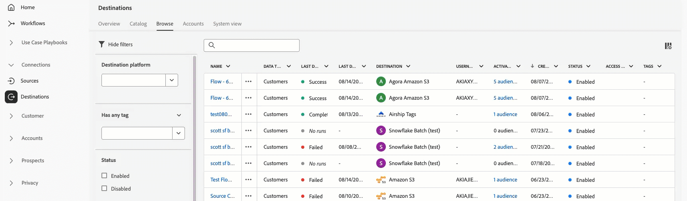

# Adobe Experience Platform 发行说明

>[!TIP]
>
>有关其他 Adobe Experience Platform 应用程序的发行说明，请参阅以下文档：
>
>- [Adobe Journey Optimizer](https://experienceleague.adobe.com/zh-hans/docs/journey-optimizer/using/whats-new/release-notes)
>- [Adobe Journey Optimizer B2B](https://experienceleague.adobe.com/zh-hans/docs/journey-optimizer-b2b/user/release-notes)
>- [Customer Journey Analytics](https://experienceleague.adobe.com/zh-hans/docs/analytics-platform/using/releases/pre-release-notes)
>- [联合受众构成](https://experienceleague.adobe.com/zh-hans/docs/federated-audience-composition/using/e-release-notes)
>- [Real-Time CDP Collaboration](https://experienceleague.adobe.com/zh-hans/docs/real-time-cdp-collaboration/using/latest)

**发行日期：2025 年 8 月 19 日**

Adobe Experience Platform 中新功能和现有功能的更新：

- [警报](#alerts)
- [目录服务](#catalog-service)
- [目标](#destinations)
- [Experience Data Model (XDM)](#xdm)
- [沙盒](#sandboxes)
- [Segmentation Service](#segmentation-service)
- [源](#sources)

## 警报 {#alerts}

Experience Platform 允许您订阅各种 Experience Platform 活动的基于事件的警报。您可以通过 Experience Platform 用户界面中的[!UICONTROL 警报]选项卡订阅不同的警报规则，并可以选择在用户界面内或通过电子邮件通知接收警报消息。

**新增功能**

| 功能 | 描述 |
| --- | --- |
| 流传输吞吐量警报 | 用户可以订阅三个新的警报，并配置警报以主动管理和监控流传输吞吐量的性能。新警报包含了当流传输吞吐量达到 80%、90% 以及超过容量限制三种情况。有关详细信息，请阅读[容量警报规则](../../observability/alerts/rules.md#capacity)指南。 |

有关警报的更多信息，请阅读[[!DNL Observability Insights] 概述](../../observability/home.md)。

## 目录服务 {#catalog-service}

目录服务是 Adobe Experience Platform 中记录数据位置和沿袭的系统。虽然所有摄取到 Experience Platform 中的数据均作为文件和目录存储在数据湖中，但目录保存这些文件和目录的元数据和描述以供查找和监控目的。

**新增功能或更新后的功能**

| 功能 | 描述 |
| --- | --- |
| 实时客户轮廓的数据保留 | 您&#x200B;**只能**&#x200B;每 30 天更新一次实时客户轮廓的数据保留期。 |

有关目录服务的更多信息，请阅读[目录服务概述](../../catalog/home.md)。

## 目标 {#destinations}

[!DNL Destinations] 是预建的与目标平台的集成，可实现从 Experience Platform 无缝激活数据。您可以使用目标激活已知和未知的数据，用于跨渠道营销活动、电子邮件营销活动、定向广告和许多其他用例。

>[!IMPORTANT]
>
>**数据集导出计划扩展**
>
>如果您的组织在 2024 年 11 月之前创建了数据集导出数据流，这些数据流将于 **2025 年 9 月 1 日**&#x200B;停止工作。如果您需要在 2025 年 9 月 1 日之后继续保持导出数据的数据流，则必须按照[这个指南](../../destinations/ui/dataset-expiration-update.md)中的步骤，为每一个数据集导出目标扩展导出计划。

>[!IMPORTANT]
>
>**必须为基于 API 的目标更新 IP 允许列表**
>
>由于流传输目标导出引擎升级，为基于 API 的目标使用 [IP 允许列表](../../destinations/catalog/streaming/ip-address-allow-list.md)的组织必须&#x200B;**在 2025 年 9 月 15 日之前**&#x200B;将以下 IP 地址添加到自己的允许列表中：
>
>**必需的 IP 地址：**
>
>```
>3.209.222.108
>3.211.230.204
>35.169.227.49
>66.117.18.133
>66.117.18.134
>66.117.18.135
>```
>
>**此更改适用于以下目标类型：**
>
>- [流传输受众导出目标](../../destinations/destination-types.md#streaming-destinations)（[Pega CDH 实时受众](/help/destinations/catalog/personalization/pega-v2.md)，与 [Salesforce Marketing Cloud](../../destinations/catalog/email-marketing/salesforce-marketing-cloud-exact-target.md) 和 [Oracle Eloqua](../../destinations/catalog/email-marketing/oracle-eloqua-api.md) 的基于 API 的集成）
>- 通过 [Destination SDK](../../destinations/destination-sdk/getting-started.md) 构建的公共或私人目标
>
>**必需的操作：**&#x200B;如果您使用 Adobe 将任何 IP 地址列入基于 API 的流传输目标的允许列表，就需要将上述 IP 地址添加到您的允许列表中，以确保数据流不间断地流向您的基于 API 的目标。

**新目标**

| 目标 | 描述 |
| --- | --- |
| [[!DNL Acxiom Real ID Audience Connection]](../../destinations/catalog/advertising/acxiom-real-id-audience-connection.md) 目标 | 使用 [!DNL Acxiom Real ID Audience Connection] 目标，通过 [!DNL Acxiom's] [Real ID](https://www.acxiom.com/real-id/real-id/) 技术增强受众，并将受众激活到多个平台，例如 [!DNL Altice]、[!DNL Ampersand]、[!DNL Comcast] 等。 |

**更新的目标**

| 目标 | 描述 |
| --- | --- |
| [[!DNL Microsoft Bing]](../../destinations/catalog/advertising/bing.md) 内部升级 | 从2025年8月11日开始，在短期内，您可能会在目标目录中看到两个&#x200B;**[!DNL Microsoft Bing]**&#x200B;卡并排显示。 这是由于目标服务内部升级造成的。现有的 **[!DNL Microsoft Bing]** 目标连接器已更名为&#x200B;**[!UICONTROL （已弃用）Microsoft Bing]**，现在为您提供一个名为 **[!UICONTROL Microsoft Bing]** 的新卡片。<br>升级已完成，已从目标目录中删除已弃用的信息卡。 使用目录中的&#x200B;**[!UICONTROL Microsoft Bing]**&#x200B;连接获取新的激活数据流。 如果您有任何到&#x200B;**[!UICONTROL （已弃用）Microsoft Bing]**&#x200B;目标的活动数据流，则会自动更新，因此您无需执行任何操作。 <br><br>如果您通过 [Flow Service API](https://developer.adobe.com/experience-platform-apis/references/destinations/) 创建数据流，则必须将 [!DNL flow spec ID] 和 [!DNL connection spec ID] 更新为以下值：<ul><li>流量规范 ID：`8d42c81d-9ba7-4534-9bf6-cf7c64fbd12e`</li><li>连接规范 ID：`dd69fc59-3bc5-451e-8ec2-1e74a670afd4`</li></ul> 此次升级后，您可能会发现流向 [!DNL Microsoft Bing] 的数据流中&#x200B;**活跃轮廓的数量下降**。出现下降的原因是，为所有流向此目标平台的激活引入了 **ECID 映射要求**。 |
| [[!DNL LinkedIn]](../../destinations/catalog/social/linkedin.md)和[LinkedIn匹配受众](../../destinations/catalog/social/linkedin-b2b.md)目标的身份验证到期详细信息 | [!DNL LinkedIn]目标的身份验证过期信息现在直接显示在Experience Platform界面中，因此您可以查看身份验证何时过期并续订，以免对数据流造成任何中断。 您可以在&#x200B;**[!UICONTROL 帐户]**&#x200B;或&#x200B;**[[!UICONTROL 浏览]](../../destinations/ui/destinations-workspace.md#accounts)**&#x200B;选项卡中从&#x200B;**[[!UICONTROL 帐户到期日期]](../../destinations/ui/destinations-workspace.md#browse)**&#x200B;列监视令牌到期日期。 |

**新增或更新的功能**

| 功能 | 描述 |
| --- | --- |
| 增强目标的搜索、过滤和标记功能 | 通过[浏览](../../destinations/ui/destinations-workspace.md#browse)和[帐户](../../destinations/ui/destinations-workspace.md#accounts)选项卡中增强的搜索、过滤和标记功能，改进您的目标管理工作流程。<br>您现在可以按名称搜索特定数据流和帐户，按包括目标平台、状态和日期在内的各种条件进行筛选，以及创建自定义标记来组织目标。 列排序还可用于关键字段，如上次数据流运行时，这使识别和管理目标连接更容易。<br>  |


## 体验数据模型 (XDM) {#xdm}

XDM 是一种开源规范，可为导入 Experience Platform 的数据提供常用的结构和定义（架构）。通过遵守 XDM 标准，所有客户体验数据都可以合并到一个通用的呈现中，以更快、更加集成的方式提供见解。您可以从客户行为中获得有价值的见解，通过区段定义客户受众，并使用客户属性实现个性化目的。

**新增功能**

| 功能 | 描述 |
| ------- | ----------- |
| 基于模型的架构 | 使用基于模型的架构简化您的数据建模。现在，您可以通过全面的操作示例和指导更轻松地创建架构。此功能目前可供营销活动编排许可证持有者使用，未来将扩展到 GA 的数据蒸馏器客户，使数据建模更易于访问、更高效。 |

有关详细信息，请参阅 [XDM 概述](../../xdm/home.md)。

<!--

## Real-Time Customer Profile {#profile}

Real-Time Customer Profile provides a unified, actionable view of each customer by consolidating data from all channels into a single profile.

**New or updated features**

| Feature | Description |
| --- | --- |
| Enhanced lookup functionality in the Entities API | The Entities API now supports the following: <ul><li>Person (Profile)</li><li>Experience Events</li><li>Account</li><li>Opportunity</li></ul> This update simplifies API usage and helps ensure optimal performance and reliability. If you previously used lookups for other entity types—including join tables and custom Multi-Entity types—now is a great opportunity to review your API usage and take advantage of the improved experience. For more information, read the [Real-Time CDB B2B Edition architecture upgrade guide](../../rtcdp/b2b-architecture-upgrade.md). |

For more information on Real-Time Customer Profile, read the [Profile overview](../../profile/home.md).

-->

## 沙盒 {#sandboxes}

Experience Platform 旨在全球范围内扩充数字体验应用。企业通常会同时运行多个数字体验应用程序，并且需要满足这些应用程序的开发、测试和部署要求，同时确保运营合规性。

**新增功能或更新后的功能**

| 功能 | 描述 |
| --- | --- |
| 删除导入工作流中依赖对象的重复数据 | 如果检测到同名的对象，沙盒工具现在将始终重复使用现有的对象，以避免对象数量激增。此更改适用于以下对象： <ul><li>架构</li><li>字段组</li><li>受众</li><li>`decisioning_ranking`</li><li>`decisioning_rules`</li></ul> 详情请参阅[沙盒工具支持对象指南](../../sandboxes/ui/sandbox-tooling.md#objects-supported-for-sandbox-tooling)。 |
| 整个沙盒支持跨组织包共享 | 现在，沙盒工具在跨组织包共享中支持&#x200B;**整个沙盒**&#x200B;类型。您现在可以在所有组织之间共享整个沙盒和多对象包。详情请参阅 [沙盒工具支持对象指南](../../sandboxes/ui/sharing-packages-across-orgs.md)。 |

有关沙盒的更多信息，请阅读[沙盒概述](../../sandboxes/home.md)。

## Segmentation Service {#segmentation-service}

[!DNL Segmentation Service] 通过描述在您的客户群中区分适销人群的标准，来定义特定的轮廓子集。受众可以基于记录型数据（如人口统计信息）或时间序列事件（代表客户与品牌的互动行为）进行构建。

**新增功能或更新后的功能**

| 功能 | 描述 |
| ------- | ----------- |
| 受众估计值 | 现在，区段生成器中会自动生成受众估计值。每当您更改受众，此值都会更新，并始终反映最新的受众规则。此外，估计值现在将显示为基于取样数据的置信区间的一个&#x200B;**范围**。 |

有关详细信息，请参阅 [[!DNL Segmentation Service]  概述](../../segmentation/home.md)。

## 源 {#sources}

Experience Platform 提供 RESTful API 和交互式 UI，可让您轻松为各种数据提供者设置源连接。这些源连接允许您验证并连接到外部存储系统和 CRM 服务、设置运行摄取操作的时间以及管理数据摄取吞吐量。

**新增或更新的功能**

| 功能 | 描述 |
| --- | --- |
| 增强 [!DNL Azure Blob Storage] 的身份验证 | 您现在可以使用基于服务主体的身份验证，将您的 [!DNL Azure Blob Storage] 源连接到 Experience Platform。使用基于服务主体的身份验证可增强安全性、简化凭据轮换，并为您的帐户提供粒度更细的访问控制。有关详细信息，请参阅 [[!DNL Azure Blob Storage]  概述](../../sources/connectors/cloud-storage/blob.md)。 |

有关更多信息，请阅读[来源概述](../../sources/home.md)。

<!---

| [!BADGE Beta]{type=Informative} Support for [!DNL Azure Private Links] in the UI | You can now use [!DNL Azure Private Links] for a select group of sources in the UI. Use this feature to create a private endpoint that which your source can connect to. With private endpoints, you can set up connections and dataflows that bypass the public internet, giving you enhanced security and network isolation for your sensitive data. Support for [!DNL Azure Private Links] is available to the following following sources: <ul><li>[[!DNL Azure Blob Storage]](../../sources/connectors/cloud-storage/blob.md)</li><li>[[!DNL ADLS Gen2]](../../sources/connectors/cloud-storage/adls-gen2.md)</li><li>[[!DNL Azure File Storage]](../../sources/connectors/cloud-storage/azure-file-storage.md)</li><li>[[!DNL Snowflake]](../../sources/connectors/databases/snowflake.md)</li></ul> For more information, read the guide on [[!DNL Azure Private Links]](../../sources/tutorials/ui/private-link.md). |

| Enhanced [[!DNL Marketo Engage]](../../destinations/catalog/adobe/marketo-engage-connection.md) destination  | The enhanced [[!DNL Marketo Engage]](../../destinations/catalog/adobe/marketo-engage-connection.md) destination is an upgraded version of the existing [[!DNL (Legacy) (V2) Marketo Engage]](../../destinations/catalog/adobe/marketo-engage.md) connector. This new connector brings profile sync capabilities in addition to the existing audience sync capabilities from the legacy connector, providing a tighter integration with [!DNL Marketo Engage]. <br> The [[!DNL (Legacy) (V2) Marketo Engage]](../../destinations/catalog/adobe/marketo-engage.md) connector will be deprecated in **March 2026**. To ensure a smooth transition to the new **[[!UICONTROL Marketo Engage]](../../destinations/catalog/adobe/marketo-engage-connection.md)** destination, review the following key points and required actions: <ul><li>All users of the existing **[!UICONTROL (Legacy) (V2) Marketo Engage]** must migrate to the new **[!UICONTROL Marketo Engage]** destination by March 2026.</li><li> **Existing dataflows will not be migrated automatically.** You must [set up a new connection](../../destinations/ui/connect-destination.md) to the new **[!UICONTROL Marketo Engage]** destination and activate your audiences there.</li></ul>|

-->

