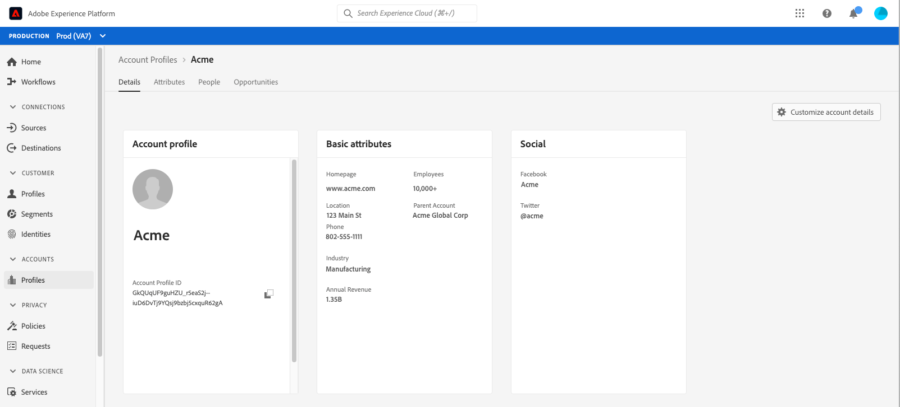

# 帐户轮廓 UI 指南

>[!NOTE]
>
>帐户配置文件仅适用于Real-Time Customer Data Platform B2B edition客户。 要了解有关Real-Time CDP的更多信息，包括每种许可证类型可用的特性和功能，请先阅读[Real-Time CDP概述](../overview.md)。

使用帐户配置文件，您可以统一来自多个来源的帐户信息。 这个统一的帐户视图将来自您多个营销渠道的数据以及您的组织当前用于存储客户帐户信息的不同系统的数据整合在一起。 本文档提供了使用Adobe Experience Platform用户界面(UI)中提供的Real-Time CDP和B2B edition功能与帐户配置文件进行交互的指南。

要了解有关如何在B2B工作流中创建帐户配置文件的更多信息，请参阅[端到端教程](../b2b-tutorial.md)。

## 帐户配置文件概述 {#account-profiles-overview}

在左侧导航中选择&#x200B;**[!UICONTROL Profiles]**&#x200B;下的[!UICONTROL Accounts]以查看帐户配置文件的概述。 在[!UICONTROL Overview]选项卡下，仪表板显示一个图形或图表，其中显示单个入口点中的小组件。

请参阅[[!UICONTROL Account Profiles]](../../dashboards/guides/account-profiles.md)仪表板上的文档以了解详情。 有关如何使用分析数据模型为仪表板创建自定义图表的更多信息，请参阅有关[Real-time Customer Data Platform Insights数据模型B2B edition](../../dashboards/data-models/cdp-insights-data-model-b2b.md)的文档。

## 配置潜在客户与帐户匹配 {#configure-lead-to-account-matching}

>[!IMPORTANT]
>
> 只有B2B AI管理员可以启用、禁用和配置潜在客户到帐户的匹配服务。 禁用服务后，将在24小时内删除匹配的结果。

要配置潜在客户与帐户的匹配，请在左侧导航的&#x200B;**[!UICONTROL Profiles]**&#x200B;下选择[!UICONTROL Accounts]。 在&#x200B;**[!UICONTROL Overview]**&#x200B;选项卡上，选择右上角的&#x200B;**[!UICONTROL Settings]**。

将打开&#x200B;**[!UICONTROL Account settings]**&#x200B;对话框。 在此处，选择&#x200B;**[!UICONTROL Enable lead-to-account-matching]**&#x200B;切换以启用该功能。 使用下拉菜单为&#x200B;**[!UICONTROL Daily]**&#x200B;设置选择&#x200B;**[!UICONTROL Matching cadence]**。 最后，选择相关的&#x200B;**[!UICONTROL Matching criteria]**&#x200B;选项，后跟&#x200B;**[!UICONTROL Save]**&#x200B;以确认您的设置并返回到&#x200B;**[!UICONTROL Account Profiles]**&#x200B;屏幕。

>[!NOTE]
>
> 地址不能用作唯一的匹配条件。 必须选择一个或多个其他匹配条件。

要了解有关商机帐户匹配的更多信息，请参阅Real-Time CDP B2B概述中的[商机帐户匹配](../../rtcdp/b2b-ai-ml-services/lead-to-account-matching.md)。

## 浏览帐户配置文件 {#browse-account-profiles}

要浏览帐户配置文件，请在左侧导航中选择&#x200B;**[!UICONTROL Profiles]**&#x200B;下的[!UICONTROL Accounts]开始。

在&#x200B;**[!UICONTROL Browse]**&#x200B;选项卡上，您可以使用连接的企业源中的帐户ID或直接输入源详细信息来浏览帐户配置文件。

### 按[!UICONTROL Connected enterprise source]浏览 {#browse-by-connected-enterprise-source}

要按连接的企业源浏览帐户配置文件，请从&#x200B;**[!UICONTROL Connected enterprise source]**&#x200B;下拉列表中选择&#x200B;**[!UICONTROL Browse by]**，然后使用&#x200B;**[!UICONTROL Source]**&#x200B;字段旁边的选择器按钮选择连接的源。

这将打开&#x200B;**[!UICONTROL Select source]**&#x200B;对话框，您可以在其中根据组织已建立的连接选择源。

>[!NOTE]
>
>贵组织可能为同一服务提供商配置了多个源(例如，Marketo)，因此请务必查看连接名称、源系统和源系统实例，以确保您按正确的源实例进行搜索。

要了解有关连接企业源的更多信息，请参阅[源概述](../sources/sources-overview.md)。

您可以通过选择连接名称旁边的单选按钮来选择源，然后使用&#x200B;**[!UICONTROL Select]**&#x200B;返回[!UICONTROL Browse]选项卡。

选定源后，您现在必须输入与该源相关的&#x200B;**[!UICONTROL Account ID]**。 例如，选择一个Salesforce源需要您从Salesforce实例中输入一个帐户ID，才能查看与该ID关联的帐户配置文件。

>[!NOTE]
>
>对于Marketo帐户ID，可能会引用两个帐户表，因此您必须使用特定语法以确保查看的帐户正确。
>
>最常见的标准语法是Marketo帐户ID，后附有`.mkto_org`（例如，`1234567.mkto_org`）。 Marketo Account-Based Marketing客户可能具有其他值，这些值可使用由`.mkto_account`附加的Marketo帐户ID找到。 如果您不确定要使用哪种语法，请咨询Marketo管理员。

### 按[!UICONTROL Others]浏览 {#browse-by-others}

Real-Time CDP、B2B edition支持执行直接查找的功能，允许您为要查看的帐户输入&#x200B;**[!UICONTROL Source name]**、**[!UICONTROL Source instance]**&#x200B;和&#x200B;**[!UICONTROL Account ID]**。 通过直接输入源名称和实例，您可以提供Experience Platform搜索和显示正确帐户配置文件数据所需的上下文。

在无法与数据直接建立源连接的情况下，执行直接查找的功能会很有用。 例如，如果贵组织制定了数据治理策略，阻止直接连接到CRM，则您可以将该数据导出到云存储系统，然后将其摄取到Experience Platform。

另一个示例可能是，从离开系统到进入Experience Platform期间您正在对数据执行转换。 您可以使用直接查找功能来提供数据的上下文(例如，指定它是Marketo数据，尽管它来自Amazon S3存储桶)，以便系统知道在哪里查找以及如何正确呈现数据。

要开始直接查找，请从&#x200B;**[!UICONTROL Others]**&#x200B;下拉列表中选择&#x200B;**[!UICONTROL Browse by]**，然后为要查看的帐户输入&#x200B;**[!UICONTROL Source name]**、**[!UICONTROL Source instance]**&#x200B;和&#x200B;**[!UICONTROL Account ID]**。

## 查看帐户个人资料详细信息 {#view-account-profile-details}

使用&#x200B;**[!UICONTROL Browse]**&#x200B;选项卡查找帐户配置文件后，选择&#x200B;**[!UICONTROL Profile ID]**&#x200B;将打开帐户配置文件的&#x200B;**[!UICONTROL Detail]**&#x200B;选项卡。 **[!UICONTROL Detail]**&#x200B;选项卡上显示的配置文件信息已从多个配置文件片段合并在一起，以形成单个帐户的单个视图。 这包括帐户详细信息，例如基本属性和社交媒体数据。

显示的默认字段也可以在组织级别更改以显示首选帐户配置文件属性。

>[!NOTE]
>
>客户配置文件也提供了类似功能，并创建了一个分步指南，其中包含有关添加和删除属性、调整面板大小等说明。 请阅读[配置文件详细信息自定义指南](../../profile/ui/profile-customization.md)以了解更多信息。

您可以通过选择其他可用选项卡来查看与帐户相关的其他详细信息。 这些标签包括属性、人员和业务机会标签，这些标签显示与企业系统中的帐户相关的未结和已结业务机会。 有关每个选项卡的更多信息，请参阅以下部分。

## “属性”选项卡 {#attributes-tab}

**[!UICONTROL Attributes]**&#x200B;选项卡列出了与该帐户相关的所有记录信息。 这包括来自多个源的属性数据，这些数据已合并到一起，以形成帐户的单个视图。

除了能够查看列表中的数据之外，您还可以使用搜索栏搜索特定属性或以JSON格式查看记录数据。

## “人员”选项卡 {#people-tab}

**[!UICONTROL People]**&#x200B;选项卡提供与帐户关联的个人人员的列表。 这些人员可能是来自贵组织内不同团队管理的不同企业系统的联系人和潜在客户，但在Real-Time CDP中，B2B edition将这些人员作为单个列表显示，以便您更加全面地查看帐户联系人。

>[!NOTE]
>
>[!UICONTROL People]选项卡显示与该帐户关联的最多25人的列表。 对于关联人员超过25人的客户，系统显示25条记录的随机抽样。

除了向您显示该联系人的信息快照外，列出的每个人员还包含一个&#x200B;**[!UICONTROL Profile ID]**，这是一个可单击的链接，允许您浏览该人员的实时客户档案。 要了解有关查看与您的帐户相关的个人客户配置文件的详细信息，请访问指南，以在B2B edition的Real-Time CDP中浏览个人资料[&#128279;](../profile/profile-browse.md)。

## “业务机会”选项卡 {#opportunities-tab}

**[!UICONTROL Opportunities]**&#x200B;选项卡提供与帐户相关的未结和已结业务机会的信息。 这些机会可能会从多个来源引入Experience Platform，但是Real-Time CDP中的B2B edition使营销人员能够轻松地在一个位置一起查看所有这些机会。

>[!NOTE]
>
>[!UICONTROL Opportunities]选项卡显示一个列表，其中包含与该帐户关联的最多25个机会。 对于关联业务机会超过25个的客户，系统显示25条记录的随机抽样。

每个机会都包括一些信息，如机会的名称、数量、阶段，以及机会是开放、关闭、成功还是失败。

## “相关帐户”选项卡 {#related-accounts-tab}

“**[!UICONTROL Related accounts]**”选项卡提供有关可能与您正在浏览的帐户相关的其他帐户的信息。 有关功能的详细信息，请阅读[相关帐户概述](/help/rtcdp/b2b-ai-ml-services/related-accounts.md)。

>[!NOTE]
>
>* 相关帐户组最多可以具有30个帐户配置文件。 如果发现超过30个帐户配置文件相关，则将其任意拆分为多个组，每个组的成员不超过30个。 帐户配置文件的“相关帐户”组始终包含自身。
>* [!UICONTROL Related accounts]选项卡当前显示一个列表，其中包含与正在浏览的帐户关联的最多25个相关帐户。 此限制将在以后的更新中解决。 尽管存在这种UI限制，当您在区段定义中使用相关帐户时，对于包含30个相关帐户配置文件的组，所有配置文件都用于定位。

每个相关帐户包括帐户资料ID和名称、帐户源密钥，以及与主页、地址、父帐户、电话、行业和年收入相关的更多信息。

您可以使用此列表中的相关帐户进行分段。 查看[分段示例](/help/rtcdp/segmentation/b2b.md#related-account)以了解如何使用相关帐户扩大您在区段定义中的范围。