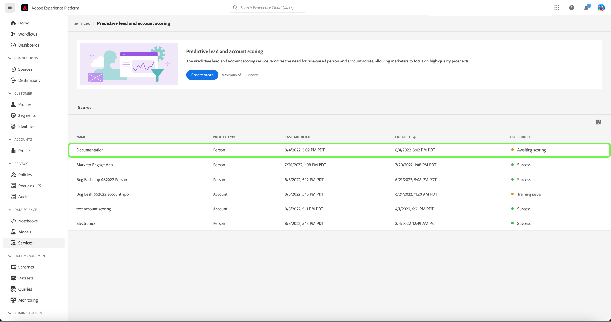
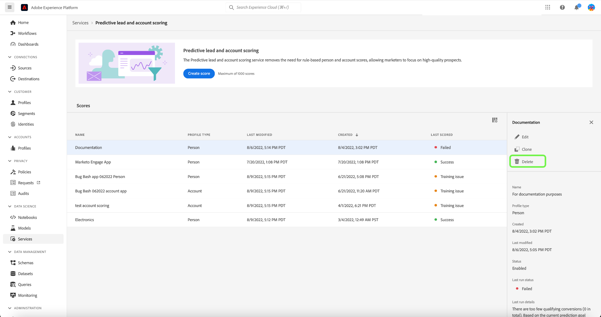

# 在Adobe Real-time Customer Data Platform B2B版本中管理预测性商机和客户评分

>[!NOTE]
>
>只有具有“管理B2B人工智能”权限的用户才能创建、更改和删除得分目标。

本教程将指导您完成管理预测商机和帐户评分服务的得分目标的步骤。 得分目标可以是人员个人资料或帐户个人资料

## 创建新得分

要创建新得分，请在侧边栏中选择&#x200B;**[!UICONTROL 服务]**，然后选择&#x200B;**[!UICONTROL 创建得分]**。

出现&#x200B;**[!UICONTROL 基本信息]**&#x200B;屏幕，提示您选择配置文件类型、输入名称和可选描述。 完成后，选择&#x200B;**[!UICONTROL 下一步]**。

将显示&#x200B;**[!UICONTROL 定义您的目标]**&#x200B;屏幕。 选择下拉箭头，然后从显示的下拉窗口中选择目标类型。

将打开&#x200B;**[!UICONTROL 目标详情]**&#x200B;对话框。 选择下拉箭头，然后从显示的下拉窗口中选择目标字段名称。

出现&#x200B;**[!UICONTROL 目标条件]**&#x200B;选择。 选择下拉箭头，然后从显示的下拉窗口中选择条件。

出现&#x200B;**[!UICONTROL 目标值]**&#x200B;字段。 接下来，配置您的[!UICONTROL 目标详情]。 选择[!UICONTROL 输入字段值]面板并输入目标值。

>[!NOTE]
>
>可以添加多个目标值。

要添加其他字段，请选择&#x200B;**[!UICONTROL 添加字段]**。

要配置预测时间范围，请选择下拉箭头，然后选择所选的时间范围。

所选合并策略确定如何选择人员配置文件的字段值。 使用下拉箭头选择您选择的合并策略，然后选择&#x200B;**[!UICONTROL 完成]**。

**[!UICONTROL 评分设置完成]**&#x200B;对话框出现，确认已创建新评分。 选择&#x200B;**[!UICONTROL 确定]**。

>[!NOTE]
>
>每个评分过程可能需要24小时才能完成。

您会返回到&#x200B;**[!UICONTROL 服务]**&#x200B;选项卡，您可以在其中查看在分数列表中创建的新分数。

选择得分以查看有关上次运行详细信息的详细信息和附加信息。

有关可在上次运行详细信息下看到的错误代码的更多详细信息，请参阅本文档中有关[潜在客户AI管道错误代码](#leads-ai-pipeline-error-codes)的部分。

## 编辑得分

要编辑得分，请从&#x200B;**[!UICONTROL 服务]**&#x200B;选项卡中选择得分，然后从屏幕右侧的附加详细信息面板中选择&#x200B;**[!UICONTROL 编辑]**。

此时将显示&#x200B;**[!UICONTROL 编辑实例]**&#x200B;对话框，您可以在其中编辑得分的说明。 进行更改并选择&#x200B;**[!UICONTROL 保存]**。

>[!NOTE]
>
>无法更改得分配置，因为这将触发模型重新训练和重新评分。 此操作等同于删除得分并创建新得分。 要编辑得分的配置，您需要克隆此得分或创建新得分。

您返回到&#x200B;**[!UICONTROL 服务]**&#x200B;选项卡。 选择分数可在屏幕右侧的其他详细信息面板中查看更新的描述详细信息。

## 克隆得分

若要克隆得分，请从&#x200B;**[!UICONTROL 服务]**&#x200B;选项卡中选择得分，然后从屏幕右侧的其他详细信息面板中选择&#x200B;**[!UICONTROL 克隆]**。

出现&#x200B;**[!UICONTROL 基本信息]**&#x200B;屏幕。 配置文件类型、名称和描述是从原始得分克隆而来的。 修改这些详细信息并选择&#x200B;**[!UICONTROL 下一步]**。

将显示&#x200B;**[!UICONTROL 定义您的目标]**&#x200B;屏幕。 像创建新得分时一样完成目标部分，然后选择&#x200B;**[!UICONTROL 完成]**。

返回到&#x200B;**[!UICONTROL 服务]**&#x200B;选项卡，您可以在列表中看到新克隆的分数。

>[!NOTE]
>
>**[!UICONTROL 定义您的目标]**&#x200B;分区未从原始得分中克隆。

## 删除得分

要删除得分，请从&#x200B;**[!UICONTROL 服务]**&#x200B;选项卡中选择一个得分，然后从屏幕右侧的附加详细信息面板中选择&#x200B;**[!UICONTROL 删除]**。

出现&#x200B;**[!UICONTROL 删除文档]**&#x200B;确认对话框。 选择&#x200B;**[!UICONTROL 删除]**。

>[!NOTE]
>
>删除得分定义也会删除人员配置文件或帐户配置文件上的所有预测得分，但不删除为得分定义创建的字段组。 字段组在数据模型中将被保留为“孤立”。

您会返回到&#x200B;**[!UICONTROL 服务]**&#x200B;选项卡，在该选项卡中，您将无法再在列表中看到得分。

## 商机AI管道错误代码

| 错误代码 | 错误消息 |
| --- | --- |
| 401 | 错误401。 商机AI管道已停止：帐户评分的有效帐户不足。 帐户计数： {}。 |
| 402 | 错误402。 潜在客户人工智能管道已停止：没有足够的有效联系人来进行联系人评分。 联系人计数： {}。 |
| 403 | 错误403。 潜在客户AI管道已停止：活动量不足以进行模型训练。 事件计数： {}。 |
| 404 | 错误404。 潜在客户人工智能管道已停止：转化不足以进行模型训练。 转化计数： {}。 |
| 405 | 错误405。 潜在客户AI管道已停止：对于有效的模型训练，活动过于稀疏。 只有{}%的帐户具有活动。 |
| 406 | 错误406。 潜在客户AI管道已停止：对于有效的模型训练，活动过于稀疏。 只有{}%的联系人有活动。 |
| 407 | 错误407。 潜在客户人工智能管道已停止：评分数据活动类型与训练数据不匹配。 |
| 408 | 错误408。 潜在客户AI管道已停止：活动功能的缺失率过高。 缺少率： {}。 |
| 409 | 错误409。 潜在客户AI管道已停止：测试auc过低。 测试auc： {}。 |
| 410 | 错误410。 Leads AI管道已停止：参数调整后测试auc过低。 测试auc： {}。 |
| 411 | 错误411。 潜在客户人工智能管道已停止：训练数据没有足够的转化来生成可靠的模型。 转化： {}。 |
| 412 | 错误412。 潜在客户AI管道已停止：测试数据不具有任何计算AUC-ROC的转换。 |

| 警告/信息代码 | 消息 |
| --- | --- |
| 100 | 信息100。 潜在客户AI质量检查：帐户数为： {}。 |
| 101 | 信息101。 潜在客户AI质量检查：联系人数为： {}。 |
| 102 | 信息102。 潜在客户AI质量检查：机会数为： {}。 |
| 103 | 信息103。 领导AI质量检查：测试auc较低。 开始参数调整。 正在测试auc： {}。 |
| 200 | 警告200。 潜在客户AI质量检查：第一代功能的缺失率为： {}。 |
| 201 | 警告201。 潜在客户AI质量检查：活动功能的缺失率为： {}。 |

## 后续步骤

通过学习本教程，您现在可以成功创建和管理得分。 有关更多详细信息，请参阅以下文档：

* [预测性商机和客户评分](/help/rtcdp/b2b-ai-ml-services/predictive-lead-and-account-scoring.md)
* [监控预测性商机和客户评分作业](/help/dataflows/ui/b2b/monitor-profile-enrichment.md)
