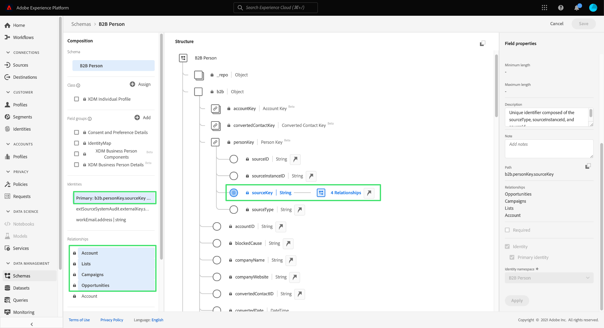

# Real-Time Customer Data Platform B2B edition快速入门

本文档提供了一个高级别的端到端工作流程，介绍Real-Time Customer Data Platform (CDP) B2B edition快速入门，并通过一个示例用例来说明关键概念。

技术公司Bodea希望将来自不同孤立数据源的个人和帐户数据整合在一起，以便通过电子邮件及其新产品的LinkedIn广告促销活动有效地定位客户。 Bodea使用营销自动化平台，并且需要从包含客户数据的多个CRM中细分特定于B2B的受众。

## 快速入门

作为演示的一部分，本教程工作流依赖于多个Adobe Experience Platform服务。 如果您希望遵循这些步骤，建议您很好地了解以下服务：

- [体验数据模型 (XDM)](../xdm/home.md)
- [源](../sources/home.md)
- [区段](../segmentation/home.md)
- [目标](../destinations/home.md)

## 为您的数据创建架构

作为初始设置的一部分，Bodea的IT部门需要创建一个XDM架构，以确保将其数据引入Experience Platform时遵循标准格式，并且可在不同的Experience Platform服务和Adobe Experience Cloud产品(例如Adobe Analytics和Adobe Target)中使用。

>[!WARNING]
>
>您必须按照本教程中链接到的相关源文档中所述的摄取模式进行操作。 不能保证其他字段映射方法有效。

Adobe Experience Platform允许您自动生成B2B数据源所需的架构和命名空间。 此工具可确保创建的架构以结构化的可重用方式描述数据。 有关安装过程的完整参考，请参阅[B2B命名空间和架构自动生成实用程序文档](../sources/connectors/adobe-applications/marketo/marketo-namespaces.md)。

在Adobe Experience Platform UI中，Bodea营销人员在左边栏中选择&#x200B;**[!UICONTROL Schemas]**，然后选择&#x200B;**[!UICONTROL Browse]**&#x200B;选项卡。 由于它们使用了自动生成实用程序，因此列表中将显示新的空架构，并且所有架构的前缀均为“B2B”。

自动生成实用程序使用捕获基本B2B数据实体的标准XDM B2B类（如[XDM业务帐户](../xdm/classes/b2b/business-account.md)和[XDM业务机会](../xdm/classes/b2b/business-opportunity.md)）为架构定义了数据模型结构。 此外，基于这些类自动生成的B2B架构已预先建立关系，允许进行高级分段用例。 任何数据结构所需的其他字段组都可以通过UI在此轻松创建。 有关详细信息，请参阅[XDM UI指南，将字段组添加到架构部分](../xdm/ui/resources/schemas.md#add-field-groups)。

>[!NOTE]
> 
>如果您未使用自动生成器实用程序，或者需要创建新关系，请参阅有关[在B2B架构之间创建关系的教程](../xdm/tutorials/relationship-b2b.md)。

Real-time Customer Profile将合并来自不同来源的数据，以创建关键B2B实体的整合配置文件。 由于用户档案是基于单个类生成的，因此自动生成实用程序会根据常见的业务用例设置架构之间的关系。 因此，Bodea团队现在已准备好根据其B2B架构摄取数据。

>[!NOTE]
> 
>通过自动生成实用程序为模式创建的默认标识命名空间、主键和关系可在模式工作区中轻松找到。
>
>

## 将数据摄取到Experience Platform

接下来，Bodea营销人员使用[源连接器](../sources/home.md)将数据摄取到Experience Platform以供下游服务使用。 您还可以使用Real-Time CDP B2B edition的某个已批准源来摄取数据。

>[!NOTE]
> 
>要了解您的组织可以使用哪些源连接器，您可以在Experience Platform UI中查看源目录。 要访问目录，请在左侧导航中选择&#x200B;**源**，然后选择&#x200B;**目录**。

要在源帐户与Experience Platform之间创建连接，您必须获取身份验证凭据。 有关获取每种类型源的身份验证凭据的详细说明，请参阅[源概述](../sources/home.md)。

在获取身份验证凭据后，Bodea营销人员会创建源帐户与其Experience Platform组织之间的连接。 有关设置源连接的详细信息，请参阅[源文档](../sources/home.md)。

源连接器提供自动映射功能，使将所有数据字段映射到新创建架构的数据字段的过程更加容易。

>[!NOTE]
> 
>如果您在XDM架构中建立了自定义字段组，则在流程的此阶段可能会有未连接的字段。 确保检查填充自定义字段组的所有值。

Bodea营销人员检查所有字段组是否都已正确映射，并通过初始化数据流来继续源设置过程。 通过创建数据流以引入源数据，下游Experience Platform服务可以使用传入数据。 在初始摄取过程中，数据会作为批次引入Experience Platform。 之后，后续摄取的数据将流式传输到配置文件中，进行实时更新。

## 创建受众以评估数据

接下来，根据源数据中相关实体的特定属性，为Bodea的新电子邮件营销活动创建受众。 在Experience Platform UI中，Bodea营销人员首先在左侧导航中选择&#x200B;**[!UICONTROL Segments]**，然后选择&#x200B;**[!UICONTROL Create segment]**。

在本例中，受众会查找所有在销售部门工作并与至少有一个未完成销售机会的任何客户相关的人员。 此受众需要XDM个人资料类、XDM商业帐户类和XDM商业机会类之间的链接。

>[!NOTE]
> 
>有关如何创建受众以评估数据的说明，请参阅[区段生成器用户界面指南](../segmentation/ui/segment-builder.md)。 有关更具体的B2B分段用例，请参阅[Real-Time CDP B2B edition分段概述](./segmentation/b2b.md)。

区段生成器允许您根据实时客户档案数据创建适销受众，并根据您定义的属性、事件和现有受众的组合查看潜在受众的估计值。

## 将评估的数据激活到目标

成功创建受众后，工作区的[!UICONTROL Details]部分将提供摘要。 由于当前没有为区段定义激活目标，因此Bodea营销人员需要将受众导出到可在其中进行访问和操作的数据集。

在Experience Platform UI的[!UICONTROL Segments]工作区中，Bodea营销人员选择&#x200B;**[!UICONTROL Activate to destination]**。

>[!NOTE]
> 
>有关如何完成此操作的完整步骤，请参阅有关[将受众激活到目标](https://experienceleague.adobe.com/docs/marketo/using/product-docs/core-marketo-concepts/smart-lists-and-static-lists/static-lists/push-an-adobe-experience-cloud-segment-to-a-marketo-static-list.html)的教程。

Bodea营销人员可将受众激活到目标，从而允许他们将受众数据从Experience Platform推送到其营销自动化平台。 有关可用目标的详细信息，请阅读[目标目录](../destinations/catalog/overview.md)。

## 后续步骤

通过阅读本教程，您已成功利用Real-Time CDP B2B edition使用的各种Adobe Experience Platform服务。 因此，您已了解如何摄取、细分、评估和导出B2B数据，作为可以跨不同渠道参与的可操作受众。
