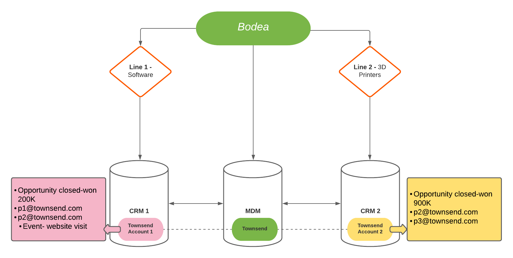

# Real-time Customer Data Platform B2B版本的示例用例

Real-time Customer Data Platform B2B版本扩展了现有的Real-Time CDP和Adobe Experience Platform产品，以支持B2B数据和工作流。 本文档提供了一个示例用例，用于演示B2B版本提供的其他好处。 其中包括：

- 将来自不同孤立数据源的个人和帐户数据相结合，生成一个全面的视图，从而更好地了解客户并更准确地分段。 请参阅相关文档 [创建XDM架构关系](./schemas/b2b.md) 用于各种B2B源，以了解更多信息。
- 根据相关实体的属性对受众进行分段。 这包括客户、商机、营销活动和营销列表。 区段不再仅限于人员属性和体验事件。 请参阅 [B2B分段文档](./segmentation/b2b.md) 有关创建特定于B2B的受众的更多示例。
- 本地支持与多个帐户相关的一个人的用例。

## 用例

Bodea是一家科技公司，它推出了一款新产品，希望同时通过电子邮件和LinkedIn广告促销活动来定位客户。 为了最大限度地提高营销活动的效率，Bodea还希望将目标客户锁定在与该现有帐户关联的用户身上，这些用户之前在其产品上花费了100多万美元，并且在上个月访问了新产品页面。

然而，Bodea拥有两种不同的业务领域。 Bodea的第一业务线“1号线”为汽车行业创建了软件。 其第二项业务“Line 2”销售制造汽车部件的3D打印机。 由于Bodea的两项业务，从Bodea客户帐户生成的收入数据没有统一到单个视图中。

每个业务线都有自己的销售系统：“CRM 1”和“CRM 2”。 这两个CRM销售系统均连接到其自己的营销自动化平台“Marketo 1”和“Marketo 2”。 来自CRM 1的数据仅同步到Marketo 1，来自CRM2的数据仅同步到Marketo 2。 最终，他们的数据会保存在不同的公司信息库中。

## 当前数据状况

由于Bodea的两条业务线都销售给Townsend公司，因此Townsend的业务数据记录为每个销售系统中的两个单独账户。

在Marketo 1中，Townsend被记录为帐户1。 在CRM 1中，它有两个相关人员(p1@townsend.com和p2@townsend.com)和一个价值200,000美元的Opportunity (“Opportunity 1”)的未完成机会。 该数据已从CRM 1同步到Marketo 1。

在Marketo 2中，Townsend被记录为帐户2。 客户2在CRM 2中还有两个相关人员(p2@townsend.com和p3@townsend.com)和一个价值900,000美元的未了结机会（“机会2”）。 该数据已从CRM 2同步到Marketo 2。

出于集成和其他公司控制目的，Bodea还具有主控数据管理(MDM)系统，在该系统中，其维护一条记录，指示Marketo 1中的帐户1（和CRM 1）和Marketo 2中的帐户2（和CRM 2）是同一公司。

上个月， `p2@townsend.com` 访问了新产品页面，并且Marketo 1记录了Web访问。

## 问题

第1行刚刚发布了一款新的软件产品，并希望将其追加销售给Bodea现有的顶级客户群。 Bodea启动营销活动，以考虑特定目标受众。

由于相关的Townsend信息在Marketo 1中记录为“帐户1”，在Marketo 2中记录为“帐户2”，因此Bodea的营销团队无法有效地利用孤立信息。

这禁止Bodea营销团队利用这一新机会有效地定位这些公司的特定业务联系人。

迄今为止，汤森家族在所有账户上累计花了100多万美元购买Bodea的产品。 但是，使用旧系统创建的区段不包括汤森的任何人，除非在单个销售系统中花费的总额超过100万美元。 这是因为收入数据被存储在不同销售系统下的帐户中。

由于汤森的支出分散在不同的销售系统，且单个销售系统的总支出不超过100万，因此该部门找不到任何合格的Marketo 1或Marketo 2销售人员。

### Real-Time CDP B2B版本如何解决此问题

借助Real-Time CDP B2B版，Bodea的营销团队可以：

- 将所有不同源(多个Marketo和CRM实例以及主控数据管理)中的数据合并到Real-Time CDP B2B版本中。

通过RT-CDP B2B版本，Bodea可以使用Marketo Engage源连接器将来自Marketo 1和Marketo 2的B2B数据引入Experience Platform，并使用平台连接的应用程序保持此数据最新。 请参阅 [Marketo源连接器](../sources/connectors/adobe-applications/marketo/marketo.md) 文档，以了解更多信息。

来自CRM1的B2B数据（人员、客户、机会和活动）已同步到Marketo 1。 同样，来自CRM 2的所有B2B数据都会同步到Marketo 2。 它们通过Marketo源连接器同步到Adobe Experience Platform。 但是，如果Bodea希望将来自CRM的其他数据引入Experience Platform，则可以使用现有CRM连接器。

为了简单起见，以及本示例的目的，用户是通过其电子邮件进行识别的。 此示例的组合帐户数据如下所示：

| 人员 |
|---|
| p1@townsend.com |
| p2@townsend.com （上个月访问过新产品页面的用户） |
| p3@townsend.com |

| 机会（闭门赢家） |
|---|
| 机会1 ， 20万美元 |
| 机会2， 90万美元 |

- 使用此聚合数据为各种营销计划创建唯一区段。 在此示例中，区段查找满足以下条件的所有人员：

   - （在所有客户中）具有超过100万美元的关联机会
   - AND
   - 上个月访问过产品页面

- 创建受众作为Bodea新营销活动的最有效接收者。 在此示例中，RT-CDP、B2B版本将帮助营销人员识别 `p2@townsend.com` 作为此营销活动的正确目标。

通过使用Marketo Engage和LinkedIn目标，Bodea为其营销团队提供了端到端客户体验管理(CXM)解决方案。 在Experience Platform中创建的受众将被推送到Marketo目标，并在其中显示为静态列表。 然后，此受众会自动添加到Marketo营销活动中。 同时，受众也可以通过RT-CDP B2B版本发送到LinkedIn营销活动中。

## 后续步骤

通过阅读本文档，您现在了解了可以使用Real-Time CDP B2B版本解决的目标和问题类型。

建议使用以下文档来帮助您更好地了解B2B的特定功能：

- [Real-time Customer Data Platform B2B版本端到端教程](./b2b-tutorial.md)
- [Real-time Customer Data Platform B2B版本中的源](./sources/b2b.md)
- [Real-time Customer Data Platform B2B版本中的架构](./schemas/b2b.md)
- [B2B分段示例](./segmentation/b2b.md)
- [帐户配置文件概述](./accounts/account-profile-overview.md)
- [Real-time Customer Data Platform B2B版本中的目标](./destinations/b2b.md)
- [配置LinkedIn匹配受众目标](../destinations/catalog/social/linkedin.md)
