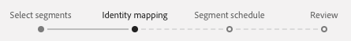
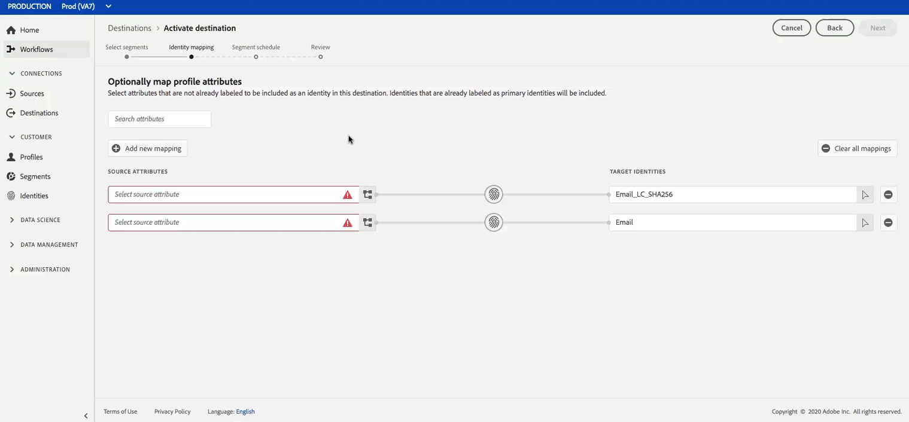

# 将用户档案和区段激活到目标

通过将细分映射到目标，激活您在实时客户数据平台中拥有的数据。 要完成此操作，请按照以下步骤操作。

## 先决条件 {#prerequisites}

要将数据激活到目标，您必须已成 [功连接目标](/help/rtcdp/destinations/connect-destination.md)。 如果尚未这样做，请转到目标目 [录](/help/rtcdp/destinations/destinations-catalog.md)，浏览支持的目标，然后设置一个或多个目标。

## 激活数据 {#activate-data}

激活工作流中的步骤因目标类型而略有不同。 以下概述了所有目标类型的完整工作流。

### 选择要激活数据的目标 {#select-destination}

适用于：所有目标

在实时CDP用户界面中，导航到 **[!UICONTROL 目标]** >浏 **[!UICONTROL 览]**，然后选择要激活区段的目标。


选择目标的名称以导航到激活工作流。


请注意，如果目标激活工作流已存在，您可以看到当前正在激活到目标的区段。 选 **[!UICONTROL 择右边栏]** 中的编辑激活，然后按照以下步骤修改激活详细信息。

选择目标后，选择“激 **[!UICONTROL 活”]**。

### [!UICONTROL 选择区段] 步骤 {#select-segments}

适用于：所有目标


在激活 **[!UICONTROL 目标工作流]** ，在选择区 **** 段页面上，选择一个或多个要激活到目标的区段。 选择 **[!UICONTROL 下一]** 步以继续执行下一步。


### [!UICONTROL 标识映射] 步骤 {#identity-mapping}

适用于：社交目的地和Google客户匹配广告目的地



对于社交目标，您可以选择要映射为目标中的目标身份的源属性。 此步骤为可选或必选，具体取决于您在模式中使用的主要标识。

如果您在模式中使用电子邮件地址作为主要标识，则可以跳过标识映射步骤，如下所示：



如果您使用模式中的其他ID（如“奖励ID”或“忠诚度ID”）作为主要标识，您需要手动将您的身份模式中的电子邮件地址映射为社交目标中的目标标识，如下所示：


如果 `Email_LC_SHA256` 您根据电子邮件散列要求对目标接收时的客户电子邮件地址进行散列处理以进入Adobe Experience Platform, [!DNL Facebook] 请选择 [身份](/help/rtcdp/destinations/facebook-destination.md#email-hashing-requirements)。

如果 `Email` 您使用的电子邮件地址没有散列，请选择作为目标标识。 实时CDP将散列电子邮件地址以符合要 [!DNL Facebook] 求。


### **[!UICONTROL 配置步]** 骤 {#configure}

适用于：电子邮件营销目标和云存储目标


在配 **[!UICONTROL 置步]** 骤中，您可以配置要导出的每个区段的计划和文件名。 必须配置计划，但配置文件名是可选的。

要为区段添加计划，请选择创 **[!UICONTROL 建计划]**。


此时会显示一个弹出窗口，其中显示用于创建段计划的选项。

- **文件导出**:您可以选择导出完整文件或增量文件。 导出完整文件会发布符合该区段条件的所有用户档案的完整快照。 导出增量文件会发布自上次导出以来符合该区段条件的用户档案增量。
- **频率**:如果 **[!UICONTROL 选择“]** Export full files”（导出完整文件） **[!UICONTROL ，则可以选择“Once]** Export **[!UICONTROL ”(一次]**)或“每天”。 如果 **[!UICONTROL 选择了]** “导出增量文件”，则只能选择“每日导 **[!UICONTROL 出”]**。 导出文件 **[!UICONTROL 一次]** ，导出文件一次。 如果选择 **[!UICONTROL 完整文件]** ，则Exporting a file Daily将每天从开始日期导出文件，直到结束日期(UTC:00 AM(EST:00 PM))；如果选择增量文件，则导出文件。
- **日期**:如 **[!UICONTROL 果选]** 择“一次”，则可以选择一次导出的日期。 如 **[!UICONTROL 果选]** 择“每日”，则可以选择导出的开始和结束日期。


默认文件名由目标名称、段ID和日期和时间指示器组成。 例如，您可以编辑导出的文件名以区分不同的活动，或将数据导出时间附加到文件。

选择铅笔图标以打开模态窗口并编辑文件名。 请注意，文件名限制为255个字符。


在文件名编辑器中，可以选择要添加到文件名的其他组件。 目标名称和段ID无法从文件名中删除。 除了这些外，您还可以添加以下内容：

- **[!UICONTROL 区段名称]**:可将段名称追加到文件名。
- **[!UICONTROL 日期和时间]**:在添加格 `MMDDYYYY_HHMMSS` 式或生成文件时的Unix 10位时间戳之间进行选择。 如果您希望文件在每次增量导出时生成动态文件名，请选择以下选项之一。
- **[!UICONTROL 自定义文本]**:向文件名中添加自定义文本。

选择 **[!UICONTROL 应用更改]** ，以确认您的选择。

>[!IMPORTANT]
> 
>如果不选择“日期和时 **[!UICONTROL 间”组件]** ，则文件名将保持静态，新导出的文件将用每次导出覆盖存储位置上以前的文件。 当从存储位置向电子邮件营销平台运行重复导入作业时，建议使用此选项。


完成所有区段的配置后，选择 **[!UICONTROL 下一]** 步继续。

### **[!UICONTROL 细分计划]** 步骤 {#segment-schedule}

适用于：广告目的地，社交目的地


在“ **[!UICONTROL 区段计划]** ”页上，您可以设置向目标发送数据的开始日期以及向目标发送数据的频率。

>[!IMPORTANT]
>
>对于社交目标，您必须在此步骤中选择受众的来源。 只有在选择下图中的某个选项后，才能继续执行下一步。


### **[!UICONTROL 计划步骤]** (S) {#scheduling}

适用于：电子邮件营销目标和云存储目标


在“计 **[!UICONTROL 划]** ”页上，您可以查看向目标发送数据的开始日期以及向目标发送数据的频率。 无法编辑这些值。

### **[!UICONTROL 选择属性]** 步骤 {#select-attributes}

适用于：电子邮件营销目标和云存储目标


在“选 **[!UICONTROL 择属性]** ”页上，选 **[!UICONTROL 择“添加新字段]** ”，然后选择要发送到目标的属性。

>[!NOTE]
>
> 实时CDP使用您的模式中四个推荐的、常用的属性来预填您的选择： `person.name.firstName`、 `person.name.lastName`、 `personalEmail.address`、 `segmentMembership.status`。

文件导出方式将因是否选择而异，具 `segmentMembership.status` 体方式如下：
- 如果选 `segmentMembership.status` 择了字段，则导出的文件在初始 **[!UICONTROL 完整快照中包含]** Active成员，在后 **[!UICONTROL 续增量导出中包]** 含Active **[!UICONTROL (活动]** )和Expired（已过期）成员。
- 如果未 `segmentMembership.status` 选择该字段，则导出的文件在初始完整快照 **[!UICONTROL 中]** ，以及后续增量导出中只包含活动成员。


此外，您还可以将不同属性标记为必需。 将某个属性标记为强制属性会使其成为强制属性，因此导出的区段必须包含该属性。 因此，它可以用作另外的过滤形式。 不需要将属性标记为 **必需** 。

建议其中一个属性是模式的 [唯一标识符](/help/rtcdp/destinations/email-marketing-destinations.md#identity) 。 有关必选属性的详细信息，请参阅电子邮件营销目标文 [档中的标识](/help/rtcdp/destinations/email-marketing-destinations.md#identity) 部分。

>[!NOTE]
> 
>如果任何激活使用标签已应用于数据集（而非整个数据集）中的某些字段，则在以下条件下将执行这些字段级别标签：
>- 这些字段用在段定义中。
>- 字段将配置为目标目标的预计属性。

>
> 
例如，如果字段具 `person.name.firstName` 有与目标的营销用例冲突的特定数据使用标签，则在审核步骤中将显示数据使用策略违规。 有关详细信息，请 [参阅实时CDP中的数据管理](/help/rtcdp/privacy/data-governance-overview.md#destinations)。

### **[!UICONTROL 审阅步骤]** {#review}

适用于：所有目标


在“审 **[!UICONTROL 阅]** ”页面上，您可以看到所选内容的摘要。 选 **[!UICONTROL 择取消]** (Cancel **[!UICONTROL )以分解流，选择]** 返回 **[!UICONTROL (Back)以修改设置，或选择]** 完成(Finish)以确认选择并开始将数据发送到目标。

>[!IMPORTANT]
>
>在此步骤中，实时CDP会检查数据使用策略违规。 下面显示了违反策略的示例。 在解决违规之前，您无法完成区段激活工作流。 有关如何解决违反策略的信息，请参 [阅数据管理](/help/rtcdp/privacy/data-governance-overview.md#enforcement) 文档部分中的策略实施。


如果未检测到任何违反策略的情况，请选 **[!UICONTROL 择“完成]** ”以确认您的选择，并让开始将数据发送到目标。


## 编辑激活 {#edit-activation}

请按照以下步骤以实时CDP编辑现有激活流：

1. 在左 **[!UICONTROL 侧导航]** 栏中选择目标，然后单击 **[!UICONTROL 浏览]** 选项卡，然后单击目标名称。
2. 选 **[!UICONTROL 择右边栏]** 中的编辑激活，以更改要发送到目标的区段。

## 验证区段激活成功 {#verify-activation}

### 电子邮件营销目标和云存储目标 {#esp-and-cloud-storage}

对于电子邮件营销目标和云存储目标，实时CDP会在您提供的存储位 `.csv` 置 `.txt` 创建制表符分隔或文件。 希望每天在存储位置创建新文件。 The default file format is:
`<destinationName>_segment<segmentID>_<timestamp-yyyymmddhhmmss>.csv|txt`

请注意，您可以编辑文件格式。 有关详细信息，请转至云存储 [目标](/help/rtcdp/destinations/activate-destinations.md#configure) 、电子邮件营销目标的配置步骤。

使用默认文件格式，您在连续三天接收的文件可能如下所示：

```console
Salesforce_Marketing_Cloud_segment12341e18-abcd-49c2-836d-123c88e76c39_20200408061804.csv
Salesforce_Marketing_Cloud_segment12341e18-abcd-49c2-836d-123c88e76c39_20200409052200.csv
Salesforce_Marketing_Cloud_segment12341e18-abcd-49c2-836d-123c88e76c39_20200410061130.csv
```

这些文件在您的存储位置是确认成功激活。 要了解导出的文件的结构，您可 [以下载示例。csv文件](assets/sample_export_file_segment12341e18-abcd-49c2-836d-123c88e76c39_20200408061804.csv)。 此示例文件包括用户档案 `person.firstname`属性 `person.lastname`、 `person.gender`、 `person.birthyear`和 `personalEmail.address`。

### 广告目标

在要激活数据的相应广告目标中检查您的帐户。 如果激活成功，则受众将填充到您的广告平台中。

### 社交网络目标

例 [!DNL Facebook]如，成功的激活意味着 [!DNL Facebook] 将在Facebook Ads Manager中有计划地 [[!UICONTROL 创建自定义受众]](https://www.facebook.com/adsmanager/manage/)。 由于用户对已激活的区段具有资格或取消资格，因此将添加和删除该受众的区段成员资格。

>[!TIP]
>
>实时CDP与支持历史受众回 [!DNL Facebook] 填之间的集成。 在将区段激活到目标时， [!DNL Facebook] 所有历史区段资格都将发送至。

## 禁用激活 {#disable-activation}

要禁用现有激活流，请执行以下步骤：

1. 在左 **[!UICONTROL 侧导航]** 栏中选择目标，然后单击 **[!UICONTROL 浏览]** 选项卡，然后单击目标名称。
2. 单击右 **[!UICONTROL 边栏]** 中的“已启用”控件以更改激活流状态。
3. 在“更 **新激活流状态** ”窗口中， **选择“确** 认”以禁用流。
