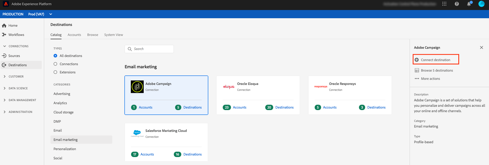
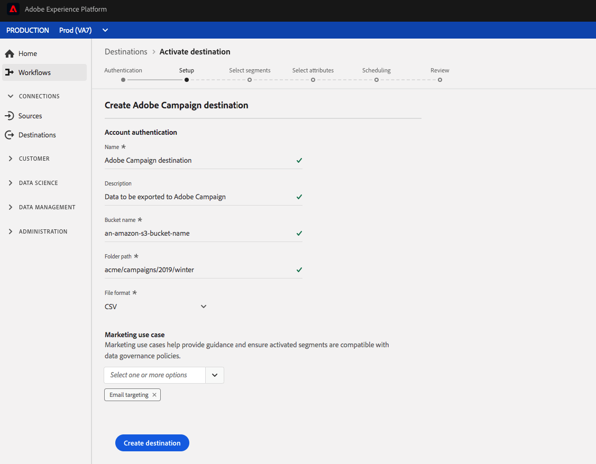

# 电子邮件营销目标 {#email-marketing-destinations}

电子邮件服务提供商(ESP)使您能够管理电子邮件营销活动，如发送促销电子邮件活动。 实时客户数据平台通过允许您将细分激活到电子邮件营销目标，与ESP集成。

要向活动的电子邮件营销目标发送Adobe，实时CDP必须首先连接到目标。

连接到电子邮件营销目标的过程分为三步。 本页将进一步介绍每个步骤。

在连接目标流中（如下面部分所述），连接到AmazonS3或SFTP。 实时CDP将您的细分作为或文 `.csv` 件导 `.txt` 出，并将它们提供给您的首选位置。 计划您在电子邮件营销平台中从实时CDP中启用的存储位置导入数据。 导入数据的过程因每个合作伙伴而异。 有关详细信息，请参阅各个目标文章。

## 配置目标 {#connect-destination}

在“ **[!UICONTROL 连接]** ”>“ **[!UICONTROL 目标]**”中，选择要连接的电子邮件营销目标，然后选择“ **[!UICONTROL 配置”]**。

在“身 **[!UICONTROL 份验证]** ”步骤中，如果您之前已设置到电子邮件营销目标的连接，请选择“现 **[!UICONTROL 有帐户]** ”，然后选择您的现有连接。 或者，您也可以选 **[!UICONTROL 择“新帐户]** ”来设置到电子邮件营销目标的新连接。 在连接 **[!UICONTROL 类型选择]** 器中，您可以在AmazonS3、SFTP（带口令）或SFTP（带SSH密钥）之间进行选择。 根据连接类型，填写以下信息，然后选择“ **[!UICONTROL Connect]**”。

- 对 **于S3连接**，您必须提供您的Amazon访问密钥ID和秘密访问密钥。
- 对 **于带口令的SFTP** ，您必须为SFTP服务器提供域、端口、用户名和密码。
- 对于 **具有SSH密钥连接** 的SFTP，您必须为SFTP服务器提供域、端口、用户名和密码。

或者，在“加 **[!UICONTROL 密PGP/GPG]** ”部分，您可以附加RSA格式的公钥，以将PGP/GPG加密添加到“密钥”部分下的导出 **[!UICONTROL 文件]** 。 请注意，此公钥 **必须** 作为Base64编码字符串写入。

在设 **[!UICONTROL 置步]** 骤中，输入新目标的名称和说明以及导出文件的文件格式。

如果您在上一步中选择了AmazonS3作为存储选项，请在云存储目标中插入存储段名称和文件夹路径，以便将文件传送到该目标。 对于SFTP存储选项，插入要将文件传送到的文件夹路径。

此外，在此步骤中，您还可以选择应用于此目标的任何市场营销用例。 市场营销用例指明要将数据导出到目标的目的。 您可以从Adobe定义的营销用例中进行选择，也可以创建自己的营销用例。 有关营销使用案例的更多信息， [请参阅实时CDP中的数据管理](/help/rtcdp/privacy/data-governance-overview.md#destinations) 。 有关各个Adobe定义的营销用例的信息，请参阅数据 [使用策略概述](/help/data-governance/policies/overview.md#core-actions)。

## 选择要包含在目标导出中的区段成员 {#select-segments}

在“选 **[!UICONTROL 择区段]** ”页面上，选择要发送到目标的区段。 在以下各节中查找有关字段的更多信息。

## 配置文件名

有关区段计划和文件名编辑选项的信息，请参 [阅激活](/help/rtcdp/destinations/activate-destinations.md#configure) 目标教程中的配置步骤。

## 选择属性——选择要在导出的文件中用作目标属性的模式字段 {#destination-attributes}

在此步骤中，您将选择要导出到电子邮件营销目标的字段，并标记哪些字段为必填字段。

有关此步骤的详细信息，请参阅激 [活目标教程](/help/rtcdp/destinations/activate-destinations.md#select-attributes) 中的选择属性步骤。

### 身份 {#identity}

我们建议您从合并模式中选择唯一标 [识符](../../profile/home.md#profile-fragments-and-union-schemas)。 这是用户身份被锁定的字段。 最常用的字段是电子邮件地址，但也可以是忠诚度项目ID或电话号码。 请参阅下表，了解该模式中最常见的唯一标识符及其XDM字段。

| 唯一标识符 | 统一模式中的XDM字段 |
---------|----------
| Email Address | `personalEmail.address` |
| Phone | `mobilePhone.number` |
| 忠诚度项目ID | `Customer-defined XDM field` |

### 其他目标属性

在模式字段选择器中，选择要导出到电子邮件目标的其他字段。 推荐的选项有：

| 架构 | XDM字段 |
---------|----------
| 名字 | `person.name.firstName` |
| 姓氏 | `person.name.lastName` |
| Phone | `mobilePhone.number` |
| 地址城市 | `homeAddress.city` |
| 地址状态 | `homeAddress.stateProvince` |
| 地址邮政编码 | `homeAddress.postalCode` |
| 生日 | `person.birthDayAndMonth` |
| 细分会员资格 | `segmentMembership.status` |

## 将数据从存储位置导入目标

请参阅单个电子邮件营销目标文章，了解如何将数据从存储位置导入目标：

- [Adobe Campaign](/help/rtcdp/destinations/adobe-campaign-destination.md#import-data-into-campaign)
- [SalesforceMarketing Cloud](/help/rtcdp/destinations/salesforce-marketing-cloud-destination.md#import-data-into-salesforce)
- [Oracle雄辩](/help/rtcdp/destinations/oracle-eloqua-destination.md#import-data-into-eloqua)
- [OracleResponsys](/help/rtcdp/destinations/oracle-responsys-destination.md#import-data-into-responsys)

## 将区段激活到电子邮件营销目标

有关如何将区段激活到电子邮件营销目标的说明，请参 [阅将数据激活到目标](/help/rtcdp/destinations/activate-destinations.md)。

## Journey Orchestration

- [将数据激活到目标](/help/rtcdp/destinations/activate-destinations.md)
- [使用流服务API创建电子邮件营销目标并激活数据](https://docs.adobe.com/content/help/en/experience-platform/tutorials/destinations/email-marketing-api.html)