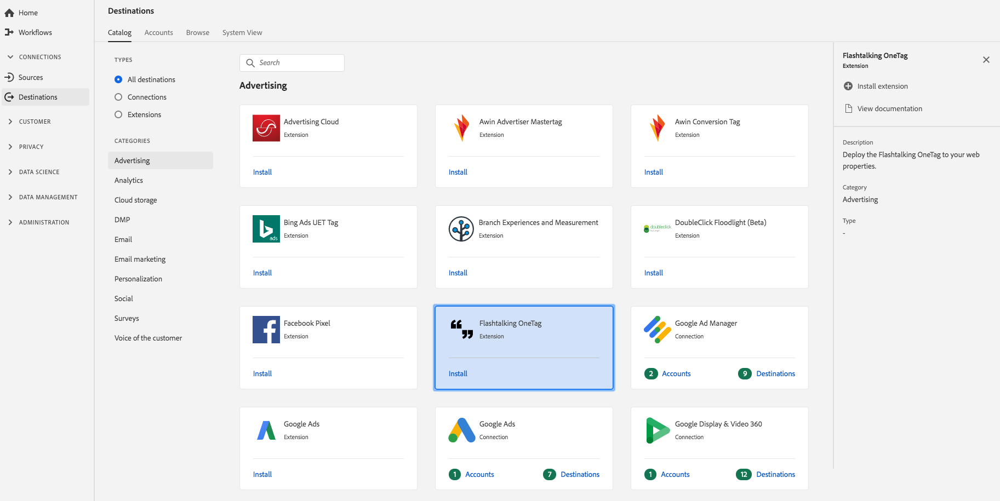

# [!DNL Flashtalking OneTag] 扩展 {#flashtalking-extension}

## 概述 {#overview}

Experience Platform Launch [!DNL Flashtalking OneTag] 扩展使得可以轻松地将站点操作归因于显示、视频和移动广告活动。 使用 [!DNL Flashtalking OneTag] Launch部署到Web属性。

[!DNL Flashtalking OneTag] 是Adobe实时客户数据平台中的广告扩展。 有关扩展功能的详细信息，请参阅Adobe Exchange上的扩 [展页](https://exchange.adobe.com/experiencecloud.details.101392.flashtalking-onetag.html)。

此目标是Experience Platform Launch扩展。 有关Launch扩展在Adobe实时CDP中的工作方式的更多信息，请参阅 [Experience Platform Launch扩展概述](/help/rtcdp/destinations/experience-platform-launch-extensions.md)。

## 先决条件 {#prerequisites}

此扩展可在目录 [!DNL Destinations] 中找到已购买Adobe实时CDP的所有客户。

要使用此扩展，您需要访问Experience Platform Launch。 Experience Platform Launch作为附带的增值功能提供给Adobe Experience Cloud客户。 请与您的组织管理员联系以获取Launch访问权限，并要求他们授予您 **[!UICONTROL manage_properties]** （管理属性）权限，以便您可以安装扩展。

## 安装扩展 {#install-extension}

安装扩 [!DNL Flashtalking OneTag] 展：

1. 在Adobe [实时CDP界面中](http://platform.adobe.com/)，转到“目 **[!UICONTROL 标”>“目录”]**。
2. 从目录中选择扩展或使用搜索栏。
3. 单击目标以选中它，然后在右边 **[!UICONTROL 栏中选择]** “安装扩展”。 如果“安 **[!UICONTROL 装扩展]** ”控件灰显，则您缺少 **[!UICONTROL manage_properties]** 权限。 请参 [阅先决条件](#prerequisites)。
4. 在“选 **[!UICONTROL 择可用的启动项属性]** ”窗口中，选择要在其中安装扩展的启动项属性。 您还可以在启动项中选择创建新属性。 资产是规则、数据元素、配置的扩展、环境和库的集合。了解启动文档的“ [属性”页](https://docs.adobe.com/content/help/en/launch/using/reference/admin/companies-and-properties.html#properties-page) 面部分中的属性。
5. 该工作流将引导您进入Launch以完成安装。

有关扩展配置选项和安装支持的信息，请参 [阅Adobe Exchange上的Flashtalking OneTag页](https://exchange.adobe.com/experiencecloud.details.101392.flashtalking-onetag.html)。

您还可以直接在Experience Platform Launch界面中安 [装扩展](https://launch.adobe.com/)。 请参 [阅启动文档](https://docs.adobe.com/content/help/en/launch/using/reference/manage-resources/extensions/overview.html#add-a-new-extension) 中的添加新扩展。

## 如何使用扩展 {#how-to-use}

安装扩展后，您可以直接在启动中开始为其设置规则。

在启动中，您可以为已安装的扩展设置规则，以便仅在特定情况下将事件数据发送到扩展目标。 有关为扩展设置规则的详细信息，请参阅规 [则文档](https://docs.adobe.com/help/zh-Hans/launch/using/reference/manage-resources/rules.html)。

## 配置、升级和删除扩展 {#configure-upgrade-delete}

您可以在启动界面中配置、升级和删除扩展。

>[!TIP]
>
>如果某个属性上已安装该扩展，Adobe实时CDP UI仍会显示该 **[!UICONTROL 扩展]** 的安装。 启动安装工作流程(如安装扩 [展中所述](#install-extension) )，以开始启动并配置或删除您的扩展。

要升级您的扩展，请参 [阅Launch文档](https://docs.adobe.com/content/help/en/launch/using/reference/manage-resources/extensions/extension-upgrade.html) 中的扩展升级。
