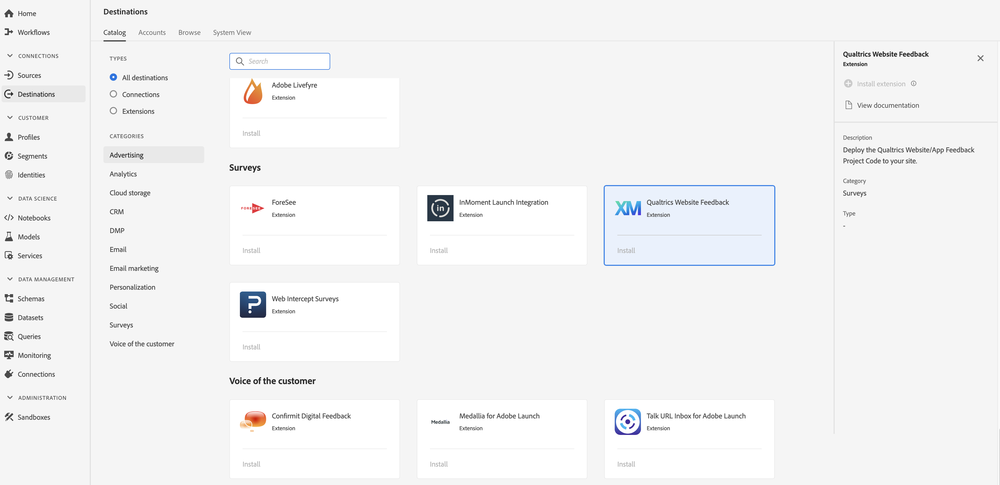

# [!DNL Qualtrics Website Feedback] 扩展 {#qualtrics-extension}

## 概述 {#overview}

[!DNL Qualtrics Website Feedback] 使您能够在正确的时间用正确的消息吸引网站访客。 无论您是希望通过网站反馈调查改善访客体验还是提高转化率， [!DNL Qualtrics Website Feedback] 都能满足您的需求。

使用直观的指向并单击界面，在几分钟内创建和部署目标明确、具有品牌的Web消息。 您从网站收集的数据和洞察会与所有渠道的客户反馈数据一起呈现，这些视图提供客户体验的完整——所有这一切均在一个平台上实现。

[!DNL Qualtrics Website Feedback] 是Adobe实时客户数据平台的调查扩展。 有关扩展功能的详细信息，请参阅Adobe交换上的扩 [展页](https://exchange.adobe.com/experiencecloud.details.101569.qualtrics-website-feedback.html)。

这个目的地是Adobe Experience Platform Launch。 有关Platform Launch扩展如何在Adobe实时CDP中工作的更多信息，请参阅 [Adobe Experience Platform Launch扩展概述](/help/rtcdp/destinations/experience-platform-launch-extensions.md)。

## 先决条件 {#prerequisites}

此扩展位于目录 [!DNL Destinations] 中，面向所有已购买Adobe实时CDP的客户。

要使用此扩展，您需要访问Adobe Experience Platform Launch。 Platform Launch作为一项附带的增值功能提供给Adobe Experience Cloud客户。 请联系您的组织管理员以获取对Platform Launch的访问权限，并要求他们授予您 **[!UICONTROL manage_properties]** （管理属性）权限，以便您可以安装扩展。

## 安装扩展 {#install-extension}

安装扩 [!DNL Qualtrics Website Feedback] 展：

1. 在Adobe [实时CDP界面中](http://platform.adobe.com/)，转到“目 **[!UICONTROL 标]** ”> **[!UICONTROL “目录]**”。
2. 从目录中选择扩展或使用搜索栏。
3. 单击目标以突出显示它，然后在右 **[!UICONTROL 边栏中]** 选择配置。 如果“ **[!UICONTROL 配置]** ”控件灰显，则您缺少 **[!UICONTROL manage_properties权限]** 。 请参 [阅先决条件](#prerequisites)。
4. 在“选 **[!UICONTROL 择可用的平台启动项属性]** ”窗口中，选择要在其中安装扩展的平台启动项属性。 您还可以选择在Platform Launch中创建新属性。 资产是规则、数据元素、配置的扩展、环境和库的集合。了解Platform Launch文档 [的“属性](https://docs.adobe.com/content/help/en/launch/using/reference/admin/companies-and-properties.html#properties-page) ”页面部分中的属性。
5. 该工作流将带您到Platform Launch以完成安装。

有关扩展配置选项和安装支持的信息，请参阅 [AdobeExchange上的Qualtrics网站反馈页](https://exchange.adobe.com/experiencecloud.details.101569.qualtrics-website-feedback.html)。

您还可以直接在Adobe Experience Platform Launch界面中安 [装扩展](https://launch.adobe.com/)。 请参 [阅平台启动文档](https://docs.adobe.com/content/help/en/launch/using/reference/manage-resources/extensions/overview.html#add-a-new-extension) 中的添加新扩展。

## 如何使用扩展 {#how-to-use}

安装扩展后，您可以直接在Platform Launch中开始为其设置规则。

在Platform Launch中，您可以为已安装的扩展设置规则，以便仅在某些情况下将事件数据发送到扩展目标。 有关为扩展设置规则的详细信息，请参阅规 [则文档](https://docs.adobe.com/help/zh-Hans/launch/using/reference/manage-resources/rules.html)。

## 配置、升级和删除扩展 {#configure-upgrade-delete}

您可以在平台启动界面中配置、升级和删除扩展。

>[!TIP]
>
>如果某个属性上已安装该扩展，Adobe实时CDP UI仍会显 **[!UICONTROL 示]** 该扩展的安装。 启动安装工作流程(如安装扩 [展中所述](#install-extension) )，以获取平台启动并配置或删除您的扩展。

要升级您的扩展，请参 [阅Platform Launch文档](https://docs.adobe.com/content/help/en/launch/using/reference/manage-resources/extensions/extension-upgrade.html) 中的扩展升级。