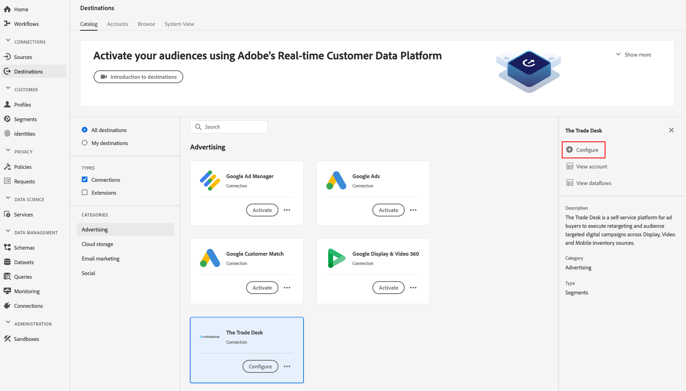

# [!DNL The Trade Desk] 目标

## 概述 {#overview}

[!DNL The Trade Desk] 目标可帮助您将用户档案数据发送 [!DNL The Trade Desk]到。

[!DNL The Trade Desk] 是一个自助平台，让广告购买者跨展示广告、视频和移动库存来源执行重定向和受众目标数字活动。

要将用户档案数据发 [!DNL The Trade Desk]送到，必须先连接到目标。

## 目标规范 {#destination-specs}

请注意特定于目标的以下详细 [!DNL The Trade Desk] 信息：

* 您可以将以下身份 [发送](../../identity-service/namespaces.md) 到目 [!DNL The Trade Desk] 标： [!DNL The Trade Desk ID], [!DNL IDFA], [!DNL GAID]

## 用例 {#use-cases}

作为营销人员，我希望能够使用基于或设备ID的细 [!DNL Trade Desk IDs] 分来创建重新定位或受众目标数字活动。

## 导出类型 {#export-type}

**[!DNL Segment export]** -您将区段(受众)的所有成员导出到目标。

## 连接到目标 {#connect-destination}

1. 在“ **[!UICONTROL 连接]** ”>“ **[!UICONTROL 目标]**”中 [!DNL The Trade Desk]，选 **[!UICONTROL 择并选择“]**&#x200B;配置”。

   

   >[!NOTE]
   >
   >如果与此目标的连接已存在，您可以在目标卡 **[!UICONTROL 上看到]** “激活”按钮。 有关激活和配置之 **[!UICONTROL 间差异]** 的详 **[!UICONTROL 细信]**&#x200B;息，请参 [阅目标工](../destinations/destinations-workspace.md#catalog) 作区文档的“目录”部分。
   >
   >

2. 在身份验证 [!UICONTROL 步骤] ，您需要输入连接详 [!DNL The Trade Desk] 细信息：

   * **[!UICONTROL 名称]**:将来用于识别此目标的名称。
   * **[!UICONTROL 描述]**:将来帮助您识别此目标的描述。
   * **[!UICONTROL 帐户ID]**:您的 [!DNL Trade Desk] 帐 [!UICONTROL 户ID]。
   * **[!UICONTROL 客户端机密]**:客户端 `clientSecret` 凭据中使用 [!DNL OAuth2] 的参数。
   * **[!UICONTROL 服务器位置]**:询问您的 [!DNL The Trade Desk] 代表您应使用哪个区域服务器。 这些是可供选择的区域服务器：

      * **[!UICONTROL 欧洲]**
      * **[!UICONTROL 新加坡]**
      * **[!UICONTROL 东京]**
      * **[!UICONTROL 北美洲东]**
      * **[!UICONTROL 北美洲西]**
      * **[!UICONTROL 拉丁美洲]**
   * **[!UICONTROL 营销用例]**:市场营销用例指明要将数据导出到目标的目的。 您可以从Adobe定义的营销用例中进行选择，也可以创建自己的营销用例。 有关市场营销用例的更多信息，请参 [阅Adobe Experience Platform的数据管](../privacy/data-governance-overview.md#destinations) 理页。 有关各个Adobe定义的营销用例的信息，请参阅数据 [使用策略概述](../../data-governance/policies/overview.md#core-actions)。

   

3. 单击“ **[!UICONTROL 创建目标]**”。 您的目标现在已创建。 如果希望以 [!UICONTROL 后激活区段] ，则可以单击保存并退出，也可以选择 [!UICONTROL 下一步] ，继续工作流并选择要激活的区段。 在任一情况下，请参阅下一 [节激活](#activate-segments)“区段”，了解工作流的其余部分。

## 激活区段 {#activate-segments}

有关 [区段用户档案工作流的信息](activate-destinations.md#select-attributes) ，请参阅将激活和区段激活到目标。

在“区 [段计划](activate-destinations.md#segment-schedule) ”步骤中，您必须手动将区段映射到目标中相应的ID或友好名称。

在映射区段时，建议您使 [!DNL Platform] 用区段名称或更短的区段名称，以便于使用。 但是，目标中的区段ID或名称不需要与帐户中的区段ID或名称匹 [!DNL Platform] 配。 您在映射字段中插入的任何值都将反映在目标中。

如果您使用多个设备映射( [!DNL IDFA]cookie [!DNL GAID]ID、、)，请确保对所有三个映射使用相同的映射值。 [!DNL The Trade Desk] 将所有数据聚合到单个细分中，并进行设备级细分。

## 导出的数据 {#exported-data}

要验证数据是否已成功导出到目 [!DNL The Trade Desk] 标，请检查您的 [!DNL The Trade Desk] 帐户。 如果激活成功，则受众将填充到您的帐户中。
