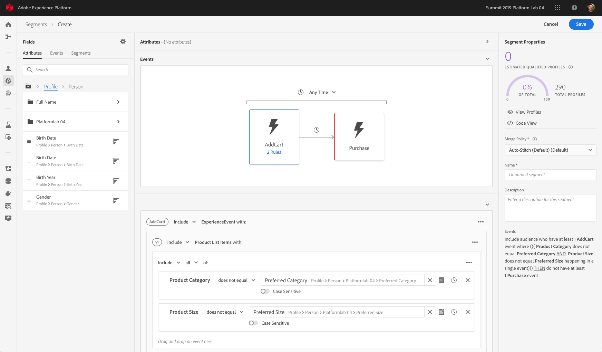

# Adobe实时客户数据平台入门

本入门指南引导您完成Adobe实时客户数据平台（实时CDP）的示例实施。 在设置自己的实现时，您可以将它用作示例。 虽然本指南显示了特定的示例，但它链接到了您在创建设置时可以使用的其他信息。

此示例展示了Adobe Experience Platform支持的Adobe实时客户数据平台在以下方面的强大功能：

* 从多个源摄取数据
* 将它们合并到一个实时客户档案中
* 跨设备提供一致、相关和个性化的体验。

## 用例

运动服装公司Luma一直在努力改善客户体验。 他们有一项新举措来增加与礼物相关的销售。 他们还希望减少过度曝光，例如关注客户的烦人广告。

目前，他们在媒体上的支出过多，而这些媒体会根据访客今后不会购买的项目重新定位。 例如，Luma不希望将某个项目重新定位到某人，该项目原本是为某人一次性购买的。

目前，Luma的数据分散在多个来源。 因此，他们面临着重大挑战：

* 营销组织必须与各自拥有数据源的不同团队合作，包括网站、移动应用、忠诚度系统、CRM等。
* 当营销团队访问数据时，数据往往已过时，与他们对时间敏感的营销活动不再相关。
* 他们需要统一数据，以便瞄准某个人，而不是渠道。

因此，Luma有以下业务目标：

* 根据不同的数据源创建消费者的实时单一视图。
* 使用跨不同渠道和设备的相关信息个性化营销活动。

要实现这些目标，营销团队需要能够大规模管理客户数据。

借助以Adobe Experience Platform为后盾的实时CDP,Luma的营销组织可以：

1. 从不同的平台收集数据并确保数据在下游可用于其他营销活动。
1. 创建单一、实时的消费者视图，不受数据来源的影响。
1. 在每个接触点提供一致、相关和个性化的体验。

## 步骤

本教程包括以下步骤：

1. 构建客 [户档案](#customer-profile)。
1. [个性化](#personalizing-the-user-experience) 、个性化的用户体验。
1. 使用 [多个数据源](#using-multiple-data-sources)。
1. [配置数据源](#configuring-a-data-source)。
1. [收集特定客户的数据](#bringing-the-data-together-for-a-specific-customer) 。
1. 设置 [区段](#segments)。
1. 设置目 [标](#destinations)。
1. [跨设备拼接配置文件](#cross-device-identity-stitching)。
1. [分析配置文件](#analyzing-the-profile)。

## 客户档案

当客户首次访问您的网站时，您对他们一无所知。


在导航时，数据会实时捕获并不仅发送到Adobe Analytics中的报表包，还直接发送到Adobe Experience Platform。 在收集数据时，您会开始根据Experience Platform实时客户档案中的行为数据，形成单一的消费者视图。

许多访问该网站的访客可能重复以前从Luma购买的客户。  对于Luma来说，为满足新访客和回头客以及已知客户的需求而个性化消息和产品非常重要。

### 新客户的首次访问

例如，一个未经确认的访客导航到Luma站点上的“男士”部分，并查看几个运行的运动衫。


当客户点击以了解有关这些产品的更多信息时，这些产品视图会在Adobe Analytics中收集并发送到Experience Platform。

<!---->

Luma可以将访客的行为映射到Adobe Experience Platform上的用户档案，并开始汇总该消费者行为的更丰富视图。

### 更详细地了解客户

随着客户继续与网站互动，会出现更清晰的图景。 例如，假设访客将产品添加到购物车并登录。

客户登录后，她将自己标识为莎拉·罗斯。


合并了两个标识：

* 匿名浏览数据
* 与莎拉·罗丝的账户相关的现有数据

这两个标识都会合并到Experience Platform中的单个配置文件中。 Luma现在对这个消费者有统一的看法。

根据网站“男士”部分的匿名访客的浏览行为，可能假定该客户为男性。 现在，Luma已经登录，她认识了Sarah Rose。 Luma利用实时客户档案的强大功能来优化跨渠道投放给她的消息。

## 个性化用户体验

Sarah受到了忠诚的欢迎，并感谢她作为铜牌会员，获得了更多关于福利以及如何提高她的地位和积分的信息。

她点击主页浏览更多内容。


Sarah会根据Adobe Experience Platform中的实时客户档案，获得动态提供的个性化主页体验。

由于Adobe Target中以Adobe Sensei为后盾的个性化，她可以看到相关内容，该个性化考虑了她过去购买的服装和服装的亲和力。 Luma还根据她最近的浏览，为男性定制了“跑步器”。

在下一页，Sarah将看到特色产品，并根据她最近查看过的物品显示一个新的推荐栏。

这个个性化内容可帮助Sarah快速找到相关项目。 这提高了转化率，并提供了更愉悦的客户体验。

### 将客户带回

莎拉分心了，离开网站，结束了她的研习会。 Luma可以使用Adobe Experience Platform中的数据帮助将她带回网站。

Adobe Real-time Customer Data Platform由Adobe Experience Platform提供支持，专为客户体验管理而构建。 它使组织能够：

* 简化数据集成和激活
* 管理已知和未知的数据使用情况
* 大规模加速营销使用案例

## 使用多个数据源

Luma团队将所有的行为和客户数据放在一个位置。


他们可以从以下所有源中摄取数据：

* 现有Adobe Experience Cloud解决方案数据
* 非Adobe来源，如Luma的忠诚度计划、呼叫中心和销售点系统数据
* 来自Luma数据源的实时流数据
* Adobe解决方案的实时数据（无需新标签）

所有这些来自不同来源的数据将合并到一个统一的客户档案中。

## 配置数据源

使用实时客户数据平台将新的数据源引入平台。 实时CDP包括一个数据源目录，只需单击几下即可添加到配置文件。


例如，要获取Luma的CRM数据，请按 *CRM*&#x200B;过滤目录，并列出包含 *CRM* 的现成连接器。 要添加Microsoft Dynamics CRM数据，请执行以下操作：

1. 授权连接。

   

1. 从推荐的XDM预映射表列表中选择要导入的内容。

   <!--     -->

   例如，选择 **[!UICONTROL Contacts]**。 联系人数据的预览会自动加载，这样您就可以确保一切看起来都符合预期。

   Adobe Experience Platform通过将标准字段自动映射到Experience Data Model(XDM)配置文件架构，从而完成了大量手动工作。

1. 查看字段映射。

   <!--     -->

   例如，仔细检查是否正确映射了联系人的电子邮件字段。\
   您可以选择预览数据并执行高级映射。

1. 设置计划。

   

都搞定了。 您刚刚将Microsoft CRM作为数据源添加到Experience Platform中。

### 为使用策略标记摄取的数据

Luma有许多内部策略限制对某些类型收集信息的使用，并且还必须遵守与数据使用相关的法律和隐私问题。 使用Adobe Experience Platform Data Governance，预定义的数据使用标签可以应用于数据集（和这些数据集中的特定字段），使Luma能够根据特定的使用限制对其数据进行分类。


应用数据使用标签后，Luma可以使用数据管理创建数据使用策略。 数据使用策略是描述允许您对包含某些标签的数据执行的操作种类的规则。 当尝试在实时CDP中执行构成策略违规的操作时，会阻止该操作，并会发出警报以显示违反了哪些策略以及原因。

## 为特定客户整合数据

在此方案中，为Sarah Rose搜索配置文件。 她的个人资料出现，并带有她用来登录的电子邮件。

<!--  -->

Luma拥有的关于Sarah的所有个人资料信息都会显示出来。 这包括她的个人信息，如地址和电话号码、通信首选项以及她有资格获得的区段。

| 类别 | 描述 |
|---|---|
| 身份 | 显示Sarah与Luma跨渠道和设备交互中在Platform中链接到的身份。 将显示来自网站的ECID。 她的身份还包括来自其移动应用程序的ECID、她的电子邮件ID、来自最近添加的Microsoft Dynamics数据集的CRM ID，以及从Luma忠诚度系统传递到Adobe Experience Platform的忠诚度ID。 |
| 事件 | 显示Sarah与Luma品牌的所有交互数据。 这包括她刚刚查看过的物品，她过去查看过的任何东西，她收到的电子邮件，她与呼叫中心的互动，以及每次互动的渠道和设备。 |

实时CDP配置文件将Luma营销团队的工作流程从数周缩短到几分钟，并基于这一360度全方位客户视图为个性化打开了大门。 个人资料将她登录前浏览网站时的行为数据与她现有的客户资料合并在一起，从而全面了解Sarah。

营销团队可以利用这一增强的实时客户档案更好地个性化Sarah的体验并提高她对Luma的品牌忠诚度。

## 区段

强大的Adobe Experience Platform细分功能使营销人员能够根据实时客户档案中捕获的数据组合属性、事件和现有细分。

<!--  -->

在这种情况下，Sarah最近在网站上的互动与她过去的行为不同。 她通常买女装。 但是，购物车中的物品是男人的大运动衫。

Luma数据科学团队围绕购买倾向创建了模型。 一个模型标识了服装类别（例如男士／女士）或现有消费者尺寸的突然变化。 Sarah的购买行为变化表明她不是在为自己购物。

<!--  -->

### 定义区段

修改或创建表示购物车放弃者的区段，这些放弃者似乎正在购买礼物：

```
Profile: Category != Preferred Category 
AND 
Product Size != Preferred Size 
in last 7 days.  
AND 
Abandoned Cart 
AND 
Loyalty member 
```

<!-- -->

由于Sarah在购物车中添加了一个明显的礼品物品并放弃了它，Luma可以通过免费的礼品包装来定位她。

## 目标

添加“放弃购物车赠送礼物”区段后，您可以大致了解该区段中有多少人。 您可以对其采取行动，并使其可用于跨渠道个性化。

单击 **[!UICONTROL Send to destinations]**。

在Adobe实时CDP中，Luma可以根据受众细分无缝地执行个性化操作。\
在此，我们看到了Luma可将此目标发送到Adobe和非Adobe解决方案的所有目标：


### 选择目标

在此方案中，Luma希望通过以下目标的个性化来重新定位此受众：

* Google，用于显示
   <!--* Facebook -->
* Adobe Campaign，用于电子邮件

<!--  -->

### 计划目标

您还可以安排区段在特定时间开始或结束。 区段将在计划日期的已配置平台中发布并自动更新。

>[!NOTE]
>（可选）如果单击日期字段，系统将自动计划90天外。

单 **[!UICONTROL Save]** 击以转到下一页。

当此受众中的客户进行购买时，其对此受众的会员资格会被实时抑制。 他们不再符合条件，因为其状态已更改。

这样，Luma媒体团队的主管就可以省下几十万美元，因为没有为不符合条件的受众使用库存。

### 为目标实施数据使用策略

Adobe Experience Platform包括隐私和安全控制，用于确定区段是否可激活到特定目标。 激活操作会根据创建时分配给目标的营销目的以及组织定义的数据使用策略来启用或限制激活。

如果活动违反策略，将显示警告。 此警告包含数据世系信息，可帮助您确定违反策略的原因，以及您可以采取什么措施来解决违规。

通过这些控制，Experience Platform可以帮助Luma以负责任的方式遵守法规和市场。 这些控制是灵活的，可以修改以满足Luma安全和管理团队的要求，使他们能够自信地满足管理已知和未知客户数据的区域和组织要求。

### 数据流画布

保存时，可视化数据流画布会显示从统一配置文件映射到您选择的三个目标的区段。


## 跨设备身份拼接

Sarah在自己的移动设备上浏览一个社交媒体网站，她看到了Luma广告。 这使她想起她在车里留下的物品。

之后，她打开自己的电子邮件，看到重新定位的电子邮件。 她点击了一封电子邮件中指向Luma的链接。

该链接将Sarah带到移动Luma主页，她在该主页上可以看到由Adobe Target提供的高度个性化体验。

* 她受到铜人的欢迎。
* 她看到了&quot;礼物&quot;的讯息。
* 她还看到“免费礼品包装”信息，这是她获得铜牌会员资格的好处之一。
* 她依然以她对跑步的亲和力为主角。

她买毛衣，加上礼物包，写礼物便条。 她还可以选择记住此次活动，并在明年收到提醒，以便在此时获得礼物。 她说是的，第二年，她将参加一场电子邮件活动，提醒她再买一份礼物。

由于观众的压制能力，莎拉不会被那些男人的毛衣所瞄准。

## 分析配置文件

Luma营销人员使用Adobe Experience Platform在实时CDP控制面板上查看送礼者细分。 他们看到了这项计划的成果，并看到它正在增长。 客户正在响应优惠并投入更多资金。

这些洞察使营销人员能够针对这一信号采取行动，而这是通过CDP中提供此数据以及让像Sarah这样的客户加入该细分而推动的。

Luma使用此CDP数据提高忠诚度和客户满意度。
