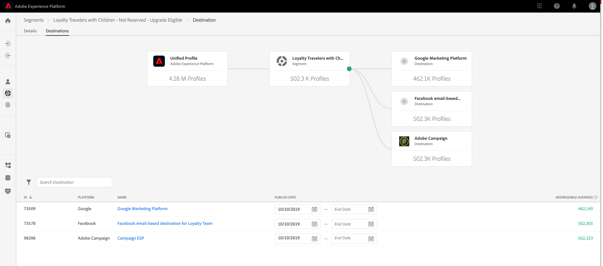

# 开始使用Real-time Customer Data Platform

本快速入门指南将指导您完成Real-time Customer Data Platform(Real-Time CDP)的示例实施。 您可以在设置自己的实施时，以此作为示例。 尽管本指南显示了特定示例，但它链接到在创建设置时可使用的其他信息。

此示例展示了由Adobe Experience Platform提供支持的Real-time Customer Data Platform的强大功能：

* 从多个源中摄取数据
* 将它们合并到单个 [!DNL real-time customer profile]
* 跨设备提供一致、相关和个性化的体验。

## 用例

运动服装公司Luma始终在努力改善客户体验。 他们有一项新的计划来增加与礼物有关的销售。 他们还希望减少过度曝光，例如关注顾客的烦人广告。

目前，他们在媒体上花费太多，无法针对访客不会购买的项目重新定位。 例如，Luma不希望将某个项目重新定位到某个人，该项目旨在为其他人进行一次性购买。

目前，Luma的数据分散在多个来源中。 因此，他们面临着重大挑战：

* 营销组织必须与各自拥有数据源的各个团队合作，这些团队包括网站、移动设备应用程序、忠诚度系统、CRM等。
* 当营销团队访问数据时，该数据通常已过时，不再与他们对时间敏感的营销活动相关。
* 他们需要统一数据，以便针对人员，而不是渠道。

因此，Luma的业务目标如下：

* 从不同的数据源创建客户的实时单一视图。
* 使用不同渠道和设备之间的相关消息个性化营销活动。

要实现这些目标，营销团队需要能够大规模管理客户数据。

借助由Adobe Experience Platform提供支持的Real-Time CDP,Luma的营销组织可以：

1. 从不同的平台收集数据，并确保数据在下游可用于其他营销活动。
1. 创建客户的单个实时视图，与数据的来源无关。
1. 在每个接触点中提供一致、相关的个性化体验。

## 步骤

本教程包括以下步骤：

1. 构建 [客户档案](#customer-profile).
1. [个性化](#personalizing-the-user-experience) 用户体验。
1. 使用 [多个数据源](#using-multiple-data-sources).
1. [配置数据源](#configuring-a-data-source).
1. [收集数据](#bringing-the-data-together-for-a-specific-customer) 特定客户的URL。
1. 设置 [区段](#segments).
1. 设置 [目标](#destinations).
1. [拼合跨设备的配置文件](#cross-device-identity-stitching).
1. [分析用户档案](#analyzing-the-profile).

## 客户用户档案

客户首次访问您的网站时，您对他们一无所知。


导航时，会实时捕获数据，这些数据不仅会发送到Adobe Analytics中的报表包，还会直接发送到Adobe Experience Platform。 在收集数据时，您会开始根据 [!DNL Experience Platform's real-time customer profile].

网站的许多访客可能是以前从Luma购买过产品的重复客户。  Luma必须个性化消息传送和服务，以满足新访客和回访访客以及已知客户的需求。

### 新客户的首次访问

例如，一位独特的访客导航到Luma网站上的“男士”区域，然后查看一对运行着运动衫的访客。


当客户导航到了解有关这些产品的更多信息时，这些产品查看将在Adobe Analytics中收集并发送到 [!DNL Experience Platform].

<!---->

Luma可以将访客行为映射到Adobe Experience Platform上的用户配置文件，并开始收集该消费者行为的更加丰富的视图。

### 更详细地了解客户

随着客户继续与网站互动，情况将更加清晰。 例如，假设访客将产品添加到购物车并登录。

当客户登录时，她将自己标识为莎拉·罗斯。


将合并两个标识：

* 匿名浏览数据
* 与莎拉·罗斯的帐户关联的现有数据

这两个标识将合并为 [!DNL Experience Platform]. Luma现在对此客户有统一的视图。

根据网站“男士”区域的匿名访客的浏览行为，可能假定该客户为男性。 现在她登录了，鲁玛认出了莎拉·罗斯。 Luma使用 [!DNL Real-time Customer Profile] 以优化跨渠道投放给她的消息。

## 个性化用户体验

萨拉以忠诚的态度受到欢迎，并感谢她成为铜牌会员，她掌握了更多关于福利以及如何提高她的地位和分数的信息。

她导航到主页以浏览更多内容。


Sarah会根据自己的情况，获得动态提供的个性化主页体验 [!DNL Real-time Customer Profile] 在Adobe Experience Platform。

得益于Adobe Sensei支持的Adobe Target个性化，她看到了相关内容，该个性化考虑了她过去的购买情况以及对运营服装和装备的喜爱程度。 Luma还根据她最近的浏览内容，为男性定制跑步器材。

在页面的下方，Sarah将显示特色产品，以及一个基于她最近查看过的项目的新推荐栏。

此个性化内容可帮助Sarah快速查找相关项目。 这可以提高转化率，并提供更令人愉快的客户体验。

### 让客户回来

莎拉分心了，离开网站，结束了她的会话。 Luma可以使用Adobe Experience Platform中的数据帮助将她带回网站。

Real-time Customer Data Platform由Adobe Experience Platform提供支持，专为客户体验管理而构建。 它使组织能够：

* 简化数据集成和激活
* 管理已知和未知的数据使用情况
* 加快大规模营销用例

## 使用多个数据源

Luma团队在一个位置提供了所有的行为数据和客户数据。


他们可以从以下所有来源摄取数据：

* 现有Adobe Experience Cloud解决方案数据
* 非Adobe来源，如Luma的忠诚度计划、呼叫中心和销售点系统数据
* 来自Luma数据源的实时流数据
* 来自Adobe解决方案的实时数据（无需新标记）

来自不同来源的所有这些数据都将合并到一个统一的客户用户档案中。

## 配置数据源

使用 [!DNL Real-Time Customer Data Platform] 将新数据源引入平台。 Real-Time CDP包含可快速轻松地添加到用户档案的数据源目录。


例如，要摄取Luma的CRM数据，请按 *CRM*，以及包含 *CRM* 列出。 添加 [!DNL Microsoft Dynamics CRM] 数据：

1. 授权连接。

   

1. 从推荐的XDM预映射表列表中选择要导入的内容。

   <!--     -->

   例如，选择 **[!UICONTROL 联系人]**. 联系人数据的预览会自动加载，这样您就可以确保一切都按预期显示。

   Adobe Experience Platform通过将标准字段自动映射到 [!DNL Experience Data Model] (XDM)配置文件架构。

1. 查看字段映射。

   <!--     -->

   例如，再次检查联系人的电子邮件字段是否正确映射。\
   您可以选择预览数据并执行高级映射。

1. 设置计划。

   

已经完成了。 您刚刚添加 [!DNL Microsoft CRM] 作为数据源输入 [!DNL Experience Platform].

### 为使用策略的摄取数据设置标签

Luma有许多内部策略来限制某些类型收集信息的使用，并且还必须遵守与数据使用有关的法律和隐私相关的问题。 使用Adobe Experience Platform数据管理，可以将预定义的数据使用标签应用于数据集（以及这些数据集中的特定字段），从而允许Luma根据特定的使用限制对其数据进行分类。


应用数据使用标签后，Luma可以使用“数据管理”创建数据使用策略。 数据使用策略是描述允许对包含特定标签的数据执行的操作类型的规则。 尝试在Real-Time CDP中执行构成策略违规的操作时，会阻止该操作，并发出警报以显示违反了哪项策略及原因。

## 为特定客户整合数据

在此方案中，搜索Sarah Rose的用户档案。 她的个人资料出现，还有她用来登录的电子邮件。

<!--  -->

Luma拥有的关于Sarah的所有用户档案信息都会显示出来。 这包括她的个人信息，如地址和电话号码、通信首选项以及她符合条件的区段。

| 类别 | 描述 |
|---|---|
| 标识 | 显示中已链接在一起的身份 [!DNL Platform] 通过渠道和设备与Luma的互动。 将显示网站中的ECID。 她的身份还包括其移动设备应用程序中的ECID、电子邮件ID、最近添加的 [!DNL Microsoft Dynamics] 数据集，以及从Luma忠诚度系统传递到Adobe Experience Platform的忠诚度ID。 |
| 活动 | 显示Sarah与Luma品牌的所有交互数据。 这包括她刚刚查看的项目、她过去查看过的任何内容、她收到的电子邮件、她与呼叫中心的交互，以及这些交互发生的渠道和设备。 |

Real-Time CDP配置文件可将Luma营销团队的工作流程从数周减少到数分钟，并根据这一360度客户视图解锁进行个性化的可能性。 用户档案可将她登录前浏览网站时的行为数据与现有客户档案合并，从而创建Sarah的全面视图。

营销团队可以使用此增强功能， [!DNL Real-time Customer Profile] 以更好地个性化莎拉的体验，并提高她对Luma的品牌忠诚度。

## 区段

强大的Adobe Experience Platform分段功能使营销人员能够根据 [!DNL Real-time Customer Profile].

<!--  -->

在这种情况下，Sarah最近在网站上的交互行为与她过去的行为不同。 她通常买女装。 但是，她车里的物品是男子的大运动衫。

Luma数据科学团队围绕购买倾向创建了一些模型。 一种模型标识了现有消费者的服装类别（如男/女）或体型的突然变化。 莎拉的购买行为改变表明她不是在为自己购物。

<!--  -->

### 定义区段

修改或创建一个区段，以表示似乎正在购买礼品的购物车放弃者：

```sql
Profile: Category != Preferred Category 
AND 
Product Size != Preferred Size 
in last 7 days.  
AND 
Abandoned Cart 
AND 
Loyalty member 
```

<!-- -->

因为莎拉在购物车里添加了一件看上去是礼物的物品，并放弃了它，所以Luma可以以免费礼品包的形式来定位她。

## 目标

添加“赠送购物车放弃者”区段后，您大致可以看到此区段中有多少人。 您可以对其执行操作，并使其可用于跨渠道进行个性化。

选择 **[!UICONTROL 发送到目标]**.

在Real-Time CDP中，Luma可以根据其受众区段无缝地执行个性化操作。\
在这里，我们看到所有可供Luma将此目标发送到的目标，包括Adobe和非Adobe解决方案：


### 选择目标

在此方案中，Luma希望通过以下目标中的个性化来重新定位此受众：

* Google，用于显示

   <!--* Facebook -->
* Adobe Campaign，用于电子邮件

<!--  -->

### 计划目标

您还可以安排区段在特定时间开始或结束。 该区段将在计划日期的已配置平台中发布并自动更新。

>[!NOTE]
>
>（可选）如果选择日期字段，它会自动计划90天外。

选择 **[!UICONTROL 保存]** 转到下一页。

当此受众中的客户购买产品时，他们对此受众的会员资格会实时受到禁止。 他们不再符合资格，因为他们的状态已经改变。

如果不将库存用于不符合条件的受众，Luma媒体团队的主管将因此节省数十万美元。

### 为目标实施数据使用策略

Adobe Experience Platform包含隐私和安全控制，用于确定区段是否可以激活到特定目标。 激活的启用或限制取决于创建时分配给目标的营销目的，以及您的组织定义的数据使用策略。

如果您的活动违反了策略，则会显示一条警告。 此警告包含数据谱系信息，可帮助您确定违反策略的原因以及您可以采取什么措施来解决违规。

有了这些控制， [!DNL Experience Platform] 帮助Luma以负责任的方式遵守法规和市场。 这些控制是灵活的，可以进行修改以满足Luma的安全和治理团队的要求，使他们能够放心地满足管理已知和未知客户数据的地区和组织要求。

### 数据流画布

保存后，可视化数据流画布会显示从统一配置文件映射到您选择的三个目标的区段。



## 跨设备身份拼合

Sarah在她的移动设备上浏览了一个社交媒体网站，她看到了一则Luma广告。 它让她想起她在车里留下的物品。

之后，她打开电子邮件，看到重新定向的电子邮件。 她从电子邮件中选择指向Luma的链接。

该链接会将Sarah引导至移动Luma主页，她在该主页上看到由Adobe Target提供支持的高度个性化体验。

* 她受到铜人的欢迎。
* 她看到“礼物”的信息。
* 她还看到“免费礼品包装”信息，这是她获得铜牌会员资格的福利之一。
* 她仍然是以她对跑步的喜爱为目标的英雄形象。

她买毛衣，加上礼物包装，写礼物便条。 她还可以选择记住这个活动，并在明年收到提醒，以便在此时收到礼物。 她说是的，并计划在第二年在电子邮件活动中提醒她再购买一份礼物。

由于受众抑制能力，莎拉不会成为男人毛衣的目标。

## 分析用户档案

Luma营销人员使用Adobe Experience Platform查看Real-Time CDP功能板上的礼品赠送区段。 他们看到了这项计划的成果，并看到它正在增长。 客户正在响应优惠，并投入更多资金。

这些洞察使营销人员能够对此信号采取行动，该信号的推动因素包括：将此数据提供到CDP中，并将Sarah等客户附加到该区段。

Luma使用此CDP数据来提高忠诚度和客户满意度。
