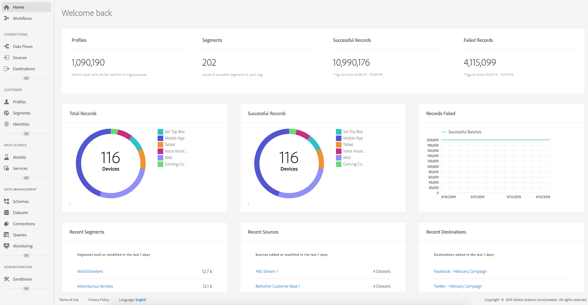

# Real-Time Customer Data Platform快速入门

本快速入门指南将指导您完成Real-Time Customer Data Platform (Real-Time CDP)的示例实施。 您可以将其用作设置自己的实施时的示例。 尽管本指南显示了具体示例，但它会链接到在创建设置时可以使用的其他信息。

此示例展示了由Adobe Experience Platform提供支持的Real-Time Customer Data Platform的强大功能：

* 从多个源摄取数据
* 将它们合并到单个[!DNL real-time customer profile]中
* 跨设备提供一致、相关的个性化体验。

## 用例

运动服装公司Luma一直努力改善客户体验。 他们推出了一项新计划，以提高与礼品相关的销售额。 他们还希望减少过度接触，例如向客户发送令人讨厌的广告。

目前，他们在针对访客以后不打算购买的项目重新定位的媒体上花费过多。 例如，Luma不希望使用旨在为他人一次性购买的项目重新定位某人。

目前，Luma的数据分散在多个来源中。 因此，它们面临着重大挑战：

* 营销组织必须与每个团队均拥有数据源的各种团队合作，包括网站、移动设备应用程序、忠诚度系统、CRM等。
* 当营销团队访问数据时，这些数据通常会失效，不再与其时效性强的营销活动相关。
* 他们需要统一数据，以便针对个人而非渠道。

因此，Luma具有以下业务目标：

* 从其完全不同的数据源创建其用户的实时单一视图。
* 通过跨不同渠道和设备的相关消息个性化营销活动。

要实现这些目标，营销团队需要能够大规模管理客户数据。

借助由Adobe Experience Platform提供支持的Real-Time CDP，Luma的营销组织可以：

1. 从不同的平台收集数据，并确保该数据可用于下游的其他营销活动。
1. 创建其消费者的单个实时视图，独立于数据来源。
1. 在所有接触点之间推动一致、相关和个性化的体验。

## 步骤

本教程包含以下步骤：

1. 生成[客户个人资料](#customer-profile)。
1. [个性化](#personalizing-the-user-experience)用户体验。
1. 使用[多个数据源](#using-multiple-data-sources)。
1. [配置数据源](#configuring-a-data-source)。
1. [收集特定客户的数据](#bringing-the-data-together-for-a-specific-customer)。
1. 设置[受众](#audiences)。
1. 设置[目标](#destinations)。
1. [跨设备拼合配置文件](#cross-device-identity-stitching)。
1. [分析配置文件](#analyzing-the-profile)。

## 客户轮廓

当客户首次访问您的网站时，您对他们一无所知。


在导航时，将会实时捕获数据，并将其发送到Adobe Analytics中的报表包，同时还会直接发送到Adobe Experience Platform。 在收集数据时，您开始根据[!DNL Experience Platform's real-time customer profile]中的行为数据形成消费者的单个视图。

网站的许多访客可能是以前从Luma购买的回头客。  Luma必须个性化消息传递和服务以面向新访客和回访访客以及已知客户，这一点很重要。

### 新客户的首次访问

例如，身份不明的访客导航到Luma网站上的男士部分，并查看了一对跑步运动衫。


当客户导航以详细了解这些产品时，将在Adobe Analytics中收集这些产品视图并将其发送给[!DNL Experience Platform]。

<!---->

Luma可以将访客的行为映射到Adobe Experience Platform上的用户个人资料，并开始更全面地了解该消费者的行为。

### 获得更详细的客户视图

随着客户继续与网站互动，将呈现更清晰的图像。 例如，假设访客将产品添加到购物车并登录。

当客户登录时，她自称是Sarah Rose。


将合并两个身份：

* 匿名浏览数据
* 与Sarah Rose的帐户关联的现有数据

两个身份均合并到[!DNL Experience Platform]中的单个配置文件中。 Luma现在拥有此消费者的统一视图。

根据匿名访客在网站男性区域的浏览行为，可以假定客户是男性。 现在她已经登录，Luma认出了Sarah Rose。 Luma使用[!DNL Real-Time Customer Profile]的强大功能来优化跨渠道交付给她的消息。

## 个性化用户体验

我们对Sarah表示欢迎，并感谢她成为铜牌会员，向其提供更多有关福利以及如何提高地位和积分的信息。

她导航到主页浏览更多内容。


Sarah收到基于她在Adobe Experience Platform中的[!DNL Real-Time Customer Profile]动态投放的个性化主页体验。

借助于Adobe Target中的Adobe Sensei支持的个性化功能，她可以看到相关内容，其中考虑到了她过去的购买情况以及对服装和用具的喜爱。 Luma还根据她最近浏览过的内容，为男士定制跑步装备。

在本页的下方，将显示Sarah的特色产品以及基于她最近查看过的项目的全新推荐栏。

此个性化内容可帮助Sarah快速查找相关项目。 这提高了转化率，并提供更愉快的客户体验。

### 将客户带回来

Sarah心烦意乱，离开网站，结束会议。 Luma可以在Adobe Experience Platform中使用她的数据来帮助她返回网站。

由Adobe Experience Platform提供支持的Real-Time Customer Data Platform专为客户体验管理而构建。 它使组织能够：

* 简化数据集成和激活
* 管理已知和未知的数据使用情况
* 大规模加快营销用例

## 使用多个数据源

Luma团队将所有行为和客户数据放在一个位置。



他们可以从以下所有来源摄取数据：

* 现有Adobe Experience Cloud解决方案数据
* 非Adobe来源，如Luma的忠诚度计划、呼叫中心和销售点系统数据
* 来自Luma数据源的实时流式传输数据
* Adobe解决方案的实时数据（无需新标记）

来自不同来源的所有此类数据将合并到单个统一的客户配置文件中。

## 配置数据源

使用[!DNL Real-Time Customer Data Platform]将新的数据源引入Experience Platform。 Real-Time CDP包括数据源目录，可快速轻松地添加到配置文件中。


例如，要摄取Luma的CRM数据，请按&#x200B;*CRM*&#x200B;筛选目录，并列出包含&#x200B;*CRM*&#x200B;的所有现成连接器。 要添加[!DNL Microsoft Dynamics CRM]数据：

1. 授权连接。

   

1. 从推荐的XDM预映射表列表中选择要导入的内容。

   <!--     -->

   例如，选择&#x200B;**[!UICONTROL Contacts]**。 联系人数据的预览会自动加载，以便您可以确保一切按预期显示。

   通过自动将标准字段映射到[!DNL Experience Data Model] (XDM)配置文件架构，Real-Time CDP可避免此流程中的大量手动工作。

1. 查看字段映射。

   <!--     -->

   例如，仔细检查联系人的电子邮件字段是否正确映射。\
   您可以选择预览数据并执行高级映射。

1. 设置计划。

   

完事了。 您刚刚将[!DNL Microsoft CRM]作为数据源添加到[!DNL Experience Platform]。

### 标记使用策略的摄取数据

Luma具有许多内部策略，这些策略限制使用某些类型收集的信息，并且还必须遵守有关数据使用的法律和隐私关切。 使用Adobe Experience Platform数据管理，预定义的数据使用标签可应用于数据集（以及这些数据集中的特定字段），从而允许Luma根据特定使用限制对其数据进行分类。


应用数据使用标签后，Luma便可以使用数据管理来创建数据使用策略。 数据使用策略是描述允许对包含特定标签的数据执行的操作类型的规则。 当试图在Real-Time CDP中执行构成策略违规的操作时，将阻止该操作，并发出警报以显示违反的策略及其原因。

此外，Real-Time CDP

## 将特定客户的数据汇集在一起

在此场景中，搜索Sarah Rose的用户档案。 她的个人资料随即出现，上面有她用来登录的电子邮件。

<!--  -->

Luma拥有的关于Sarah显示的所有配置文件信息。 这包括她的个人信息，如地址和电话号码、通信偏好以及她有资格的受众。

| 类别 | 描述 |
|---|---|
| 身份标识 | 显示通过Sarah与Luma跨渠道和设备的交互在[!DNL Experience Platform]中链接在一起的身份。 此时会显示她在该网站中的ECID。 她的身份还包括来自其移动设备应用程序的ECID、电子邮件ID、最近添加的[!DNL Microsoft Dynamics]数据集中的CRM ID，以及从Luma忠诚度系统传递到Adobe Experience Platform的忠诚度ID。 |
| 事件 | 显示Sarah与Luma品牌的所有交互数据。 这包括她刚刚查看的项目、以前查看过的任何内容、收到的电子邮件、与呼叫中心的互动，以及每次互动时所使用的渠道和设备。 |

Real-Time CDP配置文件将Luma营销团队的工作流程从几周缩短到几分钟，并根据这个全方位客户视图解锁个性化的可能性。 配置文件将她在登录之前浏览网站时的行为数据与她现有的客户配置文件合并，从而全面了解Sarah。

营销团队可以使用此增强的[!DNL Real-Time Customer Profile]来更好地个性化Sarah的体验，并提高她在Luma中的品牌忠诚度。

## 受众

借助强大的Adobe Experience Platform分段功能，营销人员可以根据[!DNL Real-Time Customer Profile]中捕获的数据合并属性、事件和现有受众。

<!--  -->

在这种情况下，Sarah最近在该网站上的交互表现出与她过去行为不同的行为。 她通常买女装。 不过，她购物车里的物品是男士大运动衫。

Luma数据科学团队围绕购买倾向创建了模型。 其中一种模型反映的是现有消费者的服装类别（如男士/女士）或尺码突然变化。 莎拉购买行为的变化表明她不是为自己买东西。

<!--  -->

### 定义受众

使用受众工作区中的各种可视构成或基于代码的表达式编辑器选项，来修改或创建代表似乎正在购买礼品的购物车放弃者的受众：

```sql
Profile: Category != Preferred Category 
AND 
Product Size != Preferred Size 
in last 7 days.  
AND 
Abandoned Cart 
AND 
Loyalty member 
```

<!-- -->

因为Sarah在购物车中添加了一个明显的礼品并放弃了，Luma可以通过免费赠送礼品包装来针对她。

## 目标

当您添加“赠品购物车放弃者”受众时，您可以大致查看有多少人属于该受众。 您可以对其执行操作，并使其可用于跨渠道个性化。

选择 **[!UICONTROL Send to destinations]**。

在Real-Time CDP中，Luma可无缝地针对其受众进行个性化操作。\
在这里，我们看到可供Luma将此目标发送到Adobe和非Adobe解决方案的所有目标：


### 选择目标

在此方案中，Luma希望通过在这些目标间进行个性化来重新定位此受众：

* Google，用于显示
  <!--* Facebook -->
* Adobe Campaign，用于电子邮件

<!--  -->

### 计划目标

您还可以安排在特定时间开始或结束受众导出。 受众将在计划的日期在配置的平台中发布并自动更新。

>[!NOTE]
>
>（可选）如果选择日期字段，则它会自动安排90天的有效期。

选择&#x200B;**[!UICONTROL Save]**&#x200B;以转到下一页。

当该受众中的客户进行购买时，其对该受众的成员资格将实时禁止。 他们不再符合条件，因为其状态已更改。

这使Luma媒体团队的主管无需为不符合条件的受众耗尽库存，从而节省了数十万美元。

### 实施目标的数据使用策略

Adobe Experience Platform包括隐私和安全控制，用于确定受众是否可用于激活到特定目标。 激活的启用或限制取决于创建目标时分配给目标的营销目的以及贵组织定义的数据使用策略。

如果您的活动违反策略，则会出现警告。 此警告包含数据历程信息，可帮助您确定违反策略的原因以及解决违规的方法。

通过这些控制，[!DNL Experience Platform]帮助Luma遵守法规和负责任地营销。 这些控制非常灵活，可以修改以满足Luma安全和治理团队的要求，使他们能够放心地满足区域和组织管理已知和未知客户数据的要求。

<!--

### Data flow canvas

When you save, a visual data flow canvas shows the segment mapped from the unified profile to the three destinations you selected.


-->

## 跨设备身份拼接

Sarah在其移动设备上浏览社交媒体网站，并看到Luma广告。 这让她想起了她购物车里留下的东西。

稍后，她打开电子邮件，看到重新定位的电子邮件。 她从电子邮件中选择指向Luma的链接。

该链接会将Sarah转到移动设备Luma主页，她将在该页面上看到由Adobe Target提供的高度个性化体验。

* 她受青铜会员的欢迎。
* 她看到“礼物”的信息。
* 她还看到“免费赠品包装”消息，这是她铜牌会员资格福利的一部分。
* 基于她对跑步的喜爱，她仍旧是主角形象中的目标人物。

她买了毛衣，增加了礼品包装，并写了礼品单。 她还可以选择记住这个活动，并在明年收到一个提醒，以便在这个时候收到礼物。 她说是的，并计划于次年发起电子邮件促销活动，提醒她再买一件礼物。

得益于受众抑制功能，Sarah今后不会再成为那件男士毛衣的目标。

## 分析用户档案

Luma营销人员使用Adobe Experience Platform查看Real-Time CDP功能板上的礼品馈送受众。 他们看到这一计划随着时间推移而取得的成果，并看到它还在不断增长。 客户对优惠做出了响应并投入了更多资金。

通过这些洞察，营销人员能够对此信号采取行动，其背后的推动力是将此数据存储在CDP中并将像Sarah这样的客户附加到受众。

Luma使用此CDP数据来提高忠诚度和客户满意度。
