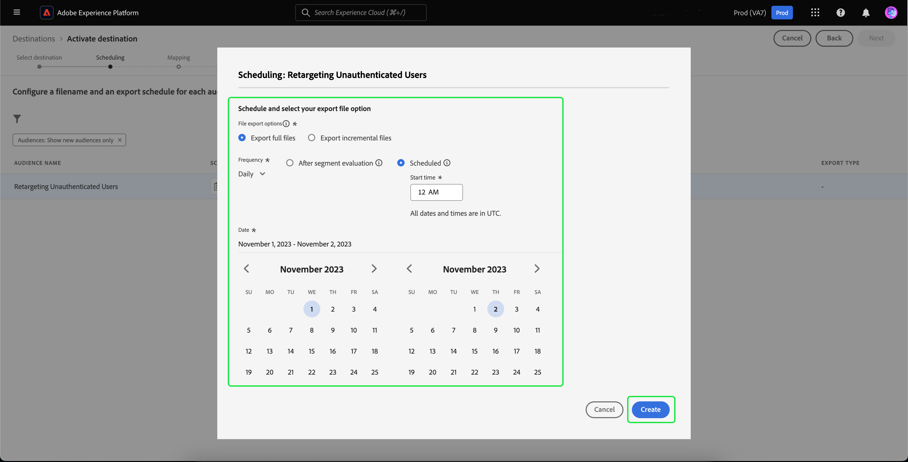

# 未经身份验证的访客的异地重定位

>[!AVAILABILITY]
>
>此功能适用于已获得许可的Real-Time CDP（应用程序服务）、Adobe Experience Platform Activation、Real-Time CDP、Real-Time CDP Prime、Real-Time CDP Ultimate的客户。 阅读[产品说明](https://helpx.adobe.com/legal/product-descriptions.html)中关于这些软件包的详细信息，并联系您的 Adobe 代表了解更多信息。

了解如何构建未经身份验证的访客受众，并使用合作伙伴提供的持久ID重新定位他们。

## 为什么要考虑此用例 {#why-use-case}

随着第三方Cookie的逐步淘汰，数字营销人员必须重新思考其重新与匿名访客接触的策略。 选择与身份供应商集成以实时识别访客的品牌还可以利用合作伙伴提供的持久标识符进行站外付费媒体重定位。

尽管流量很大，但许多品牌在转化阶段都看到了显着下降。 访客参与内容和产品演示，但不注册或购买就离开。

您不仅可以基于现场参与构建受众来个性化营销消息，还可以使用Adobe对合作伙伴ID的支持来重新吸引跨付费媒体目标的访客。

## 先决条件和规划 {#prerequisites-and-planning}

在规划重新定位未经身份验证的访客时，请在规划过程中考虑以下先决条件：

- 我是否已使用正确的身份命名空间设置合作伙伴ID？

此外，为实施用例，您将使用以下Real-Time CDP功能和UI元素。 确保您具有所有这些区域所需的基于属性的访问控制权限，或要求系统管理员授予您必要的权限。

- [受众](../../segmentation/home.md)
- [计算属性](../../profile/computed-attributes/overview.md)
- [目标](../../destinations/home.md)
- [Web SDK](../../edge/home.md)

## 将合作伙伴数据导入Real-Time CDP {#get-data-in}

要创建未经身份验证的访客受众，您首先需要将合作伙伴数据导入Real-Time CDP。

要了解如何使用Web SDK将数据以最佳方式导入Real-Time CDP，请参阅 [数据管理和事件数据收集部分](./onsite-personalization.md#data-management) 现场个性化使用案例的。

## 将合作伙伴提供的ID引入未来 {#bring-partner-ids-forward}

将合作伙伴提供的ID导入事件数据集后，您需要将此数据纳入用户档案记录中。 您可以通过使用计算属性来实现这一点。

通过计算属性，可快速将用户档案行为数据转换为用户档案级别的聚合值。 因此，您可以将这些表达式（如配置文件的“生命周期购买总计”）用于配置文件，从而轻松地在受众中使用计算属性。 有关计算属性的更多信息，请参阅 [计算属性概述](../../profile/computed-attributes/overview.md).

要访问计算属性，请选择 **[!UICONTROL 配置文件]** 后接 **[!UICONTROL 计算属性]** 和 **[!UICONTROL 创建计算属性]**.

![此 [!UICONTROL 创建计算属性] 除了“ ”按钮之外，还会高亮显示 [!UICONTROL 计算属性] 选项卡 [!UICONTROL 配置文件] 工作区。](../assets/offsite-retargeting/create-ca.png)

此 **[!UICONTROL 创建计算属性]** 页面。 在此页上，您可以使用组件创建计算属性。

>[!NOTE]
>
>有关创建计算属性的详细信息，请参阅 [计算属性UI指南](../../profile/computed-attributes/ui.md).

对于此用例，您可以创建一个计算属性，如果存在合作伙伴ID，该属性将获取过去24小时内合作伙伴ID的最新值。

使用搜索栏，您可以找到“合作伙伴ID”事件并将其添加到计算属性画布。

![此 [!UICONTROL 活动] 选项卡和搜索栏会突出显示。](../assets/offsite-retargeting/ca-add-partner-id.png)

将“Partner ID”事件添加到定义后，将事件筛选条件设置为 **[!UICONTROL 存在]**，将事件过滤条件设置为 **[!UICONTROL 最近]** 合作伙伴ID的价值，回顾期为24小时。

为计算属性指定适当的名称（如“合作伙伴ID”）和说明，然后选择 **[!UICONTROL Publish]** 完成计算属性创建过程。

## 使用计算属性创建受众 {#create-audience}

现在，您已创建了计算属性，可以使用此计算属性来创建受众。 在本例中，您将创建一个受众，该受众由本月访问您网站超过5次但尚未注册的访客组成。

要创建受众，请选择 **[!UICONTROL 受众]**，后接 **[!UICONTROL 创建受众]**.

![此 [!UICONTROL 创建受众] 按钮会突出显示。](../assets/offsite-retargeting/create-audience.png)

此时会出现一个对话框，要求您选择 [!UICONTROL 组合受众] 和 [!UICONTROL 生成规则]. 选择 **[!UICONTROL 生成规则]** 后接 **[!UICONTROL 创建]**.

![此 [!UICONTROL 生成规则] 按钮会突出显示。](../assets/offsite-retargeting/select-build-rule.png)

此时将显示“区段生成器”页面。 在此页面上，您可以使用组件构建受众。

>[!NOTE]
>
>有关使用区段生成器的更多详细信息，请参阅 [区段生成器UI指南](../../segmentation/ui/segment-builder.md).

要实现查找这些访客的目标，您首先需要添加 **[!UICONTROL 页面查看]** 事件发送给受众。 选择 **[!UICONTROL 活动]** 选项卡在 **[!UICONTROL 字段]**，然后拖放 **[!UICONTROL 页面查看]** 事件，并将其添加到事件部分画布。

![此 [!UICONTROL 活动] 选项卡 [!UICONTROL 字段] 部分会加亮，同时显示 [!UICONTROL 页面查看]事件。](../assets/offsite-retargeting/add-page-view.png)

选择新添加的 **[!UICONTROL 页面查看]** 事件。 更改回看时段 **[!UICONTROL 任何时间]** 到 **[!UICONTROL 本月]**，并将事件规则更改为包含 **至少5个**.

![添加的详细信息 [!UICONTROL 页面查看] 事件将会显示。](../assets/offsite-retargeting/edit-event.png)

添加事件后，您需要添加属性。 由于您使用的是未经身份验证的访客，因此您可以添加刚刚创建的计算属性。 通过这个新创建的计算属性，您可以将合作伙伴ID链接到受众。

要添加计算属性，请在 **[!UICONTROL 属性]**，选择 **[!UICONTROL XDM个人资料]**，后接 **[!UICONTROL 标记(_A)]**， **[!UICONTROL SystemComputedAttribute]**、和 **[!UICONTROL 合作伙伴ID]**. 现在，添加 **[!UICONTROL 值]** 属性部分的已计算属性的属性。

此外，搜索 **[!UICONTROL 个人电子邮件]** 并添加 **[!UICONTROL 地址]** 属性如下 **[!UICONTROL 合作伙伴ID]** 到画布的“属性”部分。

![此 [!UICONTROL 合作伙伴ID] 计算属性和 [!UICONTROL 个人电子邮件地址] 属性在区段生成器画布上突出显示。](../assets/offsite-retargeting/added-attributes.png)

现在您已添加属性，您需要设置其评估标准。 对象 **[!UICONTROL 合作伙伴ID]**，将条件设置为 **[!UICONTROL 存在]**、和 **[!UICONTROL 地址]**，将条件设置为 **[!UICONTROL 不存在]**.

您现在已成功创建受众，该受众会查找具有合作伙伴提供的ID但尚未注册您的网站的高密度访客。 将受众命名为“Retargeting Unauthenticated Users”，然后选择 **[!UICONTROL 保存]** 以完成创建受众。

## 激活受众 {#activate-audience}

成功创建受众后，您现在可以将此受众激活到下游目标。 选择 **[!UICONTROL 受众]** 在左侧导航栏中，查找新创建的受众，选择省略号图标，然后选择 **[!UICONTROL 激活到目标]**.

![此 [!UICONTROL 激活到目标] 按钮会突出显示。](../assets/offsite-retargeting/activate-to-destination.png)

>[!NOTE]
>
>所有目标类型（包括基于文件的目标）都支持使用合作伙伴ID进行受众激活。
>
>有关将受众激活到目标的更多信息，请参阅 [激活概述](../../destinations/ui/activation-overview.md).

此 **[!UICONTROL 激活目标]** 页面。 在此页面上，您可以选择要将目标激活到的目标。 在选择目标之后，选择 **[!UICONTROL 下一个]**.

此 **[!UICONTROL 正在计划]** 页面。 在此页面上，您可以创建一个计划来确定激活受众的频率。 选择 **[!UICONTROL 创建计划]** 创建audience activation计划。

![此 [!UICONTROL 创建计划] 按钮会突出显示。](../assets/offsite-retargeting/select-create-schedule.png)

此 [!UICONTROL 正在计划] 弹出窗口出现。 在此页面上，您可以创建受众激活的时间表。 配置计划后，选择 **[!UICONTROL 创建]** 以继续。

确认计划详细信息后，选择 **[!UICONTROL 下一个]**.

此 **[!UICONTROL 选择属性]** 页面。 在此页面上，您可以选择要与激活的受众一起导出的属性。 您至少需要包含合作伙伴ID，因为这样可以让您识别计划重新定位的访客。 选择 **[!UICONTROL 添加新映射]** 和搜索计算属性。 添加必要的属性后，选择 **[!UICONTROL 下一个]**.

![两者都是 [!UICONTROL 添加新映射] 按钮和计算属性会突出显示。](../assets/offsite-retargeting/add-new-mapping.png)

此 **[!UICONTROL 审核]** 页面。 在此页面上，您可以查看受众激活的详细信息。 如果您对提供的详细信息满意，请选择 **[!UICONTROL 完成]**.

![此 [!UICONTROL 审核] 此时将显示页面，其中显示受众激活的详细信息。](../assets/offsite-retargeting/review-destination-activation.png)

您现在已将未经身份验证的用户受众激活到下游目标，以便进一步重新定位。

## 其他用例 {#other-use-cases}

您可以进一步探索通过Real-Time CDP中的合作伙伴数据支持启用的用例：

- [吸引和赢取新客户](./prospecting.md) 使用合作伙伴数据。
- [个性化现场体验](./offsite-retargeting.md) 合作伙伴支持的访客识别功能。
- [补充第一方配置文件](./supplement-first-party-profiles.md) 具有合作伙伴提供的属性。
