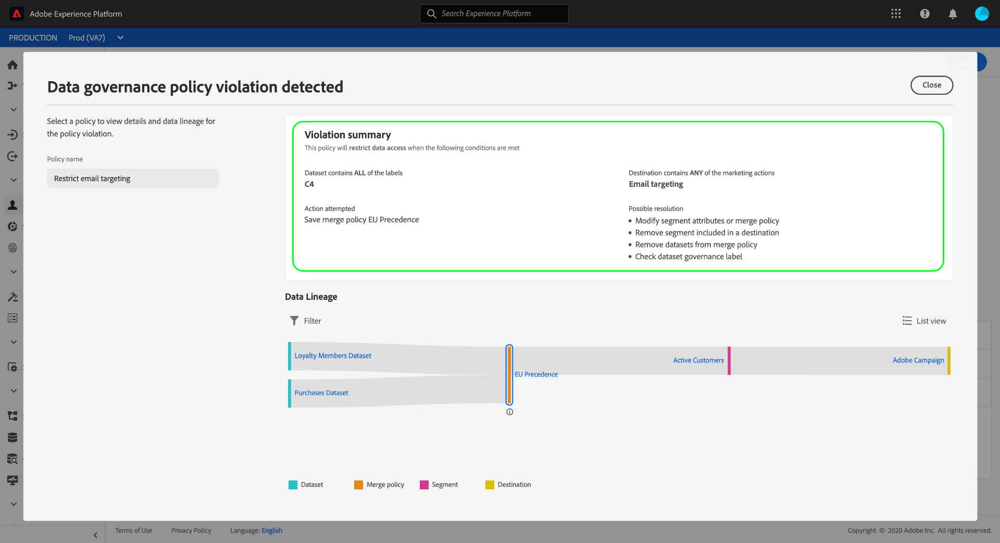

# [!DNL Data Governance] 实时CDP中

[!DNL Real-time Customer Data Platform] （实时CDP）将来自多个企业系统的数据整合在一起，使营销人员能够更好地识别、理解和吸引客户。 此数据可能受组织或法律法规定义的使用限制的约束。 因此，在处理数据时，务必确保实时CDP符合使用策略。

Adobe Experience Platform [!DNL Data Governance] 允许您管理客户数据并确保遵守适用于数据使用的法规、限制和政策。 它在实时CDP中起着关键作用，允许您定义使用策略，根据这些策略对数据进行分类，并在执行某些营销操作时检查是否存在违反策略的情况。

实时CDP构建在Adobe Experience Platform之上，因此文档中 [!DNL Data Governance] 涵盖了大部分功 [!DNL Experience Platform] 能。 本文档旨在补充 [Data Governance概述](../../data-governance/home.md)[!DNL Experience Platform]，并概述实时CDP中提供的Governance功能。 涵盖下列主题：

* [将使用标签应用于您的数据](#labels)
* [管理数据使用策略](#policies)
* [强制实施数据使用合规性](#enforce-data-usage-compliance)

## 将使用标签应用于您的数据 {#labels}

[!DNL Data Governance] 允许您在数据集或数据集字段级别将使用标签应用于数据。 数据使用标签允许您根据适用于该数据的使用策略对数据进行分类。

有关使用数据使用标签的详细信息，请参 [阅Adobe Experience Platform数据使用标签](../../data-governance/labels/overview.md) 用户指南。

## 为目标配置营销用例 {#destinations}

您可以通过为目标定义营销用例（也称为营销活动）来设置目标的数据使用限制。 目标的市场营销用例指明将导出到该目标的数据的用途。

>[!NOTE]
>
>有关营销操作及其在数据使用策略中的使用的更多信息，请参 [阅文档中的数据使用策](../../data-governance/policies/overview.md) 略 [!DNL Experience Platform] 概述。

在目标上定义营销使用案例，可确保发送到这些目标的任何用户档案或区段均符合数据使用策略。 因此，您应根据组织对激活实施策略限制的需要，向您的目标添加适当的营销使用案例。

只有在首次设置目标时，才能选择市场营销用例。 根据您所处理的目标类型，配置营销用例的机会将显示在设置工作流的不同位置。 有关如何 [配置特定目标](../destinations/destinations-overview.md#data-governance) ，请参阅目标文档。

## 管理数据使用策略 {#policies}

为了使数据使用标签能够有效支持数据合规性，必须定义并启用数据使用策略。 数据使用策略是描述您允许在实时CDP内对数据执行的或从中限制的营销操作种类的规则。 有关详细信息，请参阅“数据管理” [!DNL Experience Platform] 概 [述中的](../../data-governance/home.md) “数据使用策略”部分。

Adobe Experience Platform为常见客户体验使用案例提供了若干核心策略。 通过导航到“策略”工作区并选择“浏览”选 **[!UICONTROL 项卡]** ，可以在UI中 **[!UICONTROL 查看这些]** 策略。 有关在 [UI中使用策略](../../data-governance/policies/user-guide.md) (包括 [!DNL Experience Platform] 如何制定您自己的自定义策略)的更详细步骤，请参阅文档中的策略用户指南。

## 强制实施数据使用合规性 {#enforce-data-usage-compliance}

在标记数据并定义使用策略后，您可以强制数据使用符合策略。 在实时CDP中将受众段激活到目标时，如果发 [!DNL Data Governance] 生任何违规，将自动实施使用策略。

下图说明如何将策略实施集成到区段激活的数据流中：

首次激活区段时，会 [!DNL Policy Service] 根据以下因素检查是否存在违反策略的情况：

* 应用于要激活的区段中的字段和数据集的数据使用标签。
* 目标的营销目的。

>[!NOTE]
>
>如果激活集（而非整个数据集）中的某些字段只应用了数据使用标签，则只有在以下条件下才会对这些字段级别标签进行强制执行：
>* 这些字段用在段定义中。
>* 字段将配置为目标目标的预计属性。

### 数据世系 {#lineage}

在实时CDP中，数据谱系在策略的实施方式中起着关键作用。 一般而言，数据谱系是指来源一组数据，以及数据随时间的变化（或其移动的位置）。

在上下文中，世系 [!DNL Data Governance]允许数据使用标签从数据集传播到使用其数据的下游服务，如实时客户用户档案和目标。 这允许在数据通过平台过程中的几个关键点评估和执行策略，并为数据消费者提供策略违规发生的原因的上下文。

在实时CDP中，策略实施涉及以下世系：

1. 数据被引入实时CDP并存储在数 **据集**。
1. 通过根据合并策略合并用户档案片段，从这些数据集中识别和构 **建客户**。
1. 用户档案组根据共同 **属性** 划分为区段。
1. 区段会激活到下游 **目标**。

如下表所述，上述时间线中的每个阶段都表示可能导致被违反策略的实体：

| 数据世系阶段 | 策略实施中的角色 |
| --- | --- |
| 数据集 | 数据集包含数据使用标签（应用于数据集或字段级别），这些标签定义了整个数据集或特定字段可用于的用例。 如果将包含某些标签的数据集或字段用于策略限制的目的，则将发生策略违规。 |
| 合并策略 | 合并策略是平台用来确定在合并多个数据集中的片段时如何对数据进行优先级排序的规则。 如果您的合并策略被配置为将具有受限标签的数据集激活到目标，则会发生策略违规。 有关详细信息，请 [参阅](../../profile/ui/merge-policies.md) “合并策略”指南。 |
| 区段 | 细分规则定义应从客户用户档案包括哪些属性。 根据区段定义包含的字段，区段将继承这些字段所应用的所有使用标签。 如果激活的区段继承的标签受目标目标的适用策略（基于其营销用例）的限制，则会发生策略违规。 |
| 目标 | 设置目标时，可以定义营销活动（有时称为营销用例）。 此用例与数据使用策略中定义的营销活动相关。 换言之，您为目标定义的市场营销用例决定哪些数据使用策略适用于该目标。 如果激活的区段的使用标签受目标目标的适用策略限制，则将发生策略违规。 |

当发生策略违规时，UI中显示的结果消息将提供有用的工具来探索违规的贡献数据谱系，以帮助解决问题。 下一节提供更多详细信息。

### 策略违规消息 {#enforcement}

如果策略违规无法尝试激活区段(或对已激 [活的区段进行编辑](#policy-enforcement-for-activated-segments))，则会阻止该操作，并显示一个弹出窗口，指示已违反一个或多个策略。 触发违规后，将为要修 **[!UICONTROL 改的实]** 体禁用“保存”按钮，直到相应组件更新以符合数据使用策略。

在弹出窗口的左列中选择策略违规，以显示该违规的详细信息。

违规消息提供所违反策略的摘要，包括策略配置要检查的条件、触发违规的特定操作以及问题的可能解决列表。

违规摘要下方会显示一个数据谱系图，允许您查看哪些数据集、合并策略、区段和目标与策略违规相关。 图中突出显示您当前更改的实体，指示流中的哪个点导致违规发生。 您可以在图形中选择实体名称，以打开相关实体的详细信息页面。

您还可以使用“筛 **[!UICONTROL 选器]** ”图标()按类别筛选显示的实体。 必须至少选择两个类别才能显示数据。

选 **[!UICONTROL 择列表]** 视图以将数据世系显示为列表。 要切换回可视图，请选择“路 **[!UICONTROL 径视图”]**。

### 对激活的区段实施策略 {#policy-enforcement-for-activated-segments}

策略实施仍适用于激活区段后的区段，从而限制对区段或其目标的任何更改，这会导致策略违规。 由于数据世 [系在策略](#lineage) 实施中的工作方式，以下任何操作都可能触发违规：

* 更新数据使用标签
* 更改区段的数据集
* 更改段谓词
* 更改目标配置

如果上述任何操作触发违规，则会阻止保存该操作并显示策略违规消息，从而确保激活的区段在被修改时继续遵守数据使用策略。

## 后续步骤

现在，您已经介绍了实时CDP [!DNL Data Governance] 的主要功能以及如何 [!DNL Experience Platform] 启用这些功能，请继续阅读Adobe Experience Platform [数据管理文档](../../data-governance/home.md)。 文档概述了基本 [!DNL Data Governance] 概念，以及管理数据使用标签和策略的分步工作流。

以下视频概述了实时 [!DNL Data Governance] CDP的功能，包括在目标上的营销用例和针对不同情景的示例工作流的使用：

>[!VIDEO](https://video.tv.adobe.com/v/33631?quality=12&learn=on)