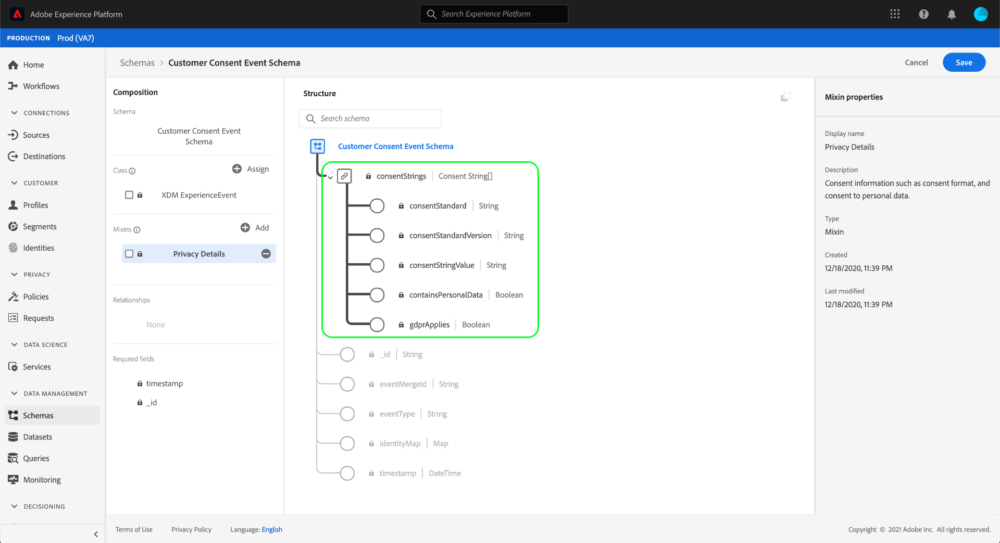
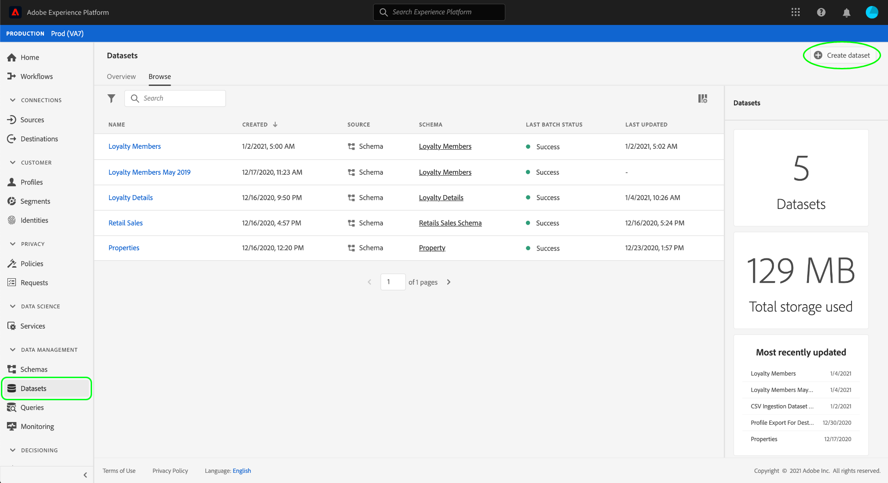
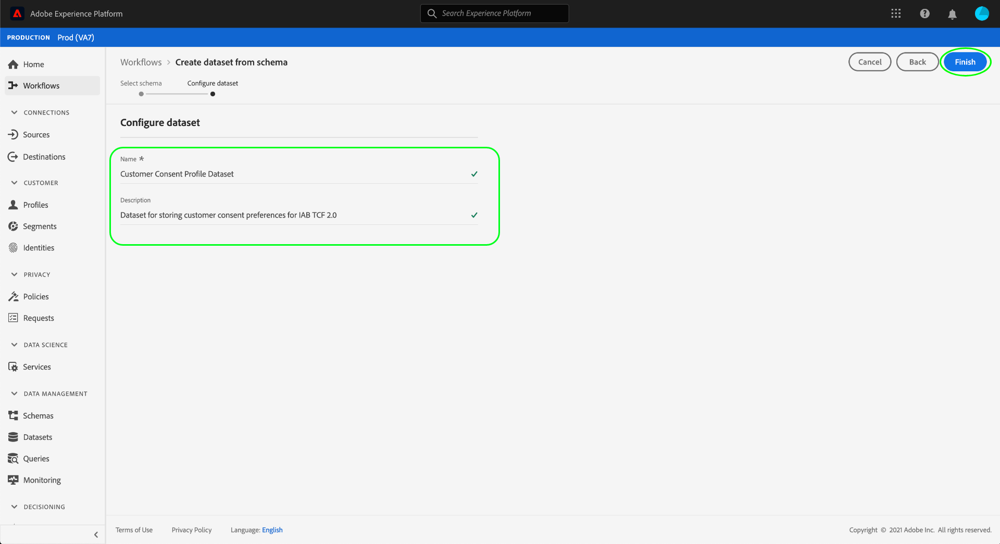

# 创建数据集以捕获IAB TCF 2.0同意数据

为了根 [!DNL Real-time Customer Data Platform] 据IAB(TCF)2.0处理客 [!DNL Transparency & Consent Framework] 户同意数据，必须将该数据发送到模式包含TCF 2.0同意字段的数据集。

具体而言，捕获TCF 2.0同意数据需要两个数据集：

* 基于类的数 [!DNL XDM Individual Profile] 据集，可在中使 [!DNL Real-time Customer Profile]用。
* 基于类的数 [!DNL XDM ExperienceEvent] 据集。

此文档提供了设置这两个数据集以收集IAB TCF 2.0同意数据的步骤。 有关为TCF 2.0配置的完 [!DNL Real-time CDP] 整工作流程的概述，请参 [阅IAB TCF 2.0规范概述](./overview.md)。

## 先决条件

本教程需要对Adobe Experience Platform的以下组件进行有效的理解：

* [体验数据模型(XDM)](../../../xdm/home.md):组织客户体验数 [!DNL Experience Platform] 据的标准化框架。
   * [模式合成基础](../../../xdm/schema/composition.md):了解XDM模式的基本构件。
   * [在UI中创建模式](../../../xdm/tutorials/create-schema-ui.md):一个教程，其中介绍使用模式编辑器的基础知识。
* [Adobe Experience Platform身份服务](../../../identity-service/home.md):使您能够跨越设备和系统的不同数据源连接客户身份。
* [实时客户用户档案](../../../profile/home.md):利 [!DNL Identity Service] 用数据集实时创建详细的客户用户档案。 [!DNL Real-time Customer Profile] 从Data Lake中提取数据，并将客户用户档案保留在其自己的单独数据存储中。

## 同意模式结构 {#structure}

有两个XDM混合提供TCF 2.0支持所需的客户同意字段：一个用于记录数据([!DNL XDM Individual Profile])，另一个用于基于时间序列的数据([!DNL XDM ExperienceEvent]):

| 架构 | 描述 |
| --- | --- |
| 用户档案隐私混合 | 此混音包含客户的当前同意偏好。 在启用的模式 [!DNL Profile]中使用时，此混合中提供的值被视为同意实施应如何适用于客户数据的真理来源。 |
| [!DNL Experience Event] 隐私混合 | 此组合捕获客户在给定时间点的同意偏好。 在这些字段中捕获的数据可用于跟踪客户同意偏好随时间的变化。 |

虽然每个混音的用例不同，但它们提供的特定字段大致相同。 以下部分将进一步说明这些字段。

### 在字段中混合同意 {#privacy-mixin}

虽然每个隐私混合在结构和包含的字段类型上都有所不同，但它们都提 `xdm:consentString` 供属性，TCF 2.0强制实施需要其子字段。 这些字段的结构如下所示，以及它们所期望的值的类型：

```json
{
  "xdm:consentString": {
    "xdm:consentStandard": "IAB TCF",
    "xdm:consentStandardVersion": "2.0",
    "xdm:consentStringValue": "BObdrPUOevsguAfDqFENCNAAAAAmeAAA.PVAfDObdrA.DqFENCAmeAENCDA",
    "xdm:gdprApplies": true,
    "xdm:containsPersonalData": false
  }
}
```

| 属性 | 描述 |
| --- | --- |
| `xdm:consentString` | 包含客户的更新同意数据和其他上下文信息。 |
| `xdm:consentStandard` | 数据适用的同意框架。 对于TCF合规性，值应为“IAB TCF”。 |
| `xdm:consentStandardVersion` | 表示同意框架的版本号 `xdm:consentStandard`。 对于TCF 2.0合规性，值应为“2.0”。 |
| `xdm:consentStringValue` | 根据客户的选定同意设置生成的同意字符串。 |
| `xdm:gdprApplies` | 一个布尔值，用于指示GDPR是否适用于此客户。 该值必须设置为“true”，才能执行TCF 2.0。 如果不包括，则默认为“false”。 |
| `xdm:containsPersonalData` | 指示同意更新是否包含个人数据的布尔值。 如果不包括，则默认为“false”。 |

## 创建客户同意模式 {#create-schemas}

在平台UI中，单击左 **[!UICONTROL 侧导]** 航中的模式以打开 **[!UICONTROL 模式工]** 作区。 从此处，请按照以下各节中的步骤创建每个必需的模式。

>[!NOTE]
>
>如果您现有的XDM模式要用来捕获同意数据，则可以编辑这些模式，而不是创建新数据。 但是，在编辑现有模式时，必须遵循 [模式演化原则](../../../xdm/schema/composition.md#evolution) ，避免突破性变化。

### 创建基于记录的同意模式 {#profile-schema}

从模式 **[!UICONTROL 工作]** 区的“浏 **[!UICONTROL 览] ”选项卡中**[!DNL XDM Individual Profile] ，基于类创建新的模式。 在模式编辑器中打开模式后， **[!UICONTROL 单击]** 画布左 **[!UICONTROL 侧]** “Mixins”部分下的“添加”。


将出 **[!UICONTROL 现“添加混音]** ”对话框。 从此处，从 **[!UICONTROL 用户档案]** 中选择列表隐私。 您可以选择使用搜索栏缩小结果范围，以便更轻松地定位混音。 选择混音后，单击“添 **[!UICONTROL 加混音]**”。


模式编辑器画布将重新显示，允许您查看添加的同意字符串字段的结构。


从此处，重复上述步骤，向模式添加以下附加混音：

* [!UICONTROL IdentityMap]
* [!UICONTROL 用户档案的数据捕获区域]
* [!UICONTROL 用户档案人详细信息]
* [!UICONTROL 用户档案个人详细信息]


如果您正在编辑已启用在中使用的现有模式，请 [!DNL Real-time Customer Profile]单击 **[!UICONTROL “保存]** ”以确认更改，然后跳到“根据您的同意模式 [创建数据集”部分](#dataset)。 如果要创建新模式，请继续执行下面子节中概述的步骤。

#### 启用模式以在 [!DNL Real-time Customer Profile]

为了将 [!DNL Real-time CDP] 其收到的同意模式与特定客户用户档案关联，必须启用同意以在中使用 [!DNL Real-time Customer Profile]。

>[!NOTE]
>
>本节中显示的示例模式使用其 `identityMap` 字段作为主标识。 如果您希望将另一个字段设置为主要标识，请确保您使用的是Cookie ID等间接标识符，而不是基于兴趣的广告中禁止使用的直接可识别字段，如电子邮件地址。 如果您不确定哪些字段受限，请咨询您的法律顾问。
>
>有关如何为模式设置主标识字段的步骤，请参阅模式创 [建教程](../../../xdm/tutorials/create-schema-ui.md#identity-field)。

要为模式启 [!DNL Profile]用模式，请单击左边栏中模式的名称，以打开右边栏 **[!UICONTROL 中的]** “属性”对话框。 从此处，单击 **[!UICONTROL 用户档案]** 切换按钮。


出现一个弹出窗口，表示缺少主标识。 选中此复选框以使用替代主标识，因为主标识将包含在identityMap字段中。

<br>

最后，单击 **[!UICONTROL 保存]** ，以确认更改。


### 创建基于时间序列的同意模式 {#event-schema}

从模式 **[!UICONTROL 工作]** 区的“浏 **[!UICONTROL 览]** ”选项卡中 [!DNL XDM ExperienceEvent] ，根据类创建新模式。 在模式编辑器中打开模式后， **[!UICONTROL 单击]** 画布左 **[!UICONTROL 侧]** “Mixins”部分下的“添加”。


将出 **[!UICONTROL 现“添加混音]** ”对话框。 从此处，从 **[!UICONTROL 列表中选择体验事件]** 隐私混合。 您可以选择使用搜索栏缩小结果范围，以便更轻松地定位混音。 选择混音后，单击“添 **[!UICONTROL 加混音]**”。


将重新显示模式编辑器画布，显示添加的同意字符串字段。



从此处，重复上述步骤，向模式添加以下附加混音：

* [!UICONTROL IdentityMap]
* [!UICONTROL 体验活动环境详细信息]
* [!UICONTROL 体验活动Web详细信息]
* [!UICONTROL ExperienceEvent实施详细信息]

添加混音后，单击“保存”即 **[!UICONTROL 可完成]**。


## 根据您的同意模式创建数据集 {#datasets}

对于上述每个必需模式，您必须创建一个数据集，以最终收集客户同意数据。 必须启用基于 [!DNL XDM Individual Profile] 模式的数据集， [!DNL Real-time Customer Profile]而不应启用基于 [!DNL XDM ExperienceEvent] 模式的 [!DNL Profile]数据集。

首先，在左侧 **[!UICONTROL 导航中]** ，选择数据集，然 **[!UICONTROL 后单击右上]** 角的“创建数据集”。



在下一页，选择“从 **[!UICONTROL 模式创建数据集”]**。


将显 **[!UICONTROL 示“从模式创建集]** ”工作流，从“选择 **[!UICONTROL 模式”步骤开始]** 。 在提供的列表中，找到您之前创建的同意模式之一。 您可以选择使用搜索缩小结果并更轻松地定位模式。 单击模式旁的单选按钮以选择它，然后单击“下 **[!UICONTROL 一步]** ”继续。


将显 **[!UICONTROL 示配置数据集]** 步骤。 在单击“完成”之前，为数据集提供唯一、易于识别的名称和 **[!UICONTROL 描述]**。



此时将显示新创建数据集的详细信息页面。 如果数据集基于您的 [!DNL XDM ExperienceEvent] 模式，则该过程已完成。 如果数据集基于您的 [!DNL XDM Individual Profile] 模式，则该过程的最后一步是启用数据集以供使用 [!DNL Real-time Customer Profile]。 在右边栏中，单击用户档案切 **[!UICONTROL 换按钮]** ，以启用数据集。


再次按照上述步骤创建符合TCF 2.0要求的其他必需数据集。

## 后续步骤

通过遵循本教程，您创建了两个数据集，现在可用于收集客户同意数据：

* 基于 [!DNL Profile]您的模式启用的数 [!DNL XDM Individual Profile] 据集。
* 基于未启用 [!DNL XDM ExperienceEvent] 的模式的数据集 [!DNL Profile]。

您现在可以返回 [IAB TCF 2.0概述](./overview.md#merge-policies) ，继续配置TCF 2 [!DNL Real-time CDP] .0规范的过程。