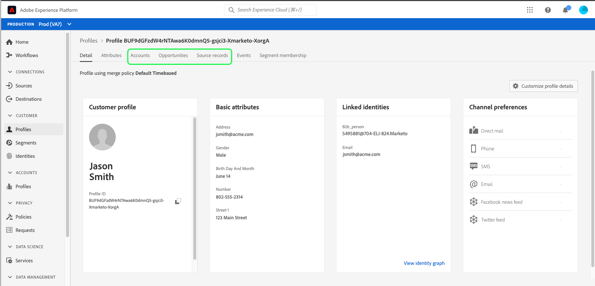

# 在Real-Time Customer Data Platform中浏览配置文件

Real-time Customer Profile可以为每位客户创建整体视图，结合来自多个渠道（包括在线、离线、CRM和第三方数据）的数据。 由于个人资料是根据从各种来源引入系统的数据进行聚合的，因此每个个人资料都成为一个可操作、且带有时间戳的帐户，说明了您的客户与您的品牌每次互动。

在Adobe Experience Platform用户界面中，您可以查看这些只读用户档案，并查看有关每个客户的重要信息，包括他们的偏好设置、过去的事件、交互和个人所属的受众。

Adobe Real-Time Customer Data Platform基于Adobe Experience Platform构建，因此能够利用Experience Platform UI中的用户档案查看功能。 有关在Experience Platform用户界面中查看客户配置文件的详细指南，请参阅[实时客户配置文件用户指南](../../profile/ui/user-guide.md)。

## Real-Time CDP、B2B edition的配置文件增强功能

除了Adobe Experience Platform、Real-Time CDP支持的配置文件浏览功能之外，B2B edition用户还可以分别在[!UICONTROL Attributes]和[!UICONTROL Events]选项卡上访问客户配置文件中的B2B属性和事件。 B2B数据还可用于执行分段，这些受众与非B2B受众一起显示在客户的[!UICONTROL Audience membership]选项卡下。

Real-Time CDP、B2B edition还允许您在与单个客户关联的企业源之间浏览[!UICONTROL Accounts]、[!UICONTROL Opportunities]和[!UICONTROL Source records]。

要探究这些增强功能，请按照[实时客户配置文件用户指南](../../profile/ui/user-guide.md)中概述的步骤开始，按合并策略或身份命名空间浏览配置文件。

除了客户配置文件中提供的标准信息之外，配置文件详细信息还包括对[!UICONTROL Accounts]、[!UICONTROL Opportunities]和[!UICONTROL Source records]选项卡的访问权限，这些标准信息也通过B2B事件和属性得到增强。

要了解有关Experience Platform UI中提供的配置文件详细信息的更多信息，请参阅配置文件仪表板文档[的](../../dashboards/guides/profiles.md#browse-profiles)详细信息部分。

### “帐户”选项卡

选择&#x200B;**[!UICONTROL Accounts]**&#x200B;以查看与配置文件相关的帐户列表。 此列表包括来自帐户资料的基本信息，如帐户的名称、网站和行业，以及指向帐户个人资料的链接。

有关查看和浏览帐户配置文件的详细信息，请从阅读[帐户配置文件概述](../accounts/account-profile-overview.md)开始。

### “业务机会”选项卡

**[!UICONTROL Opportunities]**&#x200B;选项卡提供与帐户相关的未结和已结业务机会的详细信息。 这些机会可能会从多个来源引入Experience Platform，但是Real-Time CDP中的B2B edition使营销人员能够轻松地在一个位置一起查看所有这些机会。

每个机会都包括一些信息，如机会的名称、数量、阶段，以及机会是开放、关闭、成功还是失败。

### “Source记录”选项卡

通过&#x200B;**[!UICONTROL Source records]**&#x200B;选项卡，您可以轻松查看来自企业源的多条源记录，这些记录对单个客户配置文件有贡献。 除了[!UICONTROL Person source key]和电子邮件地址之外，每个源记录还提供记录类型（例如，“联系人”或“潜在客户”记录）以及源。

