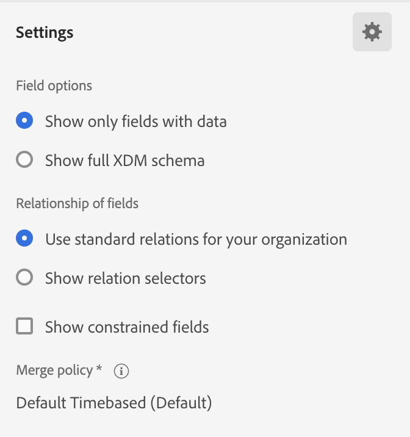

# Real-Time Customer Data Platform中的Audience Builder

[!DNL Adobe Real-Time Customer Data Platform]构建于Adobe Experience Platform之上，能够利用[!DNL Experience Platform]所包含的所有Audience Builder功能。 工作区为构建和编辑规则提供了直观的控件，例如用于表示数据属性的拖放图块。

{zoomable="yes"}

## 字段 {#fields}

>[!CONTEXTUALHELP]
>id="platform_b2b_audiencebuilder_showfullxdmschema"
>title="显示完整 XDM 架构"
>abstract="默认情况下，仅显示包含数据的字段。启用此选项可显示 XDM 架构中的所有字段。"

>[!CONTEXTUALHELP]
>id="platform_b2b_audiencebuilder_showrelationselectors"
>title="显示关系选择器"
>abstract="默认情况下会使用您组织的标准关系。启用此选项可以显示所使用的关系选择器。"

>[!CONTEXTUALHELP]
>id="platform_b2b_audiencebuilder_showconstrainedfields"
>title="显示受限字段"
>abstract="默认情况下，仅显示没有任何约束的字段。启用此选项可显示具有约束的字段。"

在将Audience Builder用于帐户时，您可以使用帐户属性或现有受众作为受众的字段。

您可以选择来调整所显示字段的设置。

{zoomable="yes"}

>[!NOTE]
>
>**[!UICONTROL 字段选项]**&#x200B;部分当前为测试版，仅向部分客户提供。 有关更多信息，请联系Adobe客户关怀部门。

将显示[!UICONTROL 设置]部分。 在此部分中，您可以更新显示哪些字段以及字段之间的关系。

对于&#x200B;**[!UICONTROL 字段选项]**，您可以只显示包含数据的字段或完整XDM架构。

对于字段的&#x200B;**[!UICONTROL 关系]**，您可以使用组织的标准关系或显示关系选择器。

{width="300"}

### 属性 {#attributes}

通过[!UICONTROL 属性]选项卡，可浏览属于XDM业务帐户类的帐户属性，以及机会和基于人员的属性。 可以展开每个文件夹以显示其他属性，其中每个属性都是一个可以拖到工作区中心的[规则生成器画布](#rule-builder-canvas)上的拼贴。

选择属性时，您可以通过选择[信息图标](../../images/icons/info.png)来查看摘要数据。 摘要数据包括顶值、字段含义以及包含此属性值的帐户百分比等信息。

{width="300"}

如果属性由少于25%的帐户填充，则将改为显示。 无论如何都将显示该属性的相同摘要数据。

{width="300"}

>[!NOTE]
>
>仅当属性属于Account 、 Person或Opportunity架构时，摘要数据才可用。 此外，仅当字段&#x200B;**不**&#x200B;包含太多不同的值并且这些字段的值通常重复时，才会显示最大值。
>
>此摘要数据按&#x200B;**每天**&#x200B;更新。

有关受众生成器的更详细指南，请阅读[受众生成器用户指南](../../segmentation/ui/segment-builder.md){target="_blank"}。

### 受众 {#audiences}

**[!UICONTROL 受众]**&#x200B;选项卡列出了Experience Platform中可用的所有基于人员和基于帐户的受众。

您可以将鼠标悬停在受众旁边的上，以查看有关受众的信息，包括其ID、描述以及用于查找受众的文件夹层次结构。

{zoomable="yes"}

## 规则生成器画布 {#rule-builder-canvas}

在Audience Builder中创建的受众是用于描述目标受众关键特征或行为的规则集合。 这些规则是使用位于受众生成器中心的规则生成器画布创建的。

要向区段定义添加新规则，请从&#x200B;**[!UICONTROL 字段]**&#x200B;选项卡中拖动一个拼贴，然后将其放到规则生成器画布上。

{zoomable="yes"}

有关使用规则生成器画布的更多信息，请阅读[区段生成器文档](../../segmentation/ui/segment-builder.md#rule-builder-canvas){target="_blank"}。

### 容器 {#containers}

受众规则的评估顺序是这些规则列出的顺序。 您可以使用容器通过嵌套查询更好地控制执行顺序。

有关容器的详细信息，请阅读[区段生成器文档](../../segmentation/ui/segment-builder.md#containers){target="_blank"}。

## 受众属性 {#properties}

**[!UICONTROL 受众属性]**&#x200B;部分显示有关受众的信息，包括预计的受众大小。 您还可以指定有关受众的详细信息，包括其名称、描述和标记。

{width="300"}

**[!UICONTROL 合格帐户]**&#x200B;指示符合受众规则的实际帐户数。 此数字在分段作业运行后，每24小时更新一次。

**[!UICONTROL 估计帐户]**&#x200B;表示基于示例作业的大致帐户数。 添加新规则或条件并选择&#x200B;**[!UICONTROL 刷新估算]**&#x200B;后，您可以更新此值。

{width="300"}

您可以选择&#x200B;**[!UICONTROL 查看帐户]**&#x200B;以查看符合受众当前规则的帐户的抽样。

{width="300"}

**[!UICONTROL 代码视图]**&#x200B;提供了受众规则的基于文本的代码描述。

您可以选择&#x200B;**[!UICONTROL 应用访问标签]**&#x200B;以应用受众的相关访问标签。 有关访问标签的详细信息，请参阅[管理标签指南](../../access-control/abac/ui/labels.md){target="_blank"}。

在受众属性部分的其余部分，您可以编辑与帐户受众相关的详细信息，包括名称、描述和标记。

{width="300"}

您&#x200B;**无法**&#x200B;更改帐户受众的评估方法，因为所有帐户受众都使用批处理分段进行评估。

## 后续步骤 {#next-steps}

Audience Builder提供了一个丰富的工作流，允许您从XDM业务帐户数据创建受众。

若要了解有关客户个人资料数据分段服务的更多信息，请阅读[分段服务概述](../../segmentation/home.md){target="_blank"}。
