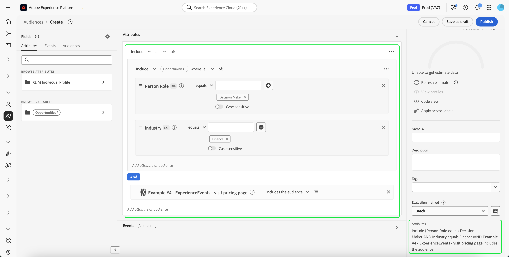
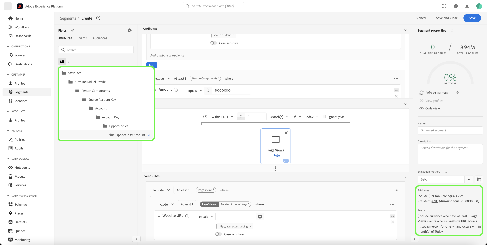
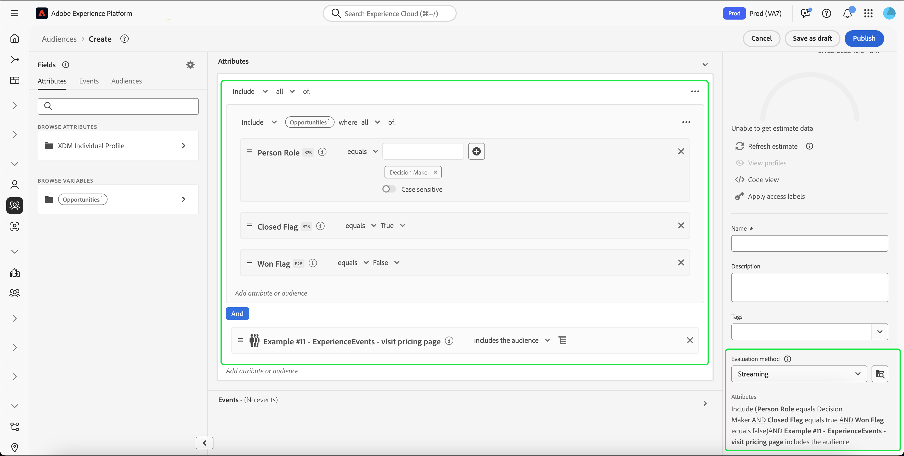

# Real-Time Customer Data Platform B2B edition的分段用例

>[!IMPORTANT]
>
>不再支持包含引用B2B实体的体验事件（例如营销活动和营销列表）的受众。 有关详细信息，请阅读[Real-Time CDP B2B edition架构升级](../../rtcdp/b2b-architecture-upgrade.md)的概述。

本文档提供了Adobe Real-Time Customer Data Platform B2B edition中的区段定义示例，以及如何为常见的B2B用例组合不同类型的属性。 要了解目标如何适合您的B2B工作流，请参阅[端到端教程](../b2b-tutorial.md#create-a-segment-to-evaluate-your-data)。

>[!NOTE]
>
>这些分段用例所需的属性仅可供Real-Time Customer Data Platform B2B edition客户使用。 如果您未使用Real-Time Customer Data Platform B2B edition，请改为查看[分段概述](./segmentation-overview.md)。

>[!BEGINSHADEBOX]

## 合并策略更改

在升级到Real-Time CDP B2B edition架构时，具有B2B属性的多实体受众现在仅支持单个合并策略（默认合并策略），而不支持多个合并策略。 此外，用户档案符合受众条件的更改可能会影响下游工作流，例如激活、历程编排和活动定位。 建议您执行以下操作，以确保数据按预期工作：

- 审查并测试依赖非默认合并逻辑的任何受众，以了解此更新的潜在影响。
- 重新评估关键受众的受众资格标准，以了解合并逻辑中的更改是否可能影响资格。
- 监测您的激活结果，以检测由合并策略更改导致的受众结果的任何偏移。

>[!ENDSHADEBOX]

## 先决条件 {#prerequisites}

在为B2B类使用分段属性之前，必须完成以下步骤：

1. 创建使用B2B类的架构。 B2B edition课程包括Account 、 Campaign 、 Opportunity 、 Marketing List等。 有关[如何设置用于B2B类的架构](../schemas/b2b.md)的信息，请参阅架构文档。
2. 在体验数据模型(XDM) B2B架构之间创建关系。 基于B2B edition属性的受众需要类之间的关系，才能充分利用扩展的B2B分段功能。 有关详细信息，请参阅有关[如何定义两个B2B架构](../../xdm/tutorials/relationship-b2b.md)之间关系的文档。
3. 使用基于B2B架构的数据集来摄取数据。 有关如何摄取数据[的信息，请参阅源文档](../../sources/connectors/adobe-applications/marketo/marketo.md)。
4. 有关如何构建受众的更详细指导，请参阅[区段生成器用户指南](../../segmentation/ui/segment-builder.md)。

在满足这些要求后，您就能够为常见的B2B用例组合这些属性。

## 快速入门 {#getting-started}

一旦B2B类的合并架构建立了关系并已用于摄取数据，则其属性在区段生成器的左边栏中可用。

在分段工作区中，B2B类及其属性会附加`B2B`标签，以使其与Real-Time Customer Data Platform中作为标准可用的类区分开来。

为了有效地为B2B用例创建受众，熟悉架构并了解数据模型是什么样子非常重要。 了解数据从一个数据对象移动到另一个数据对象的路径也很有用。

下图说明了Real-Time CDP B2B edition中可用的B2B类之间的关系。

由于数据模型可能很复杂，因此您可以使用Platform UI查看数据模型的更详细的可视化表示形式，以帮助查找用例的相关属性。 要开始，请转到Platform UI并在左侧导航中选择架构。

从可用列表中选择相应的架构，然后从[!UICONTROL 合成]侧边栏中选择相应的关系。 在以下示例中，选择“人员”关系将显示当前架构中哪个属性引用了相关的“人员”架构（如果它是关系中的源架构），或被“人员”架构（如果它是关系中的引用架构）引用。

通过使用`Key`文件夹，此关系反映在区段生成器中，如下图所示。

有关可用B2B类的更多信息，请参阅Real-Time Customer Data Platform B2B edition文档中的[架构](../schemas/b2b.md)。

下面的用例提供了有关使用哪些类在不同架构之间建立关系以实现这些结果的信息。 这些示例可用于帮助您创建自己的受众。

## 不同分段用例的示例 {#use-cases}

以下用例可用于使用B2B edition进行分段。 每个示例都提供了受众所执行操作的说明以及用于创建受众的类的说明。 提供的图像突出显示[!UICONTROL 属性]侧边栏中的文件路径，该路径反映了架构的结构。 显示屏右侧的[!UICONTROL 区段属性]部分包含受众属性的书面细分。

### 示例1：查找B2B机会的“决策者” {#find-decision-maker}

查找所有作为任何机会的“决策者”的人员。 此受众需要[!UICONTROL XDM个人配置文件]类和[!UICONTROL XDM业务机会人员关系]类之间的链接。

### 示例2：查找分配给超过特定美元金额的业务机会的B2B配置文件 {#find-opportunities-amount}

查找直接分配到任何商机金额大于给定金额（$100万）的人员的所有。 此受众需要[!UICONTROL XDM Individual Profile]类、[!UICONTROL XDM业务机会人员关系]类和[!UICONTROL XDM业务机会]类之间的链接。

### 示例3：按地点查找分配给业务机会的B2B配置文件 {#find-opportunities-location}

查找直接分配到客户位于指定位置（加拿大）的任何业务机会的所有人员。 此受众需要[!UICONTROL XDM个人配置文件]类、[!UICONTROL XDM业务机会人员关系]类、[!UICONTROL XDM业务机会]类和[!UICONTROL XDM业务帐户]类之间的链接。

### 示例4：按行业和浏览行为查找机会的“决策者” {#find-industry-browsing-behavior}

查找客户处于“金融”行业的任何机会的“决策者”并在过去三天中访问过定价页面的所有人员。

要创建此受众，您必须使用“区段段”，方法是创建过去三天访问定价页面的所有人员的基本受众。

创建第一个受众后，您可以将它与另一个受众相结合，这些受众是客户处于“金融”行业的任何机会的“决策者”。

### 示例5：按部门名称和业务机会金额查找业务机会的B2B配置文件 {#find-department-opportunity-amount}

查找所有在人力资源(HR)部门工作并具有至少有一个与给定金额（100万美元）或以上的未结业务机会的客户的人员。 此受众需要[!UICONTROL XDM Individual Profile]类、[!UICONTROL XDM Business Account]类和[!UICONTROL XDM Business Opportunity]类之间的链接。

### 示例6：按职称和年度帐户收入查找B2B用户档案 {#find-by-job-title-and-revenue}

查找所有其职衔是副总裁并具有任何账户且年收入达到给定金额（1亿美元）或以上的人员，并且在上个月至少访问过定价页面3次。 此受众需要[!UICONTROL XDM Individual Profile]类、[!UICONTROL XDM Business Account]类和[!UICONTROL XDM ExperienceEvent]类之间的链接。

### 示例7：按机会状态和浏览行为查找“决策者” {#find-by-opportunity-status-and-browsing-behavior}

查找作为任何已结束的失去的销售机会的“决策者”的所有人员，并在过去三天中访问过定价页面。

要创建此受众，您必须使用“区段段”，方法是创建过去三天访问定价页面的所有人员的基本受众。

创建第一个受众后，您可以将其与作为任何机会的“决策者”的其他受众相结合，其中“已关闭的标志”设置为true，“已丢失的标志”设置为false。

### 示例8：使用相关帐户扩大分段范围 {#related-accounts}

查找在人力资源(HR)部门工作并与任何帐户&#x200B;*或帐户的任何相关帐户*&#x200B;相关且至少有一个与给定金额（$100万）或以上的未结机会相关的所有人员。 此受众需要[!UICONTROL XDM Individual Profile]类、[!UICONTROL XDM Business Account]类和[!UICONTROL XDM Business Opportunity]类之间的链接。

### 示例9：使用潜在客户得分和/或客户得分来限定用户档案 {#account-scoring}

查找潜在客户得分超过80的所有用户档案。

### 示例10：查找与父组织收入超过特定美元金额的帐户关联的B2B配置文件 {#find-parent-org-amount}

查找与父组织收入超过给定金额($100,000,000)的帐户关联的所有人员。

### 示例11：按职务和具有有效关系的帐户名查找B2B配置文件 {#find-by-job-title-and-account-name}

查找帐户“Acme”上所有身为“经理”的人员，其中帐户关系为“活动”。

### 示例12：查找actualCost超过budgetedCost的营销活动所定向的B2B用户档案 {#find-actualcost-exceed-budgetcost}

查找actualCost超过budgetedCost的营销活动定向的所有人员。

### 示例13：查找属于Marketo静态列表且isDeleted=false的B2B配置文件 {#find-marketo-static-list}

查找所有属于Marketo静态列表“周年用户”的人员，其中isDeleted=false。

<!-- 
### Example 14: Find "decision makers" by opportunity status using streaming or edge segmentation {#find-decision-makers-personalization}

>[!NOTE]
>
>This example uses **streaming or edge** segmentation, as opposed to batch segmentation.

Find all the people who are a "Decision Maker" of any closed-lost opportunity and visited the pricing page in the last 24 hours. This example can be evaluated using streaming or edge segmentation, to support more real-time use cases.

To create this audience, you must use "segment of segments" by creating a base audience of all the people who visited the pricing page in the last 24 hours.

After creating the first audience, you can combine that with another audience of  people who are a "Decision Maker" of any opportunity where both the "Closed Flag" is set to true and the "Lost Flag" is set to false.

 -->

## 后续步骤 {#next-steps}

阅读本概述后，您现在了解了使用Real-Time CDP、B2B edition进行分段的可能性。 有关分段服务的详细信息，请阅读[分段文档](../../segmentation/home.md)。
