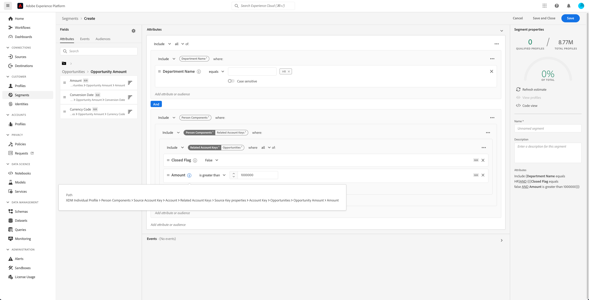

# Real-time Customer Data Platform B2B版的分段用例

本文档提供了Adobe Real-time Customer Data Platform B2B Edition中的区段定义示例，以及如何为常见的B2B用例组合不同类型的属性。 要了解目标如何融入您的B2B工作流，请参阅 [端到端教程](../b2b-tutorial.md#create-a-segment-to-evaluate-your-data).

>[!NOTE]
>
>这些分段用例所需的属性仅适用于Real-time Customer Data Platform B2B Edition客户。 如果您没有使用Real-time Customer Data Platform B2B Edition，请参阅 [分段概述](./segmentation-overview.md) 中。

## 先决条件 {#prerequisites}

您必须先完成以下步骤，然后才能对B2B类使用分段属性：

1. 创建使用B2B类的架构。 B2B版本类包括Account 、 Campaign 、 Opportunity 、 Marketing List等。 有关 [如何设置用于B2B类的模式](../schemas/b2b.md) 请参阅架构文档。
1. 在您的体验数据模型(XDM)B2B架构之间创建关系。 基于B2B版属性的区段需要类之间的关系才能充分利用扩展的B2B分段功能。 请参阅 [如何定义两个B2B模式之间的关系](../../xdm/tutorials/relationship-b2b.md) 以了解更多信息。
1. 使用基于B2B模式的数据集摄取数据。 请参阅的源文档 [有关如何摄取数据的信息](../../sources/connectors/adobe-applications/marketo/marketo.md).
1. 阅读 [区段生成器用户指南](../../segmentation/ui/segment-builder.md) ，以获取有关如何构建区段的更详细指南。

满足这些要求后，您便可以将这些属性组合到常用的B2B用例中。

## 快速入门 {#getting-started}

在B2B类的并集架构建立关系并用于摄取数据后，区段生成器的左边栏中便会提供其属性。

B2B类及其属性会附加一个 `B2B` 标签，以区分区段工作区中的标准区段。

为了有效地为B2B用例创建区段，必须深入了解模式并了解数据模型的外观。 此外，了解数据从一个数据对象获取到另一个数据对象的路径也非常有用。

下图说明了Real-Time CDP B2B Edition中可用的B2B类之间的关系。

由于数据模型可能非常复杂，因此您可以使用Platform UI查看数据模型的更详细可视化表示形式，以帮助查找用例的相关属性。 要开始，请转到Platform UI并在左侧导航中选择架构。

从可用列表中选择相应的架构，然后从 [!UICONTROL 组合物] 边栏。 在以下示例中，选择“人员”关系会显示当前架构中引用相关“人员”架构的属性（如果它是关系中的源架构），或者“人员”架构引用（如果它是关系中的引用架构）。

通过使用 `Key` 文件夹，如下图所示。

请参阅 [Real-time Customer Data Platform B2B版文档中的模式](../schemas/b2b.md) 以了解有关可用B2B类的更多信息。

下面的用例提供了有关哪些类用于在不同模式之间建立关系以实现这些结果的信息。 这些示例可帮助您创建自己的区段。

## 不同分段用例的示例 {#use-cases}

以下用例可用于使用B2B Edition进行分段。 每个示例都提供了区段功能的描述以及用于创建区段的类的描述。 提供的图像会突出显示 [!UICONTROL 属性] 侧边栏，用于反映架构的结构。 的 [!UICONTROL 区段属性] 部分包含区段属性的书面划分。

### 示例1:为B2B机会寻找“决策者” {#find-decision-maker}

找到所有机会的“决策者”。 此区段需要在 [!UICONTROL XDM个人配置文件] 类和 [!UICONTROL XDM业务机会人员关系] 类。

### 示例2:查找以特定金额分配给业务机会的B2B用户档案 {#find-opportunities-amount}

查找直接分配到任何机会的人员，其中机会金额大于给定金额（100万美元）。 此区段需要在 [!UICONTROL XDM个人配置文件] 类， [!UICONTROL XDM业务机会人员关系] 类和 [!UICONTROL XDM业务机会] 类。

### 示例3:查找按位置分配给业务机会的B2B用户档案 {#find-opportunities-location}

查找直接分配到帐户位于给定位置的任何业务机会的所有人员（加拿大）。 此区段需要在 [!UICONTROL XDM个人配置文件] 类， [!UICONTROL XDM业务机会人员关系] 类， [!UICONTROL XDM业务机会] 类和 [!UICONTROL XDM业务帐户] 类。

### 示例4:根据行业和浏览行为寻找机会的“决策者” {#find-industry-browsing-behavior}

查找帐户位于“金融”行业的任意机会的“决策者”，并在最近三天访问定价页面的所有人员。 此区段需要在 [!UICONTROL XDM个人配置文件] 类， [!UICONTROL XDM业务机会人员关系] 类， [!UICONTROL XDM业务机会] 类和 [!UICONTROL XDM业务帐户] 类和 [!UICONTROL XDM ExperienceEvent] 类。

### 示例5:按部门名称和机会金额查找B2B用户档案，以查找机会 {#find-department-opportunity-amount}

查找在人力资源部（人力资源部）工作并且与任何具有至少一个机会（价值100万美元）或更高金额的帐户相关的所有人员。 此区段需要在 [!UICONTROL XDM个人配置文件] 类， [!UICONTROL XDM业务帐户] 类和 [!UICONTROL XDM业务机会] 类。

### 示例6:按职务和年度帐户收入查找B2B用户档案 {#find-by-job-title-and-revenue}

查找所有职位为副总裁且与任何年收入达到指定金额（1亿美元）或更高的帐户相关的人员，并在上个月至少访问了定价页面3次。 此区段需要在 [!UICONTROL XDM个人配置文件] 类， [!UICONTROL XDM业务帐户] 类和 [!UICONTROL XDM ExperienceEvent] 类。

### 示例7:按机会状态和浏览行为查找“决策者” {#find-by-opportunity-status-and-browsing-behavior}

查找所有属于任何已关闭的销售机会的“决策者”，并在上周访问定价页面。 此区段需要在 [!UICONTROL XDM个人配置文件] 类， [!UICONTROL XDM业务机会人员关系] 类， [!UICONTROL XDM业务机会] 类和 [!UICONTROL XDM ExperienceEvent] 类。

### 示例8:使用相关帐户扩展分段范围 {#related-accounts}

查找在人力资源(HR)部门工作并与任何帐户相关的所有人员 *或任何一个帐户的相关帐户* 至少有一个机会，价值达到规定数额（100万美元）或更多。 此区段需要在 [!UICONTROL XDM个人配置文件] 类， [!UICONTROL XDM业务帐户] 类和 [!UICONTROL XDM业务机会] 类。

### 示例9:使用潜在客户得分和/或帐户得分确定用户档案的资格 {#account-scoring}

查找潜在客户得分超过80的所有用户档案。

## 后续步骤 {#next-steps}

阅读此概述后，您现在可以了解使用Real-Time CDP B2B Edition提供的分段可能性。 有关Segmentation Service的更多信息，请阅读 [分段文档](../../segmentation/home.md).
