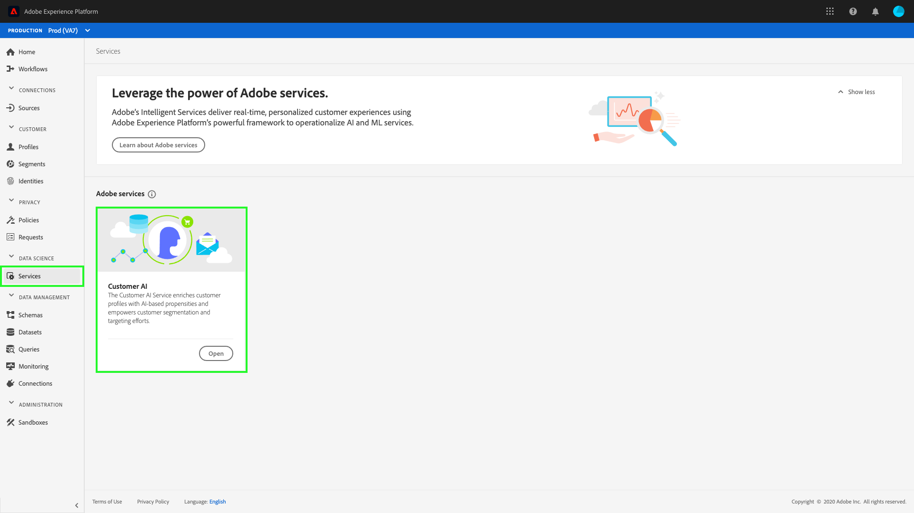

# [!DNL Real-Time Customer Data Platform]中的[!DNL Segmentation Service]

[!DNL Adobe Real-Time Customer Data Platform] (Real-Time CDP)允许您从多个来源引入数据，以便为客户提供协调一致的体验。 可使用Adobe Experience Platform的[!DNL Segmentation Service]部分实现相关的个性化营销活动。

Real-Time CDP构建于Adobe Experience Platform之上，并利用了[!DNL Experience Platform]中的许多服务和功能。 使用[!DNL Segmentation Service]，您可以将客户划分为具有相似特征的较小组，从而提供量身定制的营销。

## 区段

分段是定义由配置文件存储中的配置文件子集共享的特定属性或行为的过程，以区分可营销的人员组和您的客户群。 例如，在名为“您是否忘记购买运动鞋？”的电子邮件促销活动中，您可能希望受众包含在最近30天内搜索跑鞋但未完成购买的所有用户。 通过使用不同的区段定义，您可以专注于各种受众，从而提供更加定制的营销体验。

## [!DNL Audience Builder]

[!DNL Platform]允许您轻松创建和访问区段定义，并使用不同的构建基块来进一步表示受众的特性。 有关如何使用Audience Builder的详细信息，请阅读[Audience Builder指南](./audience-builder.md)。

## 客户人工智能

Real-Time Customer Data Platform附带的Customer AI为您提供了在个人层面生成客户预测并提供解释的能力。

在影响因素的帮助下，客户人工智能可以告诉您客户可能会做什么以及为什么。 此外，您还可以从客户人工智能预测和洞察中受益，通过提供最合适的优惠和消息传递来个性化客户体验。 客户人工智能可以协助：

* 提供高准确度的客户倾向模型，以实现更强的分段和定位。
* 了解特定客户行为背后的影响因素和可能性。
* 为您的公司独特的用例和数据提供可自定义的选项。
* 利用客户倾向分数（如流失率和转化率）增强Real-time Customer Profile。
* 通过倾向分数的影响因素增强客户用户档案。
* 根据影响因素和倾向分数创建客户受众。

客户人工智能位于&#x200B;**[!UICONTROL Adobe服务]**&#x200B;下的&#x200B;**[!UICONTROL 服务]**&#x200B;选项卡中。

### Customer AI入门

要开始使用客户人工智能，您需要遵循[数据准备教程](../../intelligent-services/data-preparation.md)，并根据您的用例配置输入架构。 接下来，您需要[配置客户人工智能实例](../../intelligent-services/customer-ai/user-guide/configure.md)。 配置实例后，将生成一个模型，您可以在其中查看您的见解和得分[&#128279;](../../intelligent-services/customer-ai/user-guide/discover-insights.md)。 使用从模型生成的数据，您可以为数据驱动激活创建受众。

要了解有关客户人工智能的更多信息，请访问[客户人工智能概述](../../intelligent-services/customer-ai/overview.md)。 此外，以下视频展示了客户人工智能如何通过基于人工智能的倾向性丰富客户档案，并支持客户分段和定位工作。

>[!VIDEO](https://video.tv.adobe.com/v/328474/?quality=12&learn=on&captions=chi_hans)

## 后续步骤

阅读本概述后，您现在应该了解Real-Time CDP如何利用[!DNL Segmentation Service]来增强营销活动的自定义和个性化。 有关[!DNL Segmentation Service]的详细信息，请阅读[分段文档](../../segmentation/home.md)。
