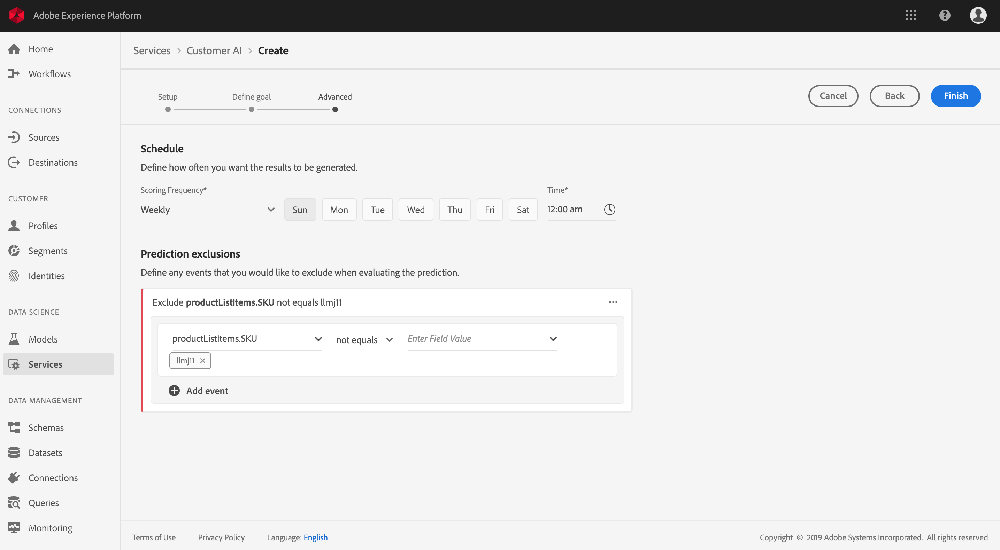

# 使用客户AI(alpha)预测客户倾向得分

>[!NOTE]
>本文档中概述的客户人工智能功能采用alpha。 文档和功能可能会发生更改。

Adobe Experience Platform中的客户人工智能由Adobe Sensei构建并提供支持，使您能生成自定义倾向得分，而无需担心机器学习方面的问题。

本教程介绍了使用Experience Platform用户界面与客户人工智能结合使用的步骤。 为下列主题提供了步骤：

* [配置实例](#configure-an-instance)
* [利用预测得分创建客户细分](#create-customer-segments-with-predicted-scores)

## 入门指南

本指南要求对使用客户AI时涉及的各种平台服务进行有效的了解。 在开始本教程之前，请查看以下文档：

* [实时客户档案概述](https://www.adobe.io/apis/experienceplatform/home/profile-identity-segmentation/profile-identity-segmentation-services.html#!api-specification/markdown/narrative/technical_overview/unified_profile_architectural_overview/unified_profile_architectural_overview.md)
* [分段服务概述](https://www.adobe.io/apis/experienceplatform/home/profile-identity-segmentation/profile-identity-segmentation-services.html#!api-specification/markdown/narrative/technical_overview/segmentation/segmentation-overview.md)
* [区段生成器用户指南](https://www.adobe.io/apis/experienceplatform/home/profile-identity-segmentation/profile-identity-segmentation-services.html#!api-specification/markdown/narrative/technical_overview/segmentation/segment-builder-guide.md)

## 配置实例

Experience Platform为客户提供了简单易用的Adobe Sensei服务，可针对不同的用例进行配置。 以下各节提供了配置客户AI实例的步骤。

### 设置实例

在平台UI中，单击左 **侧导航** 中的“服务”。 出现 **服务浏览器** ，显示您可以使用的所有可用服务。 在客户AI的容器中，单击“打 **开”**。

“客 *户AI* ”屏幕显示所有现有客户AI实例。 单击“ **创建实例**”。

将出现实例创建工作流，从“设置”( *Setup* )步骤开始。

以下是关于必须为实例提供的值的重要信息：

* 实例的名称将用于显示客户AI得分的所有位置。 因此，名称应描述预测得分代表什么，例如“取消杂志订阅的可能性”。

* 倾向类型决定得分和度量极性的目的。 您可以选择“ **客户流失** ”或 **“转化**”。

* 数据源引用用于预测得分的输入数据集。 根据设计，客户人工智能使用消费者体验事件数据来计算倾向得分。 从下拉选择器中选择数据集时，将仅列出与客户AI兼容的数据集。

* 默认情况下，将为所有配置文件生成倾向得分，除非指定符合条件的人群。 您可以通过定义条件来根据事件包含或排除配置文件来指定合格人群。

提供所需的值，然后单击“下 **一步”**。

### 定义目标

将显 *示定义目标* ，该步骤为您提供一个交互式环境以可视化地定义目标。 目标由一个或多个事件组成，其中每个事件的发生基于它所拥有的条件。 客户人工智能实例的目标是确定在给定时间范围内实现其目标的可能性。

单击 **输入字段名称** ，然后从下拉列表中选择一个字段。 单击第二个输入，为事件的条件选择一个子句，然后提供目标值以完成该事件。 可通过单击“添加事件”来配置 **其他事件**。 最后，通过应用以天为单位的预测时间帧来完成目标，然后单击“下 **一步”**。

### 配置计划 *（可选）*

将显 *示高级* 步骤。 此可选步骤允许您配置计划以自动执行预测运行，定义预测排除以过滤某些事件，或者单击 **Finish** （如果不需要）。

通过配置评分频率设置 *评分计划*。 可以计划每周或每月运行自动预测运行。

在计划配置下，您可以定义预测排除，以防止在生成分数时评估满足特定条件的事件。 此功能可用于过滤掉不相关的数据输入。

要排除某些事件，请单 **击“添加排除** ”，然后按与定义目标相同的方式定义事件。 要删除排除项，请单击事件容器右上角的省略号(**...**)，然后单击 **删除容器**。

根据需要排除事件，然后单击 **完成** ，以创建实例。

如果实例创建成功，将立即触发预测运行，随后的预测运行将根据您定义的计划执行。

>   **注意：** 根据输入数据的大小，预测运行最长可能需要24小时。

按照本节所述，您配置了客户AI的实例，并执行了预测运行。 成功完成测试后，得分的洞察会自动将Profiles与预测分数加水。 请等待24小时，然后继续本教程的下一节。

## 利用预测得分创建客户细分

当预测运行完成时，预测倾向得分会由配置文件自动消耗。 通过丰富客户AI得分，可以创建基于倾向得分的客户细分。 本节提供了使用区段生成器创建区段的步骤。 有关创建区段的更强大的教程，请参阅“区 [段生成器”用户指南](https://www.adobe.io/apis/experienceplatform/home/profile-identity-segmentation/profile-identity-segmentation-services.html#!api-specification/markdown/narrative/technical_overview/segmentation/segment-builder-guide.md)。

在平台UI中，单击左侧导 **航中的** “区段”，然后单击 **创建区段**。

此时将 *显示“区段生成器* ”。 在左侧的 *Fields* （字段）列中，在Attributes（属性）选项卡 *下，单击名为* XDM Individual Profile **** （XDM个人配置文件）的文件夹，然后单击单位命名空间所在的文件夹。 名为 **Customer AI的文件夹包含预测运行的结果** ，并以得分所属的实例命名。 单击并访问所需实例的结果。

位于区段生成器中心，将“分数”属性拖放 **到规则***生成器画布上以定义规则* 。

在右侧的区 *段属性列* ，选择合并策 *略* ，并为区段提供名称，然后单击保 **存** ，以创建区段。

## 后续步骤

通过本教程，您已成功配置了客户AI的一个实例，生成了倾向得分，并使用“区段生成器”创建了由倾向得分强制实施的区段。 激活后的目标现在可以使用您的客户细分来定位受众。 有关详细 [信息，请参阅](../destinations/destinations-overview.md) “目标”概述。
