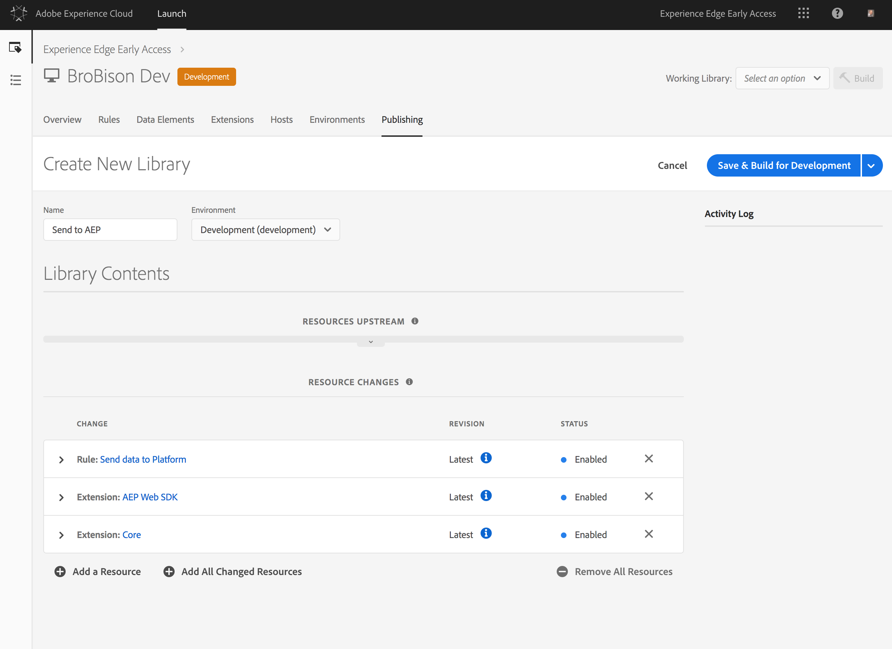

# 教程：通过Adobe启动实施网站标记

本教程介绍如何使用Adobe启动实施网站标签以将数据发送到Adobe Experience Platform。

## 先决条件

* 必要的模式和数据集在中创建 [!DNL Platform]。
* 必要的配置已部署在Experience Edge中，且具有匹配的配置ID和Edge域。
* 公司CMS已配置为在每个页面上传送一个JavaScript对象，其中包含您需要发送到平台的数据。

## 步骤

本教程包含以下步骤：

1. 安装Adobe Experience Platform [!DNL Web SDK] 扩展。
1. 创建规则，告诉 [!DNL Launch] 要发送的数据。
1. 捆绑库中的扩展和规则。

## 安装Adobe Experience Platform扩 [!DNL Web SDK] 展

首先，安装Adobe Experience Platform [!DNL Web SDK] 扩展。

1. In [!DNL Launch], open the **[!UICONTROL Extensions]** tab.

   

1. 从“启动扩展目录”中选择“Adobe Experience PlatformWeb SDK扩展”。此时将打开配置屏幕。

   

   有关详细信息，请参 [阅文档](https://docs.adobe.com/content/help/en/launch/using/reference/manage-resources/extensions/overview.html) 中的 [!DNL Launch] 扩展。

1. 配置扩展.

   您现在需要的唯一设置是：

   * **配置ID:** 指定您从Adobe代表处获得的配置ID。
   * **边缘域：** 指定您从Adobe代表处获得的边缘域。

1. 单击 **[!UICONTROL “保存]** ”，然后继续执行下一步。

## 创建规则，告诉 [!DNL Launch] 要发送的数据

接下来，创建一条规 [!DNL Launch] 则，告诉您要发送哪些数据到Adobe Experience Platform以及何时发送。

1. 在“规 **[!UICONTROL 则]** ”选项卡下，配置一个事件，该将在库加载时在网站的每个新页面上触 [!DNL Launch] 发。

   

1. 添加操作.

   要配置操作，请告 [!DNL Launch] 诉数据层的位置。 数据层是页面上存在的一个JavaScript对象，它通过呈现网页的同一CMS提供。 提供数据对象的JavaScript路径。

   

   您发送的模式对象必须是有效的XDM，它将对连接到您的配置ID的数据集所使用的数据进行验证。

1. 单击 **[!UICONTROL Keep Changes]**.

有关详细信息，请参 [阅文档](https://docs.adobe.com/content/help/zh-Hans/launch/using/reference/manage-resources/rules.html) 中的 [!DNL Launch] 规则。

## 捆绑库中的扩展和规则

然后， [将扩展和新规](https://docs.adobe.com/content/help/zh-Hans/launch/using/reference/publish/overview.html) 则捆绑到库中，并在开发环境中测试这些更改。

完成测试后，通过工作流提升库，以便将其部署到生产站点。 数据现在从每个用户流向Adobe Experience Platform。

有关详细信息，请参 [阅文档](https://docs.adobe.com/content/help/zh-Hans/launch/using/reference/publish/libraries.html) 中的 [!DNL Launch] 库。