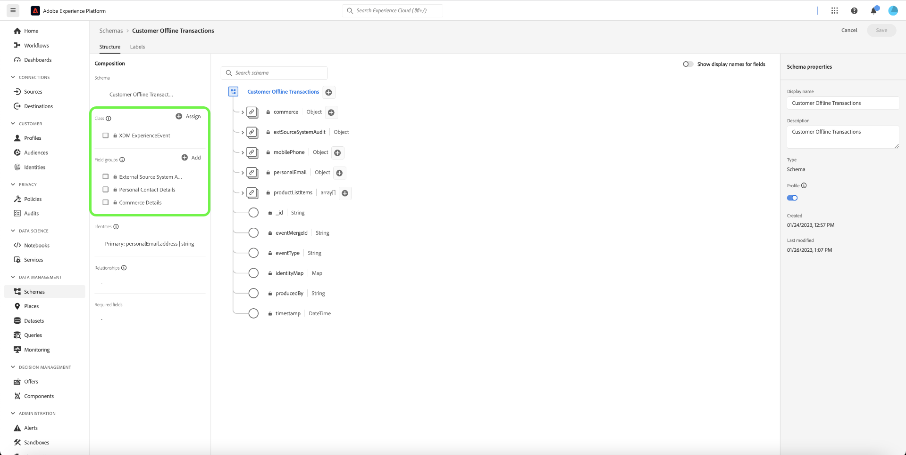
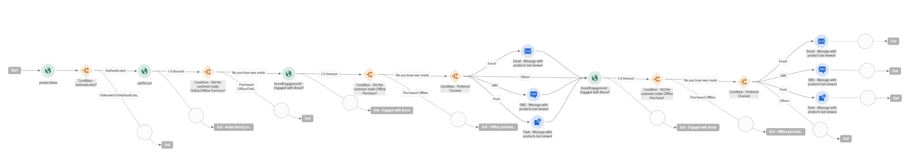
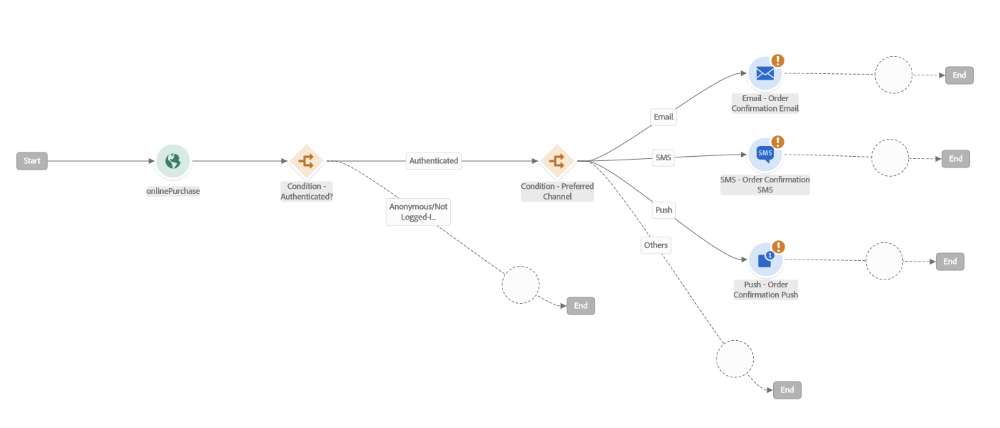

# 智能地重新吸引您的客户以返回

智能重新参与允许您设置量身定制的跨渠道点滴活动，以说服客户执行特定操作。 推介活动旨在以有限的时间运行，包括发送显示意图电子邮件、短信的客户，以及提供付费广告。 客户采取相应措施后，推介活动将立即结束。

## 先决条件和规划 {#prerequisites-and-planning}

在完成实现用例的步骤后，您将使用以下 Real-Time CDP 功能和 UI 元素（按使用顺序列出）。确保您拥有所有这些区域所需的基于属性的访问控制权限，或让系统管理员授予您这些必要的权限。

* [Adobe Real-time Customer Data Platform (Real-Time CDP)](https://experienceleague.adobe.com/docs/platform-learn/tutorials/rtcdp/understanding-the-real-time-customer-data-platform.html)  — 跨数据源聚合数据以推动营销活动。 然后，使用此数据来创建营销活动受众，并在电子邮件和Web促销活动磁贴中使用的表面个性化数据元素（例如，姓名或帐户相关信息）。 CDP还用于通过电子邮件和Web(通过Adobe Target)激活受众。
   * [架构](/help/xdm/home.md)
   * [用户档案](/help/profile/home.md)
   * [数据集](/help/catalog/datasets/overview.md)
   * [受众](/help/segmentation/home.md)
   * [Adobe Journey Optimizer](https://experienceleague.adobe.com/docs/journey-optimizer/using/orchestrate-journeys/journey.html)
   * [目标](/help/destinations/home.md)
   * [事件或受众触发器](https://experienceleague.adobe.com/docs/journey-optimizer/using/offer-decisioning/collect-event-data/data-collection.html)
   * [受众/事件](https://experienceleague.adobe.com/docs/journey-optimizer/using/audiences-profiles-identities/audiences/about-audiences.html)
   * [历程操作](https://experienceleague.adobe.com/docs/journey-optimizer/using/orchestrate-journeys/journey.html)

### 如何实现该用例：大致概述 {#achieve-the-use-case-high-level}

目前已经开发了三种不同的重新接触历程。

>[!BEGINTABS]

>[!TAB 重新参与历程]

重新参与历程定位网站和应用程序上放弃的产品浏览。 当已查看但未购买产品或未将产品添加到购物车时，会触发此历程。 如果过去24小时内没有列表添加，则会在三天后触发品牌互动。

1. 数据通过边缘网络（首选方法）聚合到Web SDK、Mobile SDK或边缘网络API摄取中。
2. 作为 **客户**，您将创建标记为以下项的数据集： [!UICONTROL 个人资料].
3. 作为 **客户**，您可以将配置文件加载到Real-Time CDP中，并构建治理策略以确保负责任地使用。
4. 作为 **客户**，则可以从用户档案列表构建重点受众以检查 **用户** 在过去三天中实现了品牌互动。
5. 作为 **客户**，您将在Adobe Journey Optimizer中创建重新参与历程。
6. 如果需要，请使用 **数据合作伙伴** 用于将受众激活到所需的付费媒体目标。
7. Adobe Journey Optimizer会检查同意情况并发送所配置的各种操作。

>[!TAB 已放弃的购物车历程]

放弃的购物车历程面向已放入购物车但尚未在网站和应用程序上购买的产品。 此外，付费媒体营销活动也将使用此方法启动和停止。

1. 数据通过边缘网络（首选方法）聚合到Web SDK、Mobile SDK或边缘网络API摄取中。
2. 作为 **客户**，您将创建标记为以下项的数据集： [!UICONTROL 个人资料].
3. 作为 **客户**，您可以将配置文件加载到Real-Time CDP中，并构建治理策略以确保负责任地使用。
4. 作为 **客户**，则可以从用户档案列表构建重点受众以检查 **用户** 已将商品放入购物车，但尚未完成购买。 此 **[!UICONTROL 添加到购物车]** 事件将启动等待30分钟的计时器，然后检查是否购买。 如果未购买任何产品，则 **用户** 已添加到 **[!UICONTROL 放弃购物车]** 受众。
5. 作为 **客户**，则将在Adobe Journey Optimizer中创建放弃的购物车旅程
6. 如果需要，请使用 **数据合作伙伴** 用于将受众激活到所需的付费媒体目标。
7. Adobe Journey Optimizer会检查同意情况并发送所配置的各种操作。

>[!TAB 订单确认历程]

订单确认历程侧重于通过网站和移动设备应用程序进行的产品购买。

1. 数据通过边缘网络（首选方法）聚合到Web SDK、Mobile SDK或边缘网络API摄取中。
2. 作为 **客户**，您将创建标记为以下项的数据集： [!UICONTROL 个人资料].
3. 作为 **客户**，您可以将配置文件加载到Real-Time CDP中，并构建治理策略以确保负责任地使用。
4. 作为 **客户**，则可以从用户档案列表构建重点受众以检查 **用户** 已经购买了。
5. 作为 **客户**，则将在Adobe Journey Optimizer中创建确认历程。
6. Adobe Journey Optimizer使用首选渠道发送订单确认消息。

>[!ENDTABS]

## 如何实现用例：分步说明 {#step-by-step-instructions}

要完成上述高级概述中的每个步骤，请阅读以下各节，其中提供了指向更多信息和更详细说明的链接。

### 您将使用的 UI 功能和元素 {#ui-functionality-and-elements}

在您完成实施用例的步骤后，您将使用本文档开头列出的Real-Time CDP功能和UI元素。 确保您拥有所有这些区域所需的基于属性的访问控制权限，或让系统管理员授予您这些必要的权限。

### 创建架构设计并指定字段组

体验数据模型(XDM)资源在中管理 [!UICONTROL 架构] Adobe Experience Platform中的工作区。 您可以查看和浏览由Adobe提供的核心资源，并为您的组织创建自定义资源和架构。

<!--
To create a schema, complete the steps below:

1. Navigate to **[!UICONTROL Data Management]** > **[!UICONTROL Schemas]** and select **[!UICONTROL Create schema]**.
2. Select **[!UICONTROL XDM Individual Profile]/[!UICONTROL XDM ExperienceEvent]**.
3. Navigate to **[!UICONTROL Field groups]** and select **[!UICONTROL Add]**.
4. Use the search box to find and select the field group, then select **[!UICONTROL Add field groups]**.
5. Give your schema a name and optionally a description.
6. Select **[!UICONTROL Save]**.

 
-->

有关创建架构的更多信息，请参阅 [创建架构教程。](/help/xdm/tutorials/create-schema-ui.md)

有四种架构设计用于重新参与历程。 每个架构都需要设置特定的字段，以及一些强烈建议的字段。

#### 客户属性架构

客户属性架构由 [!UICONTROL XDM个人资料] 类，包括以下字段组：

+++个人联系人详细信息（字段组）

[个人联系人详细信息](/help/xdm/field-groups/profile/personal-contact-details.md) 是XDM Individual Profile类的标准架构字段组，用于描述个人的联系信息。

| 字段 | 要求 | 描述 |
| --- | --- | --- |
| mobilePhone.number | 必需 | 用于短信的人员的手机号码。 |
| personalEmail.address | 必需 | 人员的电子邮件地址。 |

+++

+++人口统计详细信息（字段组）

[人口统计详细信息](/help/xdm/field-groups/profile/demographic-details.md) 是XDM Individual Profile类的标准架构字段组。 字段组提供了一个根级别的人员对象，其子字段描述有关个人的信息。

| 字段 | 要求 |
| --- | --- |
| person.name.firstName | 建议 |
| person.name.lastName | 建议 |

+++

+++外部源系统审计详细信息（字段组）

[外部源系统审计属性](/help/xdm/data-types/external-source-system-audit-attributes.md) 是一个标准的体验数据模型(XDM)数据类型，可捕获有关外部源系统的审核详细信息。

+++

+++同意和偏好设置字段组（字段组）

[同意和偏好设置](/help/xdm/field-groups//profile/consents.md) 字段组提供单个对象类型的字段“同意”，以捕获同意和偏好设置信息。

| 字段 | 要求 |
| --- | --- |
| consents.marketing.email.val | 必需 |
| consents.marketing.preferred | 必需 |
| consents.marketing.push.val | 必需 |
| consents.marketing.sms.val | 必需 |
| consents.personalize.content.val | 必需 |
| consents.share.val | 必需 |

+++

+++配置文件测试详细信息（字段组）

此字段组用于最佳实践。

+++

<!--
 
-->

#### 客户数字交易模式

客户数字交易模式由 [!UICONTROL XDM ExperienceEvent] 类，包括以下字段组：

+++Adobe Experience Platform Web SDK ExperienceEvent（字段组）

| 字段 | 要求 |
| --- | --- |
| device.model | 建议 |
| environment.browserDetails.userAgent | 建议 |

+++

+++Web详细信息（字段组）

Web详细信息是XDM ExperienceEvent类的标准架构字段组，用于描述有关Web详细信息事件的信息，例如交互、页面详细信息和反向链接。

| 字段 | 要求 | 描述 |
| --- | --- | --- |
| web.webInteraction.linkClicks.id | 建议 | 与交互对应的Web链接或URL的ID。 |
| web.webInteraction.linkClicks.value | 建议 | 与交互相对应的Web链接或URL的点击次数。 |
| web.webInteraction.name | 建议 | 网页的名称。 |
| web.webInteraction.URL | 建议 | 网页的URL。 |
| web.webPageDetails.name | 建议 | 发生Web交互的网页的名称。 |
| web.webPageDetails.URL | 建议 | 发生Web交互的网页的URL。 |
| web.webReferrer.URL | 建议 | 描述Web交互的反向链接，即在记录当前Web交互之前，访客所使用的URL。 |

+++

+++使用者体验事件（字段组）

| 字段 | 要求 |
| --- | --- |
| commerce.cart.cartID | 建议 |
| commerce.cart.cartSource | 建议 |
| commerce.cartAbandons.id | 建议 |
| commerce.cartAbandons.value | 建议 |
| commerce.order.orderType | 建议 |
| commerce.order.payments.paymentAmount | 建议 |
| commerce.order.payments.paymentType | 建议 |
| commerce.order.payments.transactionID | 建议 |
| commerce.order.priceTotal | 建议 |
| commerce.order.purchaseID | 建议 |
| commerce.productListAdds.id | 建议 |
| commerce.productListAdds.value | 建议 |
| commerce.productListOpens.id | 建议 |
| commerce.productListOpens.value | 建议 |
| commerce.productListRemoval.id | 建议 |
| commerce.productListRemoval.value | 建议 |
| commerce.productListViews.id | 建议 |
| commerce.productListViews.value | 建议 |
| commerce.productViews.id | 建议 |
| commerce.productViews.value | 建议 |
| commerce.purchases.id | 建议 |
| commerce.purchases.value | 建议 |
| marketing.campaignGroup | 建议 |
| marketing.campaignName | 建议 |
| marketing.trackingCode | 建议 |
| productListItems.name | 建议 |
| productListItems.priceTotal | 建议 |
| productListItems.product | 建议 |
| productListItems.quantity | 建议 |

+++

+++最终用户ID详细信息（字段组）

| 字段 | 要求 | 描述 |
| --- | --- | --- |
| endUserIDs._experience.emailid.authenticatedState | 必需 | 最终用户电子邮件地址ID已验证状态。 |
| endUserIDs._experience.emailid.id | 必需 | 最终用户电子邮件地址ID。 |
| endUserIDs._experience.emailid.namespace.code | 必需 | 最终用户电子邮件地址ID命名空间代码。 |
| endUserIDs._experience.mcid.authenticatedState | 必需 | Adobe Marketing Cloud ID (MCID)身份验证状态。 MCID现在称为Experience CloudID (ECID)。 |
| endUserIDs._experience.mcid.id | 必需 | Adobe Marketing Cloud ID (MCID)。 MCID现在称为Experience CloudID (ECID)。 |
| endUserIDs._experience.mcid.namespace.code | 必需 | Adobe Marketing Cloud ID (MCID)命名空间代码。 |

+++

+++类值（字段组）

| 字段 | 要求 |
| --- | --- |
| 事件类型 | 必需 |
| timestamp | 必需 |

+++

+++外部源系统审计详细信息（字段组）

外部源系统审核属性是一种标准的体验数据模型(XDM)数据类型，可捕获有关外部源系统的审核详细信息。

+++

<!--
 
-->

#### 客户离线交易架构

客户离线交易架构由 [!UICONTROL XDM ExperienceEvent] 类，包括以下字段组：

+++商业详细信息（字段组）

| 字段 | 要求 | 描述 |
| --- | --- | --- |
| commerce.cart.cartID | 必需 | 购物车的ID。 |
| commerce.order.orderType | 必需 | 描述产品订单类型的对象。 |
| commerce.order.payments.paymentAmount | 必需 | 描述产品订单付款金额的对象。 |
| commerce.order.payments.paymentType | 必需 | 描述产品订单付款类型的对象。 |
| commerce.order.payments.transactionID | 必需 | 对象产品订单交易记录ID。 |
| commerce.order.purchaseID | 必需 | 对象产品订单采购ID。 |
| productListItems.name | 必需 | 表示客户选择的产品的物料名称列表。 |
| productListItems.priceTotal | 必需 | 表示客户选择的产品的项目列表总价。 |
| productListItems.product | 必需 | 选定的产品。 |
| productListItems.quantity | 必需 | 表示客户选择的产品的物料列表的数量。 |

+++

+++个人联系人详细信息（字段组）

| 字段 | 要求 | 描述 |
| --- | --- | --- |
| mobilePhone.number | 必需 | 用于短信的人员的手机号码。 |
| personalEmail.address | 必需 | 人员的电子邮件地址。 |

+++

+++类值（字段组）

| 字段 | 要求 |
| --- | --- |
| 事件类型 | 必需 |
| timestamp | 必需 |

+++

+++外部源系统审计详细信息（字段组）

外部源系统审核属性是一种标准的体验数据模型(XDM)数据类型，可捕获有关外部源系统的审核详细信息。

+++

<!--
 
-->

#### Web连接器架构Adobe

AdobeWeb连接器架构由 [!UICONTROL XDM ExperienceEvent] 类，包括以下字段组：

+++Adobe Analytics ExperienceEvent模板（字段组）

| 字段 | 要求 | 描述 |
| --- | --- | --- |
| web.webInteraction.linkClicks.id | 建议 | 与交互对应的Web链接或URL的ID。 |
| web.webInteraction.linkClicks.value | 建议 | 与交互相对应的Web链接或URL的点击次数。 |
| web.webInteraction.name | 建议 | 网页的名称。 |
| web.webInteraction.URL | 建议 | 网页的URL。 |
| web.webPageDetails.name | 建议 | 发生Web交互的网页的名称。 |
| web.webPageDetails.URL | 建议 | 发生Web交互的网页的URL。 |
| web.webReferrer.URL | 建议 | 描述Web交互的反向链接，即在记录当前Web交互之前，访客所使用的URL。 |
| commerce.cart.cartID | 建议 | |
| commerce.cart.cartSource | 建议 | |
| commerce.cartAbandons.id | 建议 | |
| commerce.cartAbandons.value | 建议 | |
| commerce.order.orderType | 建议 | |
| commerce.order.payments.paymentAmount | 建议 | |
| commerce.order.payments.paymentType | 建议 | |
| commerce.order.payments.transactionID | 建议 | |
| commerce.order.priceTotal | 建议 | |
| commerce.order.purchaseID | 建议 | |
| commerce.productListAdds.id | 建议 | |
| commerce.productListAdds.value | 建议 | |
| commerce.productListOpens.id | 建议 | |
| commerce.productListOpens.value | 建议 | |
| commerce.productListRemoval.id | 建议 | |
| commerce.productListRemoval.value | 建议 | |
| commerce.productListViews.id | 建议 | |
| commerce.productListViews.value | 建议 | |
| commerce.productViews.id | 建议 | |
| commerce.productViews.value | 建议 | |
| commerce.purchases.id | 建议 | |
| commerce.purchases.value | 建议 | |
| marketing.campaignGroup | 建议 | |
| marketing.campaignName | 建议 | |
| marketing.trackingCode | 建议 | |
| productListItems.name | 建议 | |
| productListItems.priceTotal | 建议 | |
| productListItems.product | 建议 | |
| productListItems.quantity | 建议 | |
| endUserIDs._experience.emailid.authenticatedState | 必需 | 最终用户电子邮件地址ID已验证状态。 |
| endUserIDs._experience.emailid.id | 必需 | 最终用户电子邮件地址ID。 |
| endUserIDs._experience.emailid.namespace.code | 必需 | 最终用户电子邮件地址ID命名空间代码。 |
| endUserIDs._experience.mcid.authenticatedState | 必需 | Adobe Marketing Cloud ID (MCID)身份验证状态。 MCID现在称为Experience CloudID (ECID)。 |
| endUserIDs._experience.mcid.id | 必需 | Adobe Marketing Cloud ID (MCID)。 MCID现在称为Experience CloudID (ECID)。 |
| endUserIDs._experience.mcid.namespace.code | 必需 | Adobe Marketing Cloud ID (MCID)命名空间代码。 |

+++

+++类值（字段组）

| 字段 | 要求 |
| --- | --- |
| 事件类型 | 必需 |
| timestamp | 必需 |

+++

+++外部源系统审计详细信息（字段组）

外部源系统审核属性是一种标准的体验数据模型(XDM)数据类型，可捕获有关外部源系统的审核详细信息。

+++

<!--
 
-->

### 从架构创建数据集

数据集是一组数据的存储和管理结构，通常是具有字段（行）和架构（列）的表。 智能重新参与历程的每个架构都将有一个数据集。

有关如何从架构创建数据集的更多信息，请参阅 [数据集UI指南](/help/catalog/datasets/user-guide.md).
<!-- 
To create a dataset from a schema, complete the steps below:

1. Navigate to **[!UICONTROL Data Management]** > **[!UICONTROL Datasets]** and select **[!UICONTROL Create dataset]**.
2. Select **[!UICONTROL Create dataset from schema]**.
3. Select the relevant re-engagement schema you created.
4. Give your dataset a name and optionally a description.
5. Select **[!UICONTROL Finish]**.

-->

>[!NOTE]
>
>与创建架构的步骤类似，您需要启用要包含在实时客户档案中的数据集。 有关启用数据集以在Real-time Customer Profile中使用的更多信息，请参阅 [创建架构教程。](/help/xdm/tutorials/create-schema-ui.md#profile).

<!-- 

-->

### 隐私、同意和数据治理

#### 同意政策

>[!IMPORTANT]
>
>为客户提供取消订阅以停止从品牌接收通信的功能是一项法律要求，并且要确保遵循此选择。 在 [Experience Platform 文档](https://experienceleague.adobe.com/docs/experience-platform/privacy/regulations/overview.html)中进一步了解适用的法规。

在创建重新接触路径时，必须考虑并使用以下同意政策：

* 如果consents.marketing.email.val = &quot;Y&quot; ，则可以发送电子邮件
* 如果consents.marketing.sms.val = &quot;Y&quot; ，则可以使用短信
* 如果consents.marketing.push.val = &quot;Y&quot; ，则可以推送
* 如果consents.share.val = &quot;Y&quot; ，则可以通告
* 需要由客户实施定义

#### DULE标签和实施

个人电子邮件地址用作直接可识别数据，用于识别或联系特定个人而不是设备。

* personalEmail.address = I1

#### 营销策略

重新接触历程不需要其他营销政策，但应根据需要考虑以下内容：

* 限制敏感数据
* 限制现场广告
* 限制电子邮件定位
* 限制跨站点定位
* 限制将直接可识别的数据与匿名数据相结合

### 创建受众

<!--
To create an audience, complete the steps below:

1. Navigate to **[!UICONTROL Customer]** > **[!UICONTROL Audiences]** and select **[!UICONTROL Create audience]**.
2. Select **[!UICONTROL Build rule]** and select **[!UICONTROL Create]**.
3. Navigate to **[!UICONTROL Field]** and select **[!UICONTROL Events]** tab.
4. Navigate or use the search box to find the event type, then drag this to the builder. Finally add event rules by dragging event types.
5. Give your schema a name and optionally a description.
6. Select **[!UICONTROL Save]**.

-->

#### 品牌重新参与历程的受众创建

重新参与历程使用受众来定义由配置文件存储中的配置文件子集共享的特定属性或行为，以将可销售的人员组与客户群区分开来。 在Adobe Experience Platform上可以通过两种不同的方式创建受众：直接构成受众，或通过Platform派生的区段定义。

有关如何直接构建受众的更多信息，请参阅 [受众合成UI指南](/help/segmentation/ui/audience-composition.md).

有关如何通过Platform派生的区段定义构建受众的更多信息，请参阅 [Audience Builder UI指南](/help/segmentation/ui/segment-builder.md).

>[!BEGINTABS]

>[!TAB 重新参与历程]

以下事件用于重新参与历程，其中用户在线查看了产品，并且在未来24小时内未添加到购物车，随后的3天内没有品牌参与。

包括至少具有1个EventType = ProductViews事件的受众，然后具有至少1个事件，其中（EventType不等于commerce.productListAdds）并且在过去24小时内发生，然后3天后没有在其中发生（EventType = application.launch或web.webpagedetails.pageViews或commerce.purchases）并且在过去2天内发生的任何事件。

<!--
 
-->

>[!TAB 已放弃的购物车历程]

以下事件适用于将产品添加到购物车，但在过去24小时内未完成购买或清除购物车的用户档案。

Include EventType = commerce.productListAdds介于30分钟和1440分钟之间。
排除EventType = commerce.purchases此时提前30分钟，或者EventType = commerce.productListRemovals和购物车ID等于产品列表Adds1购物车ID（包含事件）。

<!--
 
-->

>[!ENDTABS]

### Adobe Journey Optimizer中的历程设置

>[!NOTE]
>
>Adobe Journey Optimizer不包含本页顶部的图中显示的所有内容。 所有付费媒体广告均创建于 [!UICONTROL 目标].

Adobe Journey Optimizer可帮助您为客户提供互联、情境式和个性化的体验。 客户历程是客户与品牌互动的整个过程。 每个用例可以有各种不同的历程，每个历程都需要特定信息。 下面列出了每个历程分支所需的精确数据。

>[!BEGINTABS]

>[!TAB 重新参与历程]

<!--
 
-->

+++活动

* 产品查看次数
   * 架构：客户数字交易
   * 字段:
      * 事件类型
   * 条件:
      * 事件类型= commerce.productViews
      * 字段:
         * Commerce.productViews.id
         * Commerce.productViews.value
         * 事件类型
         * identityMap.authenticatedState
         * identityMap.id
         * identityMap.primary
         * productListItems.SKU
         * productListItems.currencyCode
         * productListItems.name
         * productListItems.priceTotal
         * productListItems.product
         * productListItems.productImageUrl
         * productListItems.quantity
         * timestamp
         * endUserIDs._experience.emailid.authenticatedState
         * endUserIDs._experience.emailid.id
         * endUserIDs._experience.emailid.namespace.code
         * _id

* 添加到购物车
   * 架构：客户数字交易
   * 字段:
      * 事件类型
   * 条件:
      * 事件类型= commerce.productListAdds
      * 字段:
         * Commerce.productListAdds.id
         * Commerce.productListAdds.value
         * 事件类型
         * identityMap.authenticatedState
         * identityMap.id
         * identityMap.primary
         * productListItems.SKU
         * productListItems.currencyCode
         * productListItems.name
         * productListItems.priceTotal
         * productListItems.product
         * productListItems.productImageUrl
         * productListItems.quantity
         * timestamp
         * commerce.cart.cartID
         * endUserIDs._experience.emailid.authenticatedState
         * endUserIDs._experience.emailid.id
         * endUserIDs._experience.emailid.namespace.code
         * _id

* 品牌互动
   * 架构：客户数字交易
   * 字段:
      * 事件类型
   * 条件:
      * application.launch、commerce.purchases、web.webpagedetails.pageViews中的EventType
      * 字段:
         * 事件类型
         * identityMap.authenticatedState
         * identityMap.id
         * identityMap.primary
         * productListItems.SKU
         * productListItems.currencyCode
         * productListItems.name
         * productListItems.priceTotal
         * productListItems.product
         * productListItems.productImageUrl
         * productListItems.quantity
         * timestamp
         * web.webpagedetails.URL
         * web.webpagedetails.isHomePage
         * web.webpagedetails.name
         * endUserIDs._experience.emailid.authenticatedState
         * endUserIDs._experience.emailid.id
         * endUserIDs._experience.emailid.namespace.code
         * _id
         * Commerce.purchases.id
         * Commerce.purchases.value
         * shipping.address.city
         * shipping.address.countryCode
         * shipping.address.postalCode
         * shipping.address.state
         * shipping.address.street1
         * shipping.address.street2
         * shipping.shipDate
         * shipping.trackingNumber
         * shipping.trackingURL

+++

+++密钥历程逻辑

* 历程条目逻辑
   * 产品查看事件

* 条件
   * 检查自上次查看产品以来是否至少有一个在线或离线购买事件。
      * 架构：客户数字交易
      * eventType = commerce.purchases
      * timestamp >上次查看产品的时间戳

   * 检查自上次查看产品以来是否至少有一次离线购买：
      * 架构：客户离线交易v.1
      * eventType = commerce.purchases
      * timestamp >上次查看产品的时间戳

   * 条件 — 选择Target渠道
      * 电子邮件
         * consents.marketing.email.val = y
      * 推送
         * consents.marketing.push.val=y
      * 短信
         * consents.marketing.sms.val = y

   * 渠道个性化
      * 基于产品视图的个性化渠道内容。

+++

>[!TAB 已放弃的购物车历程]

<!--
 
-->

+++活动

* 添加到购物车
   * 架构：客户数字交易
   * 字段:
      * 事件类型
   * 条件:
      * 事件类型= commerce.productListAdds
      * 字段:
         * Commerce.productListAdds.id
         * Commerce.productListAdds.value
         * 事件类型
         * identityMap.authenticatedState
         * identityMap.id
         * identityMap.primary
         * productListItems.SKU
         * productListItems.currencyCode
         * productListItems.name
         * productListItems.priceTotal
         * productListItems.product
         * productListItems.productImageUrl
         * productListItems.quantity
         * timestamp
         * commerce.cart.cartID
         * endUserIDs._experience.emailid.authenticatedState
         * endUserIDs._experience.emailid.id
         * endUserIDs._experience.emailid.namespace.code
         * _id

* 在线购买
   * 架构：客户数字交易
   * 字段:
      * 事件类型
   * 条件:
      * 事件类型= commerce.purchases
      * 字段:
         * Commerce.purchases.id
         * Commerce.purchases.value
         * 事件类型
         * identityMap.authenticatedState
         * identityMap.id
         * identityMap.primary
         * productListItems.SKU
         * productListItems.currencyCode
         * productListItems.name
         * productListItems.priceTotal
         * productListItems.product
         * productListItems.productImageUrl
         * productListItems.quantity
         * timestamp
         * endUserIDs._experience.emailid.authenticatedState
         * endUserIDs._experience.emailid.id
         * endUserIDs._experience.emailid.namespace.code
         * _id

* 品牌互动
   * 架构：客户数字交易
   * 字段:
      * 事件类型
   * 条件:
      * application.launch、commerce.purchases、web.webpagedetails.pageViews中的EventType
      * 字段:
         * 事件类型
         * identityMap.authenticatedState
         * identityMap.id
         * identityMap.primary
         * productListItems.SKU
         * productListItems.currencyCode
         * productListItems.name
         * productListItems.priceTotal
         * productListItems.product
         * productListItems.productImageUrl
         * productListItems.quantity
         * timestamp
         * web.webpagedetails.URL
         * web.webpagedetails.isHomePage
         * web.webpagedetails.name
         * endUserIDs._experience.emailid.authenticatedState
         * endUserIDs._experience.emailid.id
         * endUserIDs._experience.emailid.namespace.code
         * _id
         * Commerce.purchases.id
         * Commerce.purchases.value
         * shipping.address.city
         * shipping.address.countryCode
         * shipping.address.postalCode
         * shipping.address.state
         * shipping.address.street1
         * shipping.address.street2
         * shipping.shipDate
         * shipping.trackingNumber
         * shipping.trackingURL

+++

+++密钥历程逻辑

* 历程条目逻辑
   * AddToCart事件

* AuthenticatedState处于已验证状态

* 条件：自上次放弃购物车以来的离线购买：
   * 架构：客户离线交易v.1
   * eventType = commerce.purchases
   * 上次放弃购物车的时间戳>时间戳

* 条件：自上次放弃购物车以来已清除的购物车：
   * 架构：客户数字交易v.1
   * eventType = commerce.cartCleared
   * cartID（购物车的ID）
   * 上次放弃购物车的时间戳>时间戳

* 选择目标渠道（选择一个或多个渠道以扩大覆盖范围）
   * 电子邮件
      * consents.marketing.email.val = y
   * 推送
      * consents.marketing.push.val = y
   * 短信
      * consents.marketing.sms.val = y
   * 渠道个性化
      * 显示购物车详细信息，并且可以采用表格格式显示多个产品。

+++

>[!TAB 订单确认历程]

<!--
 
-->

+++活动

* 在线购买
   * 架构：客户数字交易
   * 字段:
      * 事件类型
   * 条件:
      * 事件类型= commerce.purchases
      * 字段:
         * Commerce.purchases.id
         * Commerce.purchases.value
         * 事件类型
         * identityMap.authenticatedState
         * identityMap.id
         * identityMap.primary
         * productListItems.SKU
         * productListItems.currencyCode
         * productListItems.name
         * productListItems.priceTotal
         * productListItems.product
         * productListItems.productImageUrl
         * productListItems.quantity
         * timestamp
         * endUserIDs._experience.emailid.authenticatedState
         * endUserIDs._experience.emailid.id
         * endUserIDs._experience.emailid.namespace.code
         * _id

+++

+++密钥历程逻辑

* 历程条目逻辑
   * 订购事件

* 条件
   * 选择目标渠道（选择一个或多个渠道以扩大范围）。
      * 订单确认本质上被视为正在服务，因此通常不需要检查同意。
      * 电子邮件
      * 推送
      * 短信

   * 渠道内容个性化
      * 显示订单详细信息，并可使用表格格式显示产品列表。

+++

>[!ENDTABS]

有关在中创建历程的更多信息 [Adobe Journey Optimizer]，阅读 [历程指南快速入门](https://experienceleague.adobe.com/docs/journey-optimizer/using/orchestrate-journeys/journey.html).

### 在目标中设置付费媒体广告

目标框架用于付费媒体广告。 检查同意后，它将发送到配置的各种目标。 例如，直邮、电子邮件等。

#### 目标所需的数据

流式区段导出目标(例如Facebook、Google Customer Match、Google DV360)支持客户数据的各种身份：

* `personalEmail.address`
* `ECID`
* `mobilePhone.number`

放弃购物车区段正在流式传输，因此目标框架可用于此用例。

* 流/触发
   * [广告](/help/destinations/catalog/advertising/overview.md)/[付费媒体与社交](/help/destinations/catalog/social/overview.md)
   * [移动设备](/help/destinations/catalog/mobile-engagement/overview.md)
   * [流目标](/help/destinations/catalog/streaming/http-destination.md)
   * [自定义Destination SDK](/help/destinations/destination-sdk/overview.md)

* 每三小时发送一次文件/计划
   * [电子邮件营销](/help/destinations/catalog/email-marketing/overview.md)
