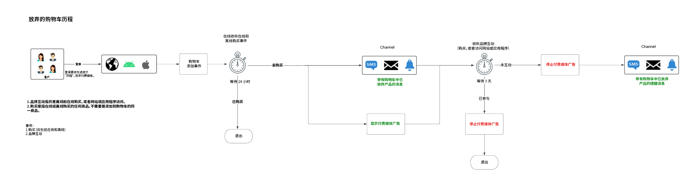
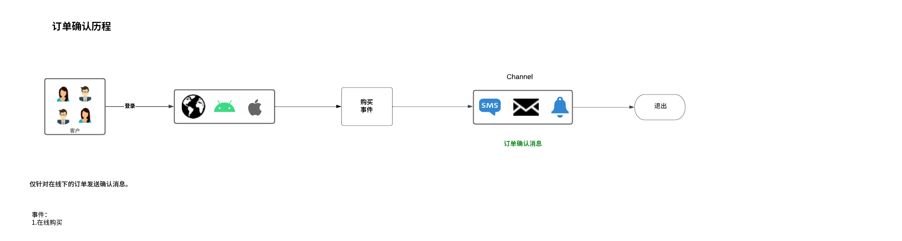

# 以智能的方式重新吸引客户回归

>[!NOTE]
>
>这是一个实施示例，本页中的示例（如区段语法）只是示例。 由于您的实施可能存在差异，因此您应该使用示例作为指南。

以明智和负责任的方式重新吸引放弃转化的客户。 通过体验吸引失效的客户，以提高转化率并增加客户存留期值。

采用实时考虑内容，考虑消费者的所有品质和行为，并根据线上和线下事件快速提供重新资格筛选。

以下是Real-Time CDP和Journey Optimizer各个组件的高级架构视图。 此图显示了数据如何流经两个Experience Platform应用程序，从数据收集到通过历程或营销活动激活到目标的点，以实现本页面上描述的使用案例。

## 用例概述 {#overview}

您将在处理重新参与方案示例时构建架构、数据集和受众。 您还会在 [!DNL Adobe Journey Optimizer] 中发现设置示例历程所需的功能，以及在目标内创建付费媒体广告所需的功能。本指南使用了重新吸引客户参与下面概述的用例历程的示例：

* **放弃的产品浏览方案** — 已放弃在网站和移动设备应用程序上浏览产品的目标客户。
* **放弃的购物车方案** — 将产品放入购物车但尚未在网站和移动设备应用程序上购买的目标客户。
* **订单确认方案** — 侧重于通过网站和移动设备应用程序进行的产品购买。

## 先决条件和规划 {#prerequisites-and-planning}

在您完成实施用例的步骤后，您将使用以下Real-Time CDP和Adobe Journey Optimizer功能（按使用顺序列出）。 确保您拥有所有这些区域所需的[基于属性的访问控制权限](/help/access-control/home.md)，或让系统管理员授予您这些必要的权限。

* [[!DNL Adobe Real-Time Customer Data Platform (Real-Time CDP)]](https://experienceleague.adobe.com/docs/platform-learn/tutorials/rtcdp/understanding-the-real-time-customer-data-platform.html)——跨数据源集成数据，以推动活动。然后，该数据可用于创建活动受众，并显示电子邮件和网络促销图块中使用的个性化数据元素（例如，姓名或与帐户相关的信息）。CDP 还可用于通过电子邮件和网络激活受众（通过 [!DNL Adobe Target]）。
   * [架构](/help/xdm/home.md)
   * [轮廓](/help/profile/home.md)
   * [数据集](/help/catalog/datasets/overview.md)
   * [受众](/help/segmentation/home.md)
   * [[!DNL Adobe Journey Optimizer]](https://experienceleague.adobe.com/docs/journey-optimizer/using/orchestrate-journeys/journey.html)
   * [目标](/help/destinations/home.md)

* [[!DNL Adobe Journey Optimizer]](https://experienceleague.adobe.com/docs/journey-optimizer-learn/tutorials/introduction-to-journey-optimizer/introduction.html?lang=zh-Hans) — 帮助您为客户提供互联、情境式和个性化的体验。
   * [事件或受众触发器](https://experienceleague.adobe.com/docs/journey-optimizer/using/offer-decisioning/collect-event-data/data-collection.html)
   * [受众/事件](https://experienceleague.adobe.com/docs/journey-optimizer/using/audiences-profiles-identities/audiences/about-audiences.html)
   * [历程操作](https://experienceleague.adobe.com/docs/journey-optimizer/using/orchestrate-journeys/journey.html)

## 如何实现用例 {#achieve-use-case-instruction}

以下是三个示例重新接触方案的高级概述。

>[!BEGINTABS]

>[!TAB 放弃的产品浏览方案]

弃用的产品浏览场景定位在网站和移动设备应用程序上弃用的产品浏览。 当已查看但未购买产品或未将产品添加到购物车时，会触发此场景。 在此示例中，如果过去24小时内没有列表添加，则会在三天后触发品牌互动。
{width="1920" zoomable="yes"}

1. 您可以创建架构和数据集，然后为[!UICONTROL 配置文件]启用。
2. 您可以通过Web SDK、Mobile SDK或API将数据摄取到Experience Platform。 也可以使用Analytics Source Connector，但可能会导致旅程延迟。
3. 您可以摄取其他启用配置文件的数据，该数据可以通过身份图链接到经过身份验证的Web和移动应用程序访客。
4. 您从轮廓列表中构建重点受众，以检查&#x200B;**客户**&#x200B;是否在过去三天内参与了活动。
5. 您在[!DNL Adobe Journey Optimizer]中创建放弃的产品浏览历程。
6. 如果需要，请与&#x200B;**数据合作伙伴**&#x200B;合作，以将受众激活到所需的付费媒体目标。
7. [!DNL Adobe Journey Optimizer] 检查是否同意，并发送配置的各种操作。

>[!TAB 放弃的购物车方案]

“放弃的购物车”方案适用于以下情况：产品已放入购物车，但尚未在网站和移动设备应用程序上购买。 此外，付费媒体活动可以使用此方法启动和停止。
{width="1920" zoomable="yes"}

1. 您创建架构和数据集，为[!UICONTROL 配置文件]启用。
2. 您可以通过Web SDK、Mobile SDK或API将数据摄取到Experience Platform。 也可以使用Analytics Source Connector，但可能会导致旅程延迟。
3. 您可以摄取其他启用配置文件的数据，该数据可以通过身份图链接到经过身份验证的Web和移动应用程序访客。
4. 您从轮廓列表中建立重点受众，以检查&#x200B;**客户**&#x200B;是否已将商品放入购物车，但尚未完成购买。**[!UICONTROL 添加到购物车]**&#x200B;事件会启动一个等待 30 分钟的计时器，然后检查购买情况。如果没有购买，那么该&#x200B;**客户**&#x200B;会被添加到&#x200B;**[!UICONTROL 放弃的购物车]**&#x200B;受众中。
5. 您在 [!DNL Adobe Journey Optimizer] 中创建一个放弃的购物车之历程。
6. 如果需要，请与&#x200B;**数据合作伙伴**&#x200B;合作，以将受众激活到所需的付费媒体目标。
7. [!DNL Adobe Journey Optimizer] 检查是否同意，并发送配置的各种操作。

>[!TAB 订单确认方案]

订单确认方案侧重于通过网站和移动设备应用程序进行的产品购买。
{width="1920" zoomable="yes"}

1. 您可以创建架构和数据集，然后为[!UICONTROL 配置文件]启用。
2. 您可以通过Web SDK、Mobile SDK或API将数据摄取到Experience Platform。 也可以使用Analytics Source Connector，但可能会导致旅程延迟。
3. 您可以摄取其他启用配置文件的数据，该数据可以通过身份图链接到经过身份验证的Web和移动应用程序访客。
4. 您在 [!DNL Adobe Journey Optimizer] 中创建一个确认历程。
5. [!DNL Adobe Journey Optimizer] 会使用首选渠道发送订购确认消息。

>[!ENDTABS]

要完成上述高级概述中的每个步骤，请通读以下部分，其中提供了更多信息和更详细说明的链接。

### 创建架构并指定字段组 {#schema-design}

体验数据模型 (XDM) 资源在 [!DNL Adobe Experience Platform] 的[!UICONTROL “架构”]工作区中进行管理。您可以查看和浏览[!DNL Adobe]提供的核心资源（例如字段组），并为您的组织创建自定义资源和架构。

有关创建[架构](/help/xdm/home.md)的详细信息，请参阅[创建架构教程。](/help/xdm/tutorials/create-schema-ui.md)和[使用XDM对您的客户体验数据进行建模](https://experienceleague.adobe.com/docs/courses/using/experienceplatform-d-1-2021-1-xdm.html)。

有四种用于重新参与用例的架构设计。每个架构都需要设置特定的字段。 您需要启用架构以包含在Real-time Customer Profile中。 有关启用架构以在Real-time Customer Profile中使用的详细信息，请阅读[为Real-time Customer Profile启用架构](/help/xdm/ui/resources/schemas.md#enable-a-schema-for-real-time-customer-profile)。

#### 客户属性架构

此架构用于构建和引用构成客户信息的轮廓数据。此数据通常通过您的CRM或类似系统摄取到[!DNL Adobe Experience Platform]，并且是引用用于个性化、营销同意和增强受众功能的客户详细信息所必需的。

客户属性架构由 [[!UICONTROL XDM 个人轮廓]](/help/xdm/classes/individual-profile.md)类表示，该类包括以下字段组：

+++个人联系方式（字段组）

[个人联系方式](/help/xdm/field-groups/profile/personal-contact-details.md)是 XDM 个人轮廓类的标准架构字段组，它描述了个人的联系信息。

| 字段 | 描述 |
| --- | --- |
| `mobilePhone.number` | 此人的手机号码，该号码会用于短信。 |
| `personalEmail.address` | 此人的电子邮件地址。 |

+++

+++外部源系统审计详细信息（字段组）

[外部来源系统审计属性](/help/xdm/data-types/external-source-system-audit-attributes.md)是一种标准体验数据模型 (XDM) 数据类型，用于捕获有关外部来源系统的审核详细信息。

+++

+++同意和偏好设置字段组（字段组）

[同意和偏好设置](/help/xdm/field-groups//profile/consents.md)字段组提供单个对象类型字段“同意”，用于捕获同意和偏好设置信息。

| 字段 | 要求 |
| --- | --- |
| `consents.marketing.email.val` | 必需 |
| `consents.marketing.preferred` | 必需 |
| `consents.marketing.push.val` | 必需 |
| `consents.marketing.sms.val` | 必需 |
| `consents.personalize.content.val` | 必需 |
| `consents.share.val` | 必需 |

+++

+++轮廓测试详细信息（字段组）

此字段组允许您使用测试用户档案在发布历程之前测试历程。 有关创建测试配置文件的详细信息，请阅读[创建测试配置文件教程](https://experienceleague.adobe.com/docs/journeys/using/building-journeys/about-journey-building/creating-test-profiles.html)和[测试历程教程](https://experienceleague.adobe.com/docs/journeys/using/building-journeys/testing-the-journey.html)。

+++

#### 客户数字交易架构

此架构用于构建和引用构成您的客户活动的事件数据，这些活动发生在您的网站或关联的数字平台上。 此数据通常通过[Web SDK](/help/web-sdk/home.md)摄取到[!DNL Adobe Experience Platform]，并且是引用各种浏览和转化事件所必需的，这些事件用于触发历程、详细的在线客户分析、增强的受众功能和个性化消息传递。

客户数字交易架构由[[!UICONTROL XDM ExperienceEvent]](/help/xdm/classes/experienceevent.md)类表示。

+++XDM ExperienceEvent（类）

[[!UICONTROL XDM ExperienceEvent]](/help/xdm/classes/experienceevent.md)类包含以下字段组：

| 字段 | 描述 |
| --- | --- |
| `_id` | 唯一标识引入[!DNL Adobe Experience Platform]的单个事件。 |
| `timestamp` | 事件发生时间的ISO 8601时间戳，按照RFC 3339第5.6节进行格式设置。此时间戳必须发生在过去。 |
| `eventType` | 指示事件类别类型的字符串。 |

+++

+++最终用户 ID 详细信息（字段组）

[最终用户ID详细信息](/help/xdm/field-groups/event/enduserids.md)字段组用于在多个Adobe应用程序中描述个人的身份信息。

| 字段 | 描述 |
| --- | --- |
| `endUserIDs._experience.emailid.authenticatedState` | 最终用户电子邮件地址 ID 已验证状态。 |
| `endUserIDs._experience.emailid.id` | 最终用户电子邮件地址 ID。 |
| `endUserIDs._experience.emailid.namespace.code` | 最终用户电子邮件地址 ID 命名空间代码。 |
| `endUserIDs._experience.mcid.authenticatedState` | [!DNL Adobe] Marketing Cloud ID (MCID) 已验证状态。MCID 现在称为 Experience Cloud ID (ECID)。 |
| `endUserIDs._experience.mcid.id` | [!DNL Adobe] Marketing Cloud ID (MCID). MCID 现在称为 Experience Cloud ID (ECID)。 |
| `endUserIDs._experience.mcid.namespace.code` | [!DNL Adobe] Marketing Cloud ID (MCID) 命名空间代码。 |

+++

+++商务详细信息（字段组）

[Commerce详细信息](/help/xdm/field-groups/event/commerce-details.md)字段组用于描述商业数据，如产品信息（SKU、名称、数量）和标准购物车操作（订购、结帐、放弃）。

| 字段 | 描述 |
| --- | --- |
| `commerce.cart.cartID` | 购物车的 ID。 |
| `commerce.order.orderType` | 描述产品订购类型的对象。 |
| `commerce.order.payments.paymentAmount` | 描述产品订购付款金额的对象。 |
| `commerce.order.payments.paymentType` | 描述产品订购付款类型的对象。 |
| `commerce.order.payments.transactionID` | 对象产品订单交易 ID。 |
| `commerce.order.purchaseID` | 对象产品订单购买 ID。 |
| `productListItems.name` | 代表客户选择的产品的项目名称列表。 |
| `productListItems.priceTotal` | 代表客户选择的产品的项目列表的总价。 |
| `productListItems.product` | 所选择的产品。 |
| `productListItems.quantity` | 代表客户选择的产品的项目列表的数量。 |

+++

+++外部源系统审计详细信息（字段组）

外部来源系统审计属性是一种标准体验数据模型 (XDM) 数据类型，用于捕获有关外部来源系统的审核详细信息。

+++

#### 客户离线交易架构

此架构用于构建和引用构成您的网站之外的平台上发生的客户活动的事件数据。此数据通常从POS（或类似系统）摄取到[!DNL Adobe Experience Platform]中，并且通常通过API连接流式传输到Experience Platform中。 其目的是引用各种离线转化事件，用于触发历程、深度在线和离线客户分析、增强受众功能和个性化消息传递。

客户离线交易架构由[[!UICONTROL XDM ExperienceEvent]](/help/xdm/classes/experienceevent.md)类表示。

+++XDM ExperienceEvent（类）

[[!UICONTROL XDM ExperienceEvent]](/help/xdm/classes/experienceevent.md)类包含以下字段组：

| 字段 | 描述 |
| --- | --- |
| `_id` | 唯一标识引入[!DNL Adobe Experience Platform]的单个事件。 |
| `timestamp` | 事件发生时间的ISO 8601时间戳，按照RFC 3339第5.6节进行格式设置。此时间戳必须发生在过去。 |
| `eventType` | 指示事件类别类型的字符串。 |

+++

+++商务详细信息（字段组）

[Commerce详细信息](/help/xdm/field-groups/event/commerce-details.md)字段组用于描述商业数据，如产品信息（SKU、名称、数量）和标准购物车操作（订购、结帐、放弃）。

| 字段 | 描述 |
| --- | --- |
| `commerce.cart.cartID` | 购物车的 ID。 |
| `commerce.order.orderType` | 描述产品订购类型的对象。 |
| `commerce.order.payments.paymentAmount` | 描述产品订购付款金额的对象。 |
| `commerce.order.payments.paymentType` | 描述产品订购付款类型的对象。 |
| `commerce.order.payments.transactionID` | 对象产品订单交易 ID。 |
| `commerce.order.purchaseID` | 对象产品订单购买 ID。 |
| `productListItems.name` | 代表客户选择的产品的项目名称列表。 |
| `productListItems.priceTotal` | 代表客户选择的产品的项目列表的总价。 |
| `productListItems.product` | 所选择的产品。 |
| `productListItems.quantity` | 代表客户选择的产品的项目列表的数量。 |

+++

+++个人联系方式（字段组）

[个人联系方式](/help/xdm/field-groups/profile/personal-contact-details.md)是 XDM 个人轮廓类的标准架构字段组，它描述了个人的联系信息。

| 字段 | 描述 |
| --- | --- |
| `mobilePhone.number` | 此人的手机号码，该号码会用于短信。 |
| `personalEmail.address` | 此人的电子邮件地址。 |

+++

+++外部源系统审计详细信息（字段组）

外部来源系统审计属性是一种标准体验数据模型 (XDM) 数据类型，用于捕获有关外部来源系统的审核详细信息。

+++

#### Adobe Web 连接器架构

>[!NOTE]
>
>如果您使用的是 [[!DNL Adobe Analytics Source Connector]](/help/sources/connectors/adobe-applications/analytics.md)，则这是一个可选的实施。

此架构用于构建和引用构成您的客户活动的事件数据，这些活动发生在您的网站或关联的数字平台上。 此架构类似于“客户数字交易”架构，但不同之处在于，此架构旨在于[Web SDK](/help/web-sdk/home.md)不是数据收集选项时使用；因此，当您利用[!DNL Adobe Analytics Source Connector]将在线数据作为主数据流或辅助数据流发送到[!DNL Adobe Experience Platform]时，需要此架构。

[!DNL Adobe] Web连接器架构由[[!UICONTROL XDM ExperienceEvent]](/help/xdm/classes/experienceevent.md)类表示。

+++XDM ExperienceEvent（类）

[[!UICONTROL XDM ExperienceEvent]](/help/xdm/classes/experienceevent.md)类包含以下字段组：

| 字段 | 描述 |
| --- | --- |
| `_id` | 唯一标识引入[!DNL Adobe Experience Platform]的单个事件。 |
| `timestamp` | 事件发生时间的ISO 8601时间戳，按照RFC 3339第5.6节进行格式设置。此时间戳必须发生在过去。 |
| `eventType` | 指示事件类别类型的字符串。 |

+++

+++Adobe Analytics ExperienceEvent 模板（字段组）

[Adobe Analytics ExperienceEvent](/help/xdm/field-groups/event/analytics-full-extension.md)字段组捕获Adobe Analytics收集的常见量度。

| 字段 | 描述 |
| --- | --- |
| `endUserIDs._experience.emailid.authenticatedState` | 最终用户电子邮件地址 ID 已验证状态。 |
| `endUserIDs._experience.emailid.id` | 最终用户电子邮件地址 ID。 |
| `endUserIDs._experience.emailid.namespace.code` | 最终用户电子邮件地址 ID 命名空间代码。 |
| `endUserIDs._experience.mcid.authenticatedState` | [!DNL Adobe] Marketing Cloud ID (MCID) 已验证状态。MCID 现在称为 Experience Cloud ID (ECID)。 |
| `endUserIDs._experience.mcid.id` | [!DNL Adobe] Marketing Cloud ID (MCID). MCID 现在称为 Experience Cloud ID (ECID)。 |
| `endUserIDs._experience.mcid.namespace.code` | [!DNL Adobe] Marketing Cloud ID (MCID) 命名空间代码。 |

+++

+++外部源系统审计详细信息（字段组）

外部来源系统审计属性是一种标准体验数据模型 (XDM) 数据类型，用于捕获有关外部来源系统的审核详细信息。

+++

### 从架构创建数据集 {#create-datasets}

数据集是对一组数据的存储和管理结构。智能重新参与方案的每个架构应具有自己的数据集。

有关如何从架构创建[数据集](/help/catalog/datasets/overview.md)的更多信息，请阅读[数据集 UI 指南。](/help/catalog/datasets/user-guide.md)。

>[!NOTE]
>
>与架构创建步骤类似，您需要使数据集包含在实时客户轮廓中。有关启用数据集以在Real-time Customer Profile中使用的更多信息，请参阅有关[将数据引入Real-time Customer Profile](https://experienceleague.adobe.com/docs/platform-learn/tutorials/profiles/bring-data-into-the-real-time-customer-profile.html?lang=zh-Hans)的教程。

### 同意和数据治理 {#privacy-consent}

>[!IMPORTANT]
>
>向客户提供取消订阅以停止从品牌接收通信的功能，以及确保遵循此选择是一项法律要求。 通过[隐私法规概述](https://experienceleague.adobe.com/docs/experience-platform/privacy/regulations/overview.html)了解有关适用法律的更多信息。

#### 同意政策

创建重新参与路径时，请考虑添加以下[同意策略](https://experienceleague.adobe.com/docs/platform-learn/data-collection/web-sdk/consent/overview.html)：

* 如果 `consents.marketing.email.val = "Y"`，则可以发送电子邮件
* 如果 `consents.marketing.sms.val = "Y"`，则可以发送短信
* 如果 `consents.marketing.push.val = "Y"`，则可以推送
* 如果 `consents.share.val = "Y"`，则可以发布广告

#### 数据治理标签和实施

创建重新参与路径时，请考虑添加以下[数据管理标签](/help/data-governance/labels/overview.md)：

* 个人电子邮件地址会被用作直接可识别数据，该数据会用来识别或联系特定个人而不是设备。
   * `personalEmail.address = I1`

#### 数据使用策略

弃用的产品浏览方案不需要[数据使用策略](/help/data-governance/policies/overview.md)。 但是，您应该考虑以下事项：

* 限制敏感数据
* 限制现场广告
* 限制电子邮件定位
* 限制跨站点定位
* 限制将直接可识别数据与匿名数据相结合

### 创建受众 {#create-audience}

重新参与方案使用受众来定义由配置文件存储中的配置文件子集共享的特定属性或行为，以将可销售的人员组与客户群区分开来。 可以在[!DNL Adobe Experience Platform]中以多种方式创建受众。

有关如何创建受众的更多信息，请阅读[受众服务UI指南](https://experienceleague.adobe.com/docs/experience-platform/segmentation/ui/overview.html#create-audience)。

有关如何直接组成[受众](/help/segmentation/home.md)的更多信息，请参阅[受众组合 UI 指南。](/help/segmentation/ui/audience-composition.md)

有关如何通过Experience Platform派生的受众定义构建受众的更多信息，请参阅[受众生成器UI指南](/help/segmentation/ui/segment-builder.md)。

>[!BEGINTABS]

>[!TAB 放弃的产品浏览方案]

创建此受众是为了增强经典的“放弃购物车”场景。虽然放弃购物车通常侧重于在特定时间段内将产品添加到购物车而后没有购买的情况，但此类受众会寻找更早的参与，特别是那些可能浏览过特定产品但没有将其添加到购物车中，并且在特定时间范围内没有在您的网站上进行后续活动的人。这些受众有助于让符合此纳入标准的客户“优先考虑”您的品牌，也可以用于数字属性可能与传统电子商务模型不同的客户。

+++过去三天中无预订的弃用产品视图

以下事件适用于已放弃的产品浏览场景，其中用户在线查看了产品，并且在随后的3天内没有参与（网站访问、应用程序访问、在线购买、离线购买和添加到购物车事件）。

设置此受众时需要以下字段和条件：

* `eventType: commerce.productViews`
* 和`THEN` （连续事件）排除`eventType: commerce.productListAdds`和`application.launch`以及`web.webpagedetails.pageViews`和`commerce.purchases`（这既包括在线又包括离线）
   * `Timestamp: > 3 days after productView`
* `Timestamp: > 4 days`

+++

+++最近三天参与的产品查看

以下事件适用于已放弃的产品浏览场景，其中用户在线查看了产品，并在接下来的3天内参与了（网站访问、应用程序访问、在线购买、离线购买和添加到购物车事件）。

设置此受众时需要以下字段和条件：

* `eventType: commerce.productViews`
* 且`THEN` （连续事件）包括`eventType: commerce.productListAdds`或`application.launch`或`web.webpagedetails.pageViews`或`commerce.purchases` （这既包括在线又包括离线）
   * `Timestamp: > 3 days after productView`
* `Timestamp: > 4 days`
+++

+++参与流在过去一天

以下事件用于过去1天内用户参与了（网站访问、应用程序访问、在线购买、离线购买和添加到购物车事件）的放弃的产品浏览方案。

设置此受众时需要以下字段和条件：

* `eventType: commerce.productListAdds OR application.launch OR web.webpagedetails.pageViews OR commerce.purchases`
   * `Timestamp: in last 1 day` （正在流式传输）

+++

+++过去三天的参与批次

以下事件用于过去3天内用户参与了（网站访问、应用程序访问、在线购买、离线购买和添加到购物车事件）的放弃的产品浏览方案。

设置此受众时需要以下字段和条件：

* `EventType: commerce.productListAdds OR application.launch OR web.webpagedetails.pageViews OR commerce.purchases`
   * `Timestamp: in last 3 days` （批次）

+++

>[!TAB 放弃的购物车方案]

创建此受众是为了支持经典的“放弃购物车”场景。其目的是找到将产品添加到购物车但最终没有进行购买的客户。这些受众不仅有助于让您的客户“优先考虑”您的品牌，而且还会优先考虑他们留下而没有后续购买的产品。

以下事件适用于放弃的购物车场景，即用户在1到4天前将产品添加到购物车，但未完成购买或清除购物车。

设置此受众时需要以下字段和条件：

* `eventType: commerce.productListAdds`
   * `Timestamp: >= 1 days before now AND <= 4 days before now `
* `eventType: commerce.purchases`
   * `Timestamp: <= 4 days before now`
* `eventType: commerce.productListRemovals`
   * `Timestamp: <= 4 days before now`

放弃的购物车方案的描述符显示为：

`Include eventType = commerce.productListAdds between 30 min and 1440 minutes before now. exclude eventType = commerce.purchases 30 minutes before now OR eventType = commerce.productListRemovals AND Cart ID equals Product List Adds1 Cart ID (the inclusion event).`

>[!TAB 订单确认方案]

这个历程不需要创建任何受众。

>[!ENDTABS]

### Adobe Journey Optimizer 中的历程设置 {#journey-setup}

>[!NOTE]
>
>[!DNL Adobe Journey Optimizer] 并不涵盖图中所示的所有内容。所有[付费媒体广告](/help/destinations/catalog/social/overview.md)均在[!UICONTROL 目标]中创建。

[[!DNL Adobe Journey Optimizer]](https://experienceleague.adobe.com/docs/journey-optimizer/using/orchestrate-journeys/journey.html) 可帮助您为客户提供贴合心意的、上下文和个性化的体验。客户历程是客户与品牌互动的整个过程。每个用例历程都需要特定的信息。下面列出了每个历程所需的精确数据。

>[!BEGINTABS]

>[!TAB 放弃的产品浏览方案]

弃用的产品浏览场景定位在网站和移动设备应用程序上弃用的产品浏览。
{width="1920" zoomable="yes"}

+++活动

事件允许您统一触发历程，向流入历程的个人实时发送消息。有关事件的详细信息，请阅读[常规事件指南](https://experienceleague.adobe.com/docs/journey-optimizer/using/orchestrate-journeys/about-journey-building/general-events.html)。

* 事件 1：产品查看次数
   * 架构：客户数字交易
   * 字段：
      * `eventType`
   * 条件：
      * `eventType = commerce.productViews`
      * 字段：
         * `eventType`
         * `productListItems.name`
         * `productListItems.priceTotal`
         * `productListItems.product`
         * `productListItems.productImageUrl`
         * `productListItems.quantity`
         * `timestamp`
         * `endUserIDs._experience.emailid.authenticatedState`
         * `endUserIDs._experience.emailid.id`
         * `endUserIDs._experience.emailid.namespace.code`
         * `_id`

* 事件 2：加入购物车
   * 架构：客户数字交易
   * 字段：
      * `eventType`
   * 条件：
      * `eventType = commerce.productListAdds`
      * 字段：
         * `commerce.productListAdds.id`
         * `commerce.productListAdds.value`
         * `eventType`
         * `identityMap.authenticatedState`
         * `identityMap.id`
         * `identityMap.primary`
         * `productListItems.SKU`
         * `productListItems.currencyCode`
         * `productListItems.name`
         * `productListItems.priceTotal`
         * `productListItems.product`
         * `productListItems.productImageUrl`
         * `productListItems.quantity`
         * `timestamp`
         * `commerce.cart.cartID`
         * `endUserIDs._experience.emailid.authenticatedState`
         * `endUserIDs._experience.emailid.id`
         * `endUserIDs._experience.emailid.namespace.code`
         * `_id`

* 事件 3：品牌参与
   * 架构：客户数字交易
   * 字段：
      * `eventType`
   * 条件：
      * `eventType in application.launch, commerce.purchases, web.webpagedetails.pageViews`
      * 字段：
         * `eventType`
         * `identityMap.authenticatedState`
         * `identityMap.id`
         * `identityMap.primary`
         * `productListItems.SKU`
         * `productListItems.currencyCode`
         * `productListItems.name`
         * `productListItems.priceTotal`
         * `productListItems.product`
         * `productListItems.productImageUrl`
         * `productListItems.quantity`
         * `timestamp`
         * `web.webpagedetails.URL`
         * `web.webpagedetails.isHomePage`
         * `web.webpagedetails.name`
         * `endUserIDs._experience.emailid.authenticatedState`
         * `endUserIDs._experience.emailid.id`
         * `endUserIDs._experience.emailid.namespace.code`
         * `_id`
         * `commerce.purchases.id`
         * `commerce.purchases.value`
         * `shipping.address.city`
         * `shipping.address.countryCode`
         * `shipping.address.postalCode`
         * `shipping.address.state`
         * `shipping.address.street1`
         * `shipping.address.street2`
         * `shipping.shipDate`
         * `shipping.trackingNumber`
         * `shipping.trackingURL`

+++

+++历程画布键逻辑

历程画布关键逻辑要求您识别特定事件并配置要在事件发生后执行的操作。

* 历程进入逻辑
   * 产品查看事件

* 条件
   * 检查自上次查看产品以来至少有一次在线或离线购买事件。
      * 架构：客户数字交易
      * `eventType = commerce.purchases`
      * `timestamp > timestamp of product last viewed`

   * 检查自上次查看产品以来至少有一次离线购买：
      * 架构：客户离线交易
      * `eventType = commerce.purchases`
      * `timestamp > timestamp of product last viewed`

   * 条件 - 选择目标渠道
      * 电子邮件
         * `consents.marketing.email.val = y`
      * 推送
         * `consents.marketing.push.val=y`
      * 短信
         * `consents.marketing.sms.val = y`

   * 渠道个性化
      * 基于产品查看情况的个性化渠道内容。

+++

>[!TAB 放弃的购物车方案]

弃用的购物车方案面向已放入购物车但尚未在网站和移动设备应用程序上购买的产品。
{width="1920" zoomable="yes"}

+++活动

事件允许您统一触发历程，向流入历程的个人实时发送消息。有关事件的详细信息，请阅读[常规事件指南](https://experienceleague.adobe.com/docs/journey-optimizer/using/orchestrate-journeys/about-journey-building/general-events.html)。

* 事件 2：加入购物车
   * 架构：客户数字交易
   * 字段：
      * `eventType`
   * 条件：
      * `eventType = commerce.productListAdds`
      * 字段：
         * `commerce.productListAdds.id`
         * `commerce.productListAdds.value`
         * `eventType`
         * `identityMap.authenticatedState`
         * `identityMap.id`
         * `identityMap.primary`
         * `productListItems.SKU`
         * `productListItems.currencyCode`
         * `productListItems.name`
         * `productListItems.priceTotal`
         * `productListItems.product`
         * `productListItems.productImageUrl`
         * `productListItems.quantity`
         * `timestamp`
         * `commerce.cart.cartID`
         * `endUserIDs._experience.emailid.authenticatedState`
         * `endUserIDs._experience.emailid.id`
         * `endUserIDs._experience.emailid.namespace.code`
         * `_id`

* 事件 4：在线购买
   * 架构：客户数字交易
   * 字段：
      * `eventType`
   * 条件：
      * `eventType = commerce.purchases`
      * 字段：
         * `commerce.purchases.id`
         * `commerce.purchases.value`
         * `eventType`
         * `identityMap.authenticatedState`
         * `identityMap.id`
         * `identityMap.primary`
         * `productListItems.SKU`
         * `productListItems.currencyCode`
         * `productListItems.name`
         * `productListItems.priceTotal`
         * `productListItems.product`
         * `productListItems.productImageUrl`
         * `productListItems.quantity`
         * `timestamp`
         * `endUserIDs._experience.emailid.authenticatedState`
         * `endUserIDs._experience.emailid.id`
         * `endUserIDs._experience.emailid.namespace.code`
         * `_id`

* 事件 3：品牌参与
   * 架构：客户数字交易
   * 字段：
      * `eventType`
   * 条件：
      * `eventType in application.launch, commerce.purchases, web.webpagedetails.pageViews`
      * 字段：
         * `eventType`
         * `identityMap.authenticatedState`
         * `identityMap.id`
         * `identityMap.primary`
         * `productListItems.SKU`
         * `productListItems.currencyCode`
         * `productListItems.name`
         * `productListItems.priceTotal`
         * `productListItems.product`
         * `productListItems.productImageUrl`
         * `productListItems.quantity`
         * `timestamp`
         * `web.webpagedetails.URL`
         * `web.webpagedetails.isHomePage`
         * `web.webpagedetails.name`
         * `endUserIDs._experience.emailid.authenticatedState`
         * `endUserIDs._experience.emailid.id`
         * `endUserIDs._experience.emailid.namespace.code`
         * `_id`
         * `commerce.purchases.id`
         * `commerce.purchases.value`
         * `shipping.address.city`
         * `shipping.address.countryCode`
         * `shipping.address.postalCode`
         * `shipping.address.state`
         * `shipping.address.street1`
         * `shipping.address.street2`
         * `shipping.shipDate`
         * `shipping.trackingNumber`
         * `shipping.trackingURL`

+++

+++历程画布键逻辑

历程画布关键逻辑要求您识别特定事件并配置要在事件发生后执行的操作。

* 历程进入逻辑
   * `AddToCart` 活动

* AuthenticatedState 已通过验证

* 条件：自上次放弃购物车以来离线购买：
   * 架构：客户离线交易
   * `eventType = commerce.purchases`
   * `timestamp > timestamp of cart was last abandoned`

* 条件：自上次放弃购物车后已清除的购物车：
   * 架构：客户数字交易
   * `eventType = commerce.cartCleared`
   * `cartID`（购物车的 ID）
   * `timestamp > timestamp of cart was last abandoned`

* 选择目标渠道（选择一个或多个渠道以扩大覆盖范围）
   * 电子邮件
      * `consents.marketing.email.val = y`
   * 推送
      * `consents.marketing.push.val = y`
   * 短信
      * `consents.marketing.sms.val = y`
   * 渠道个性化
      * 显示购物车详细信息，并能够以表格形式显示多个产品。

+++

>[!TAB 订单确认方案]

订单确认方案侧重于通过网站和移动设备应用程序进行的产品购买。
{width="1920" zoomable="yes"}

+++活动

事件允许您统一触发历程，向流入历程的个人实时发送消息。有关事件的详细信息，请阅读[常规事件指南](https://experienceleague.adobe.com/docs/journey-optimizer/using/orchestrate-journeys/about-journey-building/general-events.html)。

* 事件 4：在线购买
   * 架构：客户数字交易
   * 字段：
      * `eventType`
   * 条件：
      * `eventType = commerce.purchases`
      * 字段：
         * `commerce.purchases.id`
         * `commerce.purchases.value`
         * `eventType`
         * `identityMap.authenticatedState`
         * `identityMap.id`
         * `identityMap.primary`
         * `productListItems.SKU`
         * `productListItems.currencyCode`
         * `productListItems.name`
         * `productListItems.priceTotal`
         * `productListItems.product`
         * `productListItems.productImageUrl`
         * `productListItems.quantity`
         * `timestamp`
         * `endUserIDs._experience.emailid.authenticatedState`
         * `endUserIDs._experience.emailid.id`
         * `endUserIDs._experience.emailid.namespace.code`
         * `_id`

+++

+++历程画布键逻辑

历程画布关键逻辑要求您识别特定事件并配置要在事件发生后执行的操作。

* 历程进入逻辑
   * 订购事件

* 条件
   * 选择目标渠道（选择一个或多个渠道以扩大覆盖范围）
      * 订单确认本质上是一种服务，因此通常不需要检查同意情况。
      * 电子邮件
      * 推送
      * 短信

   * 渠道内容个性化
      * 显示订购详细信息，并可以使用表格格式显示产品列表。

+++

>[!ENDTABS]

有关在 [!DNL Adobe Journey Optimizer] 中创建历程的更多信息，请阅读[开始使用历程指南。](https://experienceleague.adobe.com/docs/journey-optimizer/using/orchestrate-journeys/journey.html)

### 在目标内设置付费媒体广告 {#paid-media-ads}

目标框架用于付费媒体广告。检查同意情况后，它会发送到所配置的各个目的地。有关目标的更多信息，请阅读[目标概览](/help/destinations/home.md)文档。

#### 目标所需数据

流式受众导出目标(如Facebook、Google Customer Match、Google DV360)支持客户数据的各种身份：

* `personalEmail.address`
* `ECID`
* `mobilePhone.number`

您可以激活弃用的产品浏览，并将购物车受众放弃到付费媒体广告。

* 流/已触发
   * [广告](/help/destinations/catalog/advertising/overview.md)/[付费媒体和社交](/help/destinations/catalog/social/overview.md)
   * [移动设备](/help/destinations/catalog/mobile-engagement/overview.md)
   * [流式处理目标](/help/destinations/catalog/streaming/http-destination.md)
   * [使用Destination SDK创建的自定义目标。](/help/destinations/destination-sdk/overview.md)的问题。如果您是Real-Time CDP Ultimate客户，则还可以使用Destination SDK[&#128279;](/help/destinations/destination-sdk/overview.md#productized-and-custom-integrations)创建专用自定义目标

## 后续步骤 {#next-steps}

通过以明智和负责任的方式重新吸引放弃转化的客户，您有望提高转化率并增加客户存留期的价值。

接下来，您可以探索Real-Time CDP支持的其他用例，例如在Web资产上向未经身份验证的用户显示个性化内容[&#128279;](/help/rtcdp/partner-data/onsite-personalization.md)。
