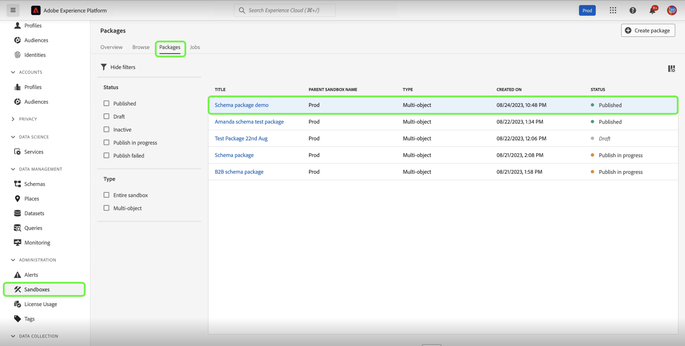

# 沙盒工具

>[!NOTE]
>
>沙盒工具是同时支持[!DNL Real-Time Customer Data Platform]和[!DNL Journey Optimizer]的基础功能，可提高开发周期效率和配置准确性。  您需要具有以下两个基于角色的访问控制权限才能使用沙盒工具功能： - `manage-sandbox`或`view-sandbox` - `manage-package`

提高沙盒之间的配置准确性，并通过沙盒工具功能在沙盒之间无缝导出和导入沙盒配置。 使用沙盒工具缩短实现实施过程的价值时间，并在沙盒之间移动成功的配置。

您可以使用沙盒工具功能选择不同的对象并将它们导出到包中。 包可以包含单个对象或多个对象。<!--or an entire sandbox.-->包中包含的任何对象必须来自同一沙盒。

## 沙盒工具支持的对象 {#supported-objects}

沙盒工具功能允许您将[!DNL Adobe Real-Time Customer Data Platform]和[!DNL Adobe Journey Optimizer]对象导出到包中。

### 实时客户数据平台对象 {#real-time-cdp-objects}

下表列出了当前支持沙盒工具的[!DNL Adobe Real-Time Customer Data Platform]对象：

| 平台 | 对象 | 详细信息 |
| --- | --- | --- |
| 客户数据平台 | 源 | 出于安全原因，源帐户凭据未复制到目标沙盒中，需要手动更新。 默认情况下，源数据流将以草稿状态复制。 |
| 客户数据平台 | 受众 | 仅支持&#x200B;**[!UICONTROL 客户受众]**&#x200B;类型&#x200B;**[!UICONTROL 分段服务]**。 用于同意和管理的现有标签将复制到同一导入作业中。 检查合并策略依赖关系时，系统将自动选择具有相同XDM类的目标沙盒中的默认合并策略。 |
| 客户数据平台 | 身份标识 | 在Target沙盒中创建时，系统将自动删除重复的Adobe标准身份命名空间。 仅当在合并架构中启用受众规则中的所有属性时，才能复制受众。 必须先为统一配置文件移动和启用必要的架构。 |
| 客户数据平台 | 架构 | 用于同意和管理的现有标签将复制到同一导入作业中。 用户可以灵活地导入未启用统一配置文件选项的架构。 架构关系边缘用例未包含在包中。 |
| 客户数据平台 | 数据集 | 在复制数据集时，默认情况下将禁用统一配置文件设置。 |
| 客户数据平台 | 同意和治理政策 | 将用户创建的自定义策略添加到包中，并在沙盒之间移动它们。 |

以下对象已导入，但处于草稿或已禁用状态：

| 功能 | 对象 | 状态 |
| --- | --- | --- |
| 导入状态 | Source数据流 | 草稿 |
| 导入状态 | 历程 | 草稿 |
| 统一配置文件 | 数据集 | 已禁用统一配置文件 |
| 支持 | 数据治理策略 | 已禁用 |

### Adobe Journey Optimizer对象 {#abobe-journey-optimizer-objects}

下表列出了当前支持沙盒工具的[!DNL Adobe Journey Optimizer]对象和限制：

| 平台 | 对象 | 支持的依赖对象 | 详细信息 |
| --- | --- | --- | --- |
| [!DNL Adobe Journey Optimizer] | 受众 | | 受众可以复制为历程对象的依赖对象。 您可以选择创建新受众，也可以重复使用目标沙盒中的现有受众。 |
| [!DNL Adobe Journey Optimizer] | 架构 | | 历程中使用的架构可以作为依赖对象复制。 您可以选择创建新架构或重用目标沙盒中的现有架构。 |
| [!DNL Adobe Journey Optimizer] | 合并策略 | | 历程中使用的合并策略可以作为依赖对象复制。 在目标沙盒中，您&#x200B;**无法**&#x200B;创建新的合并策略，您只能使用现有的合并策略。 |
| [!DNL Adobe Journey Optimizer] | 历程 | 历程中使用的以下对象将作为依赖对象复制。 在导入工作流期间，您可以选择&#x200B;**[!UICONTROL 新建]**&#x200B;或&#x200B;**[!UICONTROL 对以下各项使用现有]**： <ul><li>受众</li><li>架构</li><li>自定义操作</li><li>活动</li><li>片段</li><li>内容模板</li><li>画布详细信息</li></ul> | <ul><li>**[!UICONTROL 自定义操作]**：在将历程复制到另一个沙盒时，在导入过程中选择&#x200B;**[!UICONTROL 使用现有]**&#x200B;时，您选择的现有自定义操作&#x200B;**必须**&#x200B;与源自定义操作相同。 如果两者不同，则新历程将具有无法解决的错误。</li><li>旅程中使用的事件和事件详细信息已复制。 它始终会在目标沙盒中创建新版本。</li></ul> |
| [!DNL Adobe Journey Optimizer] | 操作 | | 历程中使用的电子邮件和推送消息可以作为依赖对象复制。 不检查消息中用于个性化的历程字段中使用的渠道操作活动的完整性。 不会复制内容块。  可以复制历程中使用的更新配置文件操作。 自定义操作可以单独添加到资源包中。 旅程中使用的操作详细信息也会被复制。 它始终会在目标沙盒中创建新版本。 |
| [!DNL Adobe Journey Optimizer] | 自定义操作 |  | 自定义操作可以单独添加到资源包中。 将自定义操作分配给历程后，便无法再编辑它。 要更新自定义操作，您应： <ul><li>在迁移历程之前移动自定义操作</li><li>在迁移后更新自定义操作的配置（如请求标头、查询参数和身份验证）</li><li>使用您在第一步中添加的自定义操作迁移历程对象</li></ul> |
| [!DNL Adobe Journey Optimizer] | 内容模板 | | 内容模板可以作为历程对象的依赖对象复制。 通过独立模板，可轻松地在Journey Optimizer营销活动和历程中重用自定义内容。 |
| [!DNL Adobe Journey Optimizer] | 片段 | 所有嵌套片段。 | 片段可以作为历程对象的依赖对象复制。 片段是可重用的组件，可以在各个Journey Optimizer营销活动和历程中的一个或多个电子邮件中引用。 |
| [!DNL Adobe Journey Optimizer] | 营销活动 | 促销活动中使用的以下对象将作为从属对象复制： <ul><li>营销活动</li><li>受众</li><li>架构</li><li>内容模板</li><li>片段</li><li>消息/内容</li><li>渠道配置</li><li>统一的决策对象</li><li>试验设置/变体</li></ul> | <ul><li>营销活动可与所有与用户档案、受众、架构、内联消息和依赖对象相关的项目一起复制。 不会复制某些项目，例如数据使用标签和语言设置。 有关无法复制的对象的完整列表，请参阅[将对象导出到另一个沙盒](https://experienceleague.adobe.com/zh-hans/docs/journey-optimizer/using/configuration/copy-objects-to-sandbox)指南。</li><li>如果存在相同的配置，系统将自动检测并重新使用目标沙盒中的现有渠道配置对象。 如果未找到匹配的配置，则在导入期间跳过渠道配置，并且用户必须手动更新此历程的目标沙盒中的渠道设置。</li><li>用户可以重复使用目标沙盒中的现有试验和受众作为所选营销活动的依赖对象。</li></ul> |

曲面（例如预设）不会被复制。 系统根据消息类型和表面名称，自动选择目标沙盒上最接近的匹配项。 如果在目标沙盒上未找到表面，则表面复制将失败，导致消息复制失败，因为消息需要表面才可供设置。 在这种情况下，需要为消息的正确渠道至少创建一个表面，以便副本正常工作。

导出历程时，不支持将自定义身份类型作为依赖对象。

## 将对象导入包 {#export-objects}

>[!NOTE]
>
>所有导出操作都记录在审核日志中。

>[!CONTEXTUALHELP]
>id="platform_sandbox_tooling_remove_object"
>title="移除对象"
>abstract="要从包中移除某个对象，请选择要移除的行，然后使用在选择后出现的删除选项。注意，无法从已发布的包中移除对象。"

>[!CONTEXTUALHELP]
>id="platform_sandbox_package_expiry"
>title="包过期设置"
>abstract="包被设置为在草稿状态下不活跃一段时间后过期。默认日期被设置为今天起 90 天后。此日期不断变化，直到发布包为止。如果您明天访问处于草稿状态下的包，则除非您手动设置此项，否则该日期前移 1 天。"

>[!CONTEXTUALHELP]
>id="platform_sandbox_tooling_package_status"
>title="包状态"
>abstract="默认情况下，状态设置为草稿。发布包后，状态将更改为已发布。发布包后不能进行任何更改。"

>[!NOTE]
>
>只有在您有权访问对象时，才能导入资源包。

此示例记录了导出架构并将其添加到包的过程。 您可以使用相同的流程导出其他对象，例如数据集、历程等。

### 将对象添加到新包 {#add-object-to-new-package}

从左侧导航中选择&#x200B;**[!UICONTROL 架构]**，然后选择&#x200B;**[!UICONTROL 浏览]**&#x200B;选项卡，该选项卡列出了可用的架构。 接下来，选择选定架构旁边的省略号(`...`)，下拉菜单将显示控件。 从下拉列表中选择&#x200B;**[!UICONTROL 添加到包]**。

![架构列表，显示突出显示[!UICONTROL 添加到包]控件的下拉菜单。](../images/ui/sandbox-tooling/add-to-package.png)

从&#x200B;**[!UICONTROL 添加到包]**&#x200B;对话框中，选择&#x200B;**[!UICONTROL 创建新包]**&#x200B;选项。 为您的包提供[!UICONTROL Name]和可选的[!UICONTROL Description]，然后选择&#x200B;**[!UICONTROL 添加]**。

![已选中[!UICONTROL 添加到包]对话框，其中显示[!UICONTROL 创建新包]并突出显示[!UICONTROL 添加]。](../images/ui/sandbox-tooling/create-new-package.png)

您返回到&#x200B;**[!UICONTROL 架构]**&#x200B;环境。 现在，您可以按照下面列出的后续步骤，将其他对象添加到您创建的资源包中。

### 将对象添加到现有包并发布 {#add-object-to-existing-package}

要查看可用架构的列表，请从左侧导航中选择&#x200B;**[!UICONTROL 架构]**，然后选择&#x200B;**[!UICONTROL 浏览]**&#x200B;选项卡。 接下来，选择所选架构旁边的省略号(`...`)，在下拉菜单中查看控制选项。 从下拉列表中选择&#x200B;**[!UICONTROL 添加到包]**。

![架构列表，显示突出显示[!UICONTROL 添加到包]控件的下拉菜单。](../images/ui/sandbox-tooling/add-to-package.png)

出现&#x200B;**[!UICONTROL 添加到包]**&#x200B;对话框。 选择&#x200B;**[!UICONTROL 现有包]**&#x200B;选项，然后选择&#x200B;**[!UICONTROL 包名称]**&#x200B;下拉列表并选择所需的包。 最后，选择&#x200B;**[!UICONTROL 添加]**&#x200B;以确认您的选择。

![[!UICONTROL 添加到包]对话框，显示从下拉列表中选定的包。](../images/ui/sandbox-tooling/add-to-existing-package.png)

将列出添加到包中的对象列表。 要发布包并使其可以导入到沙盒中，请选择&#x200B;**[!UICONTROL 发布]**。

![包中的对象列表，突出显示[!UICONTROL 发布]选项。](../images/ui/sandbox-tooling/publish-package.png)

选择&#x200B;**[!UICONTROL 发布]**&#x200B;以确认发布包。

![发布包确认对话框，突出显示[!UICONTROL 发布]选项。](../images/ui/sandbox-tooling/publish-package-confirmation.png)

>[!NOTE]
>
>发布后，无法更改包的内容。 要避免出现兼容性问题，请确保已选择所有必要的资源。 如果必须进行更改，则需要创建新资源包。

您返回到[!UICONTROL 沙盒]环境中的&#x200B;**[!UICONTROL 包]**&#x200B;选项卡，您可以在其中查看新发布的包。

## 将资源包导入目标沙盒 {#import-package-to-target-sandbox}

>[!NOTE]
>
>所有导入操作都记录在审核日志中。

要将包导入目标沙盒，请导航到沙盒&#x200B;**[!UICONTROL 浏览]**&#x200B;选项卡，然后选择沙盒名称旁边的加号(+)选项。

![沙盒&#x200B;**[!UICONTROL 浏览]**&#x200B;选项卡突出显示导入包选择。](../images/ui/sandbox-tooling/browse-sandboxes.png)

使用下拉菜单，选择要导入到目标沙盒的&#x200B;**[!UICONTROL 包名称]**。 添加将用于将来监视的&#x200B;**[!UICONTROL 作业名称]**。 默认情况下，在导入包的架构时，将禁用统一配置文件。 切换&#x200B;**为配置文件**&#x200B;启用架构以启用它，然后选择&#x200B;**[!UICONTROL 下一步]**。

![导入详细信息页面显示[!UICONTROL 包名称]下拉列表选择](../images/ui/sandbox-tooling/import-package-to-sandbox.png)

[!UICONTROL 包对象和依赖项]页提供了此包中包含的所有资源的列表。 系统自动检测成功导入所选父对象所需的从属对象。 任何缺少的属性都会显示在页面顶部。 选择&#x200B;**[!UICONTROL 查看详细信息]**&#x200B;以获取更详细的细分。

![[!UICONTROL 包对象和依赖项]页显示缺少的属性。](../images/ui/sandbox-tooling/missing-attributes.png)

>[!NOTE]
>
>依赖对象可以替换为目标沙盒中的现有对象，这允许您重用现有对象，而不是创建新版本。 例如，导入包含架构的包时，您可以在目标沙盒中重用现有的自定义字段组和身份命名空间。 或者，在导入包含历程的包时，您可以重复使用目标沙盒中的现有区段。
>
>沙盒工具当前不支持更新或覆盖现有对象。 您可以选择创建新对象，或继续使用现有对象而不进行修改。

要使用现有对象，请选择从属对象旁边的铅笔图标。

![包对象和依赖项[!UICONTROL 页]显示包中包含的资源列表。](../images/ui/sandbox-tooling/package-objects-and-dependencies.png)

此时会显示创建新或使用现有内容的选项。 选择&#x200B;**[!UICONTROL 使用现有]**。

![显示依赖对象选项[!UICONTROL 新建]和[!UICONTROL 使用现有]的[!UICONTROL 包对象和依赖项]页。](../images/ui/sandbox-tooling/use-existing-object.png)

**[!UICONTROL 字段组]**&#x200B;对话框显示该对象可用的字段组列表。 选择所需的字段组，然后选择&#x200B;**[!UICONTROL 保存]**。

![显示在[!UICONTROL 字段组]对话框中的字段列表，突出显示[!UICONTROL 保存]选择。](../images/ui/sandbox-tooling/field-group-list.png)

返回到[!UICONTROL 包对象和依赖项]页。 从此处选择&#x200B;**[!UICONTROL 完成]**&#x200B;以完成包导入。

![包对象和依赖项[!UICONTROL 页]显示包中包含的资产列表，突出显示[!UICONTROL 完成]。](../images/ui/sandbox-tooling/finish-object-dependencies.png)

## 导出和导入整个沙盒

>[!NOTE]
>
>目前，在导出或导入整个沙盒时仅支持Real-time Customer Data Platform对象。 目前不支持历程等Adobe Journey Optimizer对象。

您可以将所有受支持的对象类型导出到完整的沙盒包中，然后跨各种沙盒导入包以复制对象配置。 例如，此功能允许您：

- 如果需要重置沙盒，请重新导入沙盒以重现对象的所有配置
- 将包导入其他沙盒并将它用作Blueprint沙盒以加快开发过程。

### 导出整个沙盒 {#export-entire-sandbox}

要导出整个沙盒，请导航到[!UICONTROL 沙盒] **[!UICONTROL 包]**&#x200B;选项卡，然后选择&#x200B;**[!UICONTROL 创建包]**。

![沙盒] **[!UICONTROL 包]**&#x200B;选项卡突出显示[!UICONTROL 创建包]。(../images/ui/sandbox-tooling/create-sandbox-package.png)

在[!UICONTROL 创建包]对话框中，为[!UICONTROL 包类型]选择&#x200B;**[!UICONTROL 整个沙盒]**。 为您的新包提供[!UICONTROL 包名称]，然后从下拉列表中选择&#x200B;**[!UICONTROL 沙盒]**。 最后，选择&#x200B;**[!UICONTROL 创建]**&#x200B;以确认您的条目。

![ [!UICONTROL 创建包]对话框显示已完成的字段并突出显示[!UICONTROL 创建]。](../images/ui/sandbox-tooling/create-package-dialog.png)

已成功创建包，请选择&#x200B;**[!UICONTROL 发布]**&#x200B;以发布包。

您返回到[!UICONTROL 沙盒]环境中的&#x200B;**[!UICONTROL 包]**&#x200B;选项卡，您可以在其中查看新发布的包。

### 导入整个沙盒包 {#import-entire-sandbox-package}

>[!NOTE]
>
>所有对象将作为新对象导入到目标沙盒中。 最佳实践是将完整的沙盒包导入空沙盒中。

要将包导入目标沙盒，请导航到[!UICONTROL 沙盒] **[!UICONTROL 浏览]**&#x200B;选项卡，然后选择沙盒名称旁边的加号(+)选项。

![沙盒&#x200B;**[!UICONTROL 浏览]**&#x200B;选项卡突出显示导入包选择。](../images/ui/sandbox-tooling/browse-entire-package-sandboxes.png)

使用下拉菜单，使用&#x200B;**[!UICONTROL 包名称]**&#x200B;下拉菜单选择完整的沙盒。 添加将用于将来监视的&#x200B;**[!UICONTROL 作业名称]**&#x200B;和可选的&#x200B;**[!UICONTROL 作业描述]**，然后选择&#x200B;**[!UICONTROL 下一步]**。

![导入详细信息页面显示[!UICONTROL 包名称]下拉列表选择](../images/ui/sandbox-tooling/import-full-sandbox-package.png)

>[!NOTE]
>
>您必须对包中包含的所有对象具有完全权限。 如果您没有权限，导入操作将失败并显示错误消息。

您将转到[!UICONTROL 包对象和依赖项]页，在该页中可以查看导入和排除对象的对象和依赖项的数目。 在此处，选择&#x200B;**[!UICONTROL 导入]**&#x200B;以完成包导入。

![包对象和依赖项[!UICONTROL 页]显示不支持的对象类型的内联消息，突出显示[!UICONTROL 导入]。](../images/ui/sandbox-tooling/finish-dependencies-entire-sandbox.png)

留出一段时间以完成导入。 完成时间会因包中的对象数而异。 您可以从[!UICONTROL 沙盒] **[!UICONTROL 作业]**&#x200B;选项卡监视导入作业。

## 监控导入详细信息 {#view-import-details}

要查看导入的详细信息，请导航到[!UICONTROL 沙盒] **[!UICONTROL 作业]**&#x200B;选项卡，然后从列表中选择包。 或者，使用搜索栏搜索包。

![沙盒[!UICONTROL 作业]选项卡突出显示导入包选择。](../images/ui/sandbox-tooling/imports-tab.png)

<!--### View imported objects {#view-imported-objects}

On the **[!UICONTROL Jobs]** tab in the [!UICONTROL Sandboxes] environment, select **[!UICONTROL View imported objects]** from the right details pane.

Select **[!UICONTROL View imported objects]** from the right details pane on the **[!UICONTROL Jobs]** tab in the [!UICONTROL Sandboxes] environment.

![The sandboxes [!UICONTROL Imports] tab highlights the [!UICONTROL View imported objects] selection in the right pane.](../images/ui/sandbox-tooling/view-imported-objects.png)

Use the arrows to expand objects to view the full list of fields that have been imported into the package.

![The sandboxes [!UICONTROL Imported objects] showing a list of objects imported into the package.](../images/ui/sandbox-tooling/expand-imported-objects.png)-->

在“沙盒”环境的&#x200B;**[!UICONTROL 作业]**&#x200B;选项卡中，从右侧详细信息窗格中选择&#x200B;**[!UICONTROL 查看导入摘要]**。

![沙盒[!UICONTROL 导入]选项卡突出显示右侧窗格中的[!UICONTROL 查看导入详细信息]选项。](../images/ui/sandbox-tooling/view-import-details.png)

**[!UICONTROL 导入摘要]**&#x200B;对话框显示导入的划分以及进度百分比。

>[!NOTE]
>
>您可以通过导航到特定的清单页面来查看对象列表。

![显示导入明细的[!UICONTROL 导入详细信息]对话框。](../images/ui/sandbox-tooling/import-details.png)

导入完成后，将在Experience Platform UI中收到通知。 您可以通过警报图标访问这些通知。 如果作业不成功，您可以在此处导航到疑难解答。

## 视频教程

以下视频旨在支持您了解沙盒工具，并概述如何创建新包、发布包和导入包。

>[!VIDEO](https://video.tv.adobe.com/v/3424763/?learn=on)

## 后续步骤

本文档演示了如何在Experience Platform UI中使用沙盒工具功能。 有关沙盒的信息，请参阅[沙盒用户指南](../ui/user-guide.md)。

有关使用沙盒API执行不同操作的步骤，请参阅[沙盒开发人员指南](../api/getting-started.md)。 有关Experience Platform中沙盒的高级概述，请参阅[概述文档](../home.md)。
