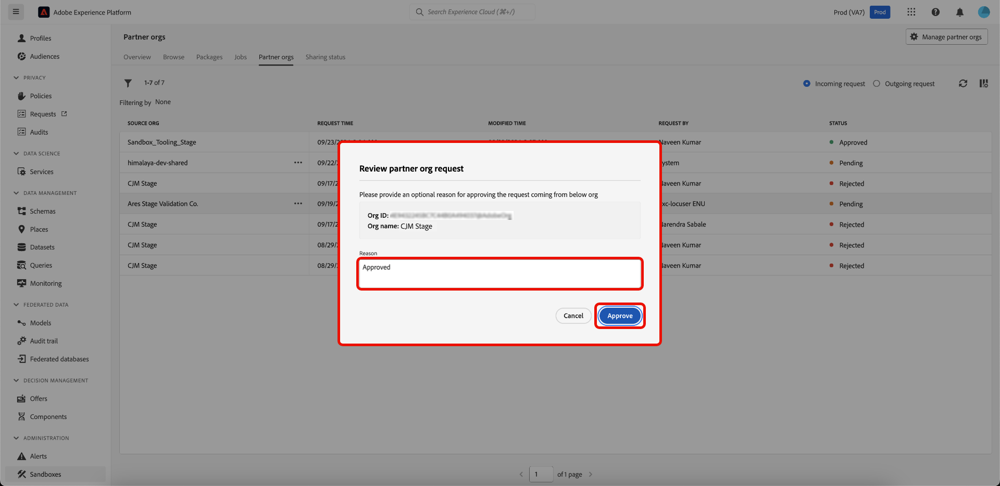
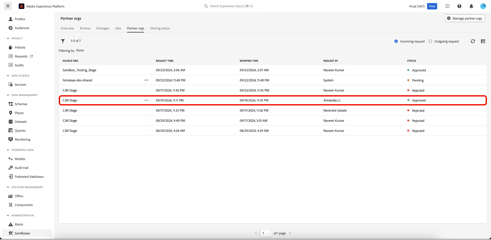

# 使用沙盒工具在组织之间共享包

使用沙盒工具功能提高沙盒之间的配置准确性，并在不同组织的沙盒之间无缝导出和导入沙盒配置。 本文档介绍如何使用Adobe Experience Platform中的沙盒工具在不同组织之间共享包。 共享包有两种类型：

- **私有包**

[私有包](#private-packages)只能与已批准来自源组织的共享请求的组织共享。

- **公共包**

[公共包](#public-packages)无需任何其他批准即可导入。 这些资源包可以在合作伙伴的网站、博客或平台上共享。 包有效负载允许从这些渠道复制包并将其粘贴到目标组织。

## 私有包 {#private-packages}

>[!NOTE]
>
>要启动和批准共享请求并在组织间共享包，您需要具有基于&#x200B;**包共享**&#x200B;角色的访问控制权限。

使用“沙盒工具”功能创建伙伴关系、跟踪伙伴关系请求统计信息、管理现有伙伴关系并与合作伙伴组织共享包。

### 创建组织伙伴关系请求

要创建组织伙伴关系请求，请导航到&#x200B;**[!UICONTROL 沙盒]** **[!UICONTROL 合作伙伴组织]**&#x200B;选项卡。 接下来，选择&#x200B;**[!UICONTROL 管理合作伙伴组织]**。

在[!UICONTROL 包合作伙伴管理]对话框中，在&#x200B;**[!UICONTROL 输入组织ID]**&#x200B;并按Enter (Windows)或return (Mac)。 组织ID显示在下面的&#x200B;**[!UICONTROL 选定的组织ID]**&#x200B;部分中。 添加ID后，选择&#x200B;**[!UICONTROL 确认]**。

>[!TIP]
>
>可以使用逗号分隔列表或通过依次输入每个组织ID来一次输入多个组织ID。

共享请求已成功发送到合作伙伴组织，并且您返回到[!UICONTROL 沙盒] **[!UICONTROL 合作伙伴组织]**&#x200B;选项卡，该选项卡显示&#x200B;**[!UICONTROL 传出请求]**。

### 授权伙伴关系请求 {#authorize-request}

要授权组织伙伴关系请求，请导航到[!UICONTROL 沙盒] **[!UICONTROL 合作伙伴组织]**&#x200B;选项卡。 接下来，选择&#x200B;**[!UICONTROL 传入请求]**。

此阶段的请求的当前&#x200B;**[!UICONTROL 状态]**&#x200B;为&#x200B;**待处理**。 要批准请求，请选择所选请求旁边的省略号(`...`)，然后从下拉列表中选择&#x200B;**[!UICONTROL 批准]**。

**[!UICONTROL 查看合作伙伴组织请求]**&#x200B;对话框显示有关组织伙伴关系请求的详细信息。 输入[!UICONTROL 原因]以供审批，然后选择&#x200B;**[!UICONTROL 审批]**。

您返回到[!UICONTROL 传入请求]页面，该请求的状态已更新为&#x200B;**[!UICONTROL 已批准]**。

使用此工作流/进程可在您的组织与源组织之间共享包。

### 将包共享到合作伙伴组织 {#share-package}

>[!NOTE]
>
>只能共享状态为&#x200B;**已发布**&#x200B;的包。

#### 共享多对象包 {#multi-object-packages}

若要将多对象包共享到批准的合作伙伴组织，请导航到[!UICONTROL 沙盒] **[!UICONTROL 包]**&#x200B;选项卡。 接下来，选择包旁边的省略号(`...`)，然后从下拉菜单中选择&#x200B;**[!UICONTROL 共享包]**。

在&#x200B;**[!UICONTROL 共享包]**&#x200B;对话框中，从&#x200B;**[!UICONTROL 共享设置]**&#x200B;下拉列表中选择要与其共享包的组织，然后选择&#x200B;**[!UICONTROL 确认]**。

>[!TIP]
>
>可以选择多个组织。 选定的组织将显示在[!UICONTROL 共享设置]下拉列表下方。

#### 共享整个沙盒包 {#entire-sandbox-packages}

要将整个沙盒包共享到批准的合作伙伴组织，请导航到[!UICONTROL 沙盒] **[!UICONTROL 包]**&#x200B;选项卡。 接下来，选择包旁边的省略号(`...`)，然后从下拉菜单中选择&#x200B;**[!UICONTROL 共享包]**。

在&#x200B;**[!UICONTROL 共享包]**&#x200B;对话框中，从&#x200B;**[!UICONTROL 共享设置]**&#x200B;下拉列表中选择要与其共享包的组织，然后选择&#x200B;**[!UICONTROL 确认]**。

>[!TIP]
>
>可以选择多个组织。 选定的组织将显示在[!UICONTROL 共享设置]下拉列表下方。

## 公共包 {#public-packages}

使用沙盒工具功能可创建不需要任何其他批准的可共享公共包，并使用包的有效负载轻松导入这些公共包。

### 更新包的公共可用性 {#update-package}

要更新包的可用性类型，请导航到[!UICONTROL 沙盒] **[!UICONTROL 包]**&#x200B;选项卡。 接下来，选择包旁边的省略号(`...`)，然后从下拉菜单中选择&#x200B;**[!UICONTROL 更新到公共包]**。

在&#x200B;**[!UICONTROL 将包可用性更改为公共]**&#x200B;对话框中，验证包名称是否正确，并选择&#x200B;**[!UICONTROL 确认]**。

>[!IMPORTANT]
>
> 将包发布后，便无法将其更改回private包。

### 使用包有效负载共享包

要共享公共包，请选择包旁边的省略号(`...`)，然后选择&#x200B;**[!UICONTROL 复制包有效负载]**。

**[!UICONTROL 复制包有效负载]**&#x200B;对话框显示包名称和有效负载。 选择&#x200B;**[!UICONTROL 复制包有效负载]**&#x200B;以复制与包关联的有效负载。

### 使用包有效负荷创建新包

要使用包有效负载创建包，请导航到[!UICONTROL 沙盒] **[!UICONTROL 包]**&#x200B;选项卡。 接下来，选择&#x200B;**[!UICONTROL 创建包]**。

在&#x200B;**[!UICONTROL 创建包]**&#x200B;对话框中，选择&#x200B;**[!UICONTROL 粘贴包有效负载]**&#x200B;的选项，然后选择&#x200B;**[!UICONTROL 选择]**。

将复制的包有效负载粘贴到文本字段中，然后选择&#x200B;**[!UICONTROL 创建]**。

要查看共享请求的当前状态，请导航到&#x200B;**[!UICONTROL 共享状态]**。 请求的当前状态显示在&#x200B;**[!UICONTROL 共享状态]**&#x200B;列中。

## 后续步骤 {#next-steps}

本文档演示如何使用沙盒工具功能在不同组织之间共享包。 有关详细信息，请参阅[沙盒工具指南](../ui/sandbox-tooling.md)。

要了解如何使用沙盒API执行不同的操作，请参阅[沙盒开发人员指南](../api/getting-started.md)。 有关Experience Platform中沙盒的高级概述，请参阅[概述文档](../home.md)。
