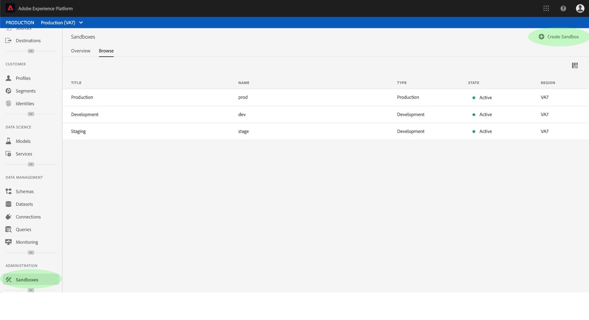
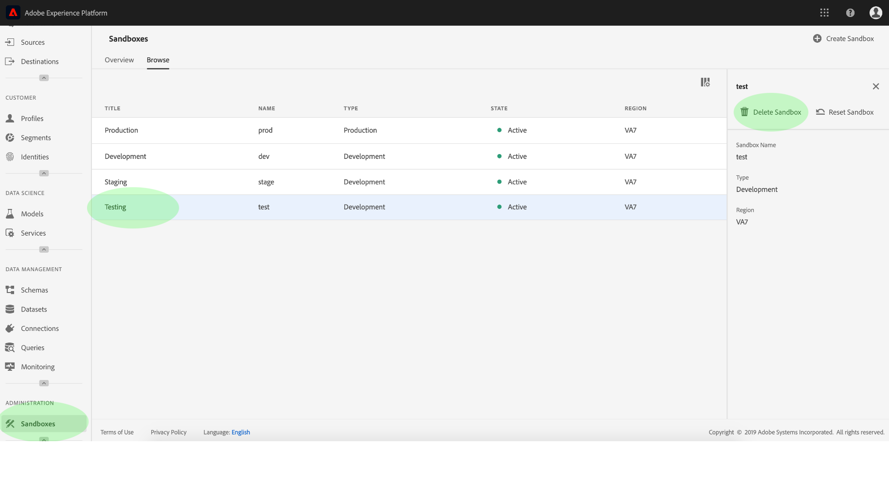

# 沙箱用户指南

本文档提供了如何在Adobe Experience Platform用户界面中执行与沙箱相关的各种操作的步骤。

## 视图沙箱

在Experience Platform UI中，单击左侧导 **航中的** “沙箱”以打开“沙 _箱_ ”仪表板。 仪表板列表组织的所有可用沙箱，包括沙箱类型（生产或开发）和状态（活动、创建、删除或失败）。

## 在沙箱之间切换

屏 **幕左上角的沙箱切换器** ，控件显示当前活动的沙箱。

要在沙箱之间切换，请单击沙箱切换器，然后从下拉列表中选择所需的沙箱。

选择沙箱后，屏幕将刷新，沙箱切换器中现在包含选定沙箱。

## 创建新沙箱

要在UI中创建新沙箱，请单击左导航 **中的** “沙箱”，然后单击“ **创建沙箱”**。

将 _出现“创建沙箱_ ”对话框，提示您提供沙箱的显示标题和名称。 显 **示标题** ，应具有可读性，并且应具有足够的描述性，以便于识别。 沙箱 **名称** 是用于API调用的全小写标识符，因此应该是唯一和简洁的。

完成后，单击“ **创建**”。

>[!NOTE] 由于您仅限于创建非生产沙箱类型，因此 **type** 选项在“非生产”处被锁定，不能进行操作。

创建完沙箱后，刷新页面，新沙箱将显示在 _Sandboxes仪表板中，状态为“创建_ ”。 新沙箱由系统提供大约需要15分钟，之后其状态将更改为“活动”。

## 重置沙箱

>[!NOTE] 此功能仅适用于非生产沙箱。 无法重置生产沙箱。

重置非生产沙箱将删除与该沙箱(模式、数据集等)关联的所有资源，同时保持沙箱的名称和关联权限。 对于有权访问该沙箱的用户，该“干净”沙箱将继续以相同的名称可用。

要在UI中重置沙箱，请单击左 **导航中的** “沙箱”，然后单击要重置的沙箱。 在屏幕右侧显示的对话框中，单击“重置沙 **箱”**。

将显示一个对话框，提示您确认选择。 Click **Reset** to continue.

 

将显示一条确认消息，沙箱的状态将更改为“重置”。 一旦系统提供它，其状态将更新为“活动”或“失败”。

## 删除沙箱

>[!NOTE] 此功能仅适用于非生产沙箱。 无法删除生产沙箱。

删除非生产沙箱将永久删除与该沙箱关联的所有资源，包括权限。

要在UI中删除沙箱，请单击左 **导航中的** “沙箱”，然后单击要删除的沙箱。 在屏幕右侧显示的对话框中，单击“删除沙 **箱”**。

将显示一个对话框，提示您确认选择。 Click **Delete** to continue.

 

将显示一条确认消息，并从“沙箱”工作区中删除 _沙箱_ 。

## 后续步骤

此文档演示了如何在Experience Platform UI中管理沙箱。 有关如何使用沙箱API管理沙箱的信息，请参阅沙箱开 [发人员指南](../api/getting-started.md)。