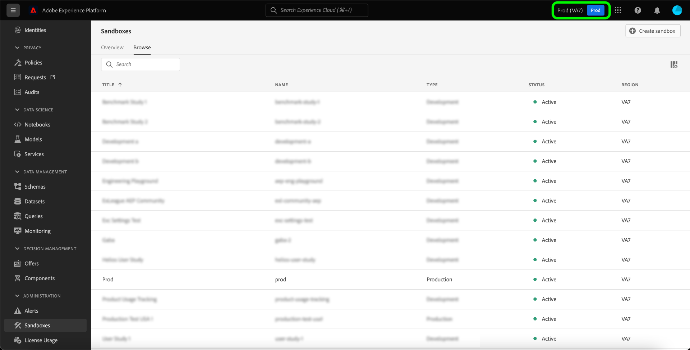

# 沙盒UI指南

本文档提供了有关如何在Adobe Experience Platform用户界面中执行与沙盒相关的各种操作的步骤。

## 查看沙盒

在Experience Platform UI中，在左侧导航中选择&#x200B;**[!UICONTROL 沙盒]**，然后选择&#x200B;**[!UICONTROL 浏览]**&#x200B;选项卡以打开[!UICONTROL 沙盒]仪表板。 仪表板列出了您组织的所有可用沙盒，包括其各自的类型（生产或开发）。

## 在沙盒之间切换

沙盒指示器位于Experience Platform UI的顶部标题中，显示您当前所在的沙盒的标题、其区域和类型。

要在沙盒之间切换，请选择沙盒指示器，然后从下拉列表中选择所需的沙盒。 或者，您可以使用下拉菜单中的搜索功能搜索所需的沙盒。

选择沙盒后，屏幕将刷新并更新到您选择的沙盒。

## 创建新沙盒 {#create}

>[!CONTEXTUALHELP]
>id="platform_sandboxes_sandboxname"
>title="沙盒名称"
>abstract="沙盒名称是在后端用于为此沙盒创建唯一 ID 的文本。"

>[!CONTEXTUALHELP]
>id="platform_sandboxes_sandboxtitle"
>title="沙盒标题"
>abstract="沙盒标题是在整个 Experience Platform UI 的菜单和下拉列表中代表沙盒的显示名称。"

>[!WARNING]
>
>创建新沙盒需要先将其添加到[[!UICONTROL 权限]](../../access-control/abac/ui/permissions.md)中的角色，然后才能开始使用。 要了解如何为角色配置沙盒，请参阅[为角色管理沙盒](../../access-control/abac/ui/permissions.md#managing-sandboxes-for-role)文档。

请观看以下视频，快速了解如何在Experience Platform中使用沙盒。

>[!VIDEO](https://video.tv.adobe.com/v/3430297/?quality=12&learn=on&captions=chi_hans)

要创建新沙盒，请选择屏幕右上角的&#x200B;**[!UICONTROL 创建沙盒]**。

出现&#x200B;**[!UICONTROL 创建沙盒]**&#x200B;对话框。 选择&#x200B;**[!UICONTROL 类型]**&#x200B;下拉列表，然后选择[!UICONTROL 开发]或[!UICONTROL 生产]沙盒类型。

选择类型后，在&#x200B;**[!UICONTROL 名称]**&#x200B;字段中提供沙盒的名称。 沙盒名称是用于API调用的全小写标识符，因此应唯一且简洁。 沙盒名称必须以字母开头，最多可包含256个字符，并且仅由字母数字字符和连字符(-)组成。 接下来，在&#x200B;**[!UICONTROL 标题]**&#x200B;字段中提供沙盒的标题。 标题应该易于用户识别，并且应该具有足够的描述性以便轻松识别。

完成后，选择&#x200B;**[!UICONTROL 创建]**。

创建完沙盒后，刷新页面，新沙盒将出现在&#x200B;**[!UICONTROL 沙盒]**&#x200B;仪表板中，状态为“[!UICONTROL 正在创建]”。 系统配置新沙盒大约需要30秒，之后沙盒的状态将更改为“[!UICONTROL 活动]”。

## 重置沙盒

>[!WARNING]
>
>以下是可阻止您重置默认生产沙盒或用户创建的生产沙盒的异常列表：
>
>* 用于在警告消息后重置与Adobe Audience Manager或Audience Core Service进行双向区段共享的用户创建的生产沙盒。
>* 在启动沙盒重置之前，您将需要手动删除合成，以确保正确清理关联的受众数据。
>* 重置完成后，沙盒ID将更改。
>* 对于[Journey Optimizer B2B edition](https://experienceleague.adobe.com/zh-hans/docs/journey-optimizer-b2b/user/guide-overview)，当前不支持&#x200B;**沙盒重置**。 重置或删除映射到Journey Optimizer B2B edition的沙盒可能会导致Journey Optimizer B2B edition中的数据永久丢失，并且可能需要配置新的Journey Optimizer B2B edition实例。

### 删除受众合成

受众构成当前未与沙盒重置功能集成，因此需要手动删除受众才能执行沙盒重置。

从左侧导航的&#x200B;**[!UICONTROL 客户]**&#x200B;部分中选择&#x200B;**[!UICONTROL 受众]**，然后选择&#x200B;**[!UICONTROL 合成]**&#x200B;选项卡。

接下来，选择第一个受众旁边的省略号(`...`)，然后选择&#x200B;**[!UICONTROL 删除]**。

![突出显示[!UICONTROL 删除]选项的受众菜单。](../images/ui/delete-composition.png)

将显示成功删除的确认，并返回到&#x200B;**[!UICONTROL 合成]**&#x200B;选项卡。

对所有合成内容重复上述步骤。 这将从受众清单中删除所有受众。 删除所有受众后，您可以继续重置沙盒。

### 重置沙盒

重置生产或开发沙盒会删除与该沙盒关联的所有资源（架构、数据集等），同时保持沙盒的名称和关联的权限。 对于有权访问此“清理”沙盒的用户，将继续以相同的名称提供该沙盒。

从沙盒列表中选择要重置的沙盒。 在出现的右侧导航面板中，选择&#x200B;**[!UICONTROL 沙盒重置]**。

将出现一个对话框，提示您确认您的选择。 选择&#x200B;**[!UICONTROL 继续]**&#x200B;以继续。

在最终确认窗口中，在对话框中输入沙盒的名称，然后选择&#x200B;**[!UICONTROL 重置]**。

## 删除沙盒

>[!WARNING]
>
>您无法删除默认的生产沙盒。 但是，在出现警告消息后，可以删除任何用于与[!DNL Audience Manager]或[!DNL Audience Core Service]进行双向区段共享的用户创建的生产沙盒。

删除生产或开发沙盒将永久删除与该沙盒关联的所有资源，包括权限。

从沙盒列表中选择要删除的沙盒。 在出现的右侧导航面板中，选择&#x200B;**[!UICONTROL 删除]**。

将出现一个对话框，提示您确认您的选择。 选择&#x200B;**[!UICONTROL 继续]**&#x200B;以继续。

在最终确认窗口中，在对话框中输入沙盒的名称，然后选择&#x200B;**[!UICONTROL 继续]**。

## 后续步骤

本文档演示了如何在Experience Platform UI中管理沙箱。 现在您已了解如何管理沙盒，了解如何通过[沙盒工具功能](./sandbox-tooling.md)指南提高沙盒之间的配置准确性以及在沙盒之间无缝导出和导入沙盒配置。

有关如何使用沙盒API管理沙盒的信息，请参阅[沙盒开发人员指南](../api/getting-started.md)。
