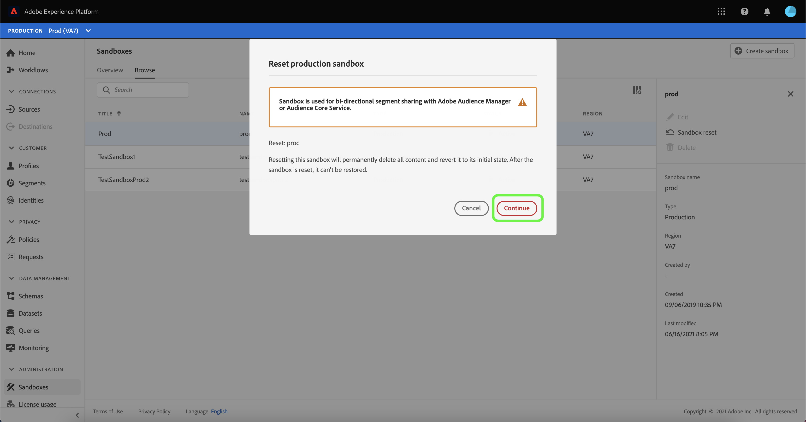

# 沙盒UI指南

本文档提供了有关如何在Adobe Experience Platform用户界面中执行与沙箱相关的各种操作的步骤。

## 查看沙箱

在平台UI中，选择左侧导航中的&#x200B;**[!UICONTROL 沙盒]**&#x200B;以打开[!UICONTROL 沙盒]功能板。 功能板列出了贵组织的所有可用沙箱，包括沙盒类型（生产或开发）和状态（活动、创建、删除或失败）。

## 在沙箱之间切换

屏幕左上角的&#x200B;**沙盒切换器**&#x200B;控件显示当前活动的沙盒。

要在沙箱之间切换，请选择沙箱切换器，然后从下拉列表中选择所需的沙箱。

选择沙盒后，屏幕将随选定的沙盒（现在位于沙盒切换器中）一起刷新。

## 搜索沙盒

您可以使用沙盒切换器菜单中的搜索功能，在可供您使用的沙箱列表中导航。 键入您要访问的沙盒的名称，以过滤组织可用的所有沙箱。

## 创建新沙盒

请使用以下视频快速了解如何在Experience Platform中使用沙箱。

>[!VIDEO](https://video.tv.adobe.com/v/29838/?quality=12&learn=on)

要创建新沙盒，请选择屏幕右上角的&#x200B;**[!UICONTROL 创建沙盒]** 。

出现&#x200B;**[!UICONTROL 创建沙盒]**&#x200B;对话框。 如果要创建开发沙盒，请在下拉面板中选择&#x200B;**[!UICONTROL 开发]**。 要创建新的生产沙盒，请选择&#x200B;**[!UICONTROL 生产]**。

选择类型后，为沙盒提供名称和标题。 标题应当具有人类可读性，且应当具有足够的描述性，以便于识别。 沙盒名称是在API调用中使用的全小写标识符，因此应该是唯一的且简洁。 沙盒名称必须以字母开头，且最多包含256个字符，且只能由字母数字字符和连字符(-)组成。

完成后，选择&#x200B;**[!UICONTROL 创建]**。

创建完沙盒后，刷新页面，新沙盒将显示在&#x200B;**[!UICONTROL 沙盒]**&#x200B;功能板中，状态为“[!UICONTROL 创建]”。 新沙箱需要大约30秒才能由系统进行配置，之后其状态将变为“[!UICONTROL Active]”。

## 重置沙盒

>[!IMPORTANT]
>
>如果Adobe Analytics还在为[跨设备分析(CDA)](https://experienceleague.adobe.com/docs/analytics/components/cda/overview.html)功能使用其中托管的身份图，或者为[基于人员的目标(PBD)](https://experienceleague.adobe.com/docs/audience-manager/user-guide/features/destinations/people-based/people-based-destinations-overview.html)功能使用其中托管的身份图，则无法重置默认的生产沙盒。 也无法重置用于与Adobe Audience Manager或受众核心服务进行双向区段共享的生产沙箱。

重置生产或开发沙盒会删除与该沙盒（架构、数据集等）关联的所有资源，同时维护沙盒的名称和关联的权限。 对于有权访问该“干净”沙盒的用户，该沙盒将继续以相同的名称提供。

从沙箱列表中选择要重置的沙箱。 在显示的右侧导航面板中，选择&#x200B;**[!UICONTROL 沙盒重置]**。

出现一个对话框，提示您确认您的选择。 选择&#x200B;**[!UICONTROL 继续]**&#x200B;以继续。

在最终的确认窗口中，在对话框中输入沙盒的名称，然后选择&#x200B;**[!UICONTROL Reset]**

片刻后，屏幕底部会显示一个确认框，确认成功重置。

### 错误消息

无法重置包含CDA数据的默认生产沙盒，并返回以下错误。

包含PBD数据的默认生产沙盒也无法重置，并返回以下错误。

包含CDA和PBD数据的默认生产沙盒也无法重置，并返回以下错误。

用于与Adobe Audience Manager或受众核心服务进行双向区段共享的生产沙盒也无法重置，并返回以下错误。

## 删除沙盒

>[!IMPORTANT]
>
>无法删除默认的生产沙盒，也无法删除用于与Adobe Audience Manager或Audience Core Service进行双向区段共享的生产沙盒。

删除生产或开发沙盒会永久删除与该沙盒关联的所有资源，包括权限。

从沙箱列表中选择要删除的沙箱。 在显示的右侧导航面板中，选择&#x200B;**[!UICONTROL Delete]**。

出现一个对话框，提示您确认您的选择。 选择&#x200B;**[!UICONTROL 继续]**&#x200B;以继续。

在最终确认窗口中，在对话框中输入沙盒的名称，然后选择&#x200B;**[!UICONTROL 继续]**

用于与Adobe Audience Manager或受众核心服务进行双向区段共享的生产沙盒，无法删除，并返回以下错误。

## 后续步骤

本文档演示了如何在Experience PlatformUI中管理沙箱。 有关如何使用沙盒API管理沙盒的信息，请参阅[沙盒开发人员指南](../api/getting-started.md)。
