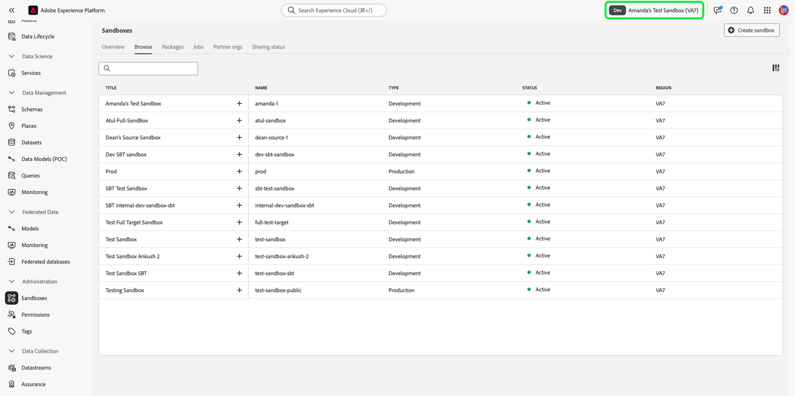

# 沙盒UI指南

本文档提供了有关如何在Adobe Experience Platform用户界面中执行与沙箱相关的各种操作的步骤。

## 查看沙箱

在平台UI中，选择 **[!UICONTROL 沙箱]** 在左侧导航中，然后选择 **[!UICONTROL 浏览]** 打开 [!UICONTROL 沙箱] 功能板。 功能板列出了贵组织的所有可用沙箱，包括其各自的类型（生产或开发）。

## 在沙箱之间切换

沙盒指示器位于Platform UI的顶部标题中，并显示您当前所在沙盒的标题、区域及其类型。

要在沙箱之间切换，请选择沙盒指示器，然后从下拉列表中选择所需的沙盒。

选择沙盒后，屏幕会刷新并更新到您选择的沙盒。

## 创建新沙盒 {#create}

>[!CONTEXTUALHELP]
>id="platform_sandboxes_sandboxname"
>title="沙盒名称"
>abstract="沙盒名称是在后端用于为此沙盒创建唯一 ID 的文本。"

>[!CONTEXTUALHELP]
>id="platform_sandboxes_sandboxtitle"
>title="沙盒标题"
>abstract="沙盒标题是在整个 Experience Platform UI 的菜单和下拉列表中代表沙盒的显示名称。"

>[!NOTE]
>
>创建新沙盒后，必须首先将该新沙盒添加到 [Adobe Admin Console](https://adminconsole.adobe.com/) 才能开始使用新沙盒。 请参阅 [管理产品配置文件的权限](../../access-control/ui/permissions.md) 有关如何向产品用户档案配置沙盒的信息。

请使用以下视频快速了解如何在Experience Platform中使用沙箱。

>[!VIDEO](https://video.tv.adobe.com/v/29838/?quality=12&learn=on)

要创建新沙盒，请选择 **[!UICONTROL 创建沙盒]** 屏幕右上角的。

的 **[!UICONTROL 创建沙盒]** 对话框。 如果要创建开发沙盒，请选择 **[!UICONTROL 开发]** 中。 要创建新的生产沙盒，请选择 **[!UICONTROL 生产]**.

选择类型后，为沙盒提供名称和标题。 标题应当具有人类可读性，且应当具有足够的描述性，以便于识别。 沙盒名称是在API调用中使用的全小写标识符，因此应该是唯一的且简洁。 沙盒名称必须以字母开头，且最多包含256个字符，且只能由字母数字字符和连字符(-)组成。

完成后，选择 **[!UICONTROL 创建]**.

创建完沙盒后，刷新页面，新的沙盒将显示在 **[!UICONTROL 沙箱]** 状态为“[!UICONTROL 创建]&quot; 新沙箱需要大约30秒才能由系统进行配置，之后其状态将更改为“[!UICONTROL 活动]&quot;

## 重置沙盒

>[!WARNING]
>
>以下是阻止重置默认生产沙盒或用户创建的生产沙盒的例外列表： <ul><li>如果Adobe Analytics还在为 [跨设备分析(CDA)](https://experienceleague.adobe.com/docs/analytics/components/cda/overview.html) 功能。</li><li>如果Adobe Audience Manager还在为 [基于人员的目标(PBD)](https://experienceleague.adobe.com/docs/audience-manager/user-guide/features/destinations/people-based/people-based-destinations-overview.html).</li><li>如果默认的生产沙盒同时包含CDA和PBD功能的数据，则无法重置该沙盒。</li><li>用户创建的生产沙盒(用于与Adobe Audience Manager或受众核心服务进行双向区段共享)在出现警告消息后可以重置。</li></ul>

重置生产或开发沙盒会删除与该沙盒（架构、数据集等）关联的所有资源，同时维护沙盒的名称和关联的权限。 对于有权访问该“干净”沙盒的用户，该沙盒将继续以相同的名称提供。

从沙箱列表中选择要重置的沙箱。 在显示的右侧导航面板中，选择 **[!UICONTROL 沙盒重置]**.

出现一个对话框，提示您确认您的选择。 选择 **[!UICONTROL 继续]** 以继续。

在最终确认窗口中，在对话框中输入沙盒的名称，然后选择 **[!UICONTROL 重置]**.

## 删除沙盒

>[!WARNING]
>
>您无法删除默认的生产沙盒。 但是，任何用户创建的生产沙盒，用于与 [!DNL Audience Manager] 或 [!DNL Audience Core Service] 可在出现警告消息后删除。

删除生产或开发沙盒会永久删除与该沙盒关联的所有资源，包括权限。

从沙箱列表中选择要删除的沙箱。 在显示的右侧导航面板中，选择 **[!UICONTROL 删除]**.

出现一个对话框，提示您确认您的选择。 选择 **[!UICONTROL 继续]** 以继续。

在最终确认窗口中，在对话框中输入沙盒的名称，然后选择  **[!UICONTROL 继续]**.

## 后续步骤

本文档演示了如何在Experience PlatformUI中管理沙箱。 有关如何使用沙盒API管理沙箱的信息，请参阅 [沙盒开发人员指南](../api/getting-started.md).
