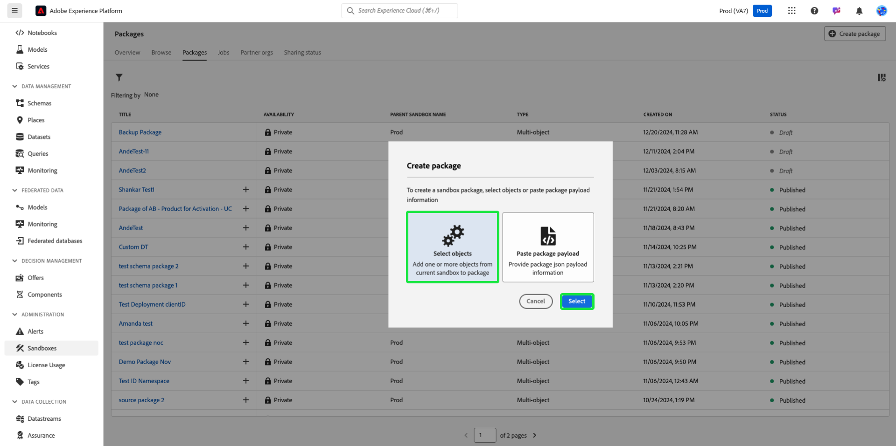

# 使用沙盒工具备份对象配置

要安全地重置沙盒并添加版本控制支持，请使用沙盒工具包备份对象配置（或元数据）。 备份包可防止丢失关键配置（如架构、数据集和受众），尤其是在开发迭代期间。

{zoomable="yes"}

## 为什么考虑此用例 {#why-this-use-case}

使用沙盒工具创建备份包可确保您的对象配置得到存储和保护安全。 开发沙盒可以在您实验和构建时快速填充，而在重置后从头开始构建沙盒可能非常耗时，并会留下出错的空间。 借助沙盒工具的强大功能，您可以将备份包导入最新重置沙盒以立即返回理想的配置，以便您可以继续开发。

备份包还允许您在整个开发过程中支持版本控制。 随着沙盒的更改，在以前的包之外创建其他备份包，以便您可以轻松地将沙盒恢复到任何配置。

## 先决条件和规划 {#prerequisites-and-planning}

当计划在组织中创建自己的备份包时，请考虑在规划过程中遇到的以下先决条件：

- 评估组织中沙盒的当前使用情况。 任何非生产沙盒是否接近或超过其许可证权利？
- 您要备份的元数据的范围是多少？ 您可以考虑备份整个或部分沙盒，具体取决于您的用例。
- 根据要备份的范围元数据，请确保您了解如何手动[将对象添加到包](../ui/sandbox-tooling.md#add-object-to-a-new-package)或如何[导出整个沙盒](../ui/sandbox-tooling.md#export-an-entire-sandbox)。
- 确保您有权以正确的权限访问组织中的沙盒工具。

### 用户界面功能、Experience Platform组件以及您将使用的Experience Cloud产品 {#ui-functionality-and-elements}

要成功实施此用例，您必须使用Adobe Experience Platform的多个区域。 确保您具有所有这些区域所需的[基于属性的访问控制权限](../../access-control/abac/overview.md)，或要求系统管理员授予您必要的权限。

- [沙盒工具](../ui/sandbox-tooling.md)
- [沙盒管理](../ui/user-guide.md)
- [许可证用量仪表板](../../landing/license-usage-and-guardrails/license-usage-dashboard.md)
- [数据集](../../catalog/datasets/overview.md)
- [架构](../../xdm//home.md)
- [受众](../../segmentation/home.md)
- 来自Adobe Journey Optimizer的[历程](https://experienceleague.adobe.com/en/docs/journey-optimizer/using/orchestrate-journeys/journey)

## 如何实现该用例：高级概述 {#achieve-the-use-case-high-level}

1. 定义要备份的元数据的范围。
2. 使用沙盒工具用户界面将所需的对象导出到备份包中。
3. 定期创建备份包的新版本，以确保沙盒与当前配置保持一致。
4. 根据您对非生产沙盒的权利，检查许可证使用情况仪表板中的当前使用情况。
5. 重置非生产沙盒以符合权利或释放不必要的资源和数据存储。
6. 在重置备份包以恢复对象配置后，将其导入沙盒。

## 如何实现用例：分步说明 {#step-by-step-instructions}

请阅读以下部分（包括指向更多文档的链接），以完成上述高级概述中的每个步骤。

### 定义元数据范围

在开始创建备份包之前，您应该考虑该包的使用案例。 根据您的需要，您可能希望备份完整的沙盒或选择要添加到包中的特定对象，如[先决条件](#prerequisites-and-planning)中所述。

>[!NOTE]
>
> 如果您考虑备份沙盒以重置沙盒，请注意有关重置沙盒的[限制](../ui/user-guide.md#reset-a-sandbox)。

### 将所选元数据导出到资源包中

此时，您已准备好使用沙盒工具用户界面备份沙盒。 此步骤包括备份整个沙盒和备份特定对象。

>[!NOTE]
>
> 沙盒工具不支持所有对象。 有关允许使用的对象的完整列表，请参阅sandbox tooling[&#128279;](../ui/sandbox-tooling.md#objects-supported-for-sandbox-tooling)指南支持的对象。

#### 导出完整的沙盒

要完整备份沙盒，请按照[沙盒工具指南](../ui/sandbox-tooling.md#export-an-entire-sandbox)创建和发布包含整个沙盒配置的新包。

#### 导出单个对象

您可以通过以下任一方式将单个对象备份到包中。 虽然这些指南侧重于将架构添加到包中，但相同的步骤适用于其他对象，例如数据集、受众或历程。

- 按照沙盒工具的[添加对象指南](../ui/sandbox-tooling.md#add-object-to-a-new-package)，将单个对象添加到新包。
- 按照[沙盒工具指南](../ui/sandbox-tooling.md#add-an-object-to-an-existing-package-and-publish)将单个对象添加到现有备份包中，确保发布更改。
- 按照下面的指南创建一个空的多对象包以向其中添加对象。

##### 创建多对象包

在Experience Platform中，在左侧导航中选择&#x200B;**[!UICONTROL 沙盒]**，然后选择&#x200B;**[!UICONTROL 包]**。 要开始创建新包，请从右上角选择&#x200B;**[!UICONTROL 创建包]**。

出现&#x200B;**[!UICONTROL 创建包]**&#x200B;对话框。 选择&#x200B;**[!UICONTROL 选择对象]**，然后选择&#x200B;**[!UICONTROL 选择]**。

选择&#x200B;**[!UICONTROL 多对象]**&#x200B;选项。 现在，您需要为新包提供一个名称。 在&#x200B;**[!UICONTROL 包名称]**&#x200B;文本字段中输入所需的名称。 完成后，选择&#x200B;**[!UICONTROL 创建]**。

您的新多对象包已创建，并且在[!UICONTROL 包]仪表板中可用。 从列表中选择包。

此时将显示包的信息和内容。 目前，我们的新包中没有对象。 要开始添加对象，请按照[将对象添加到现有包](../ui/sandbox-tooling.md#add-object-to-a-new-package)上的指南操作。

### 根据需要创建备份包的新版本

现在您已经为沙盒创建了第一个备份包，随着沙盒配置的更改，您将需要创建备份包的新版本。

虽然可以向现有备份包中添加新对象，但建议您创建新包以支持沙盒中的版本控制。 这可确保在继续开发时轻松重置和导入沙箱的任何先前版本。

### 根据您的许可证授权检查您当前的使用情况

现在，您的备份包已准备就绪，您可以重置沙盒以重置您的使用情况。 您应该定期监控使用情况，以便根据需要调整许可证权利或重置沙盒。 您可以参阅[许可证使用指南](../../dashboards/guides/license-usage.md)，了解有关许可证使用仪表板的更多信息。

### 重置沙盒

此时，您可以安全地重置沙盒，前提是沙盒满足必要的参数。 按照[重置沙盒指南](../ui/user-guide.md#reset-a-sandbox)开始重置沙盒，请务必阅读可能阻止您重置沙盒的警告列表案例。

### 将新创建的备份包导入重置沙盒中

现在您已重置沙盒，可以使用您创建的备份包。 有关将包导入目标沙盒的分步过程，请按照[沙盒工具指南](../ui/sandbox-tooling.md#import-a-package-to-a-target-sandbox)操作。

## 通过沙盒工具实现的其他用例： {#other-use-cases}

探索通过沙盒工具启用的更多用例：

- [使用沙盒工具启用卓越中心](./center-of-excellence.md)
