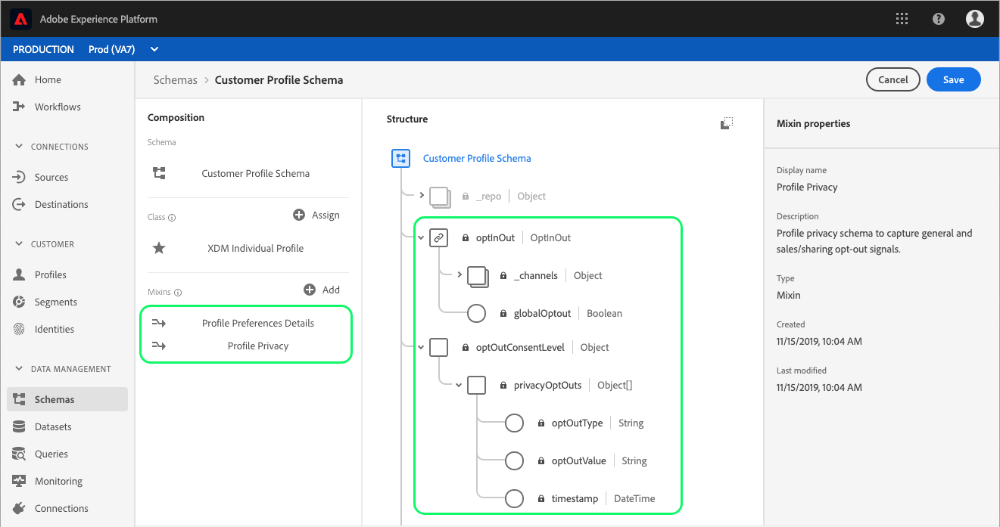

# 支持区段中的退出请求

Adobe Experience Platform允许您的客户发送关于[!DNL Real-time Customer Profile]内数据使用和存储的退出请求。 这些选择退出请求是[!DNL California Consumer Privacy Act](CCPA)的一部分，CCPA为加利福尼亚州居民提供访问和删除个人数据以及了解其个人数据是出售还是披露（以及向谁）的权利。

客户选择退出后，贵组织在为营销活动生成受众时应遵守这些选择退出的规定。 本文档介绍有关遵守退出请求的重要详细信息。

## 入门指南

执行退出请求需要了解涉及的各种[!DNL Adobe Experience Platform]服务。 在处理退出请求之前，请查看以下服务的文档：

- [[!DNL Real-time Customer Profile]](../profile/home.md):根据来自多个来源的汇总数据，实时提供统一的客户用户档案。
- [[!DNL Adobe Experience Platform Segmentation Service]](./home.md):允许您根据数据构建受众 [!DNL Real-time Customer Profile] 细分。
- [[!DNL Experience Data Model (XDM)]](../xdm/home.md):平台组织客户体验数据的标准化框架。
- [[!DNL Adobe Experience Platform Privacy Service]](../privacy-service/home.md):帮助组织自动遵守涉及内部客户数据的数据隐私法规 [!DNL Platform]。

## 选择退出混音

为了满足CCPA选择退出请求，作为模式模式一部分的合并必须包含必要的[!DNL Experience Data Model](XDM)选择退出字段。 有两种混音可用于向模式添加退出字段，下面各节将更详细地介绍它们：

- [用户档案隐私](#profile-privacy):用于捕获不同的退出类型（常规或销售／共享）。
- [用户档案首选项详细信息](#profile-preferences-details):用于捕获特定XDM渠道的退出请求。

有关如何向模式添加混音的分步说明，请参阅以下XDM文档中的“添加混音”部分：
- [模式注册表API教程](../xdm/api/getting-started.md)。:使用模式注册表API构建模式。
- [模式编辑器教程](../xdm/tutorials/create-schema-ui.md):使用平台用户界面构建模式。

下面是一个示例图像，它显示添加到用户界面中的模式的选择退出混音：



以下各节更详细地介绍了每个混音的结构以及它们对模式所贡献的字段。

### [!DNL Profile Privacy] {#profile-privacy}

[!DNL Profile Privacy] mixin允许您捕获来自客户的两种CCPA选择退出请求：

1. 一般退出
2. 销售／共享选择退出


[!DNL Profile Privacy] mixin包含以下字段：

- 隐私退出(`privacyOptOuts`):包含一列表退出对象的数组。
- 退出类型(`optOutType`):选择退出的类型。 此字段是具有两个可能值的枚举：
   - 常规退出(`general_opt_out`)
   - 销售共享退出(`sales_sharing_opt_out`)
- 退出值(`optOutValue`):根据指定的退出类型，退出的激活状态，也称为退出信号的值。 此字段是具有四个可能值的枚举：
   - 未提供(`not_provided`):尚未提供退出请求。
   - 待验证(`pending`):退出请求正在等待验证。
   - 退出(`out`):客户已选择退出。
   - 选择加入(`in`):客户已选择加入。
- 退出时间戳(`timestamp`):接收的退出信号的时间戳。

要视图[!DNL Profile Privacy]混音的完整结构，请参阅[ XDM公共GitHub存储库](https://github.com/adobe/xdm/blob/master/schemas/context/profile-privacy.schema.json)或使用平台UI预览混音。

### [!DNL Profile Preferences Details] {#profile-preferences-details}

[!DNL Profile Preferences Details] mixin提供几个表示客户用户档案偏好的字段(如电子邮件格式、首选语言和时区)。 此混音中包含的一个字段OptInOut(`optInOut`)允许为单个渠道设置退出值。


[!DNL Profile Preferences Details] mixin包含与退出相关的以下字段：

- OptInOut(`optInOut`):一个对象，其中每个键代表通信渠道的有效已知URI以及每个渠道的退出活动状态。 每个渠道可能具有以下四种可能值之一：
   - 未提供(`not_provided`):尚未为此渠道提供退出请求。
   - 待验证(`pending`):此渠道的退出请求正在等待验证。
   - 退出(`out`):客户已选择退出此渠道。
   - 选择加入(`in`):客户已选择加入此渠道。
- 全局退出(`globalOptout`):一个布尔值，当设置为true时，它为用户档案设置全局退出覆盖。 此字段的默认值为false。

以下示例JSON重点说明了OptInOut对象如何针对不同通信渠道捕获多个退出信号：

```json
{
  "xdm:optInOut": {
    "https://ns.adobe.com/xdm/channels/email": "pending",
    "https://ns.adobe.com/xdm/channels/phone": "out",
    "https://ns.adobe.com/xdm/channels/sms": "in",
    "https://ns.adobe.com/xdm/channels/fax": "not_provided",
    "https://ns.adobe.com/xdm/channels/direct-mail": "not_provided",
    "https://ns.adobe.com/xdm/channels/apns": "not_provided",
    "xdm:globalOptout": false
  }
}
```

要视图“用户档案首选项详细信息”混音的完整结构，请访问[ XDM公共GitHub存储库](https://github.com/adobe/xdm/blob/master/schemas/context/profile-preferences-details.schema.json)或使用[!DNL Platform] UI预览混音。

## 在分段中处理退出功能

为了确保标记有CCPA退出标志的用户档案不包括在区段中，必须向现有区段中添加特殊字段，或在创建区段时包括特殊字段。

以下各节演示如何为两种类型的退出标记添加相应的字段：
1. 一般退出
2. 销售／共享选择退出

### 一般退出

[!DNL Segmentation] 自动接受所有包含“一[!UICONTROL 般退出]”标志的用户档案，这意味着默认情况下，这些用户档案不会包括在受众或出口中。但是，最好添加相应的字段以确保选择退出用户档案不包括在受众和营销活动中。

可通过添加&#x200B;**[!UICONTROL 隐私退出]**&#x200B;属性，使用用户界面完成此操作。 在此实例中，区段设置为仅包含已选择的用户(这意味着他们的用户档案上没有一般选择退出标志)。 这是通过声明“[!UICONTROL 退出类型]”等于“[!UICONTROL 一般退出]”和“[!UICONTROL 退出值]”等于“[!UICONTROL 退出]”来实现的。


### 销售／共享选择退出

如果用户在其用户档案上设置了销售／共享退出标志，则此用户档案不应再用于任何区段创建或营销活动。 为确保遵守此标志，“[!UICONTROL 退出类型]”必须等于“[!UICONTROL 销售共享退出]”，而“[!UICONTROL 退出值]”必须等于“[!UICONTROL 退出]”。


<!-- ### Overriding default exclusions

In some instances, such as building a segment of people who have opted out, it may be necessary to override the default exclusion of opted-out profiles. This override can be done via the API or in the Segment Builder user interface. -->

## 后续步骤

有关分段的详细信息(包括通过API和用户界面使用段定义和受众)，请首先阅读[分段概述](./home.md)。

要进一步了解[!DNL Platform]中的数据隐私，包括[!DNL Privacy Service]如何帮助促进自动遵守法律和组织隐私法规，请参阅[[!DNL Privacy Service]](../privacy-service/home.md)上的文档。
