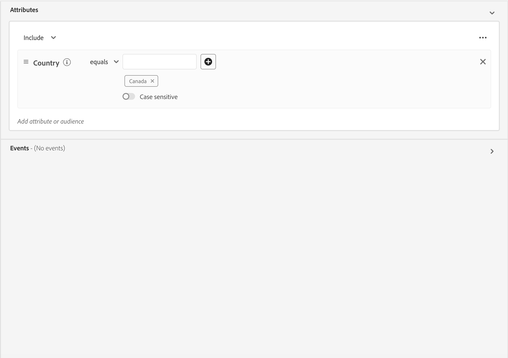
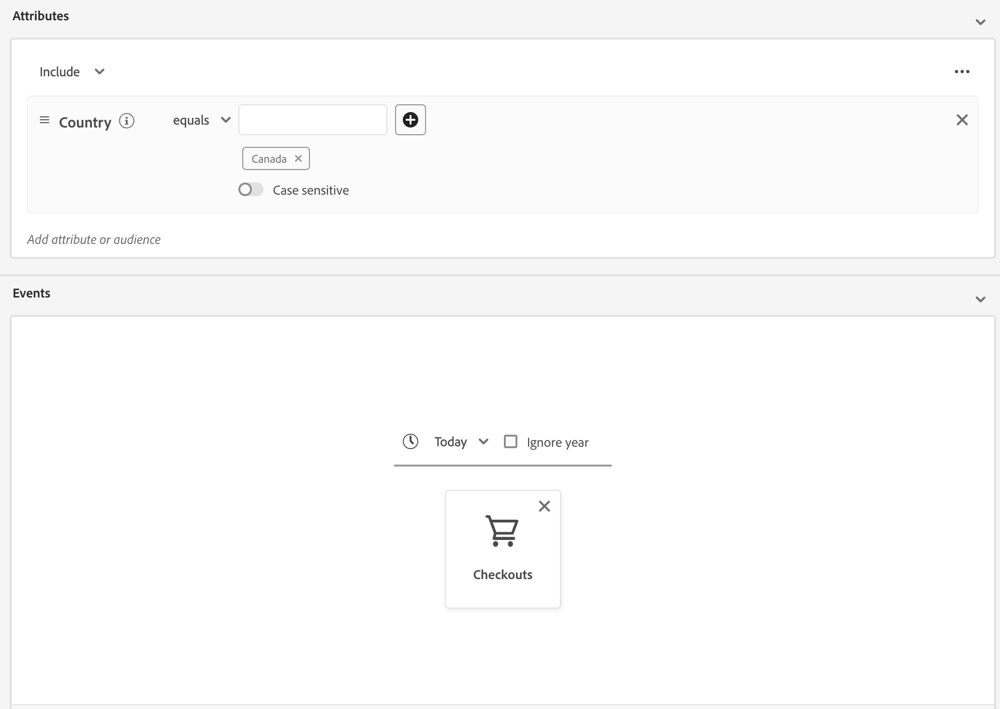
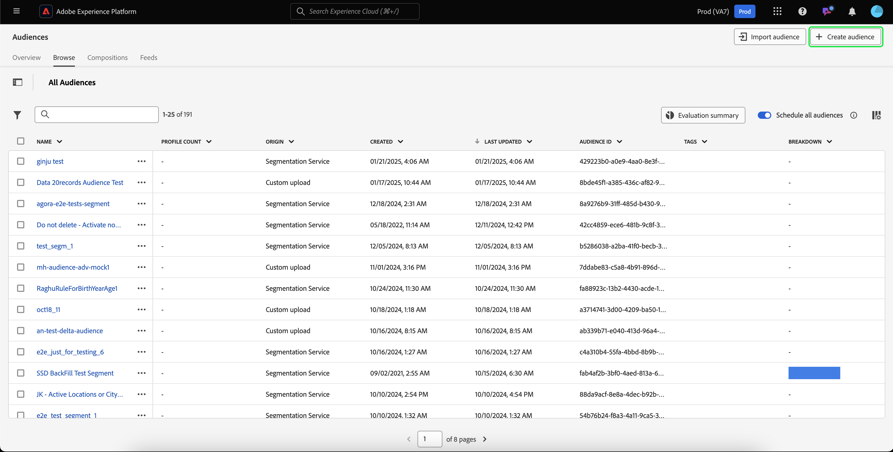
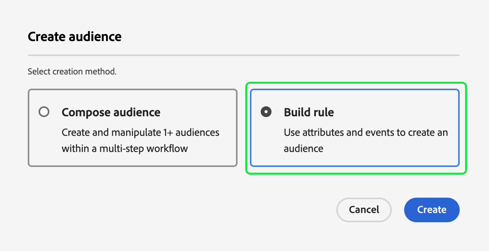
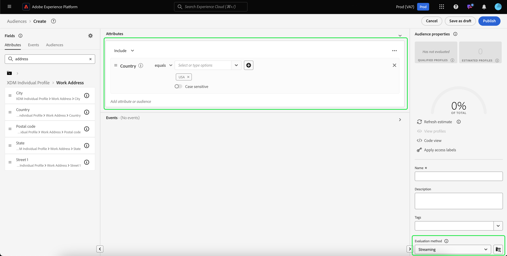
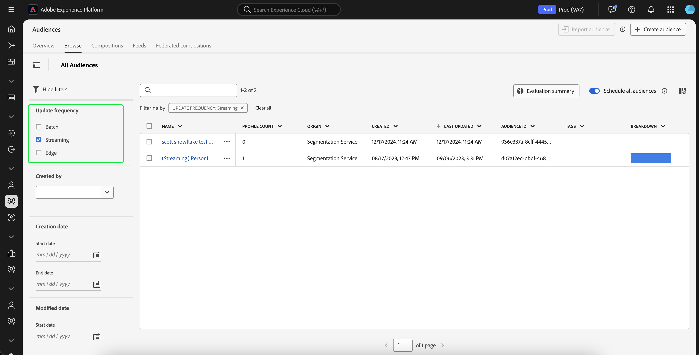

# 流分段指南

>[!BEGINSHADEBOX]

>[!NOTE]
>
>流分段资格标准已于2025年5月20日更新。

+++资格更新

>[!IMPORTANT]
>
>当前使用流或边缘分段评估的所有现有区段定义将继续按原样工作，除非进行编辑或更新。

## 规则集 {#ruleset}

任何与以下规则集匹配的&#x200B;**新的或已编辑的**&#x200B;段定义将&#x200B;**不再**&#x200B;使用流或边缘分段进行评估。 相反，将使用批量分段来评估它们。

- 时间范围超过24小时的单个事件
   - 激活过去3天内查看过网页的所有个人资料的受众。
- 没有时间范围的单个事件
   - 使用查看过网页的所有配置文件激活受众。

## 时间窗口 {#time-window}

为了使用流式分段评估受众，必须将其&#x200B;**限制在24小时时间范围内**。

## Including batch data in streaming audiences {#include-batch-data}

>[!NOTE]
>
>要在使用批量数据时保持流分段准确，请确保批量数据&#x200B;**仅**&#x200B;保留在批量受众中并在流受众中引用。

在此更新之前，您可以创建结合批量数据源和流数据源的流受众定义。 但是，随着最新更新，将使用批量分段来评估使用批量数据源和流数据源创建受众的情况。

如果需要使用与更新后的规则集匹配的流或边缘分段来评估区段定义，则需要显式创建批和流规则集，并使用区段分段组合它们。 此批处理规则集&#x200B;**必须**&#x200B;基于配置文件架构。

例如，假设您有两个受众，其中一个受众住房配置文件架构数据，另一个受众住房体验事件架构数据：

| 受众 | 架构 | 源类型 | 查询定义 | 受众 ID |
| -------- | ------ | ----------- | ---------------- | ----------- |
| 加州居民 | 轮廓 | 批次 | 家庭地址在加利福尼亚州 | `e3be6d7f-1727-401f-a41e-c296b45f607a` |
| 最近签出 | 体验事件 | 流传输 | 过去24小时内至少有一个结帐 | `9e1646bb-57ff-4309-ba59-17d6c5bab6a1` |

如果要在流式处理受众中使用批量组件，则需要使用区段段引用批量受众。

因此，将两个受众结合在一起的规则集示例如下所示：

```
inSegment("e3be6d7f-1727-401f-a41e-c296b45f607a") and 
CHAIN(xEvent, timestamp, [C0: WHAT(eventType.equals("commerce.checkouts", false)) 
WHEN(<= 24 hours before now)])
```

将使用流分段来评估生成的受众&#x200B;**，因为它通过引用批量受众组件来利用批量受众的成员资格。

但是，如果要将两个受众与事件数据合并，则&#x200B;**不能**&#x200B;仅合并这两个事件。 您需要创建这两个受众，然后创建另一个使用`inSegment`来引用这两个受众的受众。

例如，假设您有两个受众，两个受众都存放了体验活动模式数据：

| 受众 | 架构 | 源类型 | 查询定义 | 受众 ID |
| -------- | ------ | ----------- | ---------------- | ----------- |
| 最近的放弃 | 体验事件 | 批次 | 过去24小时内至少有一个放弃事件 | `e3be6d7f-1727-401f-a41e-c296b45f607a` |
| 最近签出 | 体验事件 | 流传输 | 过去24小时内至少有一个结帐 | `9e1646bb-57ff-4309-ba59-17d6c5bab6a1` |

在这种情况下，您需要创建第三个受众，如下所示：

```
inSegment("e3be6d7f-1727-401f-a41e-c296b45f607a") and inSegment("9e1646bb-57ff-4309-ba59-17d6c5bab6a1")
```

>[!IMPORTANT]
>
>与规则集匹配的所有现有区段定义将使用流或边缘区段进行评估，直到对其进行编辑为止。
>
>此外，当前满足其它流或边缘分段评估标准的所有现有分段定义将用流或边缘分段保持评估。

## 合并策略 {#merge-policy}

符合流分段或边缘分段&#x200B;**条件的任何**&#x200B;新的或编辑的&#x200B;**分段定义**&#x200B;必须位于“边缘上活动”合并策略上。

如果没有活动合并策略集，则需要[配置合并策略](../../profile/merge-policies/ui-guide.md#configure)，并将其设置为在边缘上处于活动状态。


+++

>[!ENDSHADEBOX]

流分段是指在关注数据丰富性的同时，在Adobe Experience Platform中实时评估受众的能力。

有了流分段，当流数据进入Experience Platform时，观众资格鉴定就会发生，从而减少了安排和运行分段作业的需要。 这样，您就可以在数据传入Experience Platform时对其进行评估，从而使受众会员资格自动保持最新。

## 符合条件的规则集 {#rulesets}

>[!IMPORTANT]
>
>要使用流分段，您&#x200B;**必须**&#x200B;使用“Active on Edge”的合并策略。 如需了解有关合并策略的更多信息，请参阅[合并策略概述](../../profile/merge-policies/overview.md)。

如果规则集符合下表概述的任何标准，则它有资格进行流分段。

>[!NOTE]
>
>要使流分段正常工作，您需要为组织启用计划分段。 有关启用计划分段的详细信息，请参阅[受众门户概述](../ui/audience-portal.md#scheduled-segmentation)。

| 查询类型 | 详细信息 | 查询 | 示例 |
| ---------- | ------- | ----- | ------- |
| 少于24小时时间范围内的单个事件 | 任何涉及少于24小时时间范围内的单个传入事件的区段定义。 | `CHAIN(xEvent, timestamp, [C0: WHAT(eventType.equals("commerce.checkouts", false)) WHEN(today)])` |  |
| 仅配置文件 | 仅引用配置文件属性的任何区段定义。 | `homeAddress.country.equals("Canada", false)` |  |
| 在相对时间范围小于24小时内的配置文件属性为单个事件 | 任何段定义，它是指具有一个或多个配置文件属性的单个传入事件，并且在小于24小时的相对时间范围内发生。 | `workAddress.country.equals("Canada", false) and CHAIN(xEvent, timestamp, [C0: WHAT(eventType.equals("commerce.checkouts", false)) WHEN(today)])` |  |
| 24小时相对时间范围内的多个事件 | 任何在过去24小时&#x200B;**内引用多个事件**&#x200B;且（可选）具有一个或多个配置文件属性的区段定义。 | `workAddress.country.equals("US", false) and CHAIN(xEvent, timestamp, [C0: WHAT(eventType.equals("directMarketing.emailClicked", false)) WHEN(today), C1: WHAT(eventType.equals("commerce.checkouts", false)) WHEN(today)])` |  |

在以下情况下，区段定义&#x200B;**不**&#x200B;适用于流分段：

- 区段定义包括Adobe Audience Manager (AAM)区段或特征。
- 区段定义包括多个实体（多实体查询）。
- 段定义包括单个事件和`inSegment`事件的组合。
   - 例如，将以下内容链接到一个规则集中： `inSegment("e3be6d7f-1727-401f-a41e-c296b45f607a") and  CHAIN(xEvent, timestamp, [C0: WHAT(eventType.equals("commerce.checkouts", false))  WHEN(<= 24 hours before now)])`。
- 段定义使用“忽略年份”作为其时间约束的一部分。

请注意以下适用于流分段查询的准则：

| 查询类型 | 指南 |
| ---------- | -------- |
| 单事件规则集 | 回溯窗口限制为&#x200B;**一天**。 |
| 使用事件历史记录进行查询 | <ul><li>回溯窗口限制为&#x200B;**一天**。</li><li>事件之间必须存在严格的时间排序条件&#x200B;**&#x200B;**。</li><li>支持具有至少一个否定事件的查询。 但是，整个事件&#x200B;**不能**&#x200B;为负数。</li></ul> |

如果修改了段定义，使其不再符合流分段标准，则段定义将自动从“流”切换到“批”。

此外，与区段资格鉴定类似，区段资格鉴定也会实时发生。 因此，如果受众不再符合某一区段的条件，则将立即失去该区段的条件。 例如，如果区段定义要求“所有在过去三个小时内购买红鞋的用户”，则最初符合区段定义的所有配置文件将不符合条件。

### 合并受众 {#combine-audiences}

为了合并来自批处理源和流源的数据，您需要将批处理组件和流组件分离为单独的受众。

### 配置文件属性和体验事件 {#profile-and-event}

例如，让我们考虑以下两个受众示例：

| 受众 | 架构 | 源类型 | 查询定义 | 受众 ID |
| -------- | ------ | ----------- | ---------------- | ----------- |
| 加州居民 | 轮廓 | 批次 | 家庭地址在加利福尼亚州 | `e3be6d7f-1727-401f-a41e-c296b45f607a` |
| 最近签出 | 体验事件 | 流传输 | 过去24小时内至少有一个结帐 | `9e1646bb-57ff-4309-ba59-17d6c5bab6a1` |

如果要在流式处理受众中使用批量组件，则需要使用区段段引用批量受众。

因此，将两个受众结合在一起的规则集示例如下所示：

```
inSegment("e3be6d7f-1727-401f-a41e-c296b45f607a") and 
CHAIN(xEvent, timestamp, [C0: WHAT(eventType.equals("commerce.checkouts", false)) 
WHEN(<= 24 hours before now)])
```

将使用流分段来评估生成的受众&#x200B;**，因为它通过引用批量受众组件来利用批量受众的成员资格。

### 多个体验事件 {#two-events}

如果要将多个受众与事件数据合并，则&#x200B;**不能**&#x200B;仅合并事件。 您需要为每个活动创建一个受众，然后创建另一个使用`inSegment`来引用所有受众的受众。

例如，假设您有两个受众，两个受众都存放了体验活动模式数据：

| 受众 | 架构 | 源类型 | 查询定义 | 受众 ID |
| -------- | ------ | ----------- | ---------------- | ----------- |
| 最近的放弃 | 体验事件 | 批次 | 在过去48小时内至少有一个放弃事件 | `7deb246a-49b4-4687-95f9-6316df049948` |
| 最近结帐 | 体验事件 | 流传输 | 过去24小时内至少有一个结帐 | `9e1646bb-57ff-4309-ba59-17d6c5bab6a1` |

在这种情况下，您需要创建第三个受众，如下所示：

```
inSegment("7deb246a-49b4-4687-95f9-6316df049948) and inSegment("9e1646bb-57ff-4309-ba59-17d6c5bab6a1")
```

## 创建受众 {#create-audience}

您可以使用分段服务API或通过用户界面中的受众门户创建使用流分段进行评估的受众。

如果区段定义与[符合条件的规则集](#eligible-rulesets)之一，则可以启用流式处理。

>[!BEGINTABS]

>[!TAB 分段服务API]

**API格式**

```http
POST /segment/definitions
```

**请求**

+++ 用于创建启用了流分段的段定义的示例请求

```shell
curl -X POST https://platform.adobe.io/data/core/ups/segment/definitions
 -H 'Authorization: Bearer {ACCESS_TOKEN}' \
 -H 'Content-Type: application/json' \
 -H 'x-gw-ims-org-id: {ORG_ID}' \
 -H 'x-api-key: {API_KEY}' \
 -H 'x-sandbox-name: {SANDBOX_NAME}'
 -d '{
        "name": "People in the USA",
        "description: "An audience that looks for people who live in the USA",
        "expression": {
            "type": "PQL",
            "format": "pql/text",
            "value": "homeAddress.country = \"US\""
        },
        "evaluationInfo": {
            "batch": {
                "enabled": false
            },
            "continuous": {
                "enabled": true
            },
            "synchronous": {
                "enabled": false
            }
        },
        "schema": {
            "name": "_xdm.context.profile"
        }
     }'
```

+++

**响应**

成功响应将返回HTTP状态200，其中包含新创建的区段定义的详细信息。

+++创建段定义时的示例响应。

```json
{
    "id": "4afe34ae-8c98-4513-8a1d-67ccaa54bc05",
    "schema": {
        "name": "_xdm.context.profile"
    },
    "profileInstanceId": "ups",
    "imsOrgId": "{ORG_ID}",
    "sandbox": {
        "sandboxId": "28e74200-e3de-11e9-8f5d-7f27416c5f0d",
        "sandboxName": "prod",
        "type": "production",
        "default": true
    },
    "name": "People in the USA",
    "description": "An audience that looks for people who live in the USA",
    "expression": {
        "type": "PQL",
        "format": "pql/text",
        "value": "homeAddress.country = \"US\""
    },
    "evaluationInfo": {
        "batch": {
            "enabled": false
        },
        "continuous": {
            "enabled": true
        },
        "synchronous": {
            "enabled": false
        }
    },
    "dataGovernancePolicy": {
        "excludeOptOut": true
    },
    "creationTime": 0,
    "updateEpoch": 1579292094,
    "updateTime": 1579292094000
}
```

+++

有关使用此终结点的详细信息，请参阅[段定义终结点指南](../api/segment-definitions.md)。

>[!TAB 受众门户]

在受众门户中，选择&#x200B;**[!UICONTROL Create audience]**。



此时会出现弹出窗口。 选择&#x200B;**[!UICONTROL Build rules]**&#x200B;以输入区段生成器。



在区段生成器中，创建与[符合条件的规则集](#eligible-rulesets)之一匹配的区段定义。 如果区段定义符合流式处理区段的条件，则可以选择&#x200B;**[!UICONTROL Streaming]**&#x200B;作为&#x200B;**[!UICONTROL Evaluation method]**。



要了解有关创建区段定义的更多信息，请参阅[区段生成器指南](../ui/segment-builder.md)

>[!ENDTABS]

## 检索受众 {#retrieve-audiences}

您可以使用分段服务API或通过UI中的受众门户检索通过流分段进行评估的所有受众。

>[!BEGINTABS]

>[!TAB 分段服务API]

通过向`/segment/definitions`终结点提出GET请求，检索使用组织内的流分段进行评估的所有区段定义的列表。

**API格式**

必须在请求路径中包括查询参数`evaluationInfo.synchronous.enabled=true`，才能检索使用流分段计算的段定义。

```http
GET /segment/definitions?evaluationInfo.continuous.enabled=true
```

**请求**

+++ 列出所有启用了流的段定义的示例请求

```shell
curl -X GET 'https://platform.adobe.io/data/core/ups/segment/definitions?evaluationInfo.continuous.enabled=true' \
  -H 'Authorization: Bearer {ACCESS_TOKEN}' \
  -H 'Content-Type: application/json' \
  -H 'x-api-key: {API_KEY}' \
  -H 'x-gw-ims-org-id: {ORG_ID}' \
  -H 'x-sandbox-name: {SANDBOX_NAME}'
```

+++

**响应**

成功的响应返回HTTP状态200，其中包含您的组织中启用了流分段的一系列段定义。

+++包含组织中所有启用了流分段定义的列表的示例响应

```json
{
    "segments": [
        {
            "id": "15063cb-2da8-4851-a2e2-bf59ddd2f004",
            "schema": {
                "name": "_xdm.context.profile"
            },
            "ttlInDays": 30,
            "imsOrgId": "{ORG_ID}",
            "sandbox": {
                "sandboxId": "",
                "sandboxName": "",
                "type": "production",
                "default": true
            },
            "name": " People who are NOT on their homepage ",
            "expression": {
                "type": "PQL",
                "format": "pql/text",
                "value": "select var1 from xEvent where var1._experience.analytics.endUser.firstWeb.webPageDetails.isHomePage = false"
            },
            "evaluationInfo": {
                "batch": {
                    "enabled": false
                },
                "continuous": {
                    "enabled": true
                },
                "synchronous": {
                    "enabled": false
                }
            },
            "creationTime": 1572029711000,
            "updateEpoch": 1572029712000,
            "updateTime": 1572029712000
        },
        {
            "id": "f15063cb-2da8-4851-a2e2-bf59ddd2f004",
            "schema": {
                "name": "_xdm.context.profile"
            },
            "ttlInDays": 30,
            "imsOrgId": "{ORG_ID}",
            "sandbox": {
                "sandboxId": "",
                "sandboxName": "",
                "type": "production",
                "default": true
            },
            "name": "Homepage_continuous",
            "description": "People who are on their homepage - continuous",
            "expression": {
                "type": "PQL",
                "format": "pql/text",
                "value": "select var1 from xEvent where var1._experience.analytics.endUser.firstWeb.webPageDetails.isHomePage = true"
            },
            "evaluationInfo": {
                "batch": {
                    "enabled": true
                },
                "continuous": {
                    "enabled": true
                },
                "synchronous": {
                    "enabled": false
                }
            },
            "creationTime": 1572021085000,
            "updateEpoch": 1572021086000,
            "updateTime": 1572021086000
        }
    ],
    "page": {
        "totalCount": 2,
        "totalPages": 1,
        "sortField": "creationTime",
        "sort": "desc",
        "pageSize": 2,
        "limit": 100
    },
    "link": {}
}
```

有关返回的段定义的更多详细信息，可在[段定义终结点指南](../api/segment-definitions.md)中找到。

+++

>[!TAB 受众门户]

您可以使用Audience Portal中的筛选器检索组织中启用了流分段的所有受众。 选择以显示筛选器列表。


在可用的筛选器中，转到&#x200B;**[!UICONTROL Update frequency]**&#x200B;并选择“[!UICONTROL Streaming]”。 使用此过滤器可显示组织中通过流分段进行评估的所有受众。



要了解有关在Experience Platform中查看受众的更多信息，请阅读[受众门户指南](../ui/audience-portal.md)。

>[!ENDTABS]

## 受众详情 {#audience-details}

通过在Audience Portal中选择流分段，可查看使用流分段评估的特定受众的详细信息。

在Audience Portal上选择受众后，将显示audience details页面。 这将显示有关受众的信息，包括受众详细信息摘要、一段时间内合格配置文件的数量，以及受众激活到的目标位置。


对于启用流式处理的受众，将显示&#x200B;**[!UICONTROL Profiles over time]**&#x200B;卡，其中显示符合条件的受众总数和更新的受众指标。

**[!UICONTROL Total qualified]**&#x200B;度量表示基于对此受众的批处理评估和流评估的合格受众的总数。

**[!UICONTROL New audience updated]**&#x200B;度量由显示通过流分段而导致的受众大小变化的线形图表示。 您可以调整下拉菜单以显示过去24小时、上周或过去30天。


有关受众详细信息的更多详细信息，请阅读[受众门户概述](../ui/audience-portal.md#audience-details)。

## 后续步骤

本指南说明支持流的区段定义如何在Adobe Experience Platform上工作，以及如何监视支持流的区段定义。

要了解有关使用Adobe Experience Platform用户界面的更多信息，请阅读[分段用户指南](./overview.md)。

有关流分段的常见问题，请参阅常见问题[的](../faq.md#streaming-segmentation)流分段部分。
