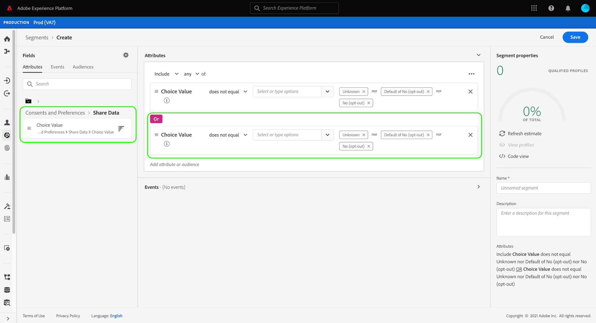

# 在区段定义中遵循同意

>[!NOTE]
>
>本指南介绍如何在&#x200B;**区段定义**&#x200B;中遵循同意。

法律隐私法规(如[!DNL California Consumer Privacy Act] (CCPA))为消费者提供了选择退出收集其个人数据或与第三方共享其个人数据的权利。 Adobe Experience Platform提供了标准体验数据模型(XDM)组件，这些组件旨在捕获实时客户配置文件数据中的这些客户同意偏好设置。

如果客户撤回或拒绝同意共享其个人数据，则贵组织在为营销活动生成受众时务必遵循该偏好设置。 本文档介绍如何使用Experience Platform用户界面在区段定义中集成客户同意值。

## 快速入门

要遵循客户同意值，必须了解所涉及的各种[!DNL Adobe Experience Platform]服务。 在开始本教程之前，请确保您熟悉以下服务：

* [[!DNL Experience Data Model (XDM)]](../../xdm/home.md)： Platform用于组织客户体验数据的标准化框架。
* [[!DNL Real-Time Customer Profile]](../../profile/home.md)：根据来自多个源的汇总数据，实时提供统一的客户个人资料。
* [[!DNL Adobe Experience Platform Segmentation Service]](../home.md)：允许您从[!DNL Real-Time Customer Profile]数据构建受众。

## 同意架构字段

为了遵循客户同意和偏好设置，作为您的[!UICONTROL XDM个人资料]合并架构的一部分的架构必须包含标准字段组&#x200B;**[!UICONTROL 同意和偏好设置]**。

有关字段组提供的每个属性的结构和预期用例的详细信息，请参阅[同意和偏好设置参考指南](../../xdm/field-groups/profile/consents.md)。 有关如何将字段组添加到架构的分步说明，请参阅[XDM UI指南](../../xdm/ui/resources/schemas.md#add-field-groups)。

一旦字段组被添加到启用了[配置文件的架构](../../xdm/ui/resources/schemas.md#profile)中，并且其字段已用于从体验应用程序中摄取同意数据，您就可以在区段规则中使用收集的同意属性。

## 在分段中处理同意

为了确保选择退出的用户档案未包含在区段定义中，必须将特殊字段添加到现有区段定义并在创建任何新区段定义时包含在内。

以下步骤演示了如何为两种类型的选择退出标记添加相应的字段：

1. [!UICONTROL 数据收集]
1. [!UICONTROL 共享数据]

>[!NOTE]
>
>虽然本指南重点介绍上述两个选择退出标记，但您也可以配置区段定义以纳入其他同意信号。 [同意和偏好设置参考指南](../../xdm/field-groups/profile/consents.md)提供了有关每个选项及其预期使用案例的更多信息。

在UI中的&#x200B;**[!UICONTROL 属性]**&#x200B;下构建区段定义时，导航到&#x200B;**[!UICONTROL XDM个人资料]**，然后选择&#x200B;**[!UICONTROL 同意和偏好设置]**，随后选择&#x200B;**[!UICONTROL 特定的ID]**。 从这里，您可以看到&#x200B;**[!UICONTROL 数据收集]**&#x200B;和&#x200B;**[!UICONTROL 共享数据]**&#x200B;的选项。

首先选择&#x200B;**[!UICONTROL 数据收集]**&#x200B;类别，然后将&#x200B;**[!UICONTROL 选择值]**&#x200B;拖到区段生成器中。 将属性添加到区段定义时，您可以指定必须包含或排除的[同意值](../../xdm/field-groups/profile/consents.md#choice-values)。

一种方法是排除任何选择不收集其数据的客户。 为此，请将运算符设置为&#x200B;**[!UICONTROL 不等于]**，然后选择以下值：

* **[!UICONTROL 否（选择退出）]**
* **[!UICONTROL 默认为“否（选择退出）”]**
* **[!UICONTROL 未知]**（如果假定拒绝同意，则为未知）

在左边栏中的&#x200B;**[!UICONTROL 属性]**&#x200B;下，导航回&#x200B;**[!UICONTROL 同意和偏好设置]**&#x200B;部分，然后选择&#x200B;**[!UICONTROL 共享数据]**。 将其对应的&#x200B;**[!UICONTROL 选择值]**&#x200B;拖到画布中，然后选择与[!UICONTROL 数据收集]选择值相同的值。 请确保两个属性之间建立了&#x200B;**[!UICONTROL Or]**&#x200B;关系。

在将&#x200B;**[!UICONTROL 数据收集]**&#x200B;和&#x200B;**[!UICONTROL 共享数据]**&#x200B;同意值添加到区段定义后，任何已选择退出使用其数据的客户都将从生成的受众中排除。 在选择&#x200B;**[!UICONTROL 保存]**&#x200B;以完成该过程之前，您可以在此处继续自定义区段定义。

## 后续步骤

现在，通过学习本教程，您应该能够更好地了解在Experience Platform中构建区段定义时如何遵循客户同意和偏好设置。

有关在Platform中管理同意的更多信息，请参阅以下文档：

* [使用Adobe标准进行同意处理](../../landing/governance-privacy-security/consent/adobe/overview.md)
* [使用IAB TCF 2.0标准进行同意处理](../../landing/governance-privacy-security/consent/iab/overview.md)