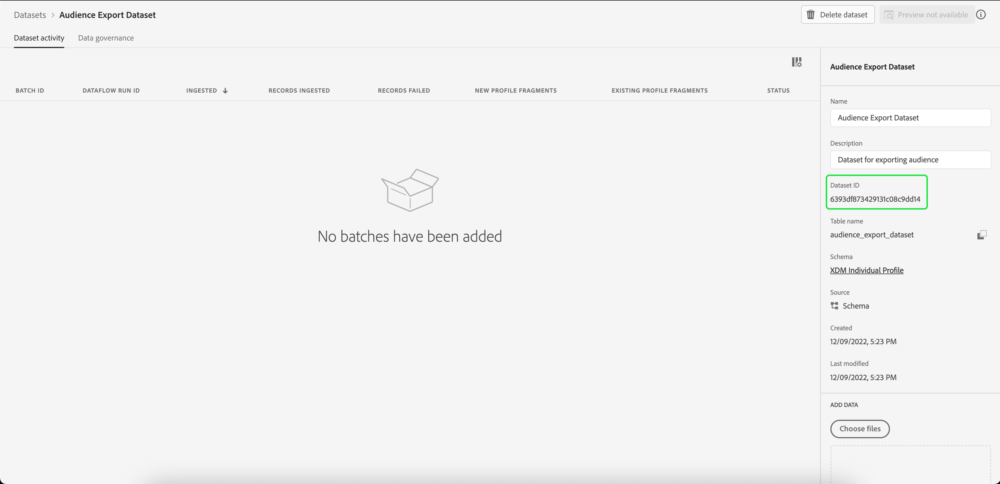

# 创建数据集以导出受众

[!DNL Adobe Experience Platform] 允许您根据特定属性将客户配置文件划分为受众。 创建区段定义后，您可以将生成的受众导出到可在其中进行访问和操作的数据集。 为了成功导出，必须正确配置数据集。

本教程将介绍创建数据集所需的步骤，该数据集可用于使用导出受众 [!DNL Experience Platform] UI。

本教程与以下教程中概述的步骤直接相关： [评估和访问分段结果](./evaluate-a-segment.md). 区段定义评估教程提供了使用创建数据集的步骤。 [!DNL Catalog Service] API，而本教程则概述了使用创建数据集的步骤 [!DNL Experience Platform] UI。

## 快速入门

要导出受众，数据集必须基于 [!DNL XDM Individual Profile Union Schema]. 合并架构是系统生成的只读架构，它聚合共享同一类的所有架构的字段。 有关合并模式的更多信息，请参阅以下指南： [模式组合的基础知识](../../xdm/schema/composition.md#union).

要在UI中查看合并架构，请选择 **[!UICONTROL 配置文件]** 在左侧导航中，然后选择 **[!UICONTROL 合并架构]** 如下所示。

## 数据集工作区

此 [!UICONTROL 数据集] 工作区允许您查看和管理组织的所有数据集。

选择 **[!UICONTROL 数据集]** 在左侧导航中访问工作区，然后选择 **[!UICONTROL 浏览]**. 此选项卡显示数据集及其详细信息的列表。 根据每列的宽度，您可能需要向左或向右滚动才能查看所有列。

>[!NOTE]
>
>选择搜索栏旁边的过滤器图标可使用过滤功能仅查看那些启用的数据集 [!DNL Real-Time Customer Profile].

## 创建数据集

要创建数据集，请选择 **[!UICONTROL 创建数据集]**.

在下一个屏幕上，选择 **[!UICONTROL 从架构创建数据集]**.

## 选择XDM Individual Profile Union架构

要选择 [!DNL XDM Individual Profile Union Schema] 要在您的数据集中使用，请找到&quot;[!UICONTROL XDM个人资料]上的“ ”架构 **[!UICONTROL 选择架构]** 屏幕。 选择架构后，您可以确认它是否是下的合并架构 **[!UICONTROL API使用情况]** 在右边栏中。 如果 [!UICONTROL 架构] 路径结束于 `_union`，它是一个合并架构。

>[!NOTE]
>
>尽管联合架构按定义参与了Real-time Customer Profile，但由于与传统架构不同，它们没有启用Profile，因此被列为“未启用”。

选择旁边的单选按钮 **[!UICONTROL XDM个人资料]**，然后选择 **[!UICONTROL 下一个]**.

## 配置数据集

在下一个屏幕上，必须为数据集提供一个名称。 您还可以添加可选描述。

**有关数据集名称的注释：**

* 数据集名称应简短且具有描述性，以便以后可以在库中轻松找到数据集。
* 数据集名称必须是唯一的，这意味着它们也应当足够具体，以便将来不会重复使用。
* 您应使用描述字段提供有关数据集的附加信息，因为它可能有助于其他用户将来区分数据集。

在数据集具有名称和描述后，选择 **[!UICONTROL 完成]**.

## 数据集活动

创建数据集后，您将获得该数据集的活动页面。 您应该会在工作区的左上角看到数据集的名称，并显示“未添加任何批次”的通知。 这是正常情况，因为您尚未将任何批次添加到此数据集。

右边栏包含与新数据集相关的信息，例如数据集ID、名称、描述、架构等。 请记下 **[!UICONTROL 数据集Id]**，因为完成受众导出工作流需要此值。

## 后续步骤

现在，您已基于以下内容创建数据集： [!DNL XDM Individual Profile Union Schema]，则可以使用数据集ID继续 [评估和访问区段定义结果](./evaluate-a-segment.md) 教程。

此时，请返回到“评估区段定义结果”教程，并从 [为受众成员生成用户档案](./evaluate-a-segment.md#generate-profiles) 导出受众工作流的步骤。
