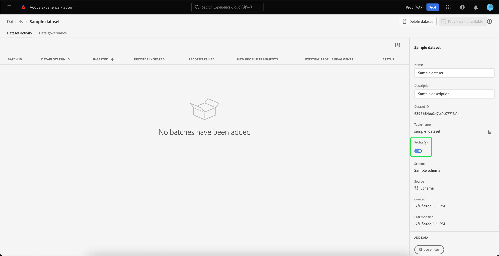

# 导入和使用外部受众

>[!IMPORTANT]
>
>此文档包含来自受众文档早期版本的信息，因此已经过期。

Adobe Experience Platform支持导入外部受众的功能，这些受众随后可用作新受众的组件。 本文档提供了有关设置Experience Platform以导入和使用外部受众的教程。

## 快速入门

本教程需要对创建受众中涉及的各种[!DNL Adobe Experience Platform]服务有一定的了解。 在开始本教程之前，请查看以下服务的文档：

- [分段服务](../home.md)：允许您根据实时客户个人资料数据构建受众。
- [实时客户个人资料](../../profile/home.md)：根据来自多个来源的汇总数据提供统一的实时客户个人资料。
- [体验数据模型(XDM)](../../xdm/home.md)： Experience Platform用于组织客户体验数据的标准化框架。 为了更好地利用分段，请确保根据用于数据建模的[最佳实践](../../xdm/schema/best-practices.md)，将您的数据作为配置文件和事件摄取。
- [数据集](../../catalog/datasets/overview.md)： Experience Platform中用于数据持久性的存储和管理结构。
- [流式摄取](../../ingestion/streaming-ingestion/overview.md)： Experience Platform如何从客户端和服务器端设备实时摄取和存储数据。

### 受众与区段定义

在开始导入和使用外部受众之前，请务必了解受众和区段定义之间的差异。

受众是指您尝试过滤的一组用户档案。 使用区段定义时，您可以通过创建区段定义来创建受众，该定义会将您的配置文件过滤到符合区段资格标准的子集。

区段定义包括名称、描述、表达式（如果适用）、创建日期、上次修改日期和ID等信息。 ID可将区段元数据链接到符合区段资格并属于生成受众的个别用户档案。

| 受众 | 区段定义 |
| --------- | ---------------- |
| 您正在尝试查找的一组配置文件。 使用区段定义时，这意味着它将是符合区段资格的用户档案组。 | 一组规则，用于对您要查找的受众进行分段。 |

## 为外部受众创建身份命名空间

使用外部受众的第一步是创建身份命名空间。 身份命名空间允许Experience Platform关联受众源自何处。

要创建身份命名空间，请按照[身份命名空间指南](../../identity-service/features/namespaces.md#manage-namespaces)中的说明操作。 创建身份命名空间时，请将源详细信息添加到身份命名空间，并将其[!UICONTROL Type]标记为&#x200B;**[!UICONTROL 非人员标识符]**。


## 为区段元数据创建架构

创建身份命名空间后，您需要为将创建的区段创建新架构。

要开始撰写架构，请先在左侧导航栏中选择&#x200B;**[!UICONTROL 架构]**，然后在架构工作区的右上角选择&#x200B;**[!UICONTROL 创建架构]**。 在此处，选择&#x200B;**[!UICONTROL 浏览]**&#x200B;以查看所有可用的架构类型。


由于您正在创建区段定义（预定义的类），请选择&#x200B;**[!UICONTROL 使用现有类]**。 现在，选择&#x200B;**[!UICONTROL 区段定义]**&#x200B;类，然后选择&#x200B;**[!UICONTROL 分配类]**。


现在您的架构已创建，您需要指定哪个字段将包含区段ID。 此字段应当标记为主标识，并分配给您之前创建的命名空间。


将`_id`字段标记为主要标识后，选择架构的标题，然后选择标记为&#x200B;**[!UICONTROL 配置文件]**&#x200B;的切换开关。 选择&#x200B;**[!UICONTROL 启用]**&#x200B;以启用[!DNL Real-Time Customer Profile]的架构。


现在，为配置文件启用此架构，并将主标识分配给您创建的非人员身份命名空间。 因此，这意味着使用此架构导入到Experience Platform的区段元数据将被摄取到配置文件中，而不会与其他人员相关的配置文件数据合并。

## 为架构创建数据集

配置架构后，您将需要为区段元数据创建数据集。

要创建数据集，请按照[数据集用户指南](../../catalog/datasets/user-guide.md#create)中的说明操作。 您应该使用&#x200B;**[!UICONTROL 从架构创建数据集]**&#x200B;选项，使用您之前创建的架构。


创建数据集后，继续按照[数据集用户指南](../../catalog/datasets/user-guide.md#enable-profile)中的说明启用此数据集以用于实时客户个人资料。



## 设置和导入受众数据

启用数据集后，现在可以通过UI或使用Experience Platform API将数据发送到Experience Platform中。 您可以通过批量连接或流连接摄取此数据。

### 使用批处理连接摄取数据

要创建批处理连接，您可以按照通用[本地文件上传UI指南](../../sources/tutorials/ui/create/local-system/local-file-upload.md)中的说明进行操作。 有关可结合使用摄取数据的可用源的完整列表，请阅读[源概述](../../sources/home.md)。

### 使用流连接摄取数据

要创建流连接，您可以按照[API教程](../../sources/tutorials/api/create/streaming/http.md)或[UI教程](../../sources/tutorials/ui/create/streaming/http.md)中的说明进行操作。

创建流连接后，您将有权访问唯一的流端点，您可以将数据发送至。 要了解如何将数据发送到这些端点，请阅读有关流式记录数据的[教程](../../ingestion/tutorials/streaming-record-data.md#ingest-data)。


## 受众元数据结构

创建连接后，您现在可以将数据摄取到Experience Platform。

下方显示了外部受众有效负载的元数据示例：

```json
{
    "header": {
        "schemaRef": {
            "id": "https://ns.adobe.com/{TENANT_ID}/schemas/{SCHEMA_ID}",
            "contentType": "application/vnd.adobe.xed-full+json;version=1"
        },
        "imsOrgId": "{ORG_ID}",
        "datasetId": "{DATASET_ID}",
        "source": {
            "name": "Sample External Audience"
        }
    },
    "body": {
        "xdmMeta": {
            "schemaRef": {
                "id": "https://ns.adobe.com/{TENANT_ID}/schemas/{SCHEMA_ID}",
                "contentType": "application/vnd.adobe.xed-full+json;version=1"
            }
        },
        "xdmEntity": {
            "_id": "{SEGMENT_ID}",
            "description": "Sample description",
            "identityMap": {
                "{IDENTITY_NAMESPACE}": [{
                    "id": "{}"
                }]
            },
            "segmentName" : "{SEGMENT_NAME}",
            "segmentStatus": "ACTIVE",
            "version": "1.0"
        }
    }
}
```

| 属性 | 描述 |
| -------- | ----------- |
| `schemaRef` | 架构&#x200B;**必须**&#x200B;引用之前为区段元数据创建的架构。 |
| `datasetId` | 数据集ID **必须**&#x200B;引用之前为刚刚创建的架构创建的数据集。 |
| `xdmEntity._id` | ID **必须**&#x200B;引用了您用作外部受众的相同区段ID。 |
| `xdmEntity.identityMap` | 此部分&#x200B;**必须**&#x200B;包含创建以前创建的命名空间时使用的身份标签。 |
| `{IDENTITY_NAMESPACE}` | 这是以前创建的身份命名空间的标签。 因此，例如，如果您将身份命名空间称为“externalAudience”，则可以将其用作数组的键。 |
| `segmentName` | 您希望外部受众分段依据的区段名称。 |

## 使用导入的受众生成区段

设置导入的受众后，可在分段过程中使用这些受众。 要查找外部受众，请转到区段生成器，然后在&#x200B;**[!UICONTROL 字段]**&#x200B;部分中选择&#x200B;**[!UICONTROL 受众]**&#x200B;选项卡。


## 后续步骤

现在，您可以在区段中使用外部受众，接下来可以使用区段生成器来创建区段。 要了解如何创建区段，请阅读有关创建区段的[教程](./create-a-segment.md)。

## 附录

除了使用导入的外部受众元数据并使用它们创建区段之外，您还可以将外部区段成员资格导入到Experience Platform。

### 设置外部区段成员资格目标架构

要开始撰写架构，请先在左侧导航栏中选择&#x200B;**[!UICONTROL 架构]**，然后在架构工作区的右上角选择&#x200B;**[!UICONTROL 创建架构]**。 在此处，选择&#x200B;**[!UICONTROL XDM个人资料]**。


现在已创建架构，您需要添加区段成员资格字段组作为架构的一部分。 为此，请选择[!UICONTROL 区段成员资格详细信息]，然后选择[!UICONTROL 添加字段组]。


此外，请确保为&#x200B;**[!UICONTROL 配置文件]**&#x200B;标记架构。 要实现此目的，您需要将字段标记为主要标识。


### 设置数据集

创建架构后，您将需要创建一个数据集。

要创建数据集，请按照[数据集用户指南](../../catalog/datasets/user-guide.md#create)中的说明操作。 您应该使用&#x200B;**[!UICONTROL 从架构创建数据集]**&#x200B;选项，使用您之前创建的架构。


创建数据集后，继续按照[数据集用户指南](../../catalog/datasets/user-guide.md#enable-profile)中的说明启用此数据集以用于实时客户个人资料。


## 设置和导入外部受众成员资格数据

启用数据集后，现在可以通过UI或使用Experience Platform API将数据发送到Experience Platform中。 您可以通过批量连接或流连接摄取此数据。

### 使用批处理连接摄取数据

要创建批处理连接，您可以按照通用[本地文件上传UI指南](../../sources/tutorials/ui/create/local-system/local-file-upload.md)中的说明进行操作。 有关可结合使用摄取数据的可用源的完整列表，请阅读[源概述](../../sources/home.md)。

### 使用流连接摄取数据

要创建流连接，您可以按照[API教程](../../sources/tutorials/api/create/streaming/http.md)或[UI教程](../../sources/tutorials/ui/create/streaming/http.md)中的说明进行操作。

创建流连接后，您将有权访问唯一的流端点，您可以将数据发送至。 要了解如何将数据发送到这些端点，请阅读有关流式记录数据的[教程](../../ingestion/tutorials/streaming-record-data.md#ingest-data)。


## 区段成员资格结构

创建连接后，您现在可以将数据摄取到Experience Platform。

下面显示了外部受众成员资格有效负载的示例：

```json
{
    "header": {
        "schemaRef": {
            "id": "https://ns.adobe.com/{TENANT_ID}/schemas/{SCHEMA_ID}",
            "contentType": "application/vnd.adobe.xed-full+json;version=1"
        },
        "imsOrgId": "{ORG_ID}",
        "datasetId": "{DATASET_ID}",
        "source": {
            "name": "Sample External Audience Membership"
        }
    },
    "body": {
        "xdmMeta": {
            "schemaRef": {
                "id": "https://ns.adobe.com/{TENANT_ID}/schemas/{SCHEMA_ID}",
                "contentType": "application/vnd.adobe.xed-full+json;version=1"
            }
        },
        "xdmEntity": {
            "_id": "{UNIQUE_ID}",
            "description": "Sample description",
            "{TENANT_NAME}": {
                "identities": {
                    "{SCHEMA_IDENTITY}": "sample-id"
                }
            },
            "personId" : "sample-name",
            "segmentMembership": {
                "{IDENTITY_NAMESPACE}": {
                    "{EXTERNAL_IDENTITY}": {
                        "status": "realized",
                        "lastQualificationTime": "2022-03-14T:00:00:00Z"
                    }
                }
            }
        }
    }
}
```

| 属性 | 描述 |
| -------- | ----------- |
| `schemaRef` | 架构&#x200B;**必须**&#x200B;引用以前为区段成员资格数据创建的架构。 |
| `datasetId` | 数据集ID **必须**&#x200B;引用之前为刚刚创建的成员资格架构创建的数据集。 |
| `xdmEntity._id` | 一个合适的ID，用于唯一标识数据集中的记录。 |
| `{TENANT_NAME}.identities` | 此部分用于将自定义标识的字段组与您之前导入的用户连接。 |
| `segmentMembership.{IDENTITY_NAMESPACE}` | 这是以前创建的自定义身份命名空间的标签。 因此，例如，如果您将身份命名空间称为“externalAudience”，则可以将其用作数组的键。 |

>[!NOTE]
>
>默认情况下，外部受众成员资格将在30天后删除。 要防止删除并将其保留超过30天，请在引入受众数据时使用`validUntil`字段。 有关此字段的更多信息，请阅读有关[区段成员资格详细信息架构字段组](../../xdm/field-groups/profile/segmentation.md)的指南。
