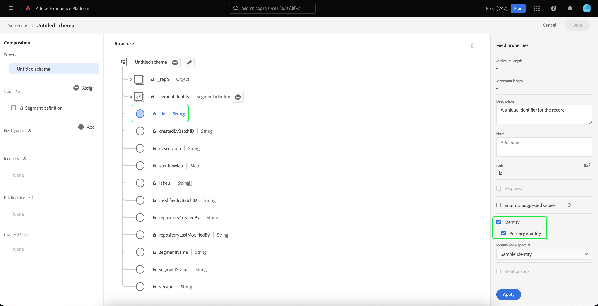

# 导入和使用外部受众

Adobe Experience Platform支持导入外部受众的功能，该功能随后可用作新区段定义的组件。 本文档提供了设置导入和使用外部受众的Experience Platform的教程。

## 快速入门

本教程需要对 [!DNL Adobe Experience Platform] 创建受众区段时涉及的服务。 在开始本教程之前，请查阅以下服务的文档：

- [Segmentation Service](../home.md):允许您根据实时客户资料数据构建受众区段。
- [实时客户资料](../../profile/home.md):根据来自多个来源的汇总数据提供统一的实时客户资料。
- [体验数据模型(XDM)](../../xdm/home.md):Platform用来组织客户体验数据的标准化框架。 为了最好地利用分段，请确保根据 [数据建模最佳实践](../../xdm/schema/best-practices.md).
- [数据集](../../catalog/datasets/overview.md):Experience Platform中数据持久性的存储和管理结构。
- [流式摄取](../../ingestion/streaming-ingestion/overview.md):Experience Platform如何实时从客户端和服务器端设备摄取和存储数据。

### 区段数据与区段元数据

在开始导入和使用外部受众之前，请务必了解区段数据与区段元数据之间的差异。

区段数据是指符合区段资格标准的用户档案，因此属于受众。

区段元数据是有关区段本身的信息，包括名称、描述、表达式（如果适用）、创建日期、上次修改日期和ID。 该ID可将区段元数据链接到符合区段资格条件且属于所生成受众一部分的个人用户档案。

| 区段数据 | 区段元数据 |
| ------------ | ---------------- |
| 符合区段资格条件的用户档案 | 有关区段本身的信息 |

## 为外部受众创建标识命名空间

使用外部受众的第一步是创建身份命名空间。 身份命名空间允许平台关联区段源自的位置。

要创建身份命名空间，请按照 [identity namespace指南](../../identity-service/namespaces.md#manage-namespaces). 创建身份命名空间时，将源详细信息添加到身份命名空间，并标记其 [!UICONTROL 类型] as a **[!UICONTROL 非人员标识符]**.


## 为区段元数据创建架构

创建身份命名空间后，您需要为要创建的区段创建新架构。

要开始构建架构，请首先选择 **[!UICONTROL 模式]** 在左侧导航栏上，然后是 **[!UICONTROL 创建架构]** 模式工作区的右上角。 从此处选择 **[!UICONTROL 浏览]** 以查看可用架构类型的完整选择。


由于您创建的区段定义是预定义的类，因此请选择 **[!UICONTROL 使用现有类]**. 现在，选择 **[!UICONTROL 区段定义]** 类，后跟 **[!UICONTROL 分配类]**.


现在，您的架构已创建，接下来将需要指定包含区段ID的字段。 此字段应标记为主标识，并分配给您之前创建的命名空间。



在将 `_id` 字段作为主标识，选择架构的标题，然后选择标记为的切换开关 **[!UICONTROL 用户档案]**. 选择 **[!UICONTROL 启用]** 为 [!DNL Real-Time Customer Profile].


现在，已为用户档案启用此架构，并将主标识分配给您创建的非人员标识命名空间。 因此，这意味着使用此架构导入到平台的区段元数据将被摄取到用户档案，而不会与其他与人员相关的用户档案数据合并。

## 为架构创建数据集

配置架构后，您将需要为区段元数据创建数据集。

要创建数据集，请按照 [数据集用户指南](../../catalog/datasets/user-guide.md#create). 您应遵循 **[!UICONTROL 从架构创建数据集]** 选项。


创建数据集后，请按照 [数据集用户指南](../../catalog/datasets/user-guide.md#enable-profile) 为“实时客户资料”启用此数据集。


## 设置和导入受众数据

启用数据集后，现在可以通过用户界面或使用Experience PlatformAPI将数据发送到平台。 您可以通过批量连接或流连接摄取此数据。

### 使用批量连接摄取数据

要创建批量连接，您可以按照 [本地文件上传UI指南](../../sources/tutorials/ui/create/local-system/local-file-upload.md). 有关可在中使用摄取数据的可用源的完整列表，请阅读 [源概述](../../sources/home.md).

### 使用流连接摄取数据

要创建流连接，您可以按照 [API教程](../../sources/tutorials/api/create/streaming/http.md) 或 [UI教程](../../sources/tutorials/ui/create/streaming/http.md).

创建流连接后，您将有权访问唯一的流端点，您可以将数据发送到该端点。 要了解如何向这些端点发送数据，请阅读 [流记录数据教程](../../ingestion/tutorials/streaming-record-data.md#ingest-data).


## 受众元数据结构

创建连接后，您现在可以将数据摄取到平台。

外部受众有效负载元数据的示例如下所示：

```json
{
    "header": {
        "schemaRef": {
            "id": "https://ns.adobe.com/{TENANT_ID}/schemas/{SCHEMA_ID}",
            "contentType": "application/vnd.adobe.xed-full+json;version=1"
        },
        "imsOrgId": "{ORG_ID}",
        "datasetId": "{DATASET_ID}",
        "source": {
            "name": "Sample External Audience"
        }
    },
    "body": {
        "xdmMeta": {
            "schemaRef": {
                "id": "https://ns.adobe.com/{TENANT_ID}/schemas/{SCHEMA_ID}",
                "contentType": "application/vnd.adobe.xed-full+json;version=1"
            }
        },
        "xdmEntity": {
            "_id": "{SEGMENT_ID}",
            "description": "Sample description",
            "identityMap": {
                "{IDENTITY_NAMESPACE}": [{
                    "id": "{}"
                }]
            },
            "segmentName" : "{SEGMENT_NAME}",
            "segmentStatus": "ACTIVE",
            "version": "1.0"
        }
    }
}
```

| 属性 | 描述 |
| -------- | ----------- |
| `schemaRef` | 架构 **必须** 请参阅之前创建的区段元数据架构。 |
| `datasetId` | 数据集ID **必须** 请参阅之前为刚刚创建的架构创建的数据集。 |
| `xdmEntity._id` | ID **必须** 请参阅与外部受众使用的相同区段ID。 |
| `xdmEntity.identityMap` | 此部分 **必须** 包含在创建之前创建的命名空间时使用的标识标签。 |
| `{IDENTITY_NAMESPACE}` | 这是之前创建的身份命名空间的标签。 例如，如果您将身份命名空间称为“externalAudience”，则会将该名称空间用作数组的键。 |
| `segmentName` | 您希望外部受众按其分段的区段名称。 |

## 使用导入的受众生成区段

设置导入的受众后，即可将其用作分段流程的一部分。 要查找外部受众，请转到区段生成器，然后选择 **[!UICONTROL 受众]** 选项卡 **[!UICONTROL 字段]** 中。


## 后续步骤

现在，您可以在区段中使用外部受众，接下来可以使用区段生成器创建区段。 要了解如何创建区段，请阅读 [创建区段的教程](./create-a-segment.md).

## 附录

除了使用导入的外部受众元数据并将其用于创建区段外，您还可以将外部区段成员资格导入Platform。

### 设置外部区段成员资格目标架构

要开始构建架构，请首先选择 **[!UICONTROL 模式]** 在左侧导航栏上，然后是 **[!UICONTROL 创建架构]** 模式工作区的右上角。 从此处选择 **[!UICONTROL XDM个人配置文件]**.


现在，架构已创建完成，接下来您需要将区段成员资格字段组添加为架构的一部分。 要执行此操作，请选择 [!UICONTROL 区段成员资格详细信息]，后跟 [!UICONTROL 添加字段组].


此外，请确保架构已标记为 **[!UICONTROL 用户档案]**. 要实现此目的，您需要将字段标记为主标识。


### 设置数据集

创建架构后，您需要创建一个数据集。

要创建数据集，请按照 [数据集用户指南](../../catalog/datasets/user-guide.md#create). 您应遵循 **[!UICONTROL 从架构创建数据集]** 选项。


创建数据集后，请按照 [数据集用户指南](../../catalog/datasets/user-guide.md#enable-profile) 为“实时客户资料”启用此数据集。


## 设置和导入外部受众成员资格数据

启用数据集后，现在可以通过用户界面或使用Experience PlatformAPI将数据发送到平台。 您可以通过批量连接或流连接摄取此数据。

### 使用批量连接摄取数据

要创建批量连接，您可以按照 [本地文件上传UI指南](../../sources/tutorials/ui/create/local-system/local-file-upload.md). 有关可在中使用摄取数据的可用源的完整列表，请阅读 [源概述](../../sources/home.md).

### 使用流连接摄取数据

要创建流连接，您可以按照 [API教程](../../sources/tutorials/api/create/streaming/http.md) 或 [UI教程](../../sources/tutorials/ui/create/streaming/http.md).

创建流连接后，您将有权访问唯一的流端点，您可以将数据发送到该端点。 要了解如何向这些端点发送数据，请阅读 [流记录数据教程](../../ingestion/tutorials/streaming-record-data.md#ingest-data).


## 区段成员结构

创建连接后，您现在可以将数据摄取到平台。

外部受众成员资格有效负载的示例如下所示：

```json
{
    "header": {
        "schemaRef": {
            "id": "https://ns.adobe.com/{TENANT_ID}/schemas/{SCHEMA_ID}",
            "contentType": "application/vnd.adobe.xed-full+json;version=1"
        },
        "imsOrgId": "{ORG_ID}",
        "datasetId": "{DATASET_ID}",
        "source": {
            "name": "Sample External Audience Membership"
        }
    },
    "body": {
        "xdmMeta": {
            "schemaRef": {
                "id": "https://ns.adobe.com/{TENANT_ID}/schemas/{SCHEMA_ID}",
                "contentType": "application/vnd.adobe.xed-full+json;version=1"
            }
        },
        "xdmEntity": {
            "_id": "{UNIQUE_ID}",
            "description": "Sample description",
            "{TENANT_NAME}": {
                "identities": {
                    "{SCHEMA_IDENTITY}": "sample-id"
                }
            },
            "personId" : "sample-name",
            "segmentMembership": {
                "{IDENTITY_NAMESPACE}": {
                    "{EXTERNAL_IDENTITY}": {
                        "status": "realized",
                        "lastQualificationTime": "2022-03-14T:00:00:00Z"
                    }
                }
            }
        }
    }
}
```

| 属性 | 描述 |
| -------- | ----------- |
| `schemaRef` | 架构 **必须** 请参阅之前创建的区段成员资格数据架构。 |
| `datasetId` | 数据集ID **必须** 请参阅之前创建的数据集，以了解您刚刚创建的成员资格架构。 |
| `xdmEntity._id` | 用于唯一标识数据集内记录的合适ID。 |
| `{TENANT_NAME}.identities` | 此部分用于将自定义标识的字段组与您之前导入的用户连接起来。 |
| `segmentMembership.{IDENTITY_NAMESPACE}` | 这是之前创建的自定义身份命名空间的标签。 例如，如果您将身份命名空间称为“externalAudience”，则会将该名称空间用作数组的键。 |