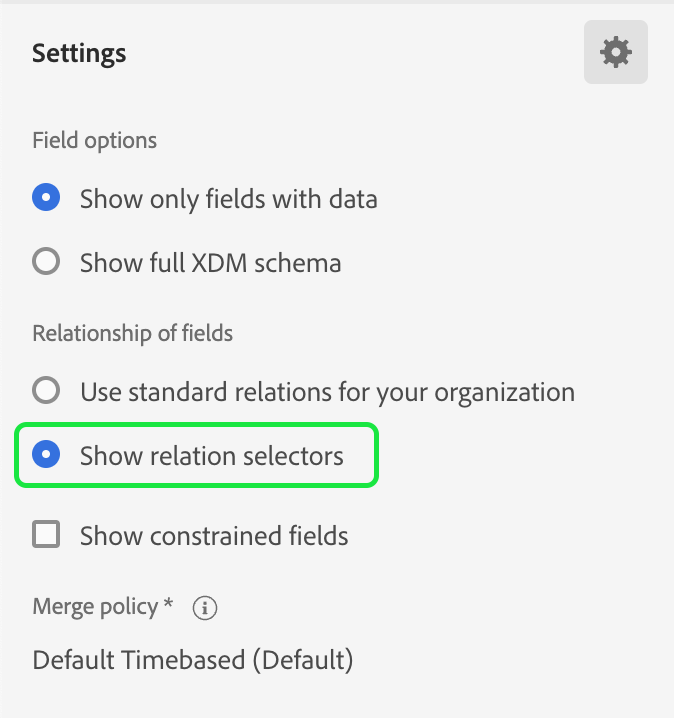

# 帐户受众

>[!AVAILABILITY]
>
>帐户受众仅在Real-Time Customer Data Platform的[B2B edition](../../rtcdp/overview.md#rtcdp-b2b)和Real-Time Customer Data Platform的[B2P版本](../../rtcdp/overview.md#rtcdp-b2p)中可用。

通过帐户分段，Adobe Experience Platform可让您从基于人员的受众到基于帐户的受众，全面轻松地体验营销分段。

帐户受众可用作基于帐户的目标中的输入，从而允许您在下游服务中定位这些帐户内的人员。 例如，您可以使用基于帐户的受众检索&#x200B;**没有**&#x200B;的帐户的所有记录，这些帐户具有首席运营官(COO)或首席营销官(CMO)职衔的任何人员的联系信息。

>[!NOTE]
>
>作为B2B架构升级的一部分，现在可精确计算具有B2B实体的受众的估计受众规模。 这些估计值可在预览期间使用，并为涉及复杂B2B关系的受众提供更准确和可靠的见解。  有关详细信息，请阅读[Real-Time CDP B2B edition架构升级概述](../../rtcdp/b2b-architecture-upgrade.md)。

## 术语 {#terminology}

在开始使用帐户受众之前，请查看不同受众类型之间的差异：

- **帐户受众**：帐户受众是使用&#x200B;**帐户**&#x200B;配置文件数据创建的受众。 帐户配置文件数据可用于创建定向下游帐户内人员的受众。 有关帐户配置文件的详细信息，请阅读[帐户配置文件概述](../../rtcdp/accounts/account-profile-overview.md)。
- **人员受众**：人员受众是使用&#x200B;**客户**&#x200B;个人资料数据创建的受众。 客户个人资料数据可用于创建针对您企业客户群的受众。 有关客户个人资料的更多信息，请阅读[实时客户个人资料概述](../../profile/home.md)。
- **潜在客户受众**：潜在客户受众是使用&#x200B;**潜在客户**&#x200B;个人资料数据创建的受众。 Prospect配置文件数据可用于从未经身份验证的用户创建受众。 有关潜在客户配置文件的详细信息，请阅读[潜在客户配置文件概述](../../profile/ui/prospect-profile.md)。

## 访问 {#access}

要访问帐户受众，请在&#x200B;**[!UICONTROL 帐户]**&#x200B;部分中选择&#x200B;**[!UICONTROL 受众]**。

此时将显示[!UICONTROL 浏览]页面，其中显示该组织的所有帐户受众列表。

此视图列出有关受众的信息，包括名称、配置文件计数、来源、生命周期状态、创建日期和上次更新日期。

您还可以使用搜索和筛选功能快速搜索和排序特定帐户受众。 有关此功能的详细信息，请参阅[受众门户概述](../ui/audience-portal.md#manage-audiences)。

## 创建受众 {#create}

>[!NOTE]
>
>帐户受众是使用&#x200B;**批次**&#x200B;分段进行评估的，每24小时进行一次评估。

要创建帐户受众，请在&#x200B;**[!UICONTROL 浏览]**&#x200B;页面上选择[!UICONTROL 创建受众]。

![帐户受众浏览页面上突出显示[!UICONTROL 创建受众]按钮。](../images/types/account/select-create-audience.png)

此时将显示“区段生成器”。 帐户属性和受众将显示在左侧导航栏中。 在[!UICONTROL 属性]选项卡下，您可以同时添加Experience Platform创建的属性和自定义属性。

在创建帐户受众时，请注意，事件列在&#x200B;**[!UICONTROL 人员]**&#x200B;下，而不是作为他们自己的选项卡，因为这些属性与人员相关联。

![位于[!UICONTROL People]文件夹中的查找事件的位置突出显示。](../images/types/account/attributes.png)

在[!UICONTROL 受众]选项卡下，您可以添加之前创建的基于人员的受众，以便在创建您自己的帐户受众时构建。

有关使用区段生成器的更多信息，请参阅[区段生成器UI指南](../ui/segment-builder.md)。

### 建立关系 {#relationships}

默认情况下，对于帐户受众，区段生成器UI显示帐户与人员之间的直接关系。 但是，其他关系类型也可用于帐户受众。

若要使用备用关系类型，请选择。

在[!UICONTROL 设置]选项卡上，在&#x200B;**[!UICONTROL 字段的关系]**&#x200B;部分中选择&#x200B;**[!UICONTROL 显示关系选择器]**。

再次选择以返回[!UICONTROL 字段]选项卡。 您现在可以看到&#x200B;**[!UICONTROL 建立关系]**&#x200B;部分，该部分允许您建立帐户与人员的连接方式以及该人员与机会的连接方式。

将帐户连接到人员时，您可以从以下选项中进行选择：

| 选项 | 描述 |
| ------ | ----------- |
| 直接关系 | 帐户和人员之间的直接连接。 这会指定每个人员通过人员架构上`accountID`数组中的`personComponents`值数组链接到哪些帐户。 此路径最常用。 |
| 帐户 — 人员关系 | 帐户与人员之间的关系，由`accountPersonRelation`对象定义。 此路径还允许每个人连接到多个帐户。 当您的组织从源数据定义了显式关系表时，将使用该关系表。 |
| 机会 — 人员关系 | 机会与人员之间的关系，由`opportunityPersonRelation`对象定义。 这会将人员从机会人员转到机会人员转到帐户以将人员连接到帐户。 这让您能够描述人员在哪些公司与销售机会相关。 |

将商机与人员连接时，您可以从以下选项中进行选择：

| 选项 | 描述 |
| ------ | ----------- |
| 帐户 | 帐户和机会之间的直接连接。 当您在帐户受众中使用此产品时，此路径会将公司中的所有人员都连接到该机会。 |
| 机会 — 人员关系 | 机会与人员之间的关系，它基于机会 — 人员对象。 此路径只将那些被明确标识为与机会相关的人关联到该机会。 |

建立所需的关系后，您可以在区段定义中添加所需的人员 — 受众。

## 激活受众 {#activate}

>[!NOTE]
>
>只有有限数量的目标支持帐户受众。 在继续此过程之前，请确保您要激活的目标支持帐户受众。

创建帐户受众后，您可以将该受众激活到其他下游服务。

选择要激活的受众，然后&#x200B;**[!UICONTROL 激活到目标]**。

![所选受众的快速操作菜单中突出显示[!UICONTROL 激活到目标]按钮。](../images/types/account/activate.png)

此时会显示[!UICONTROL 激活目标]页面。 有关激活过程的更多信息（包括支持的目标和字段映射的详细信息），请阅读[激活帐户受众](/help/destinations/ui/activate-account-audiences.md)教程。

## 后续步骤 {#next-steps}

阅读本指南后，您现在已更好地了解如何在Adobe Experience Platform中创建和使用帐户受众。 要了解如何在Experience Platform中使用其他类型的受众，请阅读[受众类型概述](./overview.md)。

## 附录 {#appendix}

以下部分提供了有关帐户受众的其他信息。

### 帐户分段验证 {#validation}

>[!CONTEXTUALHELP]
>id="platform_audiences_account_constraint_eventLookbackWindow"
>title="回顾窗口"
>abstract="使用回顾窗口查看人员级别事件的完整历史记录。"

>[!CONTEXTUALHELP]
>id="platform_audiences_account_constraint_combinationMaxDepth"
>title="最大嵌套容器深度错误"
>abstract="最大嵌套容器深度为 **5**。这意味着在创建受众时，您&#x200B;**无法**&#x200B;拥有五个以上的嵌套容器。"

>[!CONTEXTUALHELP]
>id="platform_audiences_account_constraint_combinationMaxBreadth"
>title="最大规则数量错误"
>abstract="单个容器内的最大规则数为 **5**。这意味着在创建受众时，您&#x200B;**无法**&#x200B;在单个容器中拥有五个以上的规则。"

>[!CONTEXTUALHELP]
>id="platform_audiences_account_constraint_crossEntityMaxDepth"
>title="最大跨实体数量错误"
>abstract="单个受众中可使用的跨实体的最大数量为 **5**。跨实体是指您在受众内的不同实体之间进行切换。例如，从帐户到人员再到营销列表。"

>[!CONTEXTUALHELP]
>id="platform_audiences_account_constraint_allowCustomEntity"
>title="自定义实体错误"
>abstract="**不**&#x200B;允许使用自定义实体。"

>[!CONTEXTUALHELP]
>id="platform_audiences_account_constraint_b2bBuiltInEntities"
>title="无效 B2B 实体错误"
>abstract="仅允许使用以下 B2B 实体：`_xdm.context.account`、`_xdm.content.opportunity`、`_xdm.context.profile`、`_xdm.context.experienceevent`、`_xdm.context.account-person`、`_xdm.classes.opportunity-person`、`_xdm.classes.marketing-list-member`、`_xdm.classes.marketing-list`、`_xdm.context.campaign-member` 和 `_xdm.classes.campaign`。"

>[!CONTEXTUALHELP]
>id="platform_audiences_account_constraint_rhsMaxOptions"
>title="最大值错误"
>abstract="可在单个字段中检查的值的最大数量为 **50**。"

>[!CONTEXTUALHELP]
>id="platform_audiences_account_constraint_allowInSegmentByReference"
>title="inSegment 事件错误"
>abstract="**不**&#x200B;允许使用 inSegment 事件。"

>[!CONTEXTUALHELP]
>id="platform_audiences_account_constraint_allowInSegmentByValue"
>title="inSegment 事件错误"
>abstract="**不**&#x200B;允许使用 inSegment 事件。"

>[!CONTEXTUALHELP]
>id="platform_audiences_account_constraint_allowSequentialEvents"
>title="连续事件错误"
>abstract="**不**&#x200B;允许使用连续事件。"

>[!CONTEXTUALHELP]
>id="platform_audiences_account_constraint_allowMaps"
>title="Map-type 属性错误"
>abstract="**不**&#x200B;允许使用 Map-type 属性。"

>[!CONTEXTUALHELP]
>id="platform_audiences_account_constraint_maxNestedAggregationDepth"
>title="最大嵌套实体深度错误"
>abstract="最大嵌套数组深度为 **5**。"

>[!CONTEXTUALHELP]
>id="platform_audiences_account_constraint_maxObjectNestingLevel"
>title="最大嵌套对象数量错误"
>abstract="允许的最大嵌套对象数量为 **10**。"

>[!CONTEXTUALHELP]
>id="platform_audiences_account_constraint_generic"
>title="约束违规"
>abstract="受众违反了约束。请参阅链接的文档以了解更多详细信息。"

使用帐户受众时，受众&#x200B;**必须**&#x200B;符合以下约束：

- 嵌套容器的最大深度为&#x200B;**5**。
   - 这意味着在创建受众时，您&#x200B;**无法**&#x200B;拥有五个以上的嵌套容器。
- 单个容器中的规则最大数量为&#x200B;**5**。
   - 这意味着您的受众&#x200B;**不能**&#x200B;包含组成受众的五个以上的规则。
- 可以使用的最大交叉实体数为&#x200B;**5**。
   - 跨实体是指您在受众内的不同实体之间进行切换。例如，从帐户到人员再到营销列表。
- 可在单个字段中检查的值的最大数量为 **50**。
   - 例如，如果字段为“City Name”，则可以根据50个城市名称检查该值。
- 帐户受众&#x200B;**不能**&#x200B;使用顺序事件。
- 帐户受众&#x200B;**不能**&#x200B;使用映射。
- 最大嵌套数组深度为 **5**。
- 嵌套对象的最大数量为&#x200B;**10**。

<!-- - The maximum lookback window for Experience Events is **30 days**. -->
<!-- - Account audiences **cannot** use `inSegment` events. -->
<!-- - Custom entities **cannot** be used. -->