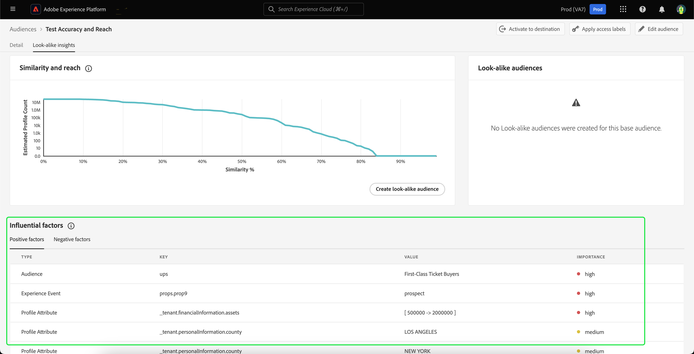

# 相似受众指南

>[!AVAILABILITY]
>
>相似见解和相似受众仅在&#x200B;**B2C版本**&#x200B;中可用。

>[!IMPORTANT]
>
>对于使用率较低的环境，相似分析和相似受众会自动禁用。 低使用率的定义是：不查看过去三个月的相似人群拓展见解，或过去六个月不创建新的相似受众。
>
>如果环境禁用了相似见解，则可以通过向Adobe客户关怀团队发送电子邮件（包括您的组织ID和消息中的环境详细信息）来请求访问权限。
>
>在收到Adobe客户关怀的确认后，您环境中的所有沙盒中将启用相似见解和受众。

在Adobe Experience Platform中，相似受众可针对每位受众提供智能见解，并利用基于机器学习的见解来通过营销活动识别和定位高价值客户。

通过相似受众，您可以创建扩展的受众以定位与高性能受众类似的客户或以前转换的受众类似的客户。

## 术语 {#terminology}

在开始使用相似受众之前，请确保了解以下概念：

- **基本受众**：基本受众是您希望了解更多相关见解的受众。 相似人群拓展模型基于&#x200B;**的**&#x200B;受众。
- **相似人群拓展模型**：相似人群拓展模型是一种机器学习模型，无需任何客户输入即可针对每个符合条件的基本受众进行培训。 每个相似模型创建影响因素和相似图。 相似模型&#x200B;**未**&#x200B;得分。
- **相似受众**：相似受众是在将具有选定相似性阈值的相似模型应用于基本受众时创建的受众。 您可以使用相同的相似人群拓展模型创建多个相似受众。 相似受众才是得分来源。
- **可寻址受众总大小**：可寻址受众总大小是过去30天内的配置文件总数减去过去30天内的基本受众群体。 例如，如果某个客户在过去30天内拥有1000万个配置文件，并且基础受众在过去30天内拥有100万个配置文件，则总可寻址受众规模为900万个配置文件。

## 资格 {#eligibility}

要使用相似见解，基本受众&#x200B;**必须**&#x200B;满足以下资格条件：

- 必须在Experience Platform中创建基础受众&#x200B;****。
   - 外部生成的受众&#x200B;**无**&#x200B;资格获得相似见解。
- 基础受众&#x200B;**必须**&#x200B;使用默认合并策略。
- 基础受众&#x200B;**必须**&#x200B;不使用数据治理所限制的字段。

## 相似模型详细信息 {#details}

>[!CONTEXTUALHELP]
>id="platform_audiences_lookAlike_notEligible"
>title="不合格"
>abstract="该受众目前没有资格获得相似的见解，因为其轮廓数量可能低于培训所需的最低数量，或者轮廓导出尚未触发。"

>[!CONTEXTUALHELP]
>id="platform_audiences_lookAlike_processing"
>title="正在处理"
>abstract="目前正在处理该受众。该模型可能需要长达 24 小时才能完成处理。请稍后重试。"

>[!CONTEXTUALHELP]
>id="platform_audiences_lookAlike_error"
>title="错误"
>abstract="处理此模型时出错。请删除并重新生成此模型或稍后重试。"

在Adobe Experience Platform中，相似模型会使用三种不同类型的数据点：

- 过去30天的受众会员资格
- 过去30天内被实时客户档案摄取的体验事件
- 过去30天内已摄取到Real-Time Customer Profile中的配置文件属性

所有这些数据点都被转换为键值对，然后输入相似模型。 将仅保留具有大量匹配用户档案百分比的键值对。

此时，每24小时运行一次相似人群拓展模型，为基本受众创建和重新创建影响因素和相似人群拓展图。 相似受众的评分也经常运行。

## 权利 {#entitlements}

以下权限适用于使用相似受众：

- Real-Time CDP Prime客户有权在生产沙盒中使用&#x200B;**5**&#x200B;个活动的相似受众
- Real-Time CDP Ultimate客户有权在生产沙盒中使用&#x200B;**20**&#x200B;个活动的相似受众
- 开发沙盒限制为所有Real-Time CDP客户的&#x200B;**5**&#x200B;相似受众

附加组件包将在以后的日期提供，它会将生产沙盒的权利增加到每个包20个相似受众。

## 访问 {#access}

要确认您是否可以访问相似受众，请在Audience Portal中选择任意受众，并检查&#x200B;**[!UICONTROL 相似见解]**&#x200B;选项卡是否可见。

## 查看相似见解 {#view}

受众详细信息页面中内置相似见解。 要查看某个受众的相似见解，请在左侧导航栏中选择&#x200B;**[!UICONTROL 受众]**，然后选择&#x200B;**[!UICONTROL 浏览]**&#x200B;以及要查看其见解的受众。

此时会显示受众详细信息页面。 选择&#x200B;**[!UICONTROL 相似见解]**&#x200B;选项卡以查看受众的相似见解。 显示&#x200B;**[!UICONTROL 相似见解]**&#x200B;页面。 此页面包含三个主要元素 — 相似性和可访问图、相似受众和影响因素。

### 相似性和覆盖率 {#similarity-and-reach}

>[!CONTEXTUALHELP]
>id="platform_audiences_lookAlike_similarityAndReach"
>title="相似性和覆盖率"
>abstract="相似性和覆盖范围图形绘制了由给定相似性分数以上的轮廓组成的相似受众的预期覆盖范围。您可以将鼠标悬停在图形中的特定点上，以显示当前突出显示的点的相似性百分比和预期轮廓计数。"

相似性和访问范围部分显示一个图形，其中绘制由超过给定相似度得分的用户档案组成的相似受众的预期访问范围。 相似度得分表示基础受众配置文件与相似insight配置文件之间的&#x200B;**距离**&#x200B;相似度。

在此图表上，x轴测量用户档案与选定受众成员之间的相似度百分比。 相似性得分从0%到100%不等，较高的相似性得分表示在影响因素值方面，用户档案与所选受众的成员更接近。

Y轴显示具有与x轴的匹配值相对应的相似性百分比的配置文件预期计数。 预期的用户档案计数介于0到可寻址受众总大小或2,500万个用户档案之间，以较低者为准。 此轴以&#x200B;**对数刻度**&#x200B;进行测量，以提高图形的可读性。

请注意，该图形从右到左为&#x200B;**累积**。 这意味着，在图形的任何位置，y轴的值都是相似度&#x200B;**大于相似性阈值**&#x200B;的用户档案数。 例如，如果x轴为60%，y轴为1,000万，这意味着有1,000万个用户档案与基础受众的相似性达到或超过60%。

您可以将鼠标悬停在图形中的特定点上，以显示当前突出显示的点的相似性百分比和预期轮廓计数。

### 相似受众 {#list}

相似受众部分显示之前为所选基本受众创建的所有相似受众的列表。

### 影响因素 {#influential-factors}

>[!CONTEXTUALHELP]
>id="platform_audiences_lookAlike_influentialFactors"
>title="影响因素"
>abstract="影响因素包括属性、事件和受众成员资格，这些因素对于解释轮廓与基础受众成员的相似性非常重要。数据使用标签和策略可用于排除某些数据，使其不被视为相似模型中的影响因素。"
>additional-url="https://experienceleague.adobe.com/docs/experience-platform/segmentation/types/lookalike-audiences.html#exclude" text="排除数据"

影响因素部分显示影响所选基础受众相似人群拓展模型的前100个因素。 这些影响因素包括用户档案属性、体验事件和受众成员资格，它们在解释基础受众的相似之处时最为重要。 通过了解主要影响因素，您可以更好地为此受众以及从中创建的任何相似受众将营销内容个性化。 请注意，不会显示影响相似人群拓展模型的所有影响因素。

对于数值型影响因素，键值对可能会放入存储桶中，具体取决于键所包含的不同值的数量。 例如，如果您拥有`income`键，则很可能有许多唯一值。 因此，键值对将放入可能类似于`income=[0 -> 30000]`、`income=[30000 -> 50000]`和`income=[50000 -> 100000]`的存储桶中。

定期重新计算这些存储段以确保数据保持最新。

>[!NOTE]
>
>各影响因素按重要性大小排序，相互独立。

| 字段 | 描述 |
| ----- | ----------- |
| 类型 | 影响因素所派生的数据类型。 这可以是配置文件属性、体验事件或受众成员资格。 |
| 键 | 数据字段的名称。 对于受众成员资格类型的键，此值表示数据来自的受众的&#x200B;**命名空间**。 可能的值包括`ups` （分段服务）和`AO` （受众编排）。 对于其他类型的键，此值表示XDM字段路径。 例如，如果公司Luma有一个名为income的自定义字段，则键将为`_luma.income` |
| 值 | 该值会因它所代表的影响因素而异。 对于用户档案属性或体验事件，此字段表示数据字段的值或值范围，它指示与基本受众成员的相似度。 值范围以`[A -> B]`的形式写入，其中`A`表示较低的范围，而`B`表示较高的范围。 对于受众成员资格，此字段是受众的名称。 |
| 重要性 | 影响因素的相对重要性水平。 这可以是高、中或低。 |

## 创建相似受众 {#create}

>[!IMPORTANT]
>
>您&#x200B;**不能**&#x200B;将相似受众用作其他相似受众的基本受众。 也就是说，您&#x200B;**无法**&#x200B;创建链接相似受众。

要创建相似受众，您需要选择要为其构建相似受众基础的受众。 要访问可用受众列表，请在左侧导航栏中选择&#x200B;**[!UICONTROL 受众]**，然后选择&#x200B;**[!UICONTROL 浏览]**。 此时将显示受众列表。 在此页面上，您可以选择要用作基础受众的受众。

在受众详细信息页面上，选择&#x200B;**[!UICONTROL 创建相似受众]**&#x200B;以开始创建相似受众的过程。

![已高亮显示[!UICONTROL 创建相似受众]按钮。](../images/types/lookalike/create-look-alike-audience.png)

出现&#x200B;**[!UICONTROL 创建相似受众]**&#x200B;弹出框。 在此页面上，您可以为相似受众设置相似性百分比。

![显示[!UICONTROL 创建相似受众]弹出框。](../images/types/lookalike/create-audience.png)

您可以通过三种不同的方式设置此相似性百分比：

- 移动滑块以设置相似性百分比
- 在滑块旁边的数字输入框中输入相似性百分比
- 将鼠标悬停在图形上并选择所需的位置以设置相似性百分比

您还可以更新有关相似受众的详细信息，包括其名称和描述。 默认情况下，将根据基础受众的名称以及之前指定的相似度百分比生成相似受众的名称。

![基本信息在[!UICONTROL 创建相似受众]弹出框内突出显示。](../images/types/lookalike/basic-info.png)

选择&#x200B;**[!UICONTROL 创建]**&#x200B;以完成创建相似受众。

![创建按钮在[!UICONTROL 创建相似受众]弹出框内突出显示。](../images/types/lookalike/create-audience.png)

可以在受众详细信息页面的&#x200B;**[!UICONTROL 相似受众]**&#x200B;部分访问新创建的相似受众，也可以在Audience Portal中和其他下游使用中访问这些受众。 请注意，对相似受众进行评分需要一点时间。 在得分之前，用户档案计数将显示为0。

## 查看相似受众详细信息 {#view-details}

要查看相似受众的详细信息，请在基础受众的&#x200B;**[!UICONTROL 相似受众]**&#x200B;部分中选择相似受众。

此时会显示受众详细信息页面。 有关此页面的详细信息，请阅读受众门户概述](../ui/audience-portal.md#audience-details)的[受众详细信息部分。

## 从相似人群拓展建模中排除数据字段 {#exclude}

>[!IMPORTANT]
>
> **您**&#x200B;有责任确保对数据（包括敏感数据）进行适当标记，并确保已定义并启用数据使用策略，以遵守您运营时承担的法律和法规义务。 您还应该了解，与通常与敏感或受保护数据类型关联的数据字段&#x200B;**不直接相关的**&#x200B;数据字段或区段成员资格可能会造成潜在偏差。 **您**&#x200B;负责分析您的数据以识别、标记数据并将适当的数据使用策略应用于您的数据，包括任何可能代表敏感或受保护数据类型且应排除在建模之外的数据字段。

相似受众可以配置为通过应用相关数据使用标签和策略来排除针对“数据科学”营销操作限制的数据字段。 在培训相似受众模型和从经过训练的模型生成相似受众时，标记为限制用于数据科学的数据将从考虑中删除。 

>[!NOTE]
>
>对基础受众上的数据使用标签所做的更改最多可能需要48小时才能生效。

标准“C9”标签可用于标记不应用于数据科学的数据，并且可以通过启用标准“限制数据科学”策略来强制实施这些数据。 您还可以创建其他策略来限制使用其他标签的数据，包括敏感标签，以阻止用于数据科学。 有关管理数据使用策略的更多信息，请参阅[数据使用策略UI指南](../../data-governance/policies/user-guide.md)。 有关管理数据使用标签的详细信息，请阅读[数据使用标签UI指南](../../data-governance/labels/user-guide.md)。

默认情况下，如果基本受众没有合同标签，则相似受众的建模流程将根据贵组织启用的隐私策略，排除&#x200B;**任意**&#x200B;字段、数据集或受众。

## 后续步骤

阅读本指南后，您已了解如何查看相似见解，并根据这些见解创建相似受众。 有关Adobe Experience Platform UI中受众的更多信息，请参阅[分段服务UI指南](./overview.md)。
