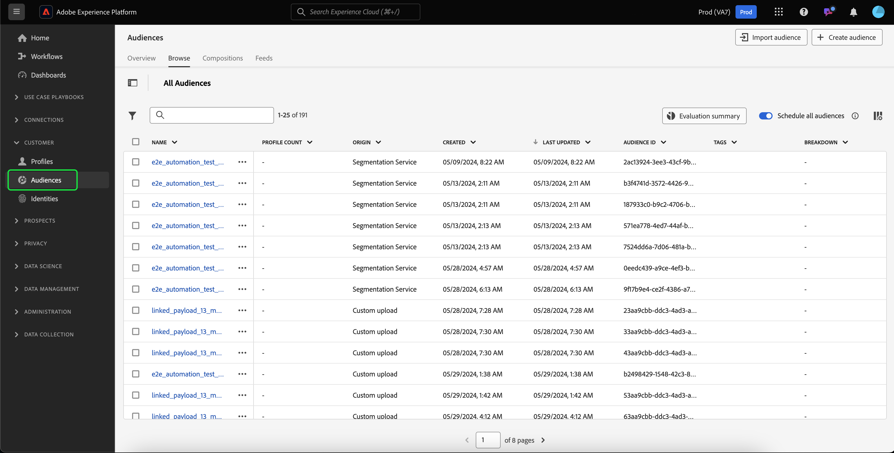
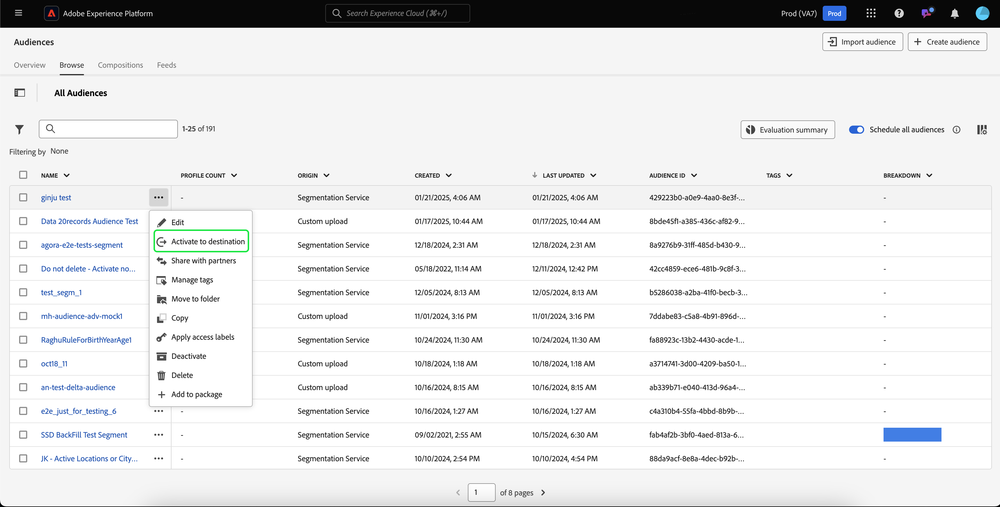

# 人员受众指南

在Adobe Experience Platform中，基于人员的受众允许您针对特定的营销活动人员组进行定位。

人员受众使用客户个人资料数据来定位特定市场，使您能够更好地定位要广告宣传的特定人口统计。

## 术语 {#terminology}

在开始使用人员受众之前，请查看不同受众类型之间的差异：

- **帐户受众**：帐户受众是使用&#x200B;**帐户**&#x200B;配置文件数据创建的受众。 帐户配置文件数据可用于创建定向下游帐户内人员的受众。 有关帐户受众的详细信息，请阅读[帐户受众概述](./account-audiences.md)。
- **人员受众**：人员受众是使用&#x200B;**客户**&#x200B;个人资料数据创建的受众。 客户个人资料数据可用于创建针对您企业客户群的受众。
- **潜在客户受众**：潜在客户受众是使用&#x200B;**潜在客户**&#x200B;个人资料数据创建的受众。 Prospect配置文件数据可用于从未经身份验证的用户创建受众。 有关潜在客户受众的详细信息，请阅读[潜在客户受众概述](./prospect-audiences.md)。

## 访问 {#access}

要访问人员受众，请在&#x200B;**[!UICONTROL 客户]**&#x200B;部分中选择&#x200B;**[!UICONTROL 受众]**。

此时将显示“受众门户”，其中包含组织的所有人员受众列表。

此视图列出有关受众的信息，包括名称、配置文件计数、来源、生命周期状态、创建日期和上次更新日期。

您还可以使用搜索和筛选功能快速搜索和排序特定帐户受众。 有关此功能的详细信息，请参阅[受众门户概述](../ui/audience-portal.md#manage-audiences)。

## 受众详情 {#details}

要查看有关特定人员受众的详细信息，请在受众门户中选择受众。

将显示受众详细信息页面。 将显示包括描述、来源和生命周期状态的信息。

有关受众详细信息页面的详细信息，请阅读受众门户概述[&#128279;](../ui/audience-portal.md#audience-details)的受众详细信息部分。

## 创建受众 {#create}

您可以使用受众编辑器或区段生成器创建人员受众。 要开始创建人员受众，请在受众门户中选择创建受众。

此时会出现一个弹出窗口，允许您在构成受众或构建规则之间进行选择。

有关创建受众的更多详细信息，请阅读[受众门户概述](../ui/audience-portal.md#create-audience)。

## 激活受众 {#activate}

创建人员受众后，您可以将此受众激活到其他下游服务。

选择要激活的受众，然后&#x200B;**[!UICONTROL 激活到目标]**。

此时会显示[!UICONTROL 激活目标]页面，其中包含可用目标的列表，具体取决于受众的更新频率。 有关激活过程的详细信息，请阅读[激活概述](../../destinations/ui/activation-overview.md)。

## 后续步骤

阅读本指南后，您将了解如何在Adobe Experience Platform中创建和管理人员受众。 若要了解不同类型的受众，请阅读[受众类型概述](./overview.md)。
