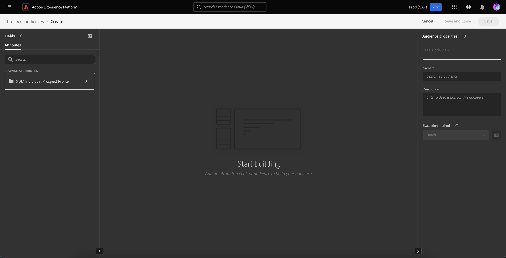

# 潜在客户受众

Adobe Experience Platform可让您为[潜在客户个人资料](../../profile/ui/prospect-profile.md)提供对营销人员友好的完整轻松复杂的分段体验。 通过创建您自己的潜在客户受众，同时负责任地使用合作伙伴数据，您可以显着减少用于组装受众的时间。

## 访问 {#access}

要访问潜在客户受众，请在&#x200B;**[!UICONTROL 潜在客户]**&#x200B;部分中选择&#x200B;**[!UICONTROL 受众]**。

![在[!UICONTROL 潜在客户]部分中突出显示了[!UICONTROL 受众]按钮。](../images/types/prospect/prospect-audiences.png)

此时将显示Audience Portal ，其中包含组织的所有潜在客户受众的列表。

此视图列出有关受众的信息，包括名称、配置文件计数、来源、生命周期状态、创建日期、上次更新日期和细分。

您可以通过选择向此显示添加其他字段。 这些附加字段包括更新频率和上次更新者。

有关受众门户的详细信息（包括所列字段的详细信息）可在[受众门户概述](../ui/audience-portal.md#list)中找到。

## 受众详情 {#details}

要查看有关特定目标客户受众的详细信息，请在受众门户中选择受众。

此时将显示目标客户受众详细信息页面。 此时会显示相关信息，包括潜在客户受众摘要、受众总数以及激活的目标。

有关受众详细信息页面的详细信息，请阅读受众门户概述](../ui/audience-portal.md#audience-details)的[受众详细信息部分。

## 创建受众 {#create}

要创建目标受众，请在受众门户中选择&#x200B;**[!UICONTROL 创建受众]**。

![目标客户受众浏览页面上突出显示[!UICONTROL 创建受众]按钮。](../images/types/prospect/select-create-audience.png)

此时将显示“区段生成器”。 潜在客户配置文件属性显示在左侧导航栏中。

有关使用区段生成器的更多信息，请参阅[区段生成器UI指南](../ui/segment-builder.md)。

## 建议的用例 {#use-cases}

要了解如何在Experience Platform中将潜在客户受众功能与其他Experience Platform功能结合使用，请阅读以下用例文档：

- [通过潜在客户发现功能吸引和赢取新客户](../../rtcdp/partner-data/prospecting.md)

## 后续步骤

阅读本指南后，您现在知道如何在Adobe Experience Platform中创建和管理潜在客户受众。 要了解如何激活其他下游服务的目标受众，请阅读有关[激活目标受众](../../destinations/ui/activate-prospect-audiences.md)的指南。
