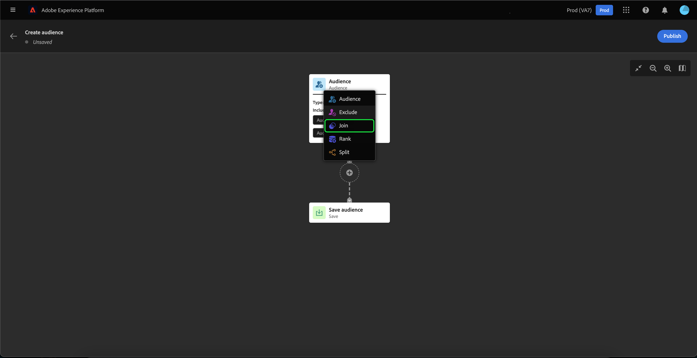
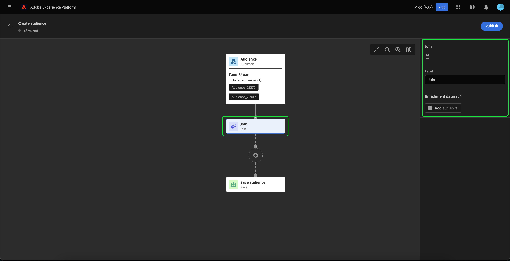

# Audience Builder UI指南

>[!IMPORTANT]
>
>Audience Builder当前为测试版，并非所有用户都能使用。 文档和功能可能会发生变化。

Audience Builder提供了一个工作区，用于使用用于表示不同操作的块来构建和编辑受众。

受众合成画布由五种不同类型的块组成： **[[!UICONTROL 受众]](#audience-block)**, **[[!UICONTROL 排除]](#exclude-block)**, **[[!UICONTROL 加入]](#join-block)**, **[[!UICONTROL 排名]](#rank-block)**&#x200B;和 **[[!UICONTROL 拆分]](#split-block)**.

## [!UICONTROL Audience] {#audience-block}

的 **[!UICONTROL 受众]** 利用块类型，可添加要构建新较大受众的子受众。 默认情况下， **[!UICONTROL 受众]** 块包括在合成画布的顶部。

当您选择 **[!UICONTROL 受众]** 块时，右边栏会显示用于标记和向块添加受众的控件。

选择后 **[!UICONTROL 添加受众]**，则会显示受众列表。 选择要包含的受众，然后 **[!UICONTROL 添加]** 以将其附加到受众块。

现在，当 **[!UICONTROL 受众]** 块。 从此处，您可以更改组合受众的合并类型。

| 合并类型 | 描述 |
| ---------- | ----------- |
| [!UICONTROL Union] | 这些受众将合并为一个受众。 这等同于OR操作。 |
| [!UICONTROL 交集] | 受众会进行组合，只有在中共享的受众 **全部** 被加进来。 这等同于AND操作。 |
| [!UICONTROL 排除重叠] | 受众会进行组合，只有在中共享的受众 **一个，但不是全部** 被加进来。 这等同于XOR操作。 |

## [!UICONTROL 排除] {#exclude-block}

的 **[!UICONTROL 排除]** 块类型允许您从新的较大受众中排除指定的子受众或属性。

添加 **[!UICONTROL 排除]** 块，选择 **+** 图标，后跟 **[!UICONTROL 排除]**.

的 **[!UICONTROL 排除]** 块。 选择此块后，有关排除的详细信息会显示在右边栏中。 这包括块的标签和排除类型。 您可以排除 [按受众](#exclude-audience) 或 [按属性](#exclude-attribute).

### 按受众排除 {#exclude-audience}

如果按受众排除，则可以通过选择 **[!UICONTROL 添加受众]**.

此时将显示受众列表。 选择 **[!UICONTROL 添加]** 添加要排除的受众以排除块。

### 按属性排除 {#exclude-attribute}

如果按属性排除，则可以通过选择  图标 **[!UICONTROL 排除规则]** 中。

此时将显示配置文件属性列表。 选择要排除的属性类型，然后 **[!UICONTROL 选择]** 以将其添加到排除块。

## [!UICONTROL 加入] {#join-block}

的 **[!UICONTROL 加入]** 块类型允许您从尚未由Adobe Experience Platform处理的数据集添加外部受众。

添加 **[!UICONTROL 加入]** 块，选择 **+** 图标，后跟 **[!UICONTROL 加入]**.

选择块后，有关连接的详细信息将显示在右边栏中，包括块的标签以及向扩充数据集添加受众的选项。

选择后 **[!UICONTROL 添加受众]**，则会显示受众列表。 选择要包含的受众，然后 **[!UICONTROL 添加]** 将其添加到连接块。

现在，当 **[!UICONTROL 加入]** 块。

## [!UICONTROL 排名] {#rank-block}

的 **[!UICONTROL 排名]** 利用块类型，可在发布新受众之前对受众进行排名和排序。

添加 **[!UICONTROL 排名]** 块，选择 **+** 图标，后跟 **[!UICONTROL 排名]**.

当您选择块时，有关排名的详细信息将显示在右边栏中，包括块的标签、要排名的属性、排名顺序以及用于限制要排名的用户档案数量的切换开关。

要选择对受众进行排名的属性，请选择  图标。

此时将显示配置文件属性列表。 在此弹出窗口中，您可以选择要按受众排名的属性类型。 选择 **[!UICONTROL 选择]** 将其添加到排名块。 请注意，所选属性可 **仅** 属于类型 `int`.

选择属性后，您可以选择对其进行排名的顺序。 这按升序（从最低到最高）或降序（从最高到最低）进行。

此外，您还可以通过启用 **[!UICONTROL 添加配置文件限制]** 切换。 启用此切换后，您可以在 **[!UICONTROL 包含的用户档案]** 字段。

## [!UICONTROL Split] {#split-block}

的 **[!UICONTROL 拆分]** 块类型允许您将新受众拆分为多个子受众。 您可以根据百分比或按属性拆分此受众。

添加 **[!UICONTROL 拆分]** 块，选择 **+** 图标，后跟 **[!UICONTROL 拆分]**.

### 按百分比拆分 {#split-percentage}

按百分比进行拆分时，受众将根据提供的路径数和百分比随机拆分。

例如，您可以有三个路径，每个路径的用户档案百分比不同。

此外，您还可以将其中一个拆分受众标记为控制组。

### 按属性拆分 {#split-attribute}

按属性进行拆分时，受众将根据提供的属性进行拆分。 要选择要拆分的属性，请选择 **[!UICONTROL 拆分]** 块，后跟  图标。

此时将显示配置文件属性列表。 选择属性类型，然后选择 **[!UICONTROL 选择]** 将其添加到拆分块。

选择属性后，您可以通过在 **[!UICONTROL 值]** 字段。

此外，您还可以启用 **[!UICONTROL 其他用户档案]** 切换以创建包含所有未选用户档案的子受众。

## 发布受众

构成受众后，可通过选择 **[!UICONTROL 发布]**.

如果创建受众时出现任何错误，则会显示警报，告知您如何解决此问题。

## 后续步骤

受众生成器提供了一个丰富的工作流，允许您从不同的块类型创建受众。 要了解有关Segmentation Service UI其他部分的更多信息，请阅读 [Segmentation Service用户指南](./overview.md).
