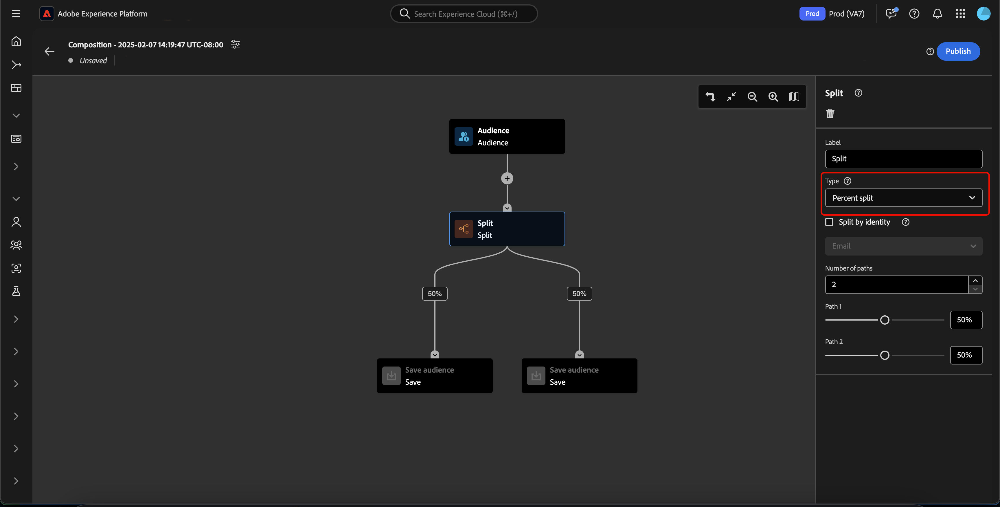

# 受众合成UI指南

>[!AVAILABILITY]
>
>要使用此功能，您必须具有以下权限：
>
>- 管理区段
>- 管理配置文件
>- 管理合并策略
>
>有关Experience Platform内权限的详细信息，请参阅[访问控制概述](../../access-control/home.md#permissions)。

>[!NOTE]
>
>本指南介绍如何使用“受众合成”创建受众。 要了解如何使用区段生成器通过区段定义创建受众，请参阅[区段生成器UI指南](./segment-builder.md)。

受众构成提供了一个工作区，通过用来表示不同操作的块来构建和编辑受众。

要更改合成的详细信息（包括标题和说明），请选择按钮。

出现&#x200B;**[!UICONTROL Composition properties]**&#x200B;弹出窗口。 您可以在此处插入构图的详细信息，包括标题和说明。

>[!NOTE]
>
>如果您&#x200B;**未**&#x200B;为文章指定标题，则默认情况下其标题为“作品”，后跟创建日期和时间。 此外，每个合成&#x200B;**必须**&#x200B;都有自己的唯一名称。

更新合成详细信息后，选择&#x200B;**[!UICONTROL Save]**&#x200B;以确认这些更新。 受众构成画布重新出现。

受众组合画布由四种不同类型的块组成：**[[!UICONTROL Audience]](#audience-block)**、**[[!UICONTROL Exclude]](#exclude-block)**、**[[!UICONTROL Rank]](#rank-block)**&#x200B;和&#x200B;**[[!UICONTROL Split]](#split-block)**。

## [!UICONTROL Audience] {#audience-block}

>[!CONTEXTUALHELP]
>id="platform_segmentation_ao_audience"
>title="受众块"
>abstract="使用受众块，您可以添加用于组成新受众的子受众。"

>[!CONTEXTUALHELP]
>id="platform_segmentation_ao_merge_types"
>title="合并类型"
>abstract="合并类型决定了所选子受众的组合方式。受支持的值包括并集、交叉和排除重叠。"

**[!UICONTROL Audience]**&#x200B;块类型允许您添加要用于构成新的更大受众的子受众。 默认情况下，**[!UICONTROL Audience]**&#x200B;块包含在合成画布的顶部。

选择&#x200B;**[!UICONTROL Audience]**&#x200B;块时，右边栏会显示用于标记受众、将受众添加到块以及为受众块构建自定义规则的控件。

>[!NOTE]
>
>您可以添加受众&#x200B;**或**&#x200B;创建自定义规则。 这两项功能&#x200B;**不能**&#x200B;一起使用。

### [!UICONTROL Add audience] {#add-audience}

将受众添加到“受众”块。 选择&#x200B;**[!UICONTROL Add Audience]**。

>[!IMPORTANT]
>
>请注意，将仅显示使用默认合并策略定义的&#x200B;**仅**&#x200B;受众。
>
>此外，只能使用使用使用区段生成器创建的&#x200B;**已发布**&#x200B;受众。 使用受众组合和外部生成的受众创建的受众&#x200B;**不可用**。

此时会显示受众列表。 选择要包含的受众，之后选择&#x200B;**[!UICONTROL Add]**&#x200B;以将其附加到受众块。

当选择&#x200B;**[!UICONTROL Audience]**&#x200B;块时，您选择的受众现在会显示在右边栏中。 在此处，您可以更改组合受众的合并类型。

| 合并类型 | 描述 |
| ---------- | ----------- |
| [!UICONTROL Union] | 受众将合并为一个受众。 此操作等同于OR操作。 |
| [!UICONTROL Intersection] | 这些受众将合并，并且只添加在&#x200B;**所有**&#x200B;中共享的受众。 此操作等同于AND操作。 |
| [!UICONTROL Exclude overlap] | 这些受众将合并，只包含在&#x200B;**1中共享的受众，但不会添加其中的所有**&#x200B;受众。 这相当于XOR操作。 |

### [!UICONTROL Build rule] {#build-rule}

>[!CONTEXTUALHELP]
>id="platform_segmentation_ao_rule_builder"
>title="区段生成器"
>abstract="您可以使用区段生成器，为您的构成添加自定义规则。"

要向受众块添加自定义规则，请选择&#x200B;**[!UICONTROL Build rule]**。

此时将显示“区段生成器”。 您可以使用区段生成器创建自定义规则，以供受众遵循。 有关使用区段生成器的更多信息，请参阅[区段生成器指南](./segment-builder.md)。

添加自定义规则后，选择&#x200B;**[!UICONTROL Save]**&#x200B;以将该规则添加到受众。

## [!UICONTROL Exclude] {#exclude-block}

>[!CONTEXTUALHELP]
>id="platform_segmentation_ao_exclude"
>title="排除块"
>abstract="使用排除块，您可以从构成中排除指定的受众或属性。"

>[!CONTEXTUALHELP]
>id="platform_segmentation_ao_exclude_type"
>title="排除类型"
>abstract="您可以排除属于某个特定受众的轮廓（按受众排除），也可以根据某个特定属性排除轮廓（按属性排除）。"

**[!UICONTROL Exclude]**&#x200B;块类型允许您从新的较大受众中排除指定的子受众或属性。

要添加&#x200B;**[!UICONTROL Exclude]**&#x200B;块，请选择&#x200B;**+**&#x200B;图标，然后选择&#x200B;**[!UICONTROL Exclude]**。

已添加&#x200B;**[!UICONTROL Exclude]**&#x200B;块。 选择此块后，右边栏中会显示有关排除项的详细信息。 这包括块的标签和排除类型。 您可以按受众[排除](#exclude-audience)或按属性[排除](#exclude-attribute)。

### 按受众排除 {#exclude-audience}

如果按受众排除，可通过选择&#x200B;**[!UICONTROL Add Audience]**&#x200B;选择要排除的受众。

![已选择“[!UICONTROL Add audience]”按钮，可让您选择要排除的受众。](../images/ui/audience-composition/add-excluded-audience.png)

>[!IMPORTANT]
>
>只能使用&#x200B;**已发布**&#x200B;使用Segment Builder创建的受众。 使用受众合成和外部生成的受众创建的受众&#x200B;**不可用**。

此时将显示受众列表。 选择&#x200B;**[!UICONTROL Add]**&#x200B;以将要排除的受众添加到排除块。

### 按属性排除 {#exclude-attribute}

>[!CONTEXTUALHELP]
>id="platform_segmentation_ao_exclude_attribute"
>title="按属性排除"
>abstract="按属性排除时，您可以根据所选属性排除特定轮廓出现在构成中。"

如果按属性排除，可通过在“筛选器&#x200B;**[!UICONTROL Exclusion rule]**”图标而选择要排除的属性。 排除属性可让您从生成的受众中排除任何包含此属性的配置文件。

此时将显示配置文件属性列表。 选择要排除的属性类型，然后选择&#x200B;**[!UICONTROL Select]**&#x200B;以将其添加到排除块。

>[!IMPORTANT]
>
>按属性排除时，只能指定要排除的&#x200B;**一个**&#x200B;值。 使用任何类型的分隔符（如逗号或分号）都只会导致排除该确切值。 例如，将该值设置为`red, blue`将导致从属性中排除术语`red, blue`，但&#x200B;**不会**&#x200B;导致排除术语`red`或`blue`。

## [!UICONTROL Enrich] {#enrich-block}

>[!CONTEXTUALHELP]
>id="platform_segmentation_ao_enrich"
>title="扩充块"
>abstract="使用扩充块，您可以通过来自 Adobe Experience Platform 数据集的其他属性来扩充您的受众。"

>[!CONTEXTUALHELP]
>id="platform_segmentation_ao_dataset"
>title="扩充数据集"
>abstract="扩充数据集中包含了您希望与受众构成相关联的数据。"

>[!CONTEXTUALHELP]
>id="platform_segmentation_ao_enrich_criteria"
>title="扩充标准"
>abstract="扩充标准包括源连接密钥和扩充数据集连接密钥。这两个密钥协调了源数据集和扩充数据集。"

>[!CONTEXTUALHELP]
>id="platform_segmentation_ao_enrich_attributes"
>title="扩充属性"
>abstract="扩充属性是您希望与受众构成相关联的属性。"

>[!IMPORTANT]
>
>此时，扩充属性只能&#x200B;**在下游Adobe Journey Optimizer方案中使用**。

**[!UICONTROL Enrich]**&#x200B;块类型允许您使用数据集中的其他属性扩充受众。 您可以在个性化用例中使用这些属性。

要添加&#x200B;**[!UICONTROL Enrich]**&#x200B;块，请选择&#x200B;**+**&#x200B;图标，然后选择&#x200B;**[!UICONTROL Enrich]**。

![已选择[!UICONTROL Enrich]选项。](../images/ui/audience-composition/add-enrich-block.png)

已添加&#x200B;**[!UICONTROL Enrich]**&#x200B;块。 选择此块后，右侧边栏中会显示有关丰富功能的详细信息。 这包括块的标签和富集数据集。

若要选择要丰富受众的数据集，请选择图标。

![筛选器按钮突出显示。 选择此选项将转到[!UICONTROL Select dataset]弹出框。](../images/ui/audience-composition/enrich-select-dataset.png)

出现&#x200B;**[!UICONTROL Select dataset]**&#x200B;弹出框。 选择要添加以进行扩充的数据集，然后选择&#x200B;**[!UICONTROL Select]**&#x200B;以添加数据集以进行扩充。

>[!IMPORTANT]
>
>选定的数据集&#x200B;**必须**&#x200B;满足以下条件：
>
>- 数据集&#x200B;**必须**&#x200B;为记录类型。
>   - 数据集&#x200B;**不能**&#x200B;为事件类型、系统生成或标记为配置文件。
>- 数据集&#x200B;**必须**&#x200B;为1 GB或更小。

**[!UICONTROL Enrichment criteria]**&#x200B;部分现在显示在右边栏中。 在此部分中，您可以选择&#x200B;**[!UICONTROL Source join key]**&#x200B;和&#x200B;**[!UICONTROL Enrichment dataset join key]**，这允许您链接扩充数据集与尝试创建的受众。

![已突出显示[!UICONTROL Enrichment criteria]区域。](../images/ui/audience-composition/enrichment-criteria.png)

要选择&#x200B;**[!UICONTROL Source join key]**，请选择图标。

出现&#x200B;**[!UICONTROL Select a profile attribute]**&#x200B;弹出框。 选择要用作源连接键的配置文件属性，然后&#x200B;**[!UICONTROL Select]**&#x200B;选择该属性作为源连接键。

要选择&#x200B;**[!UICONTROL Enrichment dataset join key]**，请选择图标。

出现&#x200B;**[!UICONTROL Enrichment attributes]**&#x200B;弹出窗口。 选择您要用作强化数据集联接键的属性，之后选择&#x200B;**[!UICONTROL Select]**&#x200B;以将该属性用作强化数据集联接键。

现在，您已添加两个联接键，此时将显示&#x200B;**[!UICONTROL Enrichment attributes]**&#x200B;部分。 您现在可以添加要用于增强受众的属性。 要添加这些属性，请选择&#x200B;**[!UICONTROL Add attribute]**。

出现&#x200B;**[!UICONTROL Enrichment attributes]**&#x200B;弹出框。 您可以从数据集中选择属性以扩充受众，然后依次选择&#x200B;**[!UICONTROL Select]**&#x200B;以将属性添加到受众。

<!-- ## [!UICONTROL Join] {#join-block}

The **[!UICONTROL Join]** block type allows you to add in external audiences from datasets that have not yet been processed by Adobe Experience Platform.

To add a **[!UICONTROL Join]** block, select the **+** icon, followed by **[!UICONTROL Join]**.

When you select the block, details about the join are shown in the right rail, including the block's label and the option to add audiences to the enrichment dataset.

After selecting **[!UICONTROL Add Audience]**, a list of audiences appears. Select the audiences you want to include, followed by **[!UICONTROL Add]** to add them to your join block.

Your selected audiences now appear within the right rail when the **[!UICONTROL Join]** block is selected. 

 -->

## [!UICONTROL Rank] {#rank-block}

>[!CONTEXTUALHELP]
>id="platform_segmentation_ao_ranking"
>title="排名块"
>abstract="使用排名块，您可以根据某个特定属性对轮廓进行排名并将它们包含在受众构成中。"

>[!CONTEXTUALHELP]
>id="platform_segmentation_ao_rank_profilelimit_text"
>title="添加轮廓限制"
>abstract="通过“添加轮廓限制切换”，您可以指定在排名过程中要包含的最大轮廓数量。"

**[!UICONTROL Rank]**&#x200B;块类型允许您根据指定属性对配置文件进行排名和排序，并将这些排名配置文件纳入您的合成。

要添加&#x200B;**[!UICONTROL Rank]**&#x200B;块，请选择&#x200B;**+**&#x200B;图标，然后选择&#x200B;**[!UICONTROL Rank]**。

选择块时，有关排名的详细信息显示在右边栏中，包括块的标签、排名依据的属性、排名顺序，以及用于限制排名配置文件数量的切换开关。

要选择受众排名所依据的属性，请选择图标。

此时将显示配置文件属性列表。 在此弹出窗口中，您可以选择要按其对受众进行排名的属性类型。 选择&#x200B;**[!UICONTROL Select]**&#x200B;以将其添加到您的排名块。 请注意，所选属性&#x200B;**只能**&#x200B;是数字。

选择属性后，可以选择排名顺序。 可以按升序（从最低到最高）或降序（从最高到最低）排列。

此外，您可以通过启用&#x200B;**[!UICONTROL Add profile limit]**&#x200B;切换来限制返回的配置文件数量。 启用此切换后，您可以设置&#x200B;**[!UICONTROL Included profiles]**&#x200B;字段中返回的最大配置文件数。

## [!UICONTROL Split] {#split-block}

>[!CONTEXTUALHELP]
>id="platform_segmentation_ao_split"
>title="拆分块"
>abstract="使用拆分块，您可以将受众构成拆分成多个路径。"

>[!CONTEXTUALHELP]
>id="platform_segmentation_ao_split_type"
>title="拆分类型"
>abstract="您可以通过百分比拆分或属性拆分来拆分受众构成。百分比拆分类型可将轮廓随机拆分到多个路径中。属性拆分可以根据某个指定的属性拆分轮廓。"

>[!CONTEXTUALHELP]
>id="platform_segmentation_ao_split_otherprofiles_text"
>title="其他轮廓"
>abstract="使用其他轮廓切换功能，您可以创建一个附加路径，其中包含与其他路径中指定的任何条件都不匹配的剩余轮廓。"

>[!NOTE]
>
>为了使用&#x200B;**[!UICONTROL Split]**&#x200B;块，您&#x200B;**必须**&#x200B;受众中至少有10个配置文件。

**[!UICONTROL Split]**&#x200B;块类型允许您将新受众拆分为各种子受众。 您可以按百分比或属性拆分此受众。

要添加&#x200B;**[!UICONTROL Split]**&#x200B;块，请选择&#x200B;**+**&#x200B;图标，然后选择&#x200B;**[!UICONTROL Split]**。

在拆分受众时，您可以按百分比或按属性拆分。

### 按百分比拆分 {#split-percentage}

>[!CONTEXTUALHELP]
>id="platform_segmentation_ao_split_percentage"
>title="按百分比拆分"
>abstract="您可以根据提供的路径数量和百分比，将受众随机拆分成多个受众。"

>[!CONTEXTUALHELP]
>id="platform_segmentation_ao_split_persistent"
>title="持久拆分"
>abstract="启用此选项并选择一个身份标识命名空间，就可以使百分比拆分持久。"

按百分比拆分时，将根据提供的路径数和百分比随机拆分受众。

或者，您也可以提供标识，这将使基于百分比的拆分永久化。 可用的身份类型包括组织中可用的所有身份命名空间。

### 按属性拆分 {#split-attribute}

按属性拆分时，将基于提供的属性拆分受众。 要选择要拆分的属性，请选择&#x200B;**[!UICONTROL Split]**&#x200B;块，然后选择图标。

此时将显示配置文件属性列表。 选择属性类型，后接&#x200B;**[!UICONTROL Select]**&#x200B;以将其添加到拆分块。

选择属性后，您可以通过在&#x200B;**[!UICONTROL Values]**&#x200B;字段中添加值来选择哪些配置文件将属于哪个子受众。

此外，您可以启用&#x200B;**[!UICONTROL Other profiles]**&#x200B;切换以创建包含所有非选定配置文件的子受众。

## 发布受众 {#publish}

>[!CONTEXTUALHELP]
>id="platform_segmentation_ao_publish"
>title="发布"
>abstract="您可以发布构成，在 Adobe Experience Platform 中创建生成的受众。"

>[!IMPORTANT]
>
>发布您的受众合成时，请注意，评估并激活它以在下游服务(如Real-Time CDP目标或Adobe Journey Optimizer渠道)中使用可能需要长达48小时。

创建合成后，您可以通过选择&#x200B;**[!UICONTROL Publish]**&#x200B;来保存和发布合成。

如果创建受众时出现任何错误，则会显示一条警报，让您知道如何解决此问题。

## 后续步骤

受众组合提供了一个丰富的工作流，允许您从不同的块类型创建组合。 要了解有关Segmentation Service UI其他部分的更多信息，请参阅[Segmentation Service用户指南](./overview.md)。
