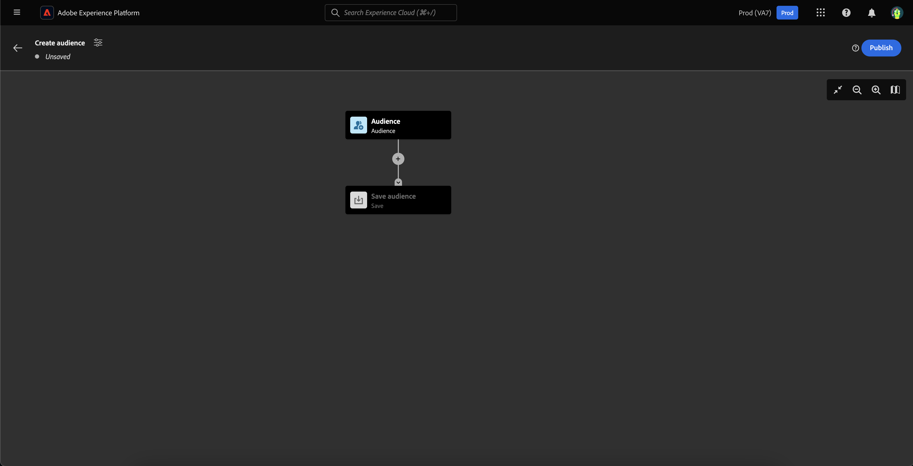
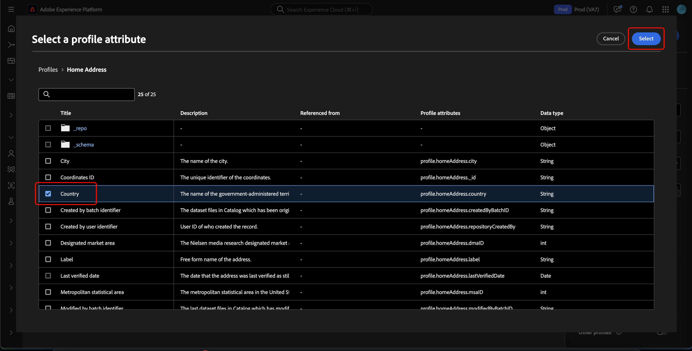

# 受众合成UI指南

>[!NOTE]
>
>本指南介绍如何使用受众构成创建受众。 要了解如何使用区段生成器通过区段定义创建受众，请参阅[区段生成器UI指南](./segment-builder.md)。

受众构成提供了一个工作区，通过用来表示不同操作的块来构建和编辑受众。

要更改构成的详细信息（包括标题和描述），请选择按钮。

出现&#x200B;**[!UICONTROL 合成属性]**&#x200B;弹出框。 您可以在此处插入构图的详细信息，包括标题和描述。

>[!NOTE]
>
>如果您&#x200B;**未**&#x200B;为文章指定标题，则默认情况下其标题为“作品”，后跟创建日期和时间。 此外，每个合成&#x200B;**必须**&#x200B;都有自己的唯一名称。

更新合成详细信息后，选择&#x200B;**[!UICONTROL 保存]**&#x200B;以确认这些更新。 受众构成画布重新出现。

受众组合画布由四种不同类型的块组成：**[[!UICONTROL 受众]](#audience-block)**、**[[!UICONTROL 排除]](#exclude-block)**、**[[!UICONTROL 排名]](#rank-block)**&#x200B;和&#x200B;**[[!UICONTROL 拆分]](#split-block)**。

## [!UICONTROL 受众] {#audience-block}

>[!CONTEXTUALHELP]
>id="platform_segmentation_ao_audience"
>title="受众块"
>abstract="通过“受众”块，可添加要用于构成新受众的子受众。"

>[!CONTEXTUALHELP]
>id="platform_segmentation_ao_merge_types"
>title="合并类型"
>abstract="合并类型确定合并所选子受众的方式。 支持的值包括“并集”、“交集”和“排除重叠”。"

**[!UICONTROL 受众]**&#x200B;块类型允许您添加要用于构成新的更大受众的子受众。 默认情况下，**[!UICONTROL 受众]**&#x200B;块包含在合成画布的顶部。

当您选择&#x200B;**[!UICONTROL 受众]**&#x200B;块时，右边栏会显示用于为受众设置标签、将受众添加到该块以及为受众块构建自定义规则的控件。

>[!NOTE]
>
>您可以添加受众&#x200B;**或**&#x200B;创建自定义规则。 这两项功能&#x200B;**不能**&#x200B;一起使用。

### [!UICONTROL 添加受众] {#add-audience}

将受众添加到“受众”块。 选择&#x200B;**[!UICONTROL 添加受众]**。

>[!IMPORTANT]
>
>请注意，将仅显示使用默认合并策略定义的&#x200B;**仅**&#x200B;受众。
>
>此外，只能使用使用使用区段生成器创建的&#x200B;**已发布**&#x200B;受众。 使用受众组合和外部生成的受众创建的受众&#x200B;**不可用**。

此时将显示受众列表。 选择要包含的受众，然后选择&#x200B;**[!UICONTROL 添加]**&#x200B;以将其附加到受众块。

现在，当选择&#x200B;**[!UICONTROL 受众]**&#x200B;块时，您选择的受众会显示在右边栏中。 在此处，您可以更改组合受众的合并类型。

| 合并类型 | 描述 |
| ---------- | ----------- |
| [!UICONTROL 并集] | 受众将合并为一个受众。 此操作等同于OR操作。 |
| [!UICONTROL 交集] | 这些受众将合并，并且只添加在&#x200B;**所有**&#x200B;中共享的受众。 此操作等同于AND操作。 |
| [!UICONTROL 排除重叠] | 这些受众将合并，只包含在&#x200B;**1中共享的受众，但不会添加其中的所有**&#x200B;受众。 这相当于XOR操作。 |

### [!UICONTROL 生成规则] {#build-rule}

>[!CONTEXTUALHELP]
>id="platform_segmentation_ao_rule_builder"
>title="区段生成器"
>abstract="您可以使用区段生成器为构成添加自定义规则。"

若要向受众块添加自定义规则，请选择&#x200B;**[!UICONTROL 生成规则]**。

此时将显示“区段生成器”。 您可以使用区段生成器创建自定义规则，以供受众遵循。 有关使用区段生成器的更多信息，请参阅[区段生成器指南](./segment-builder.md)。

添加自定义规则后，选择&#x200B;**[!UICONTROL 保存]**&#x200B;以将该规则添加到受众。

## [!UICONTROL 排除] {#exclude-block}

>[!CONTEXTUALHELP]
>id="platform_segmentation_ao_exclude"
>title="排除块"
>abstract="通过“排除”块，可从构成中排除指定的受众或属性。"

>[!CONTEXTUALHELP]
>id="platform_segmentation_ao_exclude_type"
>title="排除类型"
>abstract="您可以排除属于特定受众的用户档案（按受众排除）或根据特定属性排除用户档案（按属性排除）。"

**[!UICONTROL 排除]**&#x200B;块类型允许您从新的较大受众中排除指定的子受众或属性。

要添加&#x200B;**[!UICONTROL 排除]**&#x200B;块，请选择&#x200B;**+**&#x200B;图标，然后选择&#x200B;**[!UICONTROL 排除]**。

已添加&#x200B;**[!UICONTROL 排除]**&#x200B;块。 选择此块后，右边栏中会显示有关排除项的详细信息。 这包括块的标签和排除类型。 您可以按受众](#exclude-audience)排除[或按属性](#exclude-attribute)排除[。

### 按受众排除 {#exclude-audience}

如果按受众排除，则可以通过选择&#x200B;**[!UICONTROL 添加受众]**&#x200B;来选择要排除的受众。

![已选择[!UICONTROL 添加受众]按钮，可让您选择要排除的受众。](../images/ui/audience-composition/add-excluded-audience.png)

>[!IMPORTANT]
>
>只能使用使用使用区段生成器创建的&#x200B;**已发布**&#x200B;受众。 使用受众组合和外部生成的受众创建的受众&#x200B;**不可用**。

此时将显示受众列表。 选择&#x200B;**[!UICONTROL 添加]**&#x200B;以将要排除的受众添加到排除块。

### 按属性排除 {#exclude-attribute}

>[!CONTEXTUALHELP]
>id="platform_segmentation_ao_exclude_attribute"
>title="按属性排除"
>abstract="当按属性排除时，您可以根据选定的属性排除构成中显示的特定配置文件。"

如果按属性排除，则可以通过选择&#x200B;**[!UICONTROL 排除规则]**&#x200B;部分中的图标来选择要排除的属性。 通过排除属性，您可以从生成的受众中排除任何包含此属性的配置文件。

此时将显示配置文件属性列表。 选择要排除的属性类型，然后选择&#x200B;**[!UICONTROL 选择]**&#x200B;以将其添加到排除块。

>[!IMPORTANT]
>
>按属性排除时，只能指定要排除的&#x200B;**一个**&#x200B;值。 使用任何类型的分隔符（如逗号或分号）都只会导致排除该确切值。 例如，将该值设置为`red, blue`将导致从属性中排除术语`red, blue`，但&#x200B;**不会**&#x200B;导致排除术语`red`或`blue`。

## [!UICONTROL 扩充] {#enrich-block}

>[!CONTEXTUALHELP]
>id="platform_segmentation_ao_enrich"
>title="丰富块"
>abstract="通过“扩充”块，您可以使用来自Adobe Experience Platform数据集的其他属性扩充受众。"

>[!CONTEXTUALHELP]
>id="platform_segmentation_ao_dataset"
>title="扩充数据集"
>abstract="扩充数据集包含要与构成关联的数据。"

>[!CONTEXTUALHELP]
>id="platform_segmentation_ao_enrich_criteria"
>title="扩充标准"
>abstract="扩充条件包括Source联接键和扩充数据集联接键。 这两个键协调源数据集和扩充数据集。"

>[!CONTEXTUALHELP]
>id="platform_segmentation_ao_enrich_attributes"
>title="扩充属性"
>abstract="扩充属性是要与构成关联的属性。"

>[!IMPORTANT]
>
>此时，扩充属性只能&#x200B;**在下游Adobe Journey Optimizer方案中使用**。

**[!UICONTROL 扩充]**&#x200B;块类型允许您使用数据集中的其他属性扩充受众。 您可以在个性化用例中使用这些属性。

要添加&#x200B;**[!UICONTROL 扩充]**&#x200B;块，请选择&#x200B;**+**&#x200B;图标，然后选择&#x200B;**[!UICONTROL 扩充]**。

![已选择[!UICONTROL 扩充]选项。](../images/ui/audience-composition/add-enrich-block.png)

已添加&#x200B;**[!UICONTROL 扩充]**&#x200B;块。 选择此块后，有关扩充的详细信息将显示在右边栏中。 这包括块的标签和扩充数据集。

要选择要扩充受众的数据集，请选择图标。

![筛选器按钮突出显示。 选择此选项将转到[!UICONTROL 选择数据集]弹出框。](../images/ui/audience-composition/enrich-select-dataset.png)

出现&#x200B;**[!UICONTROL 选择数据集]**&#x200B;弹出框。 选择要添加以进行扩充的数据集，然后选择&#x200B;**[!UICONTROL 选择]**&#x200B;以添加数据集以进行扩充。

>[!IMPORTANT]
>
>选定的数据集&#x200B;**必须**&#x200B;满足以下条件：
>
>- 数据集&#x200B;**必须**&#x200B;为记录类型。
>   - 数据集&#x200B;**不能**&#x200B;为事件类型、系统生成或标记为配置文件。
>- 数据集&#x200B;**必须**&#x200B;为1 GB或更小。

**[!UICONTROL 扩充条件]**&#x200B;部分现在显示在右边栏中。 在此部分中，您可以选择&#x200B;**[!UICONTROL Source联接键]**&#x200B;和&#x200B;**[!UICONTROL 扩充数据集联接键]**，这允许您链接扩充数据集与尝试创建的受众。

![已突出显示[!UICONTROL 扩充条件]区域。](../images/ui/audience-composition/enrichment-criteria.png)

要选择&#x200B;**[!UICONTROL Source联接键]**，请选择图标。

出现&#x200B;**[!UICONTROL 选择配置文件属性]**&#x200B;弹出框。 选择要用作源连接键的配置文件属性，然后选择&#x200B;**[!UICONTROL 选择]**&#x200B;以选择该属性作为源连接键。

要选择&#x200B;**[!UICONTROL 扩充数据集联接键]**，请选择图标。

出现&#x200B;**[!UICONTROL 扩充属性]**&#x200B;弹出框。 选择要用作扩充数据集联接键的属性，然后选择&#x200B;**[!UICONTROL 选择]**&#x200B;以选择该属性作为扩充数据集联接键。

现在，您已添加两个联接键，此时将显示&#x200B;**[!UICONTROL 扩充属性]**&#x200B;部分。 您现在可以添加要用于增强受众的属性。 要添加这些属性，请选择&#x200B;**[!UICONTROL 添加属性]**。

出现&#x200B;**[!UICONTROL 扩充属性]**&#x200B;弹出框。 您可以从数据集中选择用于扩充受众的属性，然后选择&#x200B;**[!UICONTROL 选择]**&#x200B;以将属性添加到受众。

<!-- ## [!UICONTROL Join] {#join-block}

The **[!UICONTROL Join]** block type allows you to add in external audiences from datasets that have not yet been processed by Adobe Experience Platform.

To add a **[!UICONTROL Join]** block, select the **+** icon, followed by **[!UICONTROL Join]**.

When you select the block, details about the join are shown in the right rail, including the block's label and the option to add audiences to the enrichment dataset.

After selecting **[!UICONTROL Add Audience]**, a list of audiences appears. Select the audiences you want to include, followed by **[!UICONTROL Add]** to add them to your join block.

Your selected audiences now appear within the right rail when the **[!UICONTROL Join]** block is selected. 

 -->

## [!UICONTROL 排名] {#rank-block}

>[!CONTEXTUALHELP]
>id="platform_segmentation_ao_ranking"
>title="排名块"
>abstract="通过“排名”块，可根据特定属性对配置文件进行排名，并将其包含在构成中。"

>[!CONTEXTUALHELP]
>id="platform_segmentation_ao_rank_profilelimit_text"
>title="添加轮廓限制"
>abstract="通过“添加配置文件限制”切换，可指定在排名过程中包含的最大配置文件数。"

**[!UICONTROL 排名]**&#x200B;块类型允许您根据指定属性对配置文件进行排名和排序，并将这些排名配置文件包含在您的构成中。

要添加&#x200B;**[!UICONTROL 排名]**&#x200B;块，请选择&#x200B;**+**&#x200B;图标，然后选择&#x200B;**[!UICONTROL 排名]**。

选择块后，右侧边栏中显示有关排名的详细信息，包括块的标签、要排名的属性、排名顺序以及用于限制要排名的配置文件数量的切换开关。

要选择受众排名所依据的属性，请选择图标。

此时将显示配置文件属性列表。 在此弹出窗口中，您可以选择要按其对受众进行排名的属性类型。 选择&#x200B;**[!UICONTROL 选择]**&#x200B;以将其添加到您的排名块。 请注意，所选属性&#x200B;**只能**&#x200B;是数字。

选择属性后，您可以选择排序依据。 这是以升序（从最低到最高）或降序（从最高到最低）顺序显示的。

此外，您还可以通过启用&#x200B;**[!UICONTROL 添加配置文件限制]**&#x200B;切换来限制返回的配置文件数。 启用此切换后，您可以在&#x200B;**[!UICONTROL 包含的用户档案]**&#x200B;字段中设置返回的用户档案的最大数量。

## [!UICONTROL 拆分] {#split-block}

>[!CONTEXTUALHELP]
>id="platform_segmentation_ao_split"
>title="拆分块"
>abstract="利用拆分块，可将合成划分为多个路径。"

>[!CONTEXTUALHELP]
>id="platform_segmentation_ao_split_type"
>title="拆分类型"
>abstract="您可以按“百分比”拆分或“属性”拆分拆分合成。 百分比拆分会随机将用户档案拆分为多个路径。 属性拆分允许您根据指定的属性拆分用户档案。"

>[!CONTEXTUALHELP]
>id="platform_segmentation_ao_split_otherprofiles_text"
>title="其他轮廓"
>abstract="通过其他配置文件切换，可使用不符合其他任何路径指定条件的剩余配置文件创建其他路径。"

**[!UICONTROL 拆分]**&#x200B;块类型允许您将新受众拆分为各种子受众。 您可以按百分比或属性拆分此受众。

要添加&#x200B;**[!UICONTROL Split]**&#x200B;块，请选择&#x200B;**+**&#x200B;图标，然后选择&#x200B;**[!UICONTROL Split]**。

在拆分受众时，您可以按百分比拆分或按属性拆分。

### 按百分比拆分 {#split-percentage}

>[!CONTEXTUALHELP]
>id="platform_segmentation_ao_split_percentage"
>title="按百分比拆分"
>abstract="您可以根据提供的路径数和百分比，将受众随机拆分为多个受众。"

>[!CONTEXTUALHELP]
>id="platform_segmentation_ao_split_persistent"
>title="永久拆分"
>abstract="通过启用此选项并选择身份命名空间，可以使百分比拆分永久化。"

按百分比拆分时，将根据提供的路径数和百分比随机拆分受众。

或者，您也可以提供标识，这将使基于百分比的拆分永久化。 可用的身份类型包括组织中可用的所有身份命名空间。

### 按属性拆分 {#split-attribute}

按属性拆分时，将基于提供的属性拆分受众。 要选择要拆分的属性，请选择&#x200B;**[!UICONTROL 拆分]**&#x200B;块，后跟图标。

此时将显示配置文件属性列表。 选择属性类型，然后选择&#x200B;**[!UICONTROL 选择]**&#x200B;以将其添加到拆分块。

选择属性后，您可以通过在&#x200B;**[!UICONTROL 值]**&#x200B;字段中添加值来选择哪些配置文件将属于哪个子受众。

此外，您可以启用&#x200B;**[!UICONTROL 其他配置文件]**&#x200B;切换以创建包含所有非选定配置文件的子受众。

## 发布受众 {#publish}

>[!CONTEXTUALHELP]
>id="platform_segmentation_ao_publish"
>title="发布"
>abstract="您可以发布合成，以在Adobe Experience Platform中创建生成的受众。"

>[!IMPORTANT]
>
>在发布受众构成时，请注意，评估和激活它以在下游服务(例如Real-Time CDP目标或Adobe Journey Optimizer渠道)中使用可能需要48小时。

创建合成后，您可以通过选择&#x200B;**[!UICONTROL 发布]**&#x200B;来保存和发布合成。

如果创建受众时出现任何错误，则会显示一条警报，让您知道如何解决此问题。

## 后续步骤

受众组合提供了一个丰富的工作流，允许您从不同的块类型创建组合。 要了解有关Segmentation Service UI其他部分的更多信息，请参阅[Segmentation Service用户指南](./overview.md)。
