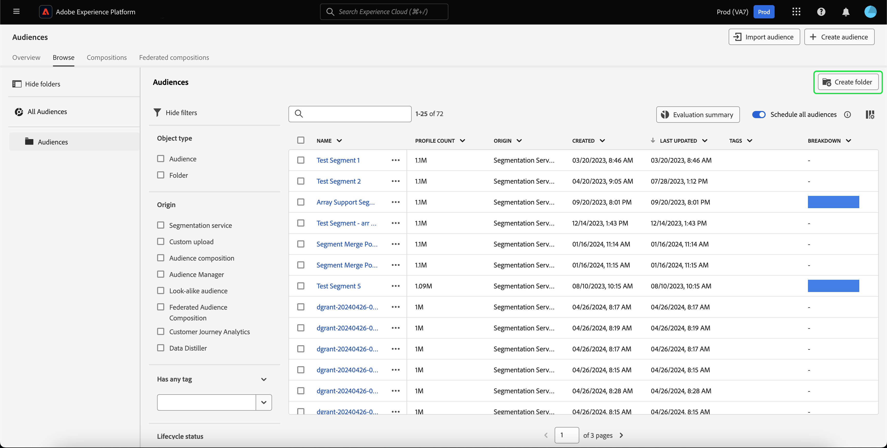
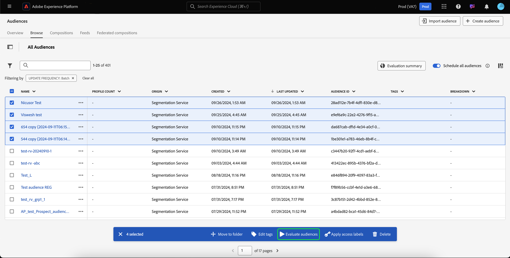
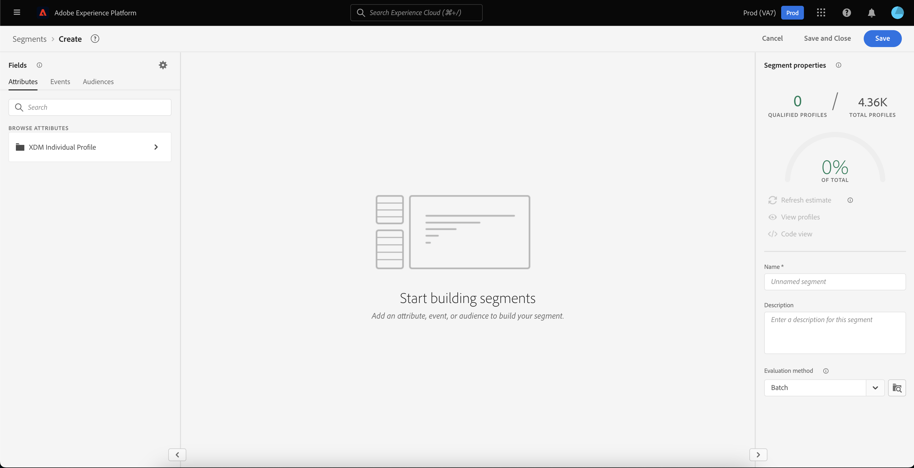

# 受众门户概述

Audience Portal是Adobe Experience Platform中的一个中心枢纽，允许您查看、管理和创建受众。

在Audience Portal中，您可以完成以下任务：

- [查看受众列表](#audience-list)
   - [对受众使用快速操作](#quick-actions)
   - [自定义受众列表中显示的属性](#customize)
   - [使用过滤器、文件夹和标记来组织受众](#manage-audiences)
- [查看有关受众的详细信息](#audience-details)
   - [查看受众摘要](#audience-summary)
- [为计划分段启用受众](#scheduled-segmentation)
- [创建受众](#create-audience)
   - [使用区段生成器创建受众](#segment-builder)
   - [使用受众组合创建受众](#audience-composition)
   - [使用联合受众合成以使用来自您现有数据仓库的数据创建受众](#fac)
- [导入外部生成的受众](#import-audience)

要打开Audience Portal，请选择“分段”部分中的&#x200B;**[!UICONTROL 浏览]**&#x200B;选项卡。

## “受众”列表 {#list}

>[!CONTEXTUALHELP]
>id="platform_segments_browse_churncolumnname"
>title="流失率"
>abstract="流失率表示与上次运行区段作业时相比，受众内正在更改的轮廓的百分比。"

>[!CONTEXTUALHELP]
>id="platform_segments_browse_evaluationmethodcolumnname"
>title="评估方法"
>abstract="受众的评估方法包括批量评估、流式评估和边缘评估。"

默认情况下，受众门户显示您的组织和沙盒中所有受众的列表，包括配置文件计数、来源、创建日期、上次修改日期、标记和细分。

### 快速操作 {#quick-actions}

每个受众旁边都有一个省略号图标。 选择此选项将显示受众可用的快速操作列表。 此操作列表因受众的来源而异。

![将显示来源为[!UICONTROL 受众合成].](../images/ui/audience-portal/browse-audience-composition-details.png)的受众的快速操作列表

| 操作 | 来源 | 描述 |
| ------ | ------- | ----------- |
| [!UICONTROL 编辑] | Segmentation Service | 打开区段生成器以编辑受众。 请注意，如果您的受众是通过API创建的，则&#x200B;**无法**&#x200B;使用区段生成器编辑它。 有关使用区段生成器的更多信息，请参阅[区段生成器UI指南](./segment-builder.md)。 |
| [!UICONTROL 打开合成] | 受众组合 | 打开受众组合以查看受众。 有关受众组合的详细信息，请参阅[受众组合UI指南](./audience-composition.md)。 |
| [!UICONTROL 激活到目标] | Segmentation Service | 激活目标受众。 有关将受众激活到目标的更多详细信息，请阅读[激活概述](../../destinations/ui/activation-overview.md)。 |
| [!UICONTROL 与合作伙伴共享] | 受众构成、自定义上传、分段服务 | 与其他Platform用户共享您的受众。 有关此功能的更多信息，请阅读[区段匹配概述](./segment-match/overview.md)。 |
| [!UICONTROL 管理标记] | 受众构成、自定义上传、分段服务 | 管理属于受众的用户定义标记。 有关此功能的详细信息，请阅读[筛选和标记](#manage-audiences)部分。 |
| [!UICONTROL 移至文件夹] | 受众构成、自定义上传、分段服务 | 管理受众属于哪个文件夹。 有关此功能的详细信息，请阅读[筛选和标记](#manage-audiences)部分。 |
| [!UICONTROL 副本] | Segmentation Service | 复制所选受众。 有关此函数的更多信息，请参阅[分段常见问题解答](../faq.md#copy)。 |
| [!UICONTROL 应用访问标签] | 受众构成、自定义上传、分段服务 | 管理属于受众的访问标签。 有关访问标签的详细信息，请阅读有关[管理标签](../../access-control/abac/ui/labels.md)的文档。 |
| [!UICONTROL 发布] | 自定义上传、分段服务 | 发布选定的受众。 有关生命周期状态管理的更多信息，请阅读分段常见问题解答](../faq.md#lifecycle-states)的[生命周期状态部分。 |
| [!UICONTROL 停用] | 自定义上传、分段服务 | 停用所选受众。 有关生命周期状态管理的更多信息，请阅读分段常见问题解答](../faq.md#lifecycle-states)的[生命周期状态部分。 |
| [!UICONTROL 删除] | 受众构成、自定义上传、分段服务 | 删除所选受众。 不能删除在下游目标中使用或属于其他受众&#x200B;**中依赖的受众**。 有关受众删除的详细信息，请阅读[分段常见问题解答](../faq.md#lifecycle-states)。 |
| [!UICONTROL 添加到包] | 受众构成、自定义上传、分段服务 | 在沙盒之间移动受众。 有关此功能的详细信息，请阅读[沙盒工具指南](../../sandboxes/ui/sandbox-tooling.md)。 |

>[!IMPORTANT]
>
>在删除您的受众之前，请确保该受众是&#x200B;**而不是用作基于帐户的受众中的组件或用于Adobe Journey Optimizer的**。

页面顶部提供了一些选项，用于将所有受众添加到计划、导入受众、创建新受众以及查看受众评估摘要。

切换&#x200B;**[!UICONTROL 计划所有受众]**&#x200B;将启用计划分段。 有关计划分段的更多信息，请参阅本用户指南](#scheduled-segmentation)的[计划分段部分。

选择&#x200B;**[!UICONTROL 导入受众]**&#x200B;将允许您导入外部生成的受众。 要了解有关导入受众的更多信息，请阅读用户指南](#import-audience)中有关[导入受众的部分。

选择&#x200B;**[!UICONTROL 创建受众]**&#x200B;将允许您创建受众。 要了解有关创建受众的更多信息，请阅读用户指南](#create-audience)中有关[创建受众的部分。

您可以选择&#x200B;**[!UICONTROL 评估摘要]**&#x200B;以显示一个饼图，其中显示了受众评估的摘要。

此时将显示饼图，其中按受众评估显示了受众的细分。 图表在中间显示受众总数，在底部显示每日批量评估时间（UTC时区）。 如果将鼠标悬停在受众的不同部分上，则会显示属于每种更新频率类型的受众数量。

### 自定义 {#customize}

您可以通过选择，向受众门户添加其他字段。 这些附加字段包括生命周期状态、更新频率、上次更新者、描述、创建者和访问标签。

| 字段 | 描述 |
| ----- | ----------- |
| [!UICONTROL 名称] | 受众的名称。 |
| [!UICONTROL 轮廓计数] | 符合受众条件的配置文件总数。 |
| [!UICONTROL Origin] | 受众的来源。 它指明了受众的来源。 可能的值包括分段服务、自定义上传、受众组合和Audience Manager。 |
| [!UICONTROL 生命周期状态] | 受众的状态。 此字段的可能值包括`Draft`、`Inactive`和`Published`。 有关生命周期状态的更多信息，包括不同状态的含义以及如何将受众移动到不同生命周期状态，请阅读分段常见问题解答](../faq.md#lifecycle-status)中的[生命周期状态部分。 |
| [!UICONTROL 更新频率] | 一个值，表示受众数据的更新频率。 此字段的可能值包括[!UICONTROL 批次]、[!UICONTROL 流式传输]、[!UICONTROL Edge]和[!UICONTROL 未计划]。 |
| [!UICONTROL 上次更新者] | 上次更新受众的人员姓名。 |
| [!UICONTROL 已创建] | 创建受众的日期和时间（UTC时区）。 |
| [!UICONTROL 上次更新时间] | 上次更新受众的日期和时间(UTC)。 |
| [!UICONTROL 标记] | 属于受众的用户定义标记。 有关这些标记的详细信息，可在标记](#tags)的[部分找到。 |
| [!UICONTROL 描述] | 受众的描述。 |
| [!UICONTROL 创建者] | 创建受众的人员姓名。 |
| [!UICONTROL 访问标签] | 受众的访问标签。 访问标签允许您根据应用于该数据的使用策略对数据集和字段进行分类。 这些标签可随时应用，从而为您选择如何管理数据提供了灵活性。 有关访问标签的详细信息，请阅读有关[管理标签](../../access-control/abac/ui/labels.md)的文档。 |
| [!UICONTROL 划分] | 受众的个人资料状态细分。 此用户档案状态划分的更详细描述可以在下面找到。 |

如果选择划分，则显示一个条形图，其中概述了属于以下每个已计算配置文件状态的配置文件百分比： [!UICONTROL 已实现]、[!UICONTROL 现有]和[!UICONTROL 正在退出]。 此外，[!UICONTROL 浏览]选项卡上显示的划分是对区段定义状态最准确的划分。 如果此数字与[!UICONTROL 概述]选项卡上所述的数字不同，您应使用[!UICONTROL 浏览]选项卡上的数字作为正确的信息源，因为[!UICONTROL 概述]选项卡上的数字每天只更新一次。

| 状态 | 描述 |
| ------ | ----------- |
| [!UICONTROL 已实现] | 自上次批处理区段作业运行以来的最后24小时内&#x200B;**符合受众资格的**&#x200B;的用户档案计数。 |
| [!UICONTROL 现有] | 自上次批处理区段作业运行以来的最后24小时内受众中仍有&#x200B;**保留**&#x200B;的用户档案数。 此字段为&#x200B;**已计算**，并且未显示在[`segmentMembership`对象](../../xdm/field-groups/profile/segmentation.md)中。 |
| [!UICONTROL 正在退出] | 自上次批处理区段作业运行以来的最后24小时内&#x200B;**退出**&#x200B;受众的个人资料计数。 |

选择要显示的字段后，您还可以重新调整所显示列的宽度。 可以通过拖动列之间的区域或选择要重新调整大小的列的以及随后的&#x200B;**[!UICONTROL 调整列大小]**&#x200B;来执行此操作。

### 筛选、文件夹和标记 {#manage-audiences}

为了提高工作效率，您可以搜索现有受众、将用户定义的标记添加到受众、将受众放入文件夹并筛选显示的受众。

#### 搜索 {#search}

您最多可以使用[!DNL Unified Search]用9种不同的语言搜索现有受众。

要使用[!DNL Unified Search]，请在高亮显示的搜索栏中添加要搜索的搜索词。

有关[!DNL Unified Search]的详细信息，包括支持的功能，请阅读[统一搜索文档](https://experienceleague.adobe.com/docs/core-services/interface/services/search-experience-cloud.html)。

#### 标记 {#tags}

您可以添加用户定义的标记，以更好地描述、查找和管理您的受众。

要添加标记，请在要标记的受众上选择&#x200B;**[!UICONTROL 管理标记]**。

![已为指定受众选择[!UICONTROL 管理标记]按钮。](../images/ui/audience-portal/browse-manage-tags.png)

出现&#x200B;**[!UICONTROL 管理标记]**&#x200B;弹出框。 在此弹出窗口中，您可以选择已分类的标记或未分类的标记。

| 标记类型 | 描述 |
| -------- | ----------- |
| 已分类 | 由贵组织的管理员创建并管理的标记。 |
| 未分类 | 在[!UICONTROL 管理标记]弹出框内创建的标记。 任何人都可以创建或管理这些类型的标记。 |

![显示[!UICONTROL 管理标记]弹出框。 用于选择已分类或未分类的选项会突出显示。](../images/ui/audience-portal/create-tag.png)

添加所有要附加到受众的标记后，选择&#x200B;**[!UICONTROL 保存]**。

![在[!UICONTROL 管理标记]弹出窗口上，添加的标记突出显示。](../images/ui/audience-portal/created-tags.png)

有关创建和管理标记的更多信息，请参阅[管理标记指南](../../administrative-tags/ui/managing-tags.md)。

#### 文件夹 {#folders}

您可以将受众放入文件夹中，以便更好地管理受众。

若要创建用于保存受众的文件夹，请选择&#x200B;**[!UICONTROL 创建文件夹]**。

>[!NOTE]
>
>仅当位于其他文件夹中时，才能创建文件夹。 这意味着，如果您在左侧导航栏上选择了&#x200B;**[!UICONTROL 所有受众]**，则&#x200B;**无法**&#x200B;创建文件夹。

此时会出现一个弹出窗口，允许您命名新创建的文件夹。 在命名文件夹后选择&#x200B;**[!UICONTROL 保存]**&#x200B;以完成创建文件夹。 请注意，名称&#x200B;**必须**&#x200B;对于父文件夹是唯一的。

要将受众移动到文件夹中，请在要移动的受众上选择&#x200B;**[!UICONTROL 移动到文件夹]**。

![已为特定受众选择[!UICONTROL 移动到文件夹]按钮。](../images/ui/audience-portal/browse-move-to-folder.png)

出现“**将受众移动到文件夹**”弹出框。 选择要将受众移动到的文件夹，然后选择&#x200B;**[!UICONTROL 保存]**。

将受众放入文件夹中后，您可以选择仅显示属于特定文件夹的受众。

#### 筛选条件 {#filter}

您还可以根据各种设置筛选受众。

要筛选可用受众，请选择。

此时将显示可用筛选器列表。

| 筛选条件 | 描述 |
| ------ | ----------- |
| [!UICONTROL Origin] | 允许您根据受众的来源进行筛选。 可用选项包括分段服务、自定义上传、受众组合和Audience Manager。 |
| [!UICONTROL 具有任何标记] | 允许您按标记过滤。 您可以选择在&#x200B;**[!UICONTROL 具有任何标记]**&#x200B;和&#x200B;**[!UICONTROL 具有所有标记]**&#x200B;之间。 选择&#x200B;**[!UICONTROL 具有任何标记]**&#x200B;时，过滤的受众将包含您已添加的&#x200B;**任意**&#x200B;标记。 选择&#x200B;**[!UICONTROL 具有所有标记]**&#x200B;时，筛选的受众必须包括您已添加的&#x200B;**所有**&#x200B;标记。 |
| [!UICONTROL 生命周期状态] | 可让您根据受众的生命周期状态进行过滤。 可用选项包括[!UICONTROL 已删除]、[!UICONTROL 草稿]、[!UICONTROL 不活动]和[!UICONTROL 已发布]。 |
| [!UICONTROL 更新频率] | 可让您根据受众的更新频率（评估方法）进行过滤。 可用选项包括[!UICONTROL 批处理]、[!UICONTROL 流式处理]和[!UICONTROL Edge] |
| [!UICONTROL 创建者] | 允许您根据创建受众的人员进行筛选。 |
| [!UICONTROL 创建日期] | 可让您根据受众的创建日期进行筛选。 您可以选择创建受众时要过滤的日期范围。 |
| [!UICONTROL 修改日期] | 可让您根据受众的上次修改日期进行筛选。 您可以选择上次修改受众时要过滤的日期范围。 |

### 批量操作 {#bulk-actions}

此外，您最多可以选择25个不同的受众，并对这些受众执行各种操作。 这些操作包括[移动到文件夹](#folders)、[编辑或应用标记](#tags)、[评估受众](#flexible-audience-evaluation)、[应用访问标签](../../access-control/abac/ui/labels.md)和[删除](#browse)。

将批量操作应用于受众时，将会满足以下条件：

- 您&#x200B;**可以**&#x200B;从不同页面选择受众。
- 您&#x200B;**无法**&#x200B;删除正在目标激活中使用的受众。
- 如果选择筛选器，则所选受众&#x200B;**将**&#x200B;重置。

#### [!BADGE 有限可用性]{type=Informative}灵活的受众评估 {#flexible-audience-evaluation}

灵活的受众评估允许您按需运行分段作业。 选择您要评估的受众，然后选择&#x200B;**[!UICONTROL 评估受众]**。

>[!IMPORTANT]
>
为灵活的受众评估选择受众时，需要满足以下条件：
>
- 您每天只能使用灵活的受众评估&#x200B;**两次**。 此限制在午夜(UTC)重置。
- 您每年最多有&#x200B;**次**&#x200B;的灵活受众评估运行，共50次。
- 所有受众&#x200B;**都必须**&#x200B;具有“分段服务”的来源。
- 必须使用批处理分段评估所有受众&#x200B;****。
- 所有受众&#x200B;**必须**&#x200B;是基于人员的受众。
- 受众&#x200B;**只能**&#x200B;激活到Platform中的目标。
- 您最多只能选择20个受众。

此时将显示&#x200B;**[!UICONTROL 按需评估受众]**&#x200B;弹出框，其中显示了将使用按需区段作业评估的受众列表。 如果受众不符合按需评估的条件，则它将被自动从评估作业中删除。 确认列出的受众就是您要评估的受众。

确认列出了正确的受众后，您可以继续请求，并将开始灵活的受众评估。 您可以在[评估作业监视视图](../../dataflows/ui/monitor-audiences.md#evaluation-job-details)中查看此受众评估的状态。

>[!NOTE]
>
如果您运行灵活的受众评估，则需要确保将频率设置为&#x200B;**[!UICONTROL 在区段评估后]**。 对已设置为在区段评估](../../destinations/ui/activate-batch-profile-destinations.md#export-full-files)后[激活的受众运行灵活的受众评估，将在灵活的受众评估作业完成后立即激活受众，而不考虑任何之前的每日激活作业。

## 受众详情 {#audience-details}

要查看有关特定受众的更多详细信息，请在&#x200B;**[!UICONTROL 浏览]**&#x200B;选项卡中选择受众的名称。

此时会显示受众详细信息页面。 顶部显示了受众摘要、有关合格受众规模的信息以及激活区段的目标。

### 受众摘要 {#audience-summary}

**[!UICONTROL 受众摘要]**&#x200B;部分提供了属性的ID、名称、描述、来源和详细信息等信息。

此外，您还可以选择将受众激活到目标、应用访问标签或编辑/更新受众。

通过选择&#x200B;**[!UICONTROL 激活到目标]**，您可以将受众激活到目标。 有关将受众激活到目标的更多详细信息，请阅读[激活概述](../../destinations/ui/activation-overview.md)。

选择&#x200B;**[!UICONTROL 应用访问标签]**&#x200B;允许您管理属于受众的访问标签。 有关访问标签的详细信息，请阅读有关[管理标签](../../access-control/abac/ui/labels.md)的文档。

>[!BEGINTABS]

>[!TAB 受众构成]

![将显示受众详细信息页面，其中突出显示[!UICONTROL 打开合成]按钮。](../images/ui/audience-portal/audience-details-open-composition.png)

选择&#x200B;**[!UICONTROL 打开合成]**&#x200B;允许您在受众合成中查看受众。 有关受众组合的详细信息，请参阅[受众组合UI指南](./audience-composition.md)。

>[!TAB 自定义上传]

![将显示受众详细信息页面，其中突出显示[!UICONTROL 更新受众]按钮。](../images/ui/audience-portal/audience-details-update-audience.png)

选择&#x200B;**[!UICONTROL 更新受众]**&#x200B;允许您重新上传外部生成的受众。 有关导入外部生成的受众的详细信息，请阅读有关[导入受众](#import-audience)的部分。

>[!TAB Segmentation Service]

![将显示受众详细信息页面，其中突出显示[!UICONTROL 编辑受众]按钮。](../images/ui/audience-portal/audience-details-edit-audience.png)

选择&#x200B;**[!UICONTROL 编辑受众]**&#x200B;允许您在区段生成器中编辑受众。 有关使用[!DNL Segment Builder]工作区的更多详细信息，请阅读[[!DNL Segment Builder] 用户指南](./segment-builder.md)。

>[!ENDTABS]

选择&#x200B;**[!UICONTROL 编辑属性]**&#x200B;将允许您编辑受众的基本详细信息，如名称、描述和标记。

### 受众总数 {#audience-total}

对于平台生成的受众和合成，**[!UICONTROL 受众总计]**&#x200B;部分显示符合受众条件的配置文件总数。

>[!NOTE]
>
导出作业完成后，可能需要长达30分钟才能更新受众总数。

通过使用当天样本数据的样本量生成预估。 如果您的配置文件存储中的实体少于100万，则使用完整数据集；对于100万到2,000万之间的实体，使用100万个实体；而对于2000多万个实体，使用总实体的5%。 有关生成估算的详细信息，请参阅受众创建教程的[估算生成部分](../tutorials/create-a-segment.md#estimate-and-preview-an-audience)。

### 摄取详细信息 {#ingestion-details}

对于源为&#x200B;**[!UICONTROL 自定义上传]**&#x200B;的受众，**[!UICONTROL 摄取详细信息]**&#x200B;部分既显示配置文件总数，也显示外部生成的受众被摄取到的数据集的详细信息。

>[!NOTE]
>
导出作业后，最多可能需要30分钟才能完全更新受众的个人资料计数。

| 属性 | 描述 |
| -------- | ----------- |
| 轮廓计数 | 符合受众条件的配置文件总数。 |
| 数据集名称 | 受众被摄取到的数据集的名称。 您可以选择数据集名称，以了解有关数据集的更多信息。 要了解有关数据集的更多信息，请阅读[数据集UI指南](../../catalog/datasets/user-guide.md)。 |
| 数据集批次 | 受众被引入的数据集的ID。 您可以选择批次的ID，以了解有关批次的详细信息。 要了解有关批次的详细信息，请阅读[监视数据摄取指南](../../ingestion/quality/monitor-data-ingestion.md#viewing-batches)。 |
| 轮廓批次 | 在Platform上创建配置文件的批次的ID。 您可以选择批次的ID，以了解有关批次的详细信息。 要了解有关批次的详细信息，请阅读[监视数据摄取指南](../../ingestion/quality/monitor-data-ingestion.md#viewing-batches)。 |
| 架构 | 受众所属的架构的名称。 您可以选择架构的名称以查看有关架构的结构信息并应用数据使用标签。 有关详细信息，请阅读架构指南](../../xdm/tutorials/labels.md)的[管理数据使用标签。 |
| 已提取的记录 | 摄取到数据集的记录数。 |
| 失败的记录 | 无法引入数据集的记录数。 |
| 新轮廓片段 | 已创建的新配置文件的数量。 |
| 现有轮廓片段 | 已更新的现有配置文件的数量。 |

>[!NOTE]
>
将数据使用标签应用于架构是最佳实践。 您&#x200B;**无法**&#x200B;将数据使用标签直接应用于受众。

### 激活的目标 {#activated-destinations}

**[!UICONTROL 激活的目标]**&#x200B;部分显示激活此受众的目标。

>[!NOTE]
>
目标是[!DNL Adobe Real-Time Customer Data Platform]提供的功能，允许您将数据导出到外部平台。 有关目标的详细信息，请阅读[目标概述](../../destinations/home.md)。 要了解如何将区段激活到目标，请参阅[激活概述](../../destinations/ui/activation-overview.md)。

### 配置文件示例 {#profile-samples}

下面是符合区段资格的用户档案样本，详细描述包括[!DNL Profile] ID、名字、姓氏和个人电子邮件在内的信息。

数据采样的触发方式取决于摄取方法。

对于批量摄取，每十五分钟自动扫描一次配置文件存储区，以查看自上次采样作业运行以来是否成功摄取了新批次。 如果是这种情况，随后将扫描配置文件存储区，以查看记录数量是否至少有5%的变化。 如果满足这些条件，则会触发新的取样作业。

对于流式摄取，每小时自动扫描一次配置文件存储区，以查看记录数量是否至少有5%的更改。 如果满足此条件，则会触发新的取样作业。

扫描的样本大小取决于配置文件存储区中的实体总数。 下表显示了这些样本量：

| 配置文件存储中的实体 | 样本大小 |
| ------------------------- | ----------- |
| 少于100万 | 完整数据集 |
| 100万到2000万 | 100万 |
| 超过2000万 | 占总数的5% |

通过选择[!DNL Profile] ID，可以查看有关每个[!DNL Profile]的更多详细信息。 若要了解有关个人资料的详细信息，请阅读[[!DNL Real-Time Customer Profile] 用户指南](../../profile/ui/user-guide.md#profile-detail)。

## 计划分段 {#scheduled-segmentation}

[!CONTEXTUALHELP]
id="platform_segments_browse_addallsegmentstoschedule"
title="将所有受众添加到计划"
abstract="启用以将使用批次处理分段评估的所有受众包括在每日计划更新中。禁用此项可从计划更新中删除所有受众。"

创建受众后，您可以通过按需评估或计划（连续）评估来评估受众。 评估是指通过区段作业移动[!DNL Real-Time Customer Profile]数据以生成相应的受众。 创建受众后，将保存并存储这些受众，以便使用[!DNL Experience Platform] API导出它们。

按需评估包括使用API执行评估并根据需要构建受众，而计划评估（也称为“计划分段”）允许您创建定期计划以在特定时间（最多，每天一次）评估受众。

### 启用计划分段 {#enable-scheduled-segmentation}

可以使用UI或API启用受众进行计划评估。 在UI中，返回到&#x200B;**[!UICONTROL 受众]**&#x200B;中的&#x200B;**[!UICONTROL 浏览]**&#x200B;选项卡并打开&#x200B;**[!UICONTROL 计划所有受众]**。 这将导致根据贵组织设置的计划评估所有受众。

>[!NOTE]
>
可以为[!DNL XDM Individual Profile]最多有五(5)个合并策略的沙盒启用计划评估。 如果贵组织在单个沙盒环境中为[!DNL XDM Individual Profile]提供了五个以上的合并策略，您将无法使用计划的评估。

当前只能使用API创建计划。 有关使用API创建、编辑和使用计划的详细步骤，请参阅有关评估和访问分段结果的教程，特别是有关使用API的[计划评估](../tutorials/evaluate-a-segment.md#scheduled-evaluation)的部分。

## 创建受众 {#create-audience}

您可以选择&#x200B;**[!UICONTROL 创建受众]**&#x200B;来创建受众。

此时会出现一个弹出窗口，允许您在构成受众或构建规则之间进行选择。

### 受众组合 {#audience-composition}

选择&#x200B;**[!UICONTROL 撰写受众]**&#x200B;将转到受众合成。 此工作区为构建和编辑受众提供了直观的控件，例如用于表示不同操作的拖放图块。 要了解有关创建受众的更多信息，请阅读[受众组合指南](./audience-composition.md)。

### 区段生成器 {#segment-builder}

选择&#x200B;**[!UICONTROL 生成规则]**&#x200B;将转到区段生成器。 此工作区为构建和编辑区段定义提供了直观的控件，例如用于表示数据属性的拖放图块。 要了解有关创建区段定义的更多信息，请参阅[区段生成器指南](./segment-builder.md)

### 联合受众构成 {#fac}

除了受众组合和区段定义之外，您还可以使用Adobe Federated Audience Composition从企业数据集构建新受众，而无需复制基础数据并将这些受众存储在Adobe Experience Platform受众门户中。 您还可以通过利用从企业数据仓库联合的组合受众数据来扩充Adobe Experience Platform中的现有受众。 请阅读有关[联合受众组合](https://experienceleague.adobe.com/zh-hans/docs/federated-audience-composition/using/home)的指南。

## 导入受众 {#import-audience}

>[!IMPORTANT]
>
为了导入外部生成的受众，您&#x200B;**必须**&#x200B;具有以下权限：[!UICONTROL 查看区段]、[!UICONTROL 管理区段]和[!UICONTROL 导入受众]。 有关这些权限的详细信息，请阅读[访问控制概述](../../access-control/home.md#permissions)。

您可以选择&#x200B;**[!UICONTROL 导入受众]**&#x200B;以导入外部生成的受众。

出现&#x200B;**[!UICONTROL 导入受众CSV]**&#x200B;工作流。 您可以选择要导入为外部生成受众的CSV文件。

![在[!UICONTROL 导入受众CSV]工作流中，[!UICONTROL 拖放文件]框突出显示，显示您可以在何处上传外部生成的受众。](../images/ui/audience-portal/import-audience-csv.png)

>[!NOTE]
>
外部生成的受众&#x200B;**必须**&#x200B;为CSV格式，其最大值为&#x200B;****，共25列，并且小于1GB。
>
此外，您&#x200B;**不能**&#x200B;在CSV的第一行或关联的列中使用空格或破折号。
>
例如，第一行的值可以是“FirstName”或“First_Name”，但不能是“First Name”或“First-Name”。

选择要导入的CSV文件后，将显示此外部生成受众的示例数据列表。 确认样本数据正确后，选择&#x200B;**[!UICONTROL 下一步]**。

此时会显示&#x200B;**[!UICONTROL 受众详细信息]**&#x200B;页面。 您可以添加有关受众的信息，包括其名称、描述、主要身份和身份命名空间值。

导入外部生成的受众时，必须选择其中一列作为主标识字段并指定命名空间值。 请注意，其余所有字段将被视为&#x200B;**有效负载属性**。 这些属性被视为&#x200B;**非持久属性**，因为它们将仅与此受众关联以进行个性化，并且&#x200B;**不**&#x200B;连接到配置文件。

![显示[!UICONTROL 受众详细信息]页面。](../images/ui/audience-portal/import-audience-audience-details.png)

您还可以选择向外部生成的受众添加一些其他详细信息，包括为其提供ID、定义其合并策略或编辑其列数据类型。

>[!NOTE]
>
如果您使用自定义外部受众ID，则必须遵守以下准则：
>
- **必须**&#x200B;以字母（a-z或A-Z）、下划线(_)或美元符号($)开头。
- 所有后续字符都可以是字母数字(a-z、A-Z、0-9)、下划线(_)或美元符号($)。

填写受众详细信息后，选择&#x200B;**[!UICONTROL 下一步]**。

![在[!UICONTROL 受众详细信息]页面上突出显示[!UICONTROL 下一步]按钮。](../images/ui/audience-portal/import-audience-filled-details.png)

显示&#x200B;**[!UICONTROL 审阅]**&#x200B;页。 您可以查看新导入的外部生成受众的详细信息。

![显示[!UICONTROL 审阅]页面，其中显示新导入的外部生成受众的详细信息。](../images/ui/audience-portal/import-audience-review-details.png)

确认详细信息正确后，选择&#x200B;**[!UICONTROL 完成]**&#x200B;以将外部生成的受众导入Adobe Experience Platform。

>[!IMPORTANT]
>
默认情况下，外部生成的受众的数据过期时间为30天。 如果以任何方式更新或修改受众，则会重置数据过期时间。
>
此外，如果您的外部生成的受众包含敏感信息和/或医疗保健相关信息，则在将其激活到任何目标之前，您&#x200B;**必须**&#x200B;应用必要的数据使用标签。 由于来自外部生成受众的变量存储在数据湖中而不是实时客户配置文件中，因此&#x200B;**不应**&#x200B;在CSV文件中包含同意数据。
>
有关应用数据使用标签的详细信息，请阅读有关[管理标签](../../access-control/abac/ui/labels.md)的文档。 要了解平台上的数据使用标签的一般信息，请阅读[数据使用标签概述](../../data-governance/labels/overview.md)。 要了解同意如何在外部生成的受众中起作用，请阅读[受众常见问题解答](../faq.md#consent)。

## 后续步骤

阅读本概述后，您应该能够使用Audience Portal有效地管理、创建受众并将其导入Adobe Experience Platform。

有关使用分段服务UI的更多信息，请阅读[分段服务UI概述](./overview.md)。

若要了解有关Audience Portal的常见问题，请阅读[常见问题](../faq.md)。
